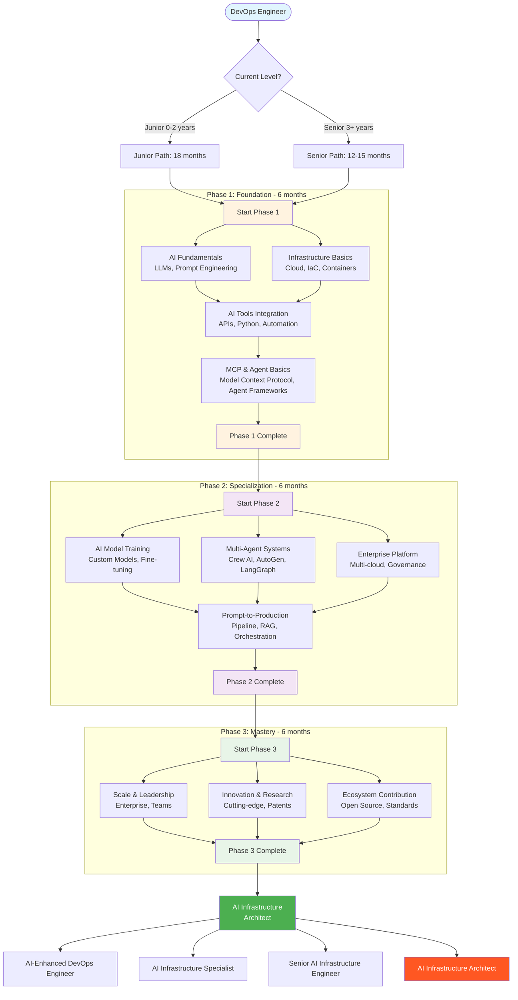

# AI Roadmap for DevOps



*A practical learning path for DevOps engineers moving into AI infrastructure work.*

> ⭐ Star this repo if you find it useful.

---

## What This Roadmap Is

This is a map, not a syllabus. It tells you what to learn, in what order, and roughly how long each layer takes. It does not promise that 18 months of study will make you an architect — that depends on what you build along the way.

The whole roadmap is built around one assumption: you already have working DevOps skills. Linux, Git, a cloud provider, some Python, a CI/CD pipeline you've broken and fixed. If that's not you yet, learn that first. AI on top of shaky infrastructure fundamentals is worse than no AI at all.

---

## The Three Phases

| Phase | What you learn | What you build |
|---|---|---|
| **Foundation** | LLMs, prompt engineering, AI APIs, MCP, basic agents | 3–4 small AI tools wired into your daily work |
| **Specialization** | RAG, multi-agent systems, evaluation, fine-tuning basics | An AI-powered service for one real DevOps domain |
| **Mastery** | Architecture at scale, leadership, ecosystem | A platform or an open-source contribution others actually use |

The dates are rough. Some weeks you'll move fast. Some weeks production will eat your time. That's fine. The phases are sequential because each one depends on the last; the months are not.

---

## Phase 1 — Foundation

Available in this repo:

| Guide | Status | What it covers |
|---|---|---|
| [AI Fundamentals & LLMs](02-ai-fundamentals-llms.md) | Ready | What LLMs are, how to evaluate them, where they break |
| [Prompt Engineering](03-prompt-engineering.md) | Ready | Reliable prompting patterns for DevOps work |
| [AI Tools Integration](04-ai-tools-integration-apis.md) | Ready | Wiring OpenAI / Gemini APIs into Python automation |
| [MCP — Model Context Protocol](05-01-mcp-model-context-protocol.md) | Ready | Building an MCP server for AWS EC2 |
| [AI Agents](05-02-ai-agent.md) | Ready | LangGraph and CrewAI agents for infrastructure |

Skills you should walk away with:

- Writing a prompt that produces the same output twice
- Calling OpenAI / Anthropic / Gemini APIs with the current SDKs
- Building a small MCP server that exposes tools to an LLM
- Designing a simple agent loop with tool calls

---

## Phase 2 — Specialization *(planned)*

| Guide | Status | What it will cover |
|---|---|---|
| AI Model Selection & Fine-Tuning | Planned | When to fine-tune, when to just use a better prompt |
| Multi-Agent Systems | Planned | LangGraph, CrewAI, AutoGen — and when not to use them |
| RAG for Operations | Planned | Vector stores, retrieval pipelines, eval for retrieval |
| Enterprise Platform | Planned | Multi-tenant AI services, governance, cost control |

---

## Phase 3 — Mastery *(planned)*

| Guide | Status | What it will cover |
|---|---|---|
| Scale & Leadership | Planned | Running an AI platform team |
| Innovation & Research | Planned | Reading papers, prototyping, knowing what to ignore |
| Ecosystem Contribution | Planned | Open source, standards, community |

---

## Prerequisites

Before you start Phase 1, make sure you have:

- **Linux + Git + CI/CD.** Not optional.
- **At least one cloud provider.** AWS, GCP, or Azure — pick one and know it well.
- **Python.** Reading and writing it. Not "I did a tutorial once."
- **Containers.** Docker for sure. Kubernetes if you're going to do anything serious at scale.
- **Infrastructure as Code.** Terraform, Pulumi, or CloudFormation. Pick one.
- **A real incident under your belt.** You learn more from one 2 AM page than from a year of reading.

If you're missing two or more of these, fix that first. The AI stack assumes everything underneath it works.

---

## How to Pick Your Starting Point

**0–2 years of DevOps experience:**
Start with [AI Fundamentals](02-ai-fundamentals-llms.md), then [Prompt Engineering](03-prompt-engineering.md). Keep learning core DevOps in parallel — don't skip it.

**3+ years of DevOps experience:**
Skim [AI Fundamentals](02-ai-fundamentals-llms.md), spend real time on [Prompt Engineering](03-prompt-engineering.md), then jump to [AI Tools Integration](04-ai-tools-integration-apis.md). You'll feel impatient with the basics. Push through anyway — the failure modes are not obvious.

**Already using ChatGPT / Copilot daily:**
You're further along than you think. Go straight to [MCP](05-01-mcp-model-context-protocol.md) and [AI Agents](05-02-ai-agent.md). That's where most engineers get stuck.

---

## The Stack You'll Use

Languages and runtimes:

- **Python 3.11+** — primary language for AI work
- **TypeScript / Node 20+** — for MCP servers and tooling
- **Go** — when you need real performance in an MCP server or operator
- **Bash** — still useful, still everywhere

AI APIs and SDKs (versions current as of mid-2026):

- `openai >= 1.50` — OpenAI Python SDK v1.x
- `anthropic >= 0.40` — Anthropic Python SDK
- `google-genai >= 1.0` — the *new* Google Gemini SDK (replaces `google-generativeai`)
- `mcp >= 1.2` — official MCP Python SDK with `FastMCP`

Agent frameworks:

- **LangGraph** — graph-based agents. Replaces the older LangChain `AgentExecutor` for most use cases.
- **CrewAI** — opinionated multi-agent orchestration. Fast to prototype with.
- **Pydantic AI** — type-safe agent framework. Worth a look.
- **AutoGen** — multi-agent conversations. Powerful but heavy.

Infrastructure (assume you already know these):

- Cloud: AWS / GCP / Azure
- IaC: Terraform or Pulumi
- Containers: Docker, Kubernetes, Helm
- Observability: Prometheus, Grafana, OpenTelemetry, Datadog

Vector stores (when you get to RAG):

- pgvector (start here — it's just Postgres)
- Qdrant, Weaviate, Pinecone (for scale)

---

## Career Progression

The titles change by company. The progression is consistent:

```
DevOps Engineer
  → AI-Enhanced DevOps Engineer       (you use AI tools well)
  → AI Infrastructure Specialist      (you build AI tools for your team)
  → Senior AI Infrastructure Engineer (you own an AI platform)
  → AI Infrastructure Architect       (you design the platform others build on)
```

The jump people get stuck on is the second one. Going from *user* of AI tools to *builder* of them is harder than it looks. That's what Phase 1 is for.

---

## Common Pitfalls

**Treating the LLM as the source of truth.** It isn't. It's the interface. The tools and data are the truth.

**Reaching for the biggest model by default.** Frontier models are 10–30x the cost of workhorse models and often no better for your task. Measure.

**Skipping evaluation.** "It worked on three examples" is not a launch criterion. Build a small eval set before you ship.

**Building a chatbot when a script would do.** If the task is deterministic, write code. Save the LLM for the parts that need natural language or judgment.

**Ignoring security.** Prompt injection is a real attack surface. So is leaking secrets through API calls. So is a runaway agent running `kubectl delete` in production.

**Vendor lock-in.** Wrap your API calls behind a thin abstraction so you can swap models. You will swap models.

---

## How to Use This Roadmap

1. Read [AI Fundamentals](02-ai-fundamentals-llms.md) this week.
2. Pick one repetitive task at work. Something you do every day or two.
3. Build a tiny AI tool for it after [Prompt Engineering](03-prompt-engineering.md).
4. Ship it. Even if it's a shell script with one API call.
5. Iterate on it as you work through the rest of Phase 1.

That last point matters most. People who finish this roadmap build things along the way. People who don't, read every chapter twice and never ship.

---

## Resources

Outside this repo:

- *Designing Machine Learning Systems* — Chip Huyen
- *Building LLMs for Production* — Louis-François Bouchard, Louie Peters
- [Anthropic's prompt engineering guide](https://docs.anthropic.com/en/docs/build-with-claude/prompt-engineering/overview)
- [OpenAI cookbook](https://github.com/openai/openai-cookbook)
- [LangGraph docs](https://langchain-ai.github.io/langgraph/)
- [Model Context Protocol spec](https://modelcontextprotocol.io/)

Communities:

- r/LocalLLaMA — for the open-source side
- r/MachineLearning — for the research side
- The MCP and LangChain Discord servers
- KubeCon and any AI Engineer conferences that come through your city

---

## Support This Work

[](https://github.com/sponsors/hoalongnatsu)
