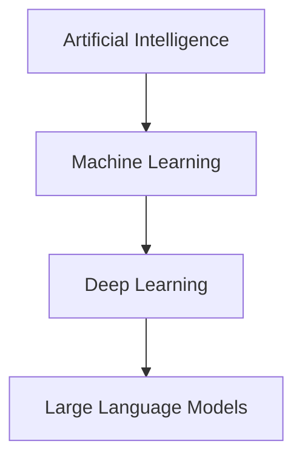

# AI Fundamentals and Large Language Models

*Phase 1 — what you actually need to know about AI before you start wiring it into your infrastructure.*

> ⭐ Star this repo if it's useful — it helps more than you think.

---

## Why This Chapter Exists

A junior engineer on my team once spent half a day asking ChatGPT to "check our production logs from this morning." He got back confident, detailed analysis. None of it was real. The model couldn't see his logs and was never going to.

That's the gap this chapter closes. Before you can use AI in DevOps, you need a working mental model of what these systems are, what they can actually do, and where they break. Not a research-grade understanding — just enough to make good decisions when you're integrating them into pipelines, runbooks, and on-call tools.

By the end, you should be able to:

- Tell AI, ML, and LLMs apart in one sentence each
- Read an OpenAI or Anthropic pricing page and know what you're paying for
- Pick the right model for a task instead of defaulting to the biggest one
- Spot the failure modes (hallucination, context limits, knowledge cutoffs) before they bite you in production

---

## The Three Words People Use Interchangeably

AI, machine learning, and deep learning are not synonyms. They nest:



- **Artificial Intelligence** is the umbrella. Any system that does something a human used to do — playing chess, classifying images, routing tickets — counts.
- **Machine learning** is AI that learns patterns from data instead of following hand-written rules. Your spam filter is ML. So is the recommendation engine that picked your last Netflix show.
- **Deep learning** is ML built on neural networks with many layers. It's what made image recognition and speech-to-text actually work.
- **Large Language Models** are deep learning systems trained on enormous text corpora. GPT, Claude, Gemini, Llama — all LLMs.

When a vendor says "AI-powered," ask which layer they actually mean. The honest answer is usually "an LLM with a prompt template."

---

## How Text Becomes Numbers

LLMs don't read English. They read sequences of integers called *tokens*.

Take this sentence: `"Restart the nginx pod."`

A tokenizer might split it into something like:

```
["Restart", " the", " nginx", " pod", "."]
→ [27914, 290, 39199, 7397, 13]
```

Each token maps to a vector — a list of a few thousand floating-point numbers. Similar tokens land in similar regions of that vector space. The model learns relationships by moving these vectors around during training.

Three practical consequences:

1. **You pay per token, not per word.** "Kubernetes" might be one token. "kubelet-config-reloader" might be five. Long variable names cost real money at scale.
2. **Context windows are measured in tokens.** When a model says "128k context," it means 128,000 tokens — roughly 90,000 English words, less for code.
3. **Tokenization is language-dependent.** A paragraph in Vietnamese or Japanese typically uses 2-3x more tokens than the same paragraph in English.

> **Tip:** Paste your typical prompts into the [OpenAI tokenizer](https://platform.openai.com/tokenizer) once. You'll be surprised what's expensive.

---

## What an LLM Actually Does

Strip away the marketing and an LLM does exactly one thing: given a sequence of tokens, it predicts the next token. Then it does it again. And again. Until it hits a stop signal.

That's it. Everything else — answering questions, writing code, summarizing logs — emerges from doing next-token prediction very well, at scale, on enough data.

This explains the personality of LLMs:

- They're **fluent** because they've seen billions of sentences.
- They're **confident** because they always produce something — there's no "I don't know" baked into the architecture; that has to be trained in.
- They **hallucinate** because they're guessing the next plausible token, not retrieving facts.
- They **forget** what's outside the context window because the architecture has no persistent memory.

When someone tells you an LLM "thinks" or "understands," they're using shortcut language. Treat it as a very capable pattern matcher with a fixed scratchpad. That mental model holds up almost everywhere.

---

## The Current Model Landscape (Mid-2026)

You don't need to know every model. You need to know the families and what they're good at.

| Family | Maker | Strengths | Typical use |
|---|---|---|---|
| **GPT-4.1 / GPT-5** | OpenAI | General reasoning, tool use, structured outputs | Production agents, code generation |
| **Claude Sonnet 4.5 / Opus 4** | Anthropic | Long context, careful reasoning, refusal behavior | Code review, long-document analysis |
| **Gemini 2.5 Pro** | Google | Multimodal, very long context, tight Google Cloud integration | Image/log analysis, BigQuery workflows |
| **Llama 3.x / 4** | Meta | Open weights, self-hostable | On-prem deployments, fine-tuning |
| **Mistral / Mixtral** | Mistral | Strong open-weight models, European hosting | EU data-residency requirements |
| **Qwen / DeepSeek** | Alibaba / DeepSeek | Open weights, strong on code and reasoning | Cost-sensitive coding agents |

Names and version numbers change every few months. The capability tiers don't:

- **Frontier models** (GPT-5, Claude Opus 4, Gemini 2.5 Pro): expensive, slow, best reasoning. Use for hard problems.
- **Workhorse models** (GPT-4.1 mini, Claude Sonnet, Gemini Flash): 10-30x cheaper, fast, good enough for 80% of tasks.
- **Small / open models** (Llama 3 8B, Qwen 7B): cheap to run, fine for classification, routing, and structured extraction.

> **Note:** "Bigger is better" is the most expensive default in AI engineering. Always start with the workhorse tier and measure before reaching for frontier models.

---

## How These Models Get Trained

You don't need to train one. You should know the shape of the process, because it explains every weird behavior you'll see.

Modern LLMs go through three stages:

**1. Pre-training.** The model reads a huge chunk of the internet, books, code, and papers — trillions of tokens. It learns next-token prediction on raw text. The result is a *base model*: fluent but unaligned. Ask it a question and it might continue with more questions instead of answering.

**2. Supervised fine-tuning (SFT).** Humans write thousands of high-quality instruction/response pairs. The model is fine-tuned on these. Now it answers questions instead of completing them.

**3. Reinforcement learning from human feedback (RLHF) or AI feedback (RLAIF).** Humans (or another model) rank multiple responses. The model is updated to prefer the higher-ranked ones. This is where "helpful, harmless, honest" personalities come from.

Two things follow:

- **Knowledge cutoffs are real.** A model's facts stop at the end of its pre-training data. If GPT-5's cutoff is May 2026, it has no idea what happened last week unless you tell it.
- **Safety behaviors are trained, not built in.** A jailbroken model will gladly help with things its production sibling refuses. This matters when you self-host.

---

## What LLMs Are Good At, What They're Not

**They're good at:**

- Generating boilerplate code, configs, and documentation
- Summarizing long text into structured output
- Translating between formats (logs → JSON, English → SQL, YAML → Terraform)
- Pattern-matching against examples ("here are 10 good commits, write one for this diff")
- Following clear, constrained instructions

**They're bad at:**

- Math beyond basic arithmetic. They guess plausible numbers. Use a calculator tool.
- Counting things accurately. Ask "how many errors are in this log?" and you'll get a number that sounds right.
- Knowing what they don't know. They will hallucinate API endpoints, function signatures, and library names with total confidence.
- Anything outside their training cutoff or context window. No, GPT can't read your wiki unless you paste it in.
- Long, multi-step planning without external structure. They drift.

> **Warning:** If correctness matters, you do not let the LLM be the source of truth. Pair it with retrieval, tool calls, and validation. A model that's right 95% of the time is wrong every twentieth time — and you won't know which time.

---

## How to Evaluate a Model for Your Work

Benchmarks like MMLU and HumanEval are useful for vendors. They're nearly useless for you. The model that wins benchmarks may still be terrible at writing your team's Terraform.

Run your own evaluation. The process takes an afternoon:

1. **Collect 10–20 real tasks** from the last two weeks of your work. Real tickets, real questions, real diffs.
2. **Write the ideal output** for each one. Or grab what a senior engineer actually produced.
3. **Run the same task through 2–3 candidate models.** Same prompt, same inputs.
4. **Score each output on four axes:** correctness, completeness, format compliance, hallucination rate.
5. **Track cost and latency** alongside quality.

The winner is rarely the most expensive model. It's the cheapest model that clears your quality bar.

```python
# evaluate.py — minimal harness for comparing models
import time
from openai import OpenAI

client = OpenAI()
MODELS = ["gpt-4.1-mini", "gpt-4.1", "gpt-5"]

def run_task(model: str, prompt: str) -> dict:
    start = time.perf_counter()
    resp = client.chat.completions.create(
        model=model,
        messages=[{"role": "user", "content": prompt}],
    )
    return {
        "model": model,
        "output": resp.choices[0].message.content,
        "latency_s": round(time.perf_counter() - start, 2),
        "input_tokens": resp.usage.prompt_tokens,
        "output_tokens": resp.usage.completion_tokens,
    }

if __name__ == "__main__":
    prompt = "Summarize: the load balancer returned 502 for 4 minutes at 09:14 UTC."
    for m in MODELS:
        print(run_task(m, prompt))
```

This script uses the OpenAI Python SDK v1.x. The older `openai.ChatCompletion.create` syntax was removed in late 2023 — if you see it in a tutorial, the tutorial is out of date.

---

## AI in DevOps: Where It Actually Helps

Strip out the hype and the genuinely useful applications cluster in four areas:

**1. Toil reduction.** Generating boilerplate Terraform, writing PromQL queries, drafting runbook stubs, formatting commit messages. Things you do the same way every time.

**2. First-pass analysis.** Triaging alerts, summarizing PRs, extracting structure from logs. Not the final word, but a useful first read.

**3. Documentation.** Generating docs from code, code from docs, and keeping them in sync. The single biggest wins I've seen on real teams.

**4. Interactive troubleshooting.** A chat interface over your tools — Kubernetes, AWS, Datadog — beats memorizing a hundred CLI flags. This is the killer app for MCP, which you'll see in chapter 5.

What it doesn't do well: act autonomously on production systems without human review. Not yet. The gap between "agent that can run `kubectl`" and "agent you trust to run `kubectl` at 3 AM" is enormous.

---

## A Failure Story

A team I worked with built an "AI on-call assistant" in a weekend. It read PagerDuty alerts, ran diagnostic commands through an MCP server, and posted a summary to Slack. Beautiful demo.

Two weeks in, it confidently posted that a database was healthy. It wasn't. Replication had been broken for six hours. The assistant had run `SELECT 1;`, gotten back a `1`, and called it a day.

The fix wasn't a better model. It was a better tool: a real health check that walked replication lag, recent error logs, and connection counts. The LLM was fine at *narrating*. It was terrible at *deciding what to check*.

The lesson: the LLM is the interface. The tools are the truth. Get the tools right first.

---

## A Tiny Hands-On

If you've never made an API call to an LLM, do it now. This is the entire program:

```python
# hello_llm.py
from openai import OpenAI

client = OpenAI()  # reads OPENAI_API_KEY from env

response = client.chat.completions.create(
    model="gpt-4.1-mini",
    messages=[
        {"role": "system", "content": "You are a senior SRE. Be concise."},
        {"role": "user", "content": "Explain what a readiness probe does in 2 sentences."},
    ],
)

print(response.choices[0].message.content)
print("---")
print(f"tokens in/out: {response.usage.prompt_tokens}/{response.usage.completion_tokens}")
```

Run it. Read the output. Note the token count. That's the foundation of every AI tool you'll build in this book.

Setup:

```bash
pip install "openai>=1.50"
export OPENAI_API_KEY=sk-...   # or use a .env loader
python hello_llm.py
```

Same idea with Anthropic:

```python
# hello_claude.py
from anthropic import Anthropic

client = Anthropic()  # reads ANTHROPIC_API_KEY

msg = client.messages.create(
    model="claude-sonnet-4-5",
    max_tokens=256,
    system="You are a senior SRE. Be concise.",
    messages=[{"role": "user", "content": "Explain what a readiness probe does in 2 sentences."}],
)
print(msg.content[0].text)
```

---

## Chapter Summary

- AI > ML > Deep Learning > LLMs. Use the right word.
- LLMs predict the next token. Everything else is emergent behavior on top of that.
- Tokens cost money. Context windows have hard limits. Both matter at scale.
- Three model tiers: frontier, workhorse, small/open. Default to workhorse.
- Run your own evaluation on real tasks. Benchmarks are for vendors.
- The LLM is the interface. The tools are the truth.

Next: [Prompt Engineering](03-prompt-engineering.md) — turning the model into a reliable component.

---

## Resources

- [OpenAI API reference](https://platform.openai.com/docs/api-reference)
- [Anthropic API docs](https://docs.anthropic.com/)
- [Google Gemini API](https://ai.google.dev/)
- [3Blue1Brown — Neural Networks](https://www.youtube.com/playlist?list=PLZHQObOWTQDNU6R1_67000Dx_ZCJB-3pi) — best free explanation of how this stuff actually works
- *The Hundred-Page Machine Learning Book* — Andriy Burkov

---

[](https://github.com/sponsors/hoalongnatsu)
