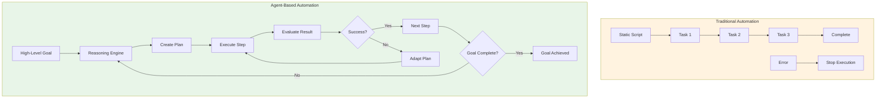
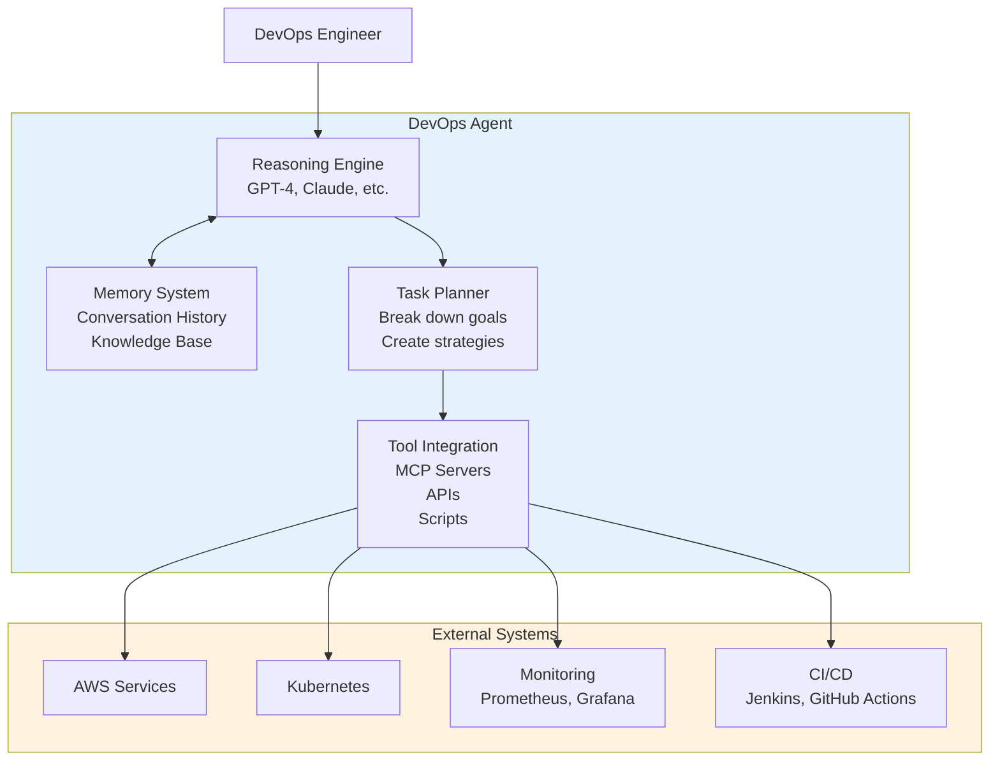
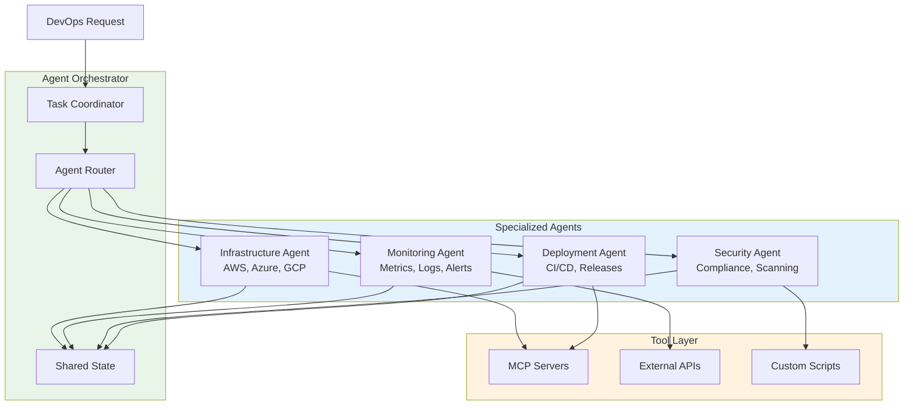

# 05-02 AI Agent for DevOps

*Learn agent frameworks, multi-agent systems, and orchestration patterns to build intelligent DevOps automation*

> ⭐ **Starring** this repository to support this work

## Table of Contents

- [What are Agent Frameworks?](#what-are-agent-frameworks)
- [Why Agents Matter in DevOps](#why-agents-matter-in-devops)
- [Agent Architecture Patterns](#agent-architecture-patterns)
- [Hands-On: Building DevOps Agents](#hands-on-building-devops-agents)
- [Multi-Agent Systems](#multi-agent-systems)
- [Agent Orchestration Patterns](#agent-orchestration-patterns)
- [Production Deployment](#production-deployment)
- [Best Practices](#best-practices)
- [Next Steps](#next-steps)

**Note:** This guide provides a brief overview and a basic understanding of how AI Agent can be applied to DevOps. For a deeper understanding and step-by-step tutorial, please visit **[AI Agents for DevOps](/03-ai-agent-for-devops/00-toc.md)**.

---

## What are Agent Frameworks?

**Agent Frameworks** provide the building blocks for creating autonomous AI systems that can reason, plan, and execute complex tasks. Unlike simple chatbots, agents can break down problems, use tools, and coordinate with other agents to achieve goals.

### Key Concepts

**Reasoning Engine**: Agents can analyze problems and create step-by-step plans

**Tool Integration**: Agents can use external tools, APIs, and services (including MCP servers)

**Iterative Execution**: Agents can retry, adapt, and learn from failures

**Collaboration**: Multiple agents can work together on complex tasks

### Agent vs Traditional Automation



---

## Why Agents Matter in DevOps

### Intelligent Automation

**Adaptive Problem Solving**: Agents can handle unexpected situations and adapt their approach

**Context Awareness**: Agents understand the broader context of DevOps operations

**Self-Correction**: Agents can detect and fix their own mistakes

### DevOps Use Cases

1. **Incident Response**: Autonomous investigation and remediation
2. **Infrastructure Optimization**: Continuous analysis and improvement
3. **Deployment Orchestration**: Intelligent deployment strategies
4. **Monitoring & Alerting**: Smart alert correlation and escalation
5. **Security Compliance**: Automated security audits and fixes
6. **Cost Management**: Dynamic resource optimization

### Business Impact

- **Reduced MTTR**: Faster incident resolution through intelligent automation
- **24/7 Operations**: Agents work continuously without human intervention
- **Consistent Quality**: Standardized responses and procedures
- **Knowledge Retention**: Agents capture and apply organizational knowledge

---

## Agent Architecture Patterns

### Single Agent Architecture



### Multi-Agent Architecture



---

## Hands-On: Building DevOps Agents

Let's build practical agents using popular frameworks. We'll start with a simple infrastructure agent and progress to more complex multi-agent systems.

### Framework Comparison

| **Framework** | **Best For**                | **Complexity** | **DevOps Integration**     |
| ------------------- | --------------------------------- | -------------------- | -------------------------------- |
| **LangChain** | General purpose, extensive tools  | Medium               | Excellent (many integrations)    |
| **CrewAI**    | Multi-agent collaboration         | Low                  | Good (growing ecosystem)         |
| **AutoGen**   | Complex multi-agent conversations | High                 | Moderate (requires custom tools) |
| **LangGraph** | State-based workflows             | Medium               | Excellent (Langchain ecosystem)  |

### Project 1: Infrastructure Health Agent (LangChain)

#### Step 1: Setup and Dependencies

```python
# requirements.txt
langchain>=0.1.0
langchain-openai>=0.1.0
langchain-community>=0.1.0
boto3>=1.26.0
psutil>=5.9.0
requests>=2.31.0
```

**What this includes**:

- `langchain`: Core agent framework
- `langchain-openai`: OpenAI LLM integration
- `boto3`: AWS SDK for infrastructure monitoring
- `psutil`: System metrics collection

#### Step 2: Basic Agent Structure

```python
# infrastructure_agent.py
import os
import json
from datetime import datetime
from typing import List, Dict, Any

from langchain.agents import create_openai_functions_agent, AgentExecutor
from langchain.tools import BaseTool
from langchain_openai import ChatOpenAI
from langchain.schema import SystemMessage
from langchain.prompts import ChatPromptTemplate, MessagesPlaceholder

import boto3
import psutil

class InfrastructureHealthAgent:
    """
    An intelligent agent that monitors and manages infrastructure health.
    Can work with AWS, local systems, and integrate with our MCP servers.
    """
  
    def __init__(self, aws_profile: str = None, aws_region: str = "us-west-2"):
        # Initialize LLM
        self.llm = ChatOpenAI(
            model="gpt-4",
            temperature=0.1  # Low temperature for consistent, factual responses
        )
    
        # Initialize AWS clients
        session = boto3.Session(profile_name=aws_profile)
        self.ec2_client = session.client('ec2', region_name=aws_region)
        self.cloudwatch_client = session.client('cloudwatch', region_name=aws_region)
    
        # Initialize agent tools
        self.tools = self._create_tools()
    
        # Create agent
        self.agent = self._create_agent()
    
        # Create agent executor
        self.executor = AgentExecutor(
            agent=self.agent,
            tools=self.tools,
            verbose=True,
            handle_parsing_errors=True,
            max_iterations=10
        )
  
    def _create_agent(self):
        """Create the LangChain agent with proper prompting"""
    
        system_message = """You are an expert DevOps Infrastructure Agent. Your role is to:

1. Monitor infrastructure health across cloud and on-premises systems
2. Diagnose problems and suggest solutions
3. Automate routine maintenance tasks
4. Provide clear, actionable insights

Guidelines:
- Always gather comprehensive data before making recommendations
- Prioritize system stability and security
- Explain your reasoning and provide step-by-step plans
- Use the available tools to get real-time information
- When in doubt, recommend safe, conservative actions

You have access to tools for:
- AWS EC2 instance monitoring
- System metrics collection
- CloudWatch metrics analysis
- Infrastructure health checks
"""

        prompt = ChatPromptTemplate.from_messages([
            SystemMessage(content=system_message),
            MessagesPlaceholder(variable_name="chat_history", optional=True),
            ("human", "{input}"),
            MessagesPlaceholder(variable_name="agent_scratchpad")
        ])
    
        return create_openai_functions_agent(self.llm, self.tools, prompt)
```

**What this does**:

- Creates an intelligent agent with reasoning capabilities
- Integrates with AWS services for infrastructure monitoring
- Provides clear guidelines for DevOps decision-making
- Sets up a flexible tool system for extensibility

**Why this architecture**: The agent can reason about complex infrastructure scenarios and adapt its approach based on real-time data.

#### Step 3: Infrastructure Monitoring Tools

```python
    def _create_tools(self) -> List[BaseTool]:
        """Create the tools that the agent can use"""
        return [
            self._create_ec2_status_tool(),
            self._create_system_metrics_tool(),
            self._create_cloudwatch_metrics_tool(),
            self._create_health_check_tool()
        ]
  
    def _create_ec2_status_tool(self) -> BaseTool:
        """Tool to check EC2 instance status"""
    
        class EC2StatusTool(BaseTool):
            name = "ec2_status"
            description = "Get the status of EC2 instances. Use this to check if instances are running, stopped, or have issues."
        
            def _run(self, query: str = "") -> str:
                try:
                    response = self.ec2_client.describe_instances()
                
                    instances = []
                    for reservation in response['Reservations']:
                        for instance in reservation['Instances']:
                            instance_info = {
                                'InstanceId': instance['InstanceId'],
                                'InstanceType': instance['InstanceType'],
                                'State': instance['State']['Name'],
                                'LaunchTime': instance['LaunchTime'].isoformat(),
                                'PublicIP': instance.get('PublicIpAddress', 'N/A'),
                                'PrivateIP': instance.get('PrivateIpAddress', 'N/A'),
                                'Name': self._get_instance_name(instance)
                            }
                            instances.append(instance_info)
                
                    return json.dumps(instances, indent=2)
                
                except Exception as e:
                    return f"Error getting EC2 status: {str(e)}"
        
            def _get_instance_name(self, instance):
                """Extract instance name from tags"""
                tags = instance.get('Tags', [])
                for tag in tags:
                    if tag['Key'] == 'Name':
                        return tag['Value']
                return 'Unnamed'
    
        tool = EC2StatusTool()
        tool.ec2_client = self.ec2_client  # Bind the client to the tool
        return tool
  
    def _create_system_metrics_tool(self) -> BaseTool:
        """Tool to get local system metrics"""
    
        class SystemMetricsTool(BaseTool):
            name = "system_metrics"
            description = "Get current system metrics like CPU, memory, disk usage. Use this to check local system health."
        
            def _run(self, query: str = "") -> str:
                try:
                    metrics = {
                        'timestamp': datetime.now().isoformat(),
                        'cpu_percent': psutil.cpu_percent(interval=1),
                        'memory': {
                            'total': psutil.virtual_memory().total,
                            'available': psutil.virtual_memory().available,
                            'percent': psutil.virtual_memory().percent
                        },
                        'disk': {
                            'total': psutil.disk_usage('/').total,
                            'free': psutil.disk_usage('/').free,
                            'percent': psutil.disk_usage('/').percent
                        },
                        'load_average': os.getloadavg() if hasattr(os, 'getloadavg') else 'N/A'
                    }
                
                    return json.dumps(metrics, indent=2)
                
                except Exception as e:
                    return f"Error getting system metrics: {str(e)}"
    
        return SystemMetricsTool()
  
    def _create_cloudwatch_metrics_tool(self) -> BaseTool:
        """Tool to get CloudWatch metrics"""
    
        class CloudWatchMetricsTool(BaseTool):
            name = "cloudwatch_metrics"
            description = "Get CloudWatch metrics for AWS resources. Specify instance ID to get detailed metrics."
        
            def _run(self, instance_id: str = "") -> str:
                try:
                    from datetime import timedelta
                
                    end_time = datetime.utcnow()
                    start_time = end_time - timedelta(hours=1)  # Last hour
                
                    # Get CPU utilization
                    cpu_response = self.cloudwatch_client.get_metric_statistics(
                        Namespace='AWS/EC2',
                        MetricName='CPUUtilization',
                        Dimensions=[
                            {
                                'Name': 'InstanceId',
                                'Value': instance_id
                            }
                        ],
                        StartTime=start_time,
                        EndTime=end_time,
                        Period=300,  # 5 minutes
                        Statistics=['Average', 'Maximum']
                    )
                
                    metrics = {
                        'instance_id': instance_id,
                        'time_range': f"{start_time.isoformat()} to {end_time.isoformat()}",
                        'cpu_utilization': cpu_response['Datapoints']
                    }
                
                    return json.dumps(metrics, indent=2, default=str)
                
                except Exception as e:
                    return f"Error getting CloudWatch metrics: {str(e)}"
    
        tool = CloudWatchMetricsTool()
        tool.cloudwatch_client = self.cloudwatch_client  # Bind the client
        return tool
  
    def _create_health_check_tool(self) -> BaseTool:
        """Tool to perform comprehensive health checks"""
    
        class HealthCheckTool(BaseTool):
            name = "health_check"
            description = "Perform a comprehensive health check across all monitored systems."
        
            def _run(self, query: str = "") -> str:
                try:
                    health_report = {
                        'timestamp': datetime.now().isoformat(),
                        'status': 'checking',
                        'checks': []
                    }
                
                    # Check system resources
                    cpu_percent = psutil.cpu_percent(interval=1)
                    memory_percent = psutil.virtual_memory().percent
                    disk_percent = psutil.disk_usage('/').percent
                
                    # CPU Check
                    cpu_status = "healthy" if cpu_percent < 80 else "warning" if cpu_percent < 95 else "critical"
                    health_report['checks'].append({
                        'check': 'CPU Usage',
                        'value': f"{cpu_percent}%",
                        'status': cpu_status,
                        'threshold': '80% warning, 95% critical'
                    })
                
                    # Memory Check
                    memory_status = "healthy" if memory_percent < 85 else "warning" if memory_percent < 95 else "critical"
                    health_report['checks'].append({
                        'check': 'Memory Usage',
                        'value': f"{memory_percent}%",
                        'status': memory_status,
                        'threshold': '85% warning, 95% critical'
                    })
                
                    # Disk Check
                    disk_status = "healthy" if disk_percent < 90 else "warning" if disk_percent < 98 else "critical"
                    health_report['checks'].append({
                        'check': 'Disk Usage',
                        'value': f"{disk_percent}%",
                        'status': disk_status,
                        'threshold': '90% warning, 98% critical'
                    })
                
                    # Overall status
                    statuses = [check['status'] for check in health_report['checks']]
                    if 'critical' in statuses:
                        health_report['status'] = 'critical'
                    elif 'warning' in statuses:
                        health_report['status'] = 'warning'
                    else:
                        health_report['status'] = 'healthy'
                
                    return json.dumps(health_report, indent=2)
                
                except Exception as e:
                    return f"Error performing health check: {str(e)}"
    
        return HealthCheckTool()
```

**What this does**:

- **EC2 Status Tool**: Monitors AWS instances and their states
- **System Metrics Tool**: Collects local server performance data
- **CloudWatch Tool**: Retrieves AWS monitoring metrics
- **Health Check Tool**: Performs comprehensive system analysis

**DevOps Value**: These tools give the agent real-time visibility into infrastructure health, enabling intelligent decision-making.

#### Step 4: Agent Usage Examples

```python
    def run(self, task: str) -> str:
        """Execute a task using the agent"""
        try:
            result = self.executor.invoke({"input": task})
            return result["output"]
        except Exception as e:
            return f"Error executing task: {str(e)}"

# Usage Examples
def main():
    """Demonstrate the Infrastructure Health Agent"""
  
    # Initialize the agent
    agent = InfrastructureHealthAgent(aws_profile="devops-team")
  
    # Example 1: General health check
    print("=== Example 1: Infrastructure Health Check ===")
    response = agent.run(
        "Perform a comprehensive health check of our infrastructure. "
        "Check both local system and AWS EC2 instances. "
        "Provide recommendations for any issues found."
    )
    print(response)
  
    # Example 2: Specific investigation
    print("\n=== Example 2: High CPU Investigation ===")
    response = agent.run(
        "I'm seeing alerts about high CPU usage. "
        "Investigate which systems are affected and suggest solutions."
    )
    print(response)
  
    # Example 3: Proactive monitoring
    print("\n=== Example 3: Proactive Optimization ===")
    response = agent.run(
        "Analyze our current infrastructure utilization. "
        "Identify opportunities for cost optimization and performance improvement."
    )
    print(response)

if __name__ == "__main__":
    main()
```

**Real-World Agent Conversations**:

```
🗣️ DevOps Engineer: "Perform a comprehensive health check of our infrastructure"

🤖 Agent: I'll perform a comprehensive health check across your infrastructure. Let me gather data from multiple sources.

[Agent uses health_check tool]
[Agent uses ec2_status tool]
[Agent uses system_metrics tool]

📊 Infrastructure Health Report:

🖥️ Local System Status:
• CPU Usage: 23% ✅ Healthy
• Memory Usage: 67% ✅ Healthy  
• Disk Usage: 78% ✅ Healthy
• Load Average: [0.8, 0.9, 1.1] ✅ Normal

☁️ AWS EC2 Status:
• web-prod-1: Running ✅ (t3.medium, launched 12 days ago)
• web-prod-2: Running ✅ (t3.medium, launched 12 days ago)
• db-prod-1: Running ✅ (r5.large, launched 45 days ago)
• staging-app: Stopped ⚠️ (t3.small, stopped 3 days ago)

🎯 Recommendations:
1. All critical systems are healthy and operating normally
2. Consider starting staging-app if testing is needed
3. Monitor db-prod-1 closely as it's been running for 45 days (consider reboot during maintenance window)
4. Current resource utilization is optimal with room for growth

Overall Status: ✅ HEALTHY
```

---

## Multi-Agent Systems

### Project 2: DevOps Multi-Agent System (CrewAI)

Now let's build a more sophisticated multi-agent system where specialized agents collaborate on complex DevOps tasks.

#### Step 1: CrewAI Setup

```python
# requirements.txt (add to previous)
crewai>=0.1.0
crewai-tools>=0.1.0
```

#### Step 2: Multi-Agent Architecture

```python
# devops_crew.py
import os
from datetime import datetime
from typing import List, Dict

from crewai import Agent, Task, Crew, Process
from crewai.tools import BaseTool
from langchain_openai import ChatOpenAI

class DevOpsAgentCrew:
    """
    A multi-agent system for comprehensive DevOps operations.
    Each agent specializes in a specific domain but can collaborate.
    """
  
    def __init__(self):
        self.llm = ChatOpenAI(model="gpt-4", temperature=0.1)
    
        # Create specialized agents
        self.infrastructure_agent = self._create_infrastructure_agent()
        self.security_agent = self._create_security_agent()
        self.monitoring_agent = self._create_monitoring_agent()
        self.deployment_agent = self._create_deployment_agent()
    
        # Create the crew
        self.crew = self._create_crew()
  
    def _create_infrastructure_agent(self) -> Agent:
        """Infrastructure specialist agent"""
        return Agent(
            role="Infrastructure Specialist",
            goal="Manage and optimize cloud infrastructure, ensure high availability and performance",
            backstory="""You are a seasoned Infrastructure Engineer with deep expertise in cloud platforms, 
            particularly AWS. You understand infrastructure patterns, scaling strategies, and cost optimization. 
            You work closely with other team members to ensure infrastructure supports application and security requirements.""",
            verbose=True,
            allow_delegation=True,
            llm=self.llm,
            tools=self._get_infrastructure_tools()
        )
  
    def _create_security_agent(self) -> Agent:
        """Security specialist agent"""
        return Agent(
            role="Security Specialist", 
            goal="Ensure infrastructure security, compliance, and implement security best practices",
            backstory="""You are a cybersecurity expert specializing in DevSecOps. You understand security 
            frameworks, compliance requirements, and threat modeling. You review infrastructure changes for 
            security implications and implement security controls.""",
            verbose=True,
            allow_delegation=True,
            llm=self.llm,
            tools=self._get_security_tools()
        )
  
    def _create_monitoring_agent(self) -> Agent:
        """Monitoring and observability specialist"""
        return Agent(
            role="Monitoring Specialist",
            goal="Implement comprehensive monitoring, alerting, and observability solutions",
            backstory="""You are an SRE expert focused on monitoring, metrics, and observability. You design 
            alerting strategies, create dashboards, and ensure system reliability through proactive monitoring. 
            You help other agents understand system behavior and performance trends.""",
            verbose=True,
            allow_delegation=True,
            llm=self.llm,
            tools=self._get_monitoring_tools()
        )
  
    def _create_deployment_agent(self) -> Agent:
        """Deployment and CI/CD specialist"""
        return Agent(
            role="Deployment Specialist",
            goal="Manage CI/CD pipelines, deployments, and release strategies",
            backstory="""You are a DevOps engineer specializing in continuous integration and deployment. 
            You design deployment pipelines, implement blue-green deployments, and ensure reliable releases. 
            You coordinate with infrastructure and security teams for safe deployments.""",
            verbose=True,
            allow_delegation=True,
            llm=self.llm,
            tools=self._get_deployment_tools()
        )
```

#### Step 3: Collaborative Task Execution

```python
    def _create_crew(self) -> Crew:
        """Create the crew with task delegation capabilities"""
        return Crew(
            agents=[
                self.infrastructure_agent,
                self.security_agent, 
                self.monitoring_agent,
                self.deployment_agent
            ],
            process=Process.hierarchical,  # Infrastructure agent leads
            manager_llm=self.llm,
            verbose=True
        )
  
    def handle_incident(self, incident_description: str) -> str:
        """Handle a production incident using the full crew"""
    
        # Define the incident response tasks
        tasks = [
            Task(
                description=f"""
                Incident Report: {incident_description}
            
                As the Infrastructure Specialist, lead the incident response:
                1. Assess the current infrastructure state
                2. Identify affected systems and services
                3. Coordinate with other specialists for comprehensive analysis
                4. Provide immediate stabilization recommendations
            
                Delegate specific tasks to other agents as needed.
                """,
                agent=self.infrastructure_agent,
                expected_output="Comprehensive incident assessment with immediate action plan"
            ),
        
            Task(
                description=f"""
                Security Analysis for incident: {incident_description}
            
                Analyze the security implications:
                1. Check if this could be a security incident
                2. Review access logs and security events
                3. Assess potential data exposure or compromise
                4. Recommend security hardening measures
                """,
                agent=self.security_agent,
                expected_output="Security impact assessment and recommendations"
            ),
        
            Task(
                description=f"""
                Monitoring Analysis for incident: {incident_description}
            
                Provide observability insights:
                1. Analyze relevant metrics and logs
                2. Identify patterns or anomalies leading to the incident
                3. Set up additional monitoring if needed
                4. Create alerts to prevent recurrence
                """,
                agent=self.monitoring_agent,
                expected_output="Monitoring analysis and preventive measures"
            ),
        
            Task(
                description=f"""
                Deployment Impact Analysis for incident: {incident_description}
            
                Assess deployment-related factors:
                1. Check if recent deployments contributed to the incident
                2. Evaluate rollback options if applicable
                3. Review deployment pipeline health
                4. Recommend deployment process improvements
                """,
                agent=self.deployment_agent,
                expected_output="Deployment analysis and process recommendations"
            )
        ]
    
        # Execute the incident response
        result = self.crew.kickoff(tasks=tasks)
        return result
  
    def infrastructure_optimization(self, requirements: str) -> str:
        """Optimize infrastructure based on requirements"""
    
        optimization_task = Task(
            description=f"""
            Infrastructure Optimization Request: {requirements}
        
            Lead a comprehensive infrastructure optimization initiative:
            1. Analyze current infrastructure state and usage patterns
            2. Coordinate with Security team for compliance requirements
            3. Work with Monitoring team for performance baselines
            4. Collaborate with Deployment team for rollout strategy
        
            Provide a detailed optimization plan with timeline and risk assessment.
            """,
            agent=self.infrastructure_agent,
            expected_output="Comprehensive infrastructure optimization plan"
        )
    
        result = self.crew.kickoff(tasks=[optimization_task])
        return result

# Usage Examples
def demonstrate_multi_agent_system():
    """Show the multi-agent system in action"""
  
    crew = DevOpsAgentCrew()
  
    # Example 1: Incident Response
    print("=== Multi-Agent Incident Response ===")
    incident = """
    Production Alert: High response times detected on web application.
    - Average response time increased from 200ms to 3000ms
    - Error rate increased from 0.1% to 5%
    - Started approximately 15 minutes ago
    - Affects primary user-facing application
    """
  
    response = crew.handle_incident(incident)
    print(f"Incident Response:\n{response}")
  
    # Example 2: Infrastructure Optimization
    print("\n=== Multi-Agent Infrastructure Optimization ===")
    requirements = """
    Optimize our infrastructure for:
    - 50% cost reduction over 6 months
    - Improved security posture
    - Better monitoring and alerting
    - Zero-downtime deployment capability
    """
  
    optimization = crew.infrastructure_optimization(requirements)
    print(f"Optimization Plan:\n{optimization}")

if __name__ == "__main__":
    demonstrate_multi_agent_system()
```

**What this creates**:

- **Hierarchical Collaboration**: Infrastructure agent leads and delegates to specialists
- **Domain Expertise**: Each agent brings specialized knowledge to complex problems
- **Comprehensive Analysis**: Multiple perspectives ensure thorough problem-solving
- **Coordinated Response**: Agents work together rather than in isolation

---

## Agent Orchestration Patterns

### Pattern 1: Sequential Workflow

```python
# sequential_workflow.py
from typing import List, Dict
import asyncio

class SequentialAgentWorkflow:
    """
    Orchestrates agents in a sequential pipeline.
    Perfect for deployment workflows where order matters.
    """
  
    def __init__(self, agents: List[Agent]):
        self.agents = agents
        self.workflow_state = {}
  
    async def execute_workflow(self, initial_task: str) -> Dict:
        """Execute agents sequentially, passing results forward"""
    
        current_input = initial_task
        workflow_results = []
    
        for i, agent in enumerate(self.agents):
            print(f"🔄 Step {i+1}: {agent.role}")
        
            # Execute current agent
            result = await agent.execute(current_input)
        
            # Store result
            workflow_results.append({
                'step': i+1,
                'agent': agent.role,
                'input': current_input,
                'output': result,
                'timestamp': datetime.now().isoformat()
            })
        
            # Pass result to next agent
            current_input = f"Previous step result: {result}\n\nContinue with next phase."
    
        return {
            'workflow_type': 'sequential',
            'total_steps': len(self.agents),
            'execution_time': self._calculate_execution_time(workflow_results),
            'steps': workflow_results,
            'final_result': workflow_results[-1]['output'] if workflow_results else None
        }

# Example: Deployment Pipeline
deployment_workflow = SequentialAgentWorkflow([
    security_agent,      # 1. Security validation
    infrastructure_agent, # 2. Infrastructure preparation  
    deployment_agent,    # 3. Application deployment
    monitoring_agent     # 4. Monitoring setup
])

result = await deployment_workflow.execute_workflow(
    "Deploy version 2.1.0 of our web application to production"
)
```

### Pattern 2: Parallel Execution

```python
# parallel_workflow.py
import asyncio
from concurrent.futures import ThreadPoolExecutor

class ParallelAgentWorkflow:
    """
    Orchestrates agents in parallel for independent tasks.
    Perfect for comprehensive system analysis.
    """
  
    def __init__(self, agents: List[Agent]):
        self.agents = agents
  
    async def execute_parallel(self, task: str) -> Dict:
        """Execute all agents in parallel"""
    
        print(f"🚀 Starting parallel execution with {len(self.agents)} agents")
    
        # Create tasks for all agents
        tasks = []
        for agent in self.agents:
            task_coroutine = agent.execute_async(task)
            tasks.append(task_coroutine)
    
        # Execute all tasks concurrently
        start_time = datetime.now()
        results = await asyncio.gather(*tasks, return_exceptions=True)
        execution_time = (datetime.now() - start_time).total_seconds()
    
        # Process results
        agent_results = []
        for i, (agent, result) in enumerate(zip(self.agents, results)):
            if isinstance(result, Exception):
                agent_result = {
                    'agent': agent.role,
                    'status': 'error',
                    'error': str(result),
                    'output': None
                }
            else:
                agent_result = {
                    'agent': agent.role,
                    'status': 'success',
                    'error': None,
                    'output': result
                }
            agent_results.append(agent_result)
    
        return {
            'workflow_type': 'parallel',
            'execution_time': execution_time,
            'total_agents': len(self.agents),
            'successful_agents': len([r for r in agent_results if r['status'] == 'success']),
            'failed_agents': len([r for r in agent_results if r['status'] == 'error']),
            'results': agent_results
        }

# Example: System Analysis
analysis_workflow = ParallelAgentWorkflow([
    infrastructure_agent,
    security_agent,
    monitoring_agent,
    deployment_agent
])

result = await analysis_workflow.execute_parallel(
    "Analyze our production environment for optimization opportunities"
)
```

### Pattern 3: Conditional Workflow

```python
# conditional_workflow.py
class ConditionalAgentWorkflow:
    """
    Dynamic workflow that adapts based on agent outputs.
    Perfect for incident response where the path depends on findings.
    """
  
    def __init__(self):
        self.decision_tree = {}
  
    def add_decision_node(self, condition: callable, true_agent: Agent, false_agent: Agent):
        """Add a decision point in the workflow"""
        self.decision_tree[condition] = (true_agent, false_agent)
  
    async def execute_conditional(self, initial_task: str) -> Dict:
        """Execute workflow with conditional branching"""
    
        workflow_path = []
        current_task = initial_task
    
        # Start with initial assessment
        assessment = await self.infrastructure_agent.execute(
            f"Assess the situation: {current_task}"
        )
    
        # Make decisions based on assessment
        if "security" in assessment.lower() or "breach" in assessment.lower():
            # Security incident path
            next_agent = self.security_agent
            workflow_path.append("security_branch")
        elif "performance" in assessment.lower() or "slow" in assessment.lower():
            # Performance issue path
            next_agent = self.monitoring_agent
            workflow_path.append("performance_branch")
        else:
            # General infrastructure path
            next_agent = self.infrastructure_agent
            workflow_path.append("infrastructure_branch")
    
        # Execute the chosen path
        result = await next_agent.execute(current_task)
    
        return {
            'workflow_type': 'conditional',
            'path_taken': workflow_path,
            'decision_factors': assessment,
            'final_result': result
        }
```

---

## Production Deployment

### Containerized Agent Deployment

```dockerfile
# Dockerfile
FROM python:3.11-slim

WORKDIR /app

# Install system dependencies
RUN apt-get update && apt-get install -y \
    gcc \
    && rm -rf /var/lib/apt/lists/*

# Copy requirements and install Python dependencies
COPY requirements.txt .
RUN pip install --no-cache-dir -r requirements.txt

# Copy application code
COPY . .

# Create non-root user
RUN useradd -m -u 1000 agent && chown -R agent:agent /app
USER agent

# Environment variables
ENV PYTHONPATH=/app
ENV AGENT_MODE=production

# Health check
HEALTHCHECK --interval=30s --timeout=10s --start-period=5s --retries=3 \
    CMD python -c "import requests; requests.get('http://localhost:8000/health')"

# Start the agent
CMD ["python", "agent_server.py"]
```

### Kubernetes Deployment

```yaml
# k8s-deployment.yaml
apiVersion: apps/v1
kind: Deployment
metadata:
  name: devops-agent-crew
  namespace: devops-automation
spec:
  replicas: 2
  selector:
    matchLabels:
      app: devops-agent-crew
  template:
    metadata:
      labels:
        app: devops-agent-crew
    spec:
      serviceAccount: devops-agent-sa
      containers:
      - name: agent-crew
        image: your-registry/devops-agent-crew:latest
        ports:
        - containerPort: 8000
        env:
        - name: OPENAI_API_KEY
          valueFrom:
            secretKeyRef:
              name: agent-secrets
              key: openai-api-key
        - name: AWS_REGION
          value: "us-west-2"
        resources:
          requests:
            memory: "512Mi"
            cpu: "250m"
          limits:
            memory: "1Gi"
            cpu: "500m"
        livenessProbe:
          httpGet:
            path: /health
            port: 8000
          initialDelaySeconds: 30
          periodSeconds: 10
        readinessProbe:
          httpGet:
            path: /ready
            port: 8000
          initialDelaySeconds: 5
          periodSeconds: 5
---
apiVersion: v1
kind: Service
metadata:
  name: devops-agent-crew-service
  namespace: devops-automation
spec:
  selector:
    app: devops-agent-crew
  ports:
  - port: 80
    targetPort: 8000
  type: ClusterIP
---
apiVersion: v1
kind: ServiceAccount
metadata:
  name: devops-agent-sa
  namespace: devops-automation
---
apiVersion: rbac.authorization.k8s.io/v1
kind: ClusterRole
metadata:
  name: devops-agent-role
rules:
- apiGroups: [""]
  resources: ["pods", "services", "nodes"]
  verbs: ["get", "list", "watch"]
- apiGroups: ["apps"]
  resources: ["deployments", "replicasets"]
  verbs: ["get", "list", "watch", "update"]
---
apiVersion: rbac.authorization.k8s.io/v1
kind: ClusterRoleBinding
metadata:
  name: devops-agent-binding
roleRef:
  apiGroup: rbac.authorization.k8s.io
  kind: ClusterRole
  name: devops-agent-role
subjects:
- kind: ServiceAccount
  name: devops-agent-sa
  namespace: devops-automation
```

### Agent Server Implementation

```python
# agent_server.py
from fastapi import FastAPI, HTTPException
from pydantic import BaseModel
import asyncio
import logging
from typing import Dict, Any

app = FastAPI(title="DevOps Agent Crew API", version="1.0.0")

# Initialize logging
logging.basicConfig(level=logging.INFO)
logger = logging.getLogger(__name__)

# Initialize the agent crew
agent_crew = DevOpsAgentCrew()

class TaskRequest(BaseModel):
    task_type: str  # "incident", "optimization", "analysis"
    description: str
    priority: str = "medium"  # "low", "medium", "high", "critical"
    metadata: Dict[str, Any] = {}

class TaskResponse(BaseModel):
    task_id: str
    status: str
    result: str
    execution_time: float
    timestamp: str

@app.post("/execute_task", response_model=TaskResponse)
async def execute_task(request: TaskRequest):
    """Execute a task using the appropriate agent workflow"""
  
    task_id = f"task_{int(datetime.now().timestamp())}"
    logger.info(f"Executing task {task_id}: {request.task_type}")
  
    try:
        start_time = datetime.now()
    
        if request.task_type == "incident":
            result = await agent_crew.handle_incident(request.description)
        elif request.task_type == "optimization":
            result = await agent_crew.infrastructure_optimization(request.description)
        elif request.task_type == "analysis":
            result = await agent_crew.system_analysis(request.description)
        else:
            raise HTTPException(status_code=400, detail=f"Unknown task type: {request.task_type}")
    
        execution_time = (datetime.now() - start_time).total_seconds()
    
        return TaskResponse(
            task_id=task_id,
            status="completed",
            result=result,
            execution_time=execution_time,
            timestamp=datetime.now().isoformat()
        )
    
    except Exception as e:
        logger.error(f"Task {task_id} failed: {str(e)}")
        raise HTTPException(status_code=500, detail=f"Task execution failed: {str(e)}")

@app.get("/health")
async def health_check():
    """Health check endpoint"""
    return {"status": "healthy", "timestamp": datetime.now().isoformat()}

@app.get("/ready")
async def readiness_check():
    """Readiness check endpoint"""
    try:
        # Test agent initialization
        test_result = await agent_crew.infrastructure_agent.execute("system status check")
        return {"status": "ready", "timestamp": datetime.now().isoformat()}
    except Exception as e:
        raise HTTPException(status_code=503, detail="Service not ready")

if __name__ == "__main__":
    import uvicorn
    uvicorn.run(app, host="0.0.0.0", port=8000)
```

---

## Best Practices

### Security Considerations

```python
# secure_agent_config.py
class SecureAgentConfiguration:
    """Security best practices for production agent deployment"""
  
    @staticmethod
    def configure_secure_llm():
        """Configure LLM with security constraints"""
        return ChatOpenAI(
            model="gpt-4",
            temperature=0.1,  # Low temperature for consistent responses
            max_tokens=4000,  # Limit response length
            request_timeout=30,  # Prevent hanging requests
            max_retries=3,  # Limit retry attempts
            # Add API key rotation logic
        )
  
    @staticmethod
    def implement_input_validation():
        """Validate and sanitize agent inputs"""
        def validate_task_input(task: str) -> str:
            # Remove potentially dangerous commands
            dangerous_patterns = [
                r'rm\s+-rf',
                r'sudo\s+',
                r'curl\s+.*\|\s*sh',
                r'wget\s+.*\|\s*sh',
            ]
        
            for pattern in dangerous_patterns:
                if re.search(pattern, task, re.IGNORECASE):
                    raise ValueError(f"Potentially dangerous command detected: {pattern}")
        
            # Limit input length
            if len(task) > 10000:
                raise ValueError("Task description too long")
        
            return task
    
        return validate_task_input
  
    @staticmethod
    def configure_rbac():
        """Role-based access control for agents"""
        agent_permissions = {
            'infrastructure_agent': [
                'aws:ec2:DescribeInstances',
                'aws:ec2:StartInstances', 
                'aws:ec2:StopInstances',
                'aws:cloudwatch:GetMetricStatistics'
            ],
            'security_agent': [
                'aws:iam:ListUsers',
                'aws:guardduty:GetFindings',
                'aws:securityhub:GetFindings'
            ],
            'monitoring_agent': [
                'aws:cloudwatch:*',
                'aws:logs:*'
            ],
            'deployment_agent': [
                'aws:codedeploy:*',
                'kubernetes:apps:deployments'
            ]
        }
    
        return agent_permissions
```

### Monitoring and Observability

```python
# agent_monitoring.py
import prometheus_client
from prometheus_client import Counter, Histogram, Gauge
import structlog

# Metrics
AGENT_REQUESTS = Counter('agent_requests_total', 'Total agent requests', ['agent_type', 'status'])
AGENT_DURATION = Histogram('agent_request_duration_seconds', 'Agent request duration', ['agent_type'])
ACTIVE_AGENTS = Gauge('active_agents', 'Number of active agents', ['agent_type'])

# Structured logging
logger = structlog.get_logger()

class AgentMonitoring:
    """Comprehensive monitoring for agent operations"""
  
    @staticmethod
    def track_agent_execution(agent_type: str):
        """Decorator to track agent execution metrics"""
        def decorator(func):
            async def wrapper(*args, **kwargs):
                start_time = time.time()
                ACTIVE_AGENTS.labels(agent_type=agent_type).inc()
            
                try:
                    result = await func(*args, **kwargs)
                    AGENT_REQUESTS.labels(agent_type=agent_type, status='success').inc()
                    logger.info("Agent execution successful", 
                              agent_type=agent_type, 
                              duration=time.time() - start_time)
                    return result
                
                except Exception as e:
                    AGENT_REQUESTS.labels(agent_type=agent_type, status='error').inc()
                    logger.error("Agent execution failed", 
                               agent_type=agent_type, 
                               error=str(e),
                               duration=time.time() - start_time)
                    raise
                
                finally:
                    AGENT_DURATION.labels(agent_type=agent_type).observe(time.time() - start_time)
                    ACTIVE_AGENTS.labels(agent_type=agent_type).dec()
        
            return wrapper
        return decorator
  
    @staticmethod
    def setup_alerting():
        """Configure alerting rules for agent health"""
        alerting_rules = {
            'agent_error_rate_high': {
                'query': 'rate(agent_requests_total{status="error"}[5m]) > 0.1',
                'for': '2m',
                'labels': {'severity': 'warning'},
                'annotations': {'summary': 'High agent error rate detected'}
            },
            'agent_response_time_high': {
                'query': 'histogram_quantile(0.95, agent_request_duration_seconds) > 30',
                'for': '5m', 
                'labels': {'severity': 'critical'},
                'annotations': {'summary': 'Agent response time too high'}
            }
        }
    
        return alerting_rules
```

### Performance Optimization

```python
# performance_optimization.py
import asyncio
from functools import lru_cache
from typing import Dict, Any
import redis

class AgentPerformanceOptimizer:
    """Optimize agent performance for production workloads"""
  
    def __init__(self):
        self.redis_client = redis.Redis(host='redis', port=6379, db=0)
        self.response_cache = {}
  
    @lru_cache(maxsize=1000)
    def cache_tool_results(self, tool_name: str, parameters: str) -> Any:
        """Cache expensive tool operations"""
        cache_key = f"tool:{tool_name}:{hash(parameters)}"
    
        # Try to get from Redis cache
        cached_result = self.redis_client.get(cache_key)
        if cached_result:
            return json.loads(cached_result)
    
        return None
  
    def store_tool_result(self, tool_name: str, parameters: str, result: Any, ttl: int = 300):
        """Store tool result in cache"""
        cache_key = f"tool:{tool_name}:{hash(parameters)}"
        self.redis_client.setex(cache_key, ttl, json.dumps(result, default=str))
  
    async def batch_tool_execution(self, tool_requests: List[Dict]) -> List[Any]:
        """Execute multiple tool requests in parallel"""
    
        async def execute_single_tool(request):
            tool_name = request['tool']
            parameters = request['parameters']
        
            # Check cache first
            cached = self.cache_tool_results(tool_name, str(parameters))
            if cached:
                return cached
        
            # Execute tool
            result = await request['tool_instance'].execute(parameters)
        
            # Store in cache
            self.store_tool_result(tool_name, str(parameters), result)
        
            return result
    
        # Execute all tools in parallel
        results = await asyncio.gather(*[execute_single_tool(req) for req in tool_requests])
        return results
  
    def optimize_agent_memory(self, agent):
        """Optimize agent memory usage"""
        # Limit conversation history
        if hasattr(agent, 'memory') and len(agent.memory.chat_memory.messages) > 50:
            # Keep only the last 30 messages
            agent.memory.chat_memory.messages = agent.memory.chat_memory.messages[-30:]
    
        # Clear tool caches periodically
        if len(self.response_cache) > 1000:
            self.response_cache.clear()
```

---

## Next Steps

### Immediate Actions

1. **Choose Your Framework**: Start with LangChain for single agents or CrewAI for multi-agent systems
2. **Build Your First Agent**: Implement the Infrastructure Health Agent example
3. **Integrate with MCP**: Connect your agents to the MCP servers from 05-01
4. **Test in Development**: Use the agent examples in a safe environment

### Advanced Implementations

1. **Custom Agent Tools**: Build domain-specific tools for your infrastructure
2. **Workflow Orchestration**: Implement conditional and parallel workflows
3. **Production Deployment**: Use the Kubernetes deployment templates
4. **Monitoring Integration**: Set up comprehensive agent monitoring

### Learning Resources

- [LangChain Agent Documentation](https://docs.langchain.com/docs/components/agents/)
- [CrewAI Framework Guide](https://docs.crewai.com/)
- [AutoGen Multi-Agent Tutorial](https://microsoft.github.io/autogen/)
- [LangGraph State Machines](https://langchain-ai.github.io/langgraph/)

### Integration with Other Phases

**From Phase 1**: Use your MCP servers (05-01) as tools in your agents
**To Phase 2**: Scale to enterprise multi-agent platforms and custom models
**Continuous**: Apply prompt engineering techniques (03) for better agent interactions

---

## Summary

In this guide, you've learned:

- **Agent Framework Fundamentals** - Understanding autonomous AI systems
- **Single Agent Implementation** - Building intelligent DevOps agents with LangChain
- **Multi-Agent Systems** - Creating collaborative agent teams with CrewAI
- **Orchestration Patterns** - Sequential, parallel, and conditional workflows
- **Production Deployment** - Containerized and Kubernetes-based agent deployment
- **Best Practices** - Security, monitoring, and performance optimization

**Key Takeaway**: Agent frameworks transform DevOps from reactive manual processes to proactive intelligent automation. Start with single agents for specific tasks, then evolve to multi-agent systems for complex operational workflows.

**Ready for Production?** Continue to Phase 2 to learn about enterprise AI platforms, custom model training, and advanced orchestration patterns that scale agent systems across your entire organization.

---

* **Pro Tip**: Begin with read-only agents that analyze and recommend, then gradually add action capabilities as your team builds confidence in agent decision-making.*
