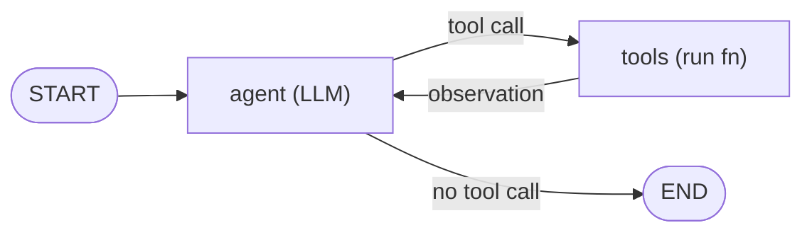

# AI Agents for DevOps

*Phase 1, chapter 5.2 — building loops that call tools to actually get work done.*

> ⭐ Star this repo if you find it useful.

> This chapter is a working introduction. For the full multi-chapter treatment — memory, evaluation, production deployment — see **[AI Agents for DevOps](/03-ai-agent-for-devops/00-toc.md)**.

---

## What an Agent Actually Is

The word "agent" gets thrown around the way "AI" did five years ago. So let's be precise.

An **agent** is a loop:

1. The model receives a goal and a list of tools it can call.
2. The model decides whether to call a tool or to respond.
3. If it calls a tool, the framework runs it and feeds the result back.
4. Repeat until the model decides it's done — or you stop it.

That's the whole idea. Everything else — frameworks, multi-agent systems, "reasoning models" — is variation on the loop.

The chapter before this gave the model *tools* (via MCP). This chapter gives it the *loop* that uses those tools to solve a goal. By the end you'll have:

- A working LangGraph agent that triages infrastructure issues
- A multi-agent example built with CrewAI
- A clear sense of where agents help and where they're the wrong answer

---

## When You Actually Need an Agent

Most "agent" use cases don't need an agent. They need a pipeline. Here's how to tell them apart.

**Use a pipeline (no agent) when:**

- The steps are the same every time.
- You know which tools to call up front.
- Failure modes are predictable.

Example: every night, pull yesterday's error logs, summarize them, post to Slack. That's a cron with three function calls. An agent is overkill.

**Use an agent when:**

- The right next step depends on what you find.
- The number of tool calls varies per task.
- The task is naturally exploratory (debugging, triage, investigation).

Example: "the payments service is alerting — figure out why." You don't know in advance whether the answer is in logs, metrics, recent deploys, or a downstream dependency. The model has to look around.

> **Warning:** Agents are slower, more expensive, and harder to debug than pipelines. Reach for one only when the branching matters.

---

## The Agent Framework Landscape (mid-2026)

Five frameworks worth knowing. Pick one — they all work.

| Framework | Best for | Notes |
|---|---|---|
| **LangGraph** | Production agents with explicit state machines | The successor to LangChain's `AgentExecutor`. What we'll use first. |
| **CrewAI** | Multi-agent collaboration | Opinionated, fast to prototype. Good for "team of specialists" patterns. |
| **OpenAI Agents SDK** | OpenAI-first deployments | New official SDK, lightweight, hands-off. |
| **Pydantic AI** | Type-safe Python agents | Excellent if you already live in Pydantic. |
| **AutoGen** | Multi-agent research and conversation | Microsoft. Powerful, heavy, opinionated. |

LangChain itself is still around but the old `AgentExecutor` / `initialize_agent` API is legacy. New code uses LangGraph or the framework-specific equivalents.

I'll use LangGraph for the first example because the graph model maps cleanly onto how I actually think about agents in production.

---

## Setting Up

```bash
pip install \
  "langgraph>=0.2" \
  "langchain-openai>=0.2" \
  "crewai>=0.70" \
  "boto3>=1.34" \
  "psutil>=5.9"
```

Environment:

```bash
export OPENAI_API_KEY=sk-...
export AWS_REGION=us-east-1
```

---

## A Working Infrastructure Triage Agent

Goal: a CLI tool I can run as `python triage.py "the api-gateway is slow"` and have an agent figure out what's wrong using real data — EC2 status, CloudWatch metrics, local system health.

### Define the tools

Tools are plain Python functions. LangGraph reads the docstring and type hints to expose them to the model.

```python
# tools.py
from __future__ import annotations
import json
import os
import boto3
import psutil
from datetime import datetime, timedelta, timezone
from typing import Annotated
from langchain_core.tools import tool

_ec2 = boto3.client("ec2", region_name=os.getenv("AWS_REGION", "us-east-1"))
_cw = boto3.client("cloudwatch", region_name=os.getenv("AWS_REGION", "us-east-1"))


@tool
def list_ec2_instances(
    state: Annotated[str, "Filter by state: running, stopped, pending. Empty for all."] = "",
) -> str:
    """List EC2 instances in the configured region, optionally filtered by state."""
    filters = [{"Name": "instance-state-name", "Values": [state]}] if state else []
    resp = _ec2.describe_instances(Filters=filters)
    out = []
    for r in resp["Reservations"]:
        for inst in r["Instances"]:
            name = next(
                (t["Value"] for t in inst.get("Tags", []) if t["Key"] == "Name"),
                "(unnamed)",
            )
            out.append({
                "id": inst["InstanceId"],
                "name": name,
                "type": inst["InstanceType"],
                "state": inst["State"]["Name"],
                "private_ip": inst.get("PrivateIpAddress"),
            })
    return json.dumps(out, indent=2)


@tool
def get_cpu_metrics(
    instance_id: Annotated[str, "EC2 instance ID, e.g. i-0abc1234"],
    minutes: Annotated[int, "Lookback window in minutes"] = 60,
) -> str:
    """Return CPU utilization data points from CloudWatch for the given instance."""
    end = datetime.now(timezone.utc)
    start = end - timedelta(minutes=minutes)
    resp = _cw.get_metric_statistics(
        Namespace="AWS/EC2",
        MetricName="CPUUtilization",
        Dimensions=[{"Name": "InstanceId", "Value": instance_id}],
        StartTime=start,
        EndTime=end,
        Period=300,
        Statistics=["Average", "Maximum"],
    )
    points = sorted(resp["Datapoints"], key=lambda d: d["Timestamp"])
    rendered = [
        {
            "t": p["Timestamp"].strftime("%H:%M"),
            "avg": round(p["Average"], 1),
            "max": round(p["Maximum"], 1),
        }
        for p in points
    ]
    return json.dumps(rendered, indent=2)


@tool
def local_system_health() -> str:
    """Return CPU, memory, disk, and load on the machine running the agent."""
    load = os.getloadavg() if hasattr(os, "getloadavg") else None
    return json.dumps({
        "cpu_percent": psutil.cpu_percent(interval=0.5),
        "memory_percent": psutil.virtual_memory().percent,
        "disk_percent": psutil.disk_usage("/").percent,
        "load_avg_1_5_15": load,
    }, indent=2)
```

A few notes:

- **`@tool` from `langchain_core.tools`** is the modern decorator. It builds the JSON schema from your type hints and `Annotated[..., "description"]` strings.
- **Return strings or JSON-serializable data.** Models read text. Returning a `dict` works in some frameworks but is more fragile.
- **No exceptions for "expected" failures.** If an instance isn't found, return a message. Don't raise — the model handles messages better than tracebacks.

### Build the agent

LangGraph's `create_react_agent` is a prebuilt graph for the ReAct loop (reason → act → observe → repeat). For a first agent, you don't need anything more elaborate.

```python
# triage.py
from __future__ import annotations
import sys
from langgraph.prebuilt import create_react_agent
from langchain_openai import ChatOpenAI

from tools import list_ec2_instances, get_cpu_metrics, local_system_health

SYSTEM = """You are a senior SRE triaging an infrastructure problem.

Rules:
- Use tools to gather real data before drawing conclusions.
- Quote tool output verbatim when citing evidence.
- If you cannot determine the cause from available tools, say so. Do not guess.
- Suggest exactly one concrete next step at the end.
- Be concise. No preamble."""


def build_agent():
    llm = ChatOpenAI(model="gpt-4.1-mini", temperature=0)
    return create_react_agent(
        model=llm,
        tools=[list_ec2_instances, get_cpu_metrics, local_system_health],
        prompt=SYSTEM,
    )


def main() -> None:
    if len(sys.argv) < 2:
        print('usage: python triage.py "describe the problem"')
        sys.exit(2)

    goal = " ".join(sys.argv[1:])
    agent = build_agent()
    final = agent.invoke({"messages": [{"role": "user", "content": goal}]})

    # Stream messages so you see the tool calls
    for m in final["messages"]:
        role = m.type if hasattr(m, "type") else m.__class__.__name__
        content = m.content if isinstance(m.content, str) else str(m.content)
        print(f"\n--- {role} ---\n{content}")


if __name__ == "__main__":
    main()
```

### Try it

```bash
python triage.py "one of our EC2 instances looks unhealthy. find out which."
```

A typical run produces something like:

```
--- HumanMessage ---
one of our EC2 instances looks unhealthy. find out which.

--- AIMessage ---
[tool call: list_ec2_instances(state="running")]

--- ToolMessage ---
[{"id": "i-0abc...", "name": "api-prod-1", "type": "t3.medium", "state": "running", ...}, ...]

--- AIMessage ---
[tool call: get_cpu_metrics(instance_id="i-0abc...", minutes=60)]

--- ToolMessage ---
[{"t": "13:05", "avg": 92.4, "max": 98.1}, {"t": "13:10", "avg": 94.0, ...}]

--- AIMessage ---
api-prod-1 (i-0abc...) has been sitting at >90% CPU for the last hour
(avg 92.4–94.0, max up to 98.1). Other instances are below 30%.

Next step: SSH in and run `top` / `pidstat 1 5` to identify the runaway process.
```

That's an agent. Three tool calls, one conclusion, one action. The model decided the order; you didn't pre-script it.

---

## What's Happening Inside the Loop

`create_react_agent` builds a two-node graph:


```mermaid
flowchart LR
    START([START]) --> Agent["agent (LLM)"]
    Agent -- tool call --> Tools["tools (run fn)"]
    Tools -- observation --> Agent
    Agent -- no tool call --> END([END])
```

Each turn:

1. The LLM gets the conversation so far plus the tool list.
2. If it returns a tool call, the framework runs the tool and appends the result as a `ToolMessage`.
3. The LLM runs again with the new context.
4. When it returns a plain message instead of a tool call, the loop ends.

Knobs you'll touch in production:

- **Max iterations.** Prevent runaway loops: `create_react_agent(..., recursion_limit=15)`.
- **State.** Add typed state (a TypedDict) when you want to pass structured data between nodes instead of stuffing everything into messages.
- **Checkpointing.** LangGraph can persist state to SQLite/Postgres so agents survive restarts.
- **Streaming.** `agent.stream(...)` instead of `invoke(...)` to see tokens as they arrive.

---

## A Multi-Agent Example with CrewAI

Sometimes the right shape is multiple specialists, not one generalist. CrewAI makes this easy.

The mental model: you describe a *crew* of agents with distinct roles and goals, and a list of *tasks*. CrewAI handles the orchestration.

Use it when:

- The work naturally divides between domains (infra vs. security vs. deploys).
- You want different prompts and tools per agent.
- You're prototyping. CrewAI optimizes for "get something running today."

Don't use it when:

- The work is linear. Just use a pipeline.
- You need fine-grained control over state and routing. Use LangGraph.

### A two-agent crew

We'll build a tiny crew: one agent investigates, another writes the postmortem.

```python
# crew_postmortem.py
from __future__ import annotations
import os
from crewai import Agent, Task, Crew, Process, LLM

from tools import list_ec2_instances, get_cpu_metrics

llm = LLM(model="gpt-4.1-mini", temperature=0)

investigator = Agent(
    role="Infrastructure Investigator",
    goal=(
        "Determine the root cause of infrastructure issues using available tools. "
        "Cite evidence verbatim."
    ),
    backstory=(
        "Senior SRE who has been on call for years. Methodical, skeptical of guesses, "
        "always pulls real metrics before concluding anything."
    ),
    tools=[list_ec2_instances, get_cpu_metrics],
    llm=llm,
    allow_delegation=False,
    verbose=True,
)

writer = Agent(
    role="Postmortem Writer",
    goal=(
        "Turn investigation notes into a blameless, structured postmortem in Markdown."
    ),
    backstory=(
        "Engineering writer who has reviewed hundreds of postmortems. Allergic to "
        "blame and vague language."
    ),
    llm=llm,
    allow_delegation=False,
    verbose=True,
)

investigation = Task(
    description=(
        "An on-call engineer reported: '{incident}'. "
        "Use your tools to figure out which instance(s) are affected and what the "
        "evidence shows. Output a bulleted list of findings with raw numbers."
    ),
    expected_output="Bulleted findings with verbatim metric values.",
    agent=investigator,
)

postmortem = Task(
    description=(
        "Using the investigator's findings, write a postmortem in this exact "
        "Markdown structure:\n"
        "# Incident: <one-line title>\n"
        "## Summary\n## Impact\n## Root Cause\n## Timeline\n## Action Items\n"
        "Be blameless. No 'engineer X failed to' phrasing."
    ),
    expected_output="A markdown postmortem document.",
    agent=writer,
    context=[investigation],
)

crew = Crew(
    agents=[investigator, writer],
    tasks=[investigation, postmortem],
    process=Process.sequential,
    verbose=True,
)


if __name__ == "__main__":
    result = crew.kickoff(inputs={"incident": "api-gateway latency spiked at 14:00 UTC"})
    print("\n=== FINAL ===\n")
    print(result.raw)
```

Run it:

```bash
python crew_postmortem.py
```

The investigator calls tools, finds the affected instance, hands findings to the writer, the writer produces a Markdown postmortem. Two agents, sequential process, clean separation of concerns.

---

## What Goes Wrong With Agents

Spend a month building agents and you'll see the same problems on repeat.

**1. Tool descriptions are vague, so the agent picks the wrong tool.** Fix: name and describe tools the way you'd describe them to a junior engineer. "Get CloudWatch CPU metrics for one EC2 instance over the last N minutes" beats "get metrics."

**2. The agent calls the same tool ten times in a loop.** Usually because the tool returns ambiguous data and the model keeps trying to "confirm" what it already saw. Fix: tighten the tool output. If the answer is "no instances found," return exactly that, not an empty list.

**3. The agent makes things up after a few iterations.** Long contexts dilute instructions. Fix: cap iterations, summarize tool output before feeding it back, use a smaller focused agent instead of a generalist.

**4. Costs balloon.** Every iteration is a full LLM call. A 10-step agent on a frontier model is 10x the cost of a single-shot prompt. Fix: workhorse models for routine work, cost ceiling per run, iteration cap.

**5. The agent runs a destructive tool.** This is the one that ends careers. Fix: don't expose destructive tools. Period. Or require a confirmation step that comes from a human, not the model.

---

## A Failure Story

We built an agent that could "fix simple Kubernetes issues" — restart pods, scale deployments, that kind of thing. It worked in staging for a week. In production it ran for three hours one night and racked up $47 in API calls before someone noticed.

What happened: a node went unhealthy. The agent restarted pods on it. The new pods landed on the same unhealthy node and crashed. The agent restarted them again. Loop.

The agent eventually "solved" it by scaling the deployment from 3 to 30 pods, which spread enough load that some landed on healthy nodes. Production was fine. The bill was not.

Two fixes, in order of importance:

1. **Iteration cap.** No agent run gets more than 15 steps. If it can't solve in 15, escalate to a human.
2. **No restarting the same resource twice in one run.** Idempotency at the agent level, not just the tool level.

The lesson: an agent without a cost ceiling and an iteration limit is a script that bills you to fail.

---

## Going to Production: The Short Version

A real production deployment is its own chapter ([here, actually](/03-ai-agent-for-devops/00-toc.md)). The short version:

- **Read-only first.** Ship an agent that observes and recommends. Add actions only after weeks of clean recommendations.
- **Wrap in an HTTP service.** FastAPI is fine. Expose `POST /agents/{name}/run`.
- **Persist state.** LangGraph checkpointers (SQLite for dev, Postgres for prod) make agents resumable.
- **Log everything.** Every prompt, every tool call, every result. You'll need it for debugging.
- **Add per-run budget caps.** Both iteration count and dollar cost. Hard-stop on either.
- **Authentication and authorization.** Who can trigger which agents on which resources?
- **Evaluation.** Run new agent versions against a fixed set of historical tasks before deploying. Compare outputs.

That last point is the one teams skip the most often. Without an eval set you have no way to know whether a prompt change made the agent better or worse. You're just rolling dice.

---

## Chapter Summary

- An agent is just a loop: model decides, tool runs, repeat.
- Use a pipeline if the steps are fixed. Use an agent if the path depends on findings.
- LangGraph's `create_react_agent` is the right starting point for production agents.
- CrewAI is the right starting point for multi-agent prototypes.
- Most agent failures are loops, vague tools, and missing budget caps.
- Ship read-only agents first. Earn the right to take actions.

---

## Resources

- [LangGraph documentation](https://langchain-ai.github.io/langgraph/) — the canonical reference
- [LangGraph prebuilt agents](https://langchain-ai.github.io/langgraph/reference/prebuilt/)
- [CrewAI documentation](https://docs.crewai.com/)
- [OpenAI Agents SDK](https://github.com/openai/openai-agents-python)
- [Pydantic AI](https://ai.pydantic.dev/)
- [AutoGen](https://microsoft.github.io/autogen/)
- [AI Agents for DevOps (this repo's deep dive)](/03-ai-agent-for-devops/00-toc.md)

---

[](https://github.com/sponsors/hoalongnatsu)
