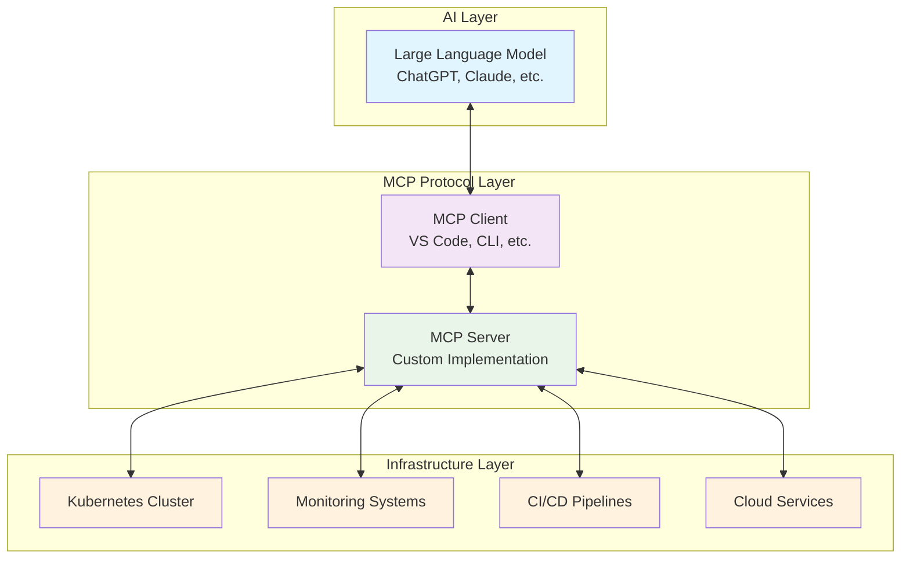
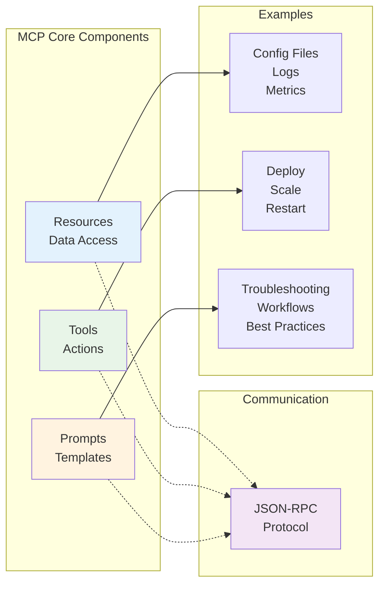
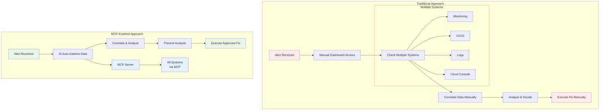
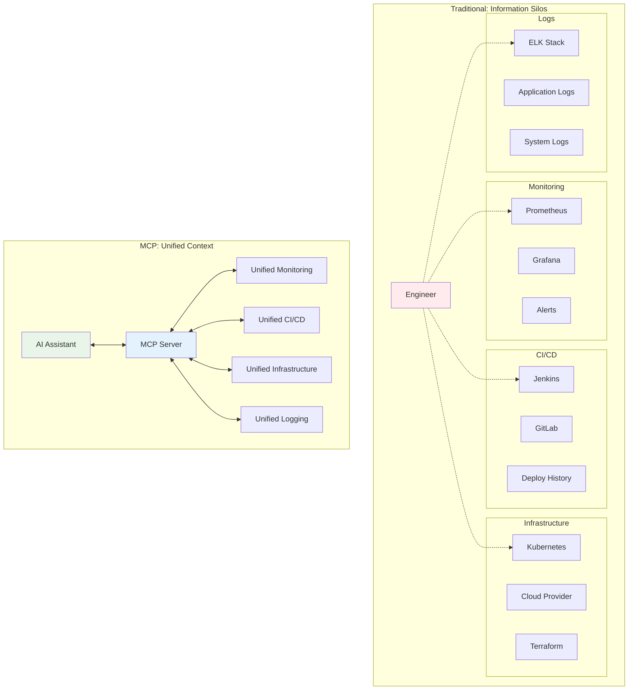
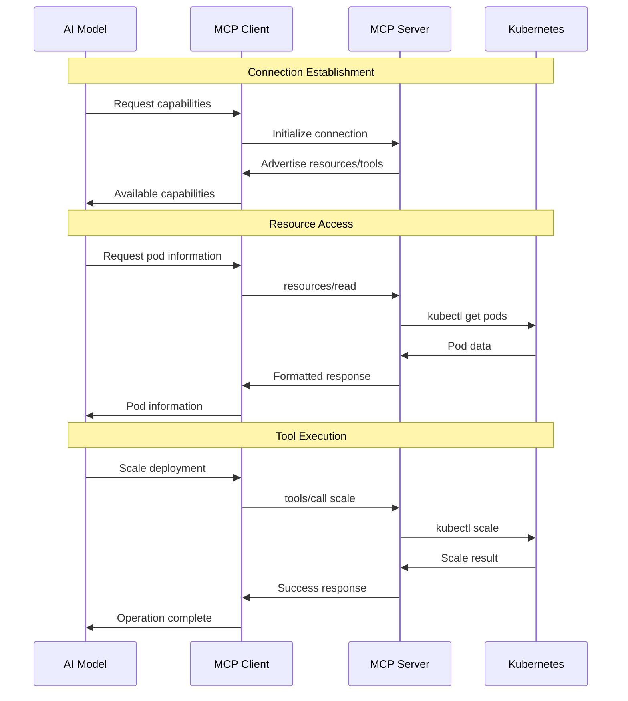

# Chapter 1: MCP Fundamentals & DevOps Context

*Understanding the Model Context Protocol and its transformative role in modern DevOps automation*

## 📚 Support This Work

> Consider [sponsoring this work](https://github.com/sponsors/hoalongnatsu) or check out my book [&#34;PromptOps: From YAML to AI&#34;](https://leanpub.com/promptops-from-yaml-to-ai) to help create more AI-powered DevOps resources.

## 📚 Chapter of Contents

- [1.1 Introduction to Model Context Protocol (MCP)](#11-introduction-to-model-context-protocol-mcp)
- [1.2 MCP vs Traditional Automation Approaches](#12-mcp-vs-traditional-automation-approaches)
- [1.3 DevOps Automation Challenges MCP Solves](#13-devops-automation-challenges-mcp-solves)
- [1.4 MCP Ecosystem and Community](#14-mcp-ecosystem-and-community)
- [1.5 Core MCP Concepts and Terminology](#15-core-mcp-concepts-and-terminology)
- [1.6 Chapter Summary and Next Steps](#16-chapter-summary-and-next-steps)

## 1.1 Introduction to Model Context Protocol (MCP)

The Model Context Protocol (MCP) represents a paradigm shift in how we integrate artificial intelligence with software development and operations workflows. At its core, MCP is an open standard that enables AI models to interact with external tools, data sources, and services through a unified interface. This protocol bridges the gap between the reasoning capabilities of large language models and the practical need to access and manipulate real-world systems.

For DevOps professionals, MCP offers unprecedented opportunities to create intelligent automation systems that combine the contextual understanding of AI with the operational power of infrastructure management tools. Rather than building separate scripts, APIs, and automation tools, MCP allows teams to create unified interfaces that AI assistants can use to understand, monitor, and manage complex infrastructure environments.

### The Protocol Foundation

MCP operates on a client-server architecture using JSON-RPC (Remote Procedure Call) as its communication protocol. This design choice ensures reliable, structured communication between AI models and the tools they need to access. The protocol defines three primary interaction patterns:

**Resources**: Static or dynamic data that AI models can read and understand. In a DevOps context, resources might include configuration files, deployment manifests, monitoring data, or infrastructure inventory.

**Tools**: Interactive capabilities that allow AI models to perform actions. These could include deploying applications, scaling services, restarting containers, or modifying configurations.

**Prompts**: Templated instructions that help AI models understand how to interact with specific systems or accomplish particular tasks within your infrastructure.

### Why MCP Matters for DevOps

Traditional DevOps automation relies on scripts, configuration management tools, and custom APIs that operate in isolation. Each tool requires specific knowledge, syntax, and integration patterns. When issues arise, engineers must manually correlate information across multiple systems, interpret logs and metrics, and execute remediation procedures.

MCP fundamentally changes this workflow by enabling AI assistants to serve as intelligent orchestrators. Instead of engineers manually gathering information from monitoring systems, checking deployment status, and executing remediation steps, AI assistants can perform these tasks autonomously while maintaining full context across all systems.

This transformation is particularly powerful because AI models excel at pattern recognition, correlation analysis, and decision-making under uncertainty—exactly the skills required for effective incident response and system optimization.

## 1.2 MCP vs Traditional Automation Approaches

### Traditional Automation Limitations

Traditional DevOps automation tools, while powerful, exhibit several fundamental limitations that MCP addresses:

**Fragmented Toolchains**: Modern DevOps environments typically involve dozens of specialized tools—monitoring systems, CI/CD platforms, container orchestrators, cloud services, and configuration management tools. Each tool maintains its own API, authentication mechanism, and operational model. Engineers must master multiple interfaces and manually correlate information across systems.

**Static Automation**: Traditional scripts and workflows follow predetermined paths based on specific conditions. They lack the contextual understanding necessary to adapt to novel situations or combine insights from multiple sources. When unexpected issues arise, human intervention becomes necessary.

**Limited Context Propagation**: Information gathered from one system rarely propagates effectively to other tools. For example, a deployment failure in your CI/CD system might trigger alerts in your monitoring system, but the correlation between these events often requires manual investigation.

**Operational Overhead**: Maintaining traditional automation requires constant updates as systems evolve. API changes, new tools, and modified workflows all require corresponding updates to automation scripts and integration code.

### MCP's Unified Approach

MCP addresses these limitations through several key innovations:

**Protocol Standardization**: All tools, regardless of their underlying implementation, expose their capabilities through the same MCP interface. This standardization eliminates the need to learn and maintain multiple API integrations.

**Context Preservation**: AI models can maintain context across multiple tool interactions. When investigating an incident, the model remembers information gathered from monitoring systems while accessing deployment logs and can correlate this data to suggest appropriate remediation steps.

**Adaptive Intelligence**: Unlike static scripts, AI models can reason about unexpected situations and combine insights from multiple sources to suggest novel solutions or investigation paths.

**Dynamic Discovery**: MCP servers can expose their capabilities programmatically, allowing AI assistants to discover available tools and resources without hardcoded integrations.

### Practical Comparison Example

Consider a typical scenario: investigating a web application performance degradation.

**Traditional Approach**:

1. Engineer receives alert from monitoring system
2. Manually accesses various dashboards (APM, infrastructure, logs)
3. Correlates timing of performance issues with recent deployments
4. Examines deployment logs in CI/CD system
5. Checks resource utilization in cloud provider console
6. Reviews recent configuration changes in version control
7. Synthesizes findings and determines root cause
8. Executes remediation steps across multiple systems

**MCP-Enabled Approach**:

1. AI assistant receives the same monitoring alert
2. Automatically gathers data from all relevant systems through MCP servers
3. Correlates timing, deployment events, resource usage, and configuration changes
4. Presents comprehensive analysis with suggested remediation steps
5. Executes approved remediation actions through MCP tools
6. Continues monitoring to verify resolution

The MCP approach reduces time-to-resolution while providing more comprehensive analysis and reducing the cognitive load on operations teams.

## 1.3 DevOps Automation Challenges MCP Solves

### Context Loss

Modern DevOps environments generate vast amounts of operational data across multiple systems. Monitoring platforms collect metrics and logs, CI/CD systems track deployment status, container orchestrators provide runtime information, and cloud providers offer infrastructure insights. However, this information typically exists in isolation.

Engineers investigating issues must manually gather context from each system, remember findings across different interfaces, and synthesize insights to understand the complete operational picture. This process is time-consuming, error-prone, and heavily dependent on individual expertise.

MCP eliminates these information silos by enabling AI assistants to gather comprehensive context automatically. The assistant can simultaneously query monitoring data, deployment history, configuration state, and infrastructure status, then present a unified view of the operational environment. This comprehensive context enables more accurate problem diagnosis and more effective remediation strategies.

### Operational Complexity and Cognitive Load

DevOps teams manage increasingly complex environments with microservices architectures, multi-cloud deployments, and sophisticated toolchains. The cognitive load required to understand interactions between these systems often exceeds human capacity, leading to reactive rather than proactive operations.

Traditional automation helps with routine tasks but lacks the contextual understanding necessary for complex problem-solving. Scripts can restart failed services or scale resources based on metrics, but they cannot reason about whether these actions address root causes or merely mask symptoms.

MCP-enabled AI assistants can manage this complexity by maintaining comprehensive mental models of your infrastructure. They understand relationships between services, recognize patterns in system behavior, and can reason about the cascading effects of operational changes. This capability enables more sophisticated automation that addresses root causes rather than symptoms.

### Knowledge Transfer and Team Scaling

DevOps expertise is often concentrated in key individuals who understand the intricate details of complex systems. When these experts are unavailable, less experienced team members may struggle to diagnose issues or implement solutions effectively. This knowledge concentration creates operational risk and limits team scaling.

Traditional documentation and runbooks help but quickly become outdated as systems evolve. Maintaining comprehensive, current documentation requires significant ongoing effort that competes with feature development and operational responsibilities.

MCP servers act as living repositories of operational knowledge. They encode not just static information but also the procedures and reasoning patterns that experienced engineers use to manage systems. AI assistants can leverage this encoded knowledge to guide less experienced team members through complex operational procedures, effectively democratizing expertise across the team.

### Tool Proliferation and Integration Overhead

DevOps environments typically incorporate numerous specialized tools, each optimized for specific use cases. While this specialization provides powerful capabilities, it also creates integration challenges. Each new tool requires API integration, authentication setup, and workflow modification.

The overhead of maintaining these integrations often discourages teams from adopting beneficial tools or leads to underutilized capabilities within existing tools. Teams may continue using suboptimal workflows simply to avoid integration complexity.

MCP reduces integration overhead by providing a standard interface for all tools. Once a tool exposes its capabilities through an MCP server, AI assistants can immediately leverage these capabilities without additional integration work. This standardization encourages tool adoption and ensures that teams can fully utilize their technology investments.

## 1.4 MCP Ecosystem and Community

### Protocol Development and Governance

The Model Context Protocol emerged from Anthropic's research into AI system integration and has evolved into an open standard with active community participation. The protocol specification is developed transparently, with community input shaping design decisions and implementation guidelines.

The governance model emphasizes compatibility, extensibility, and simplicity. Protocol updates maintain backward compatibility while adding new capabilities that address evolving use cases. This stability ensures that investments in MCP server development continue to provide value as the ecosystem evolves.

### Implementation Landscape

The MCP ecosystem includes implementations across multiple programming languages and platforms:

**Server Implementations**: Production-ready MCP servers exist for popular tools including Git repositories, databases, cloud services, monitoring systems, and container orchestrators. These servers provide immediate value while serving as reference implementations for custom development.

**Client Libraries**: MCP client libraries enable integration with various AI platforms and development frameworks. These libraries handle protocol details, allowing developers to focus on application logic rather than communication mechanics.

**Development Tools**: The ecosystem includes debugging tools, protocol validators, and development frameworks that accelerate MCP server creation and testing.

### Community Resources

Active community participation drives ecosystem growth through several channels:

**Documentation and Tutorials**: Community-contributed documentation covers implementation patterns, best practices, and integration examples across various platforms and use cases.

**Reference Implementations**: Open-source MCP servers for common tools provide starting points for custom development and demonstrate implementation patterns.

**Integration Examples**: Real-world integration examples showcase MCP's capabilities across different operational scenarios and organizational contexts.

**Community Support**: Active forums and communication channels provide support for developers implementing MCP solutions.

## 1.5 Core MCP Concepts and Terminology

### Resources: Information Access Layer

Resources represent information that AI models can access and understand. In MCP terminology, resources are read-only data sources that provide context for AI reasoning and decision-making. Resources can be static (like configuration files) or dynamic (like real-time monitoring data).

**Resource Types**:

- **Configuration Data**: Infrastructure configurations, application settings, deployment manifests
- **Operational Metrics**: Performance data, resource utilization, health check results
- **Historical Information**: Deployment history, incident reports, change logs
- **Documentation**: Runbooks, architectural diagrams, operational procedures

**Resource Characteristics**:

- **Addressable**: Each resource has a unique identifier that clients can use to request specific information
- **Typed**: Resources include metadata describing their content type and structure
- **Cacheable**: Clients can cache resource content based on expiration policies
- **Discoverable**: Servers can advertise available resources without requiring hardcoded client knowledge

### Tools: Action Execution Layer

Tools provide AI models with the ability to perform actions within external systems. Unlike resources, tools can modify system state and trigger operational changes. Tool design emphasizes safety, with comprehensive parameter validation and authorization controls.

**Tool Categories**:

- **Information Gathering**: Query databases, retrieve logs, check system status
- **State Modification**: Deploy applications, modify configurations, restart services
- **Orchestration**: Coordinate complex workflows across multiple systems
- **Analysis**: Generate reports, perform calculations, synthesize data

**Tool Safety Mechanisms**:

- **Parameter Validation**: Comprehensive input validation prevents malformed requests
- **Authorization Checks**: Permission systems ensure tools operate within authorized boundaries
- **Dry-Run Capabilities**: Preview tool execution without making actual changes
- **Audit Logging**: Complete records of all tool invocations for compliance and debugging

### Prompts: Instruction Templates

Prompts provide AI models with structured guidance for accomplishing specific tasks. They encode operational knowledge and best practices into reusable templates that ensure consistent, effective AI assistance.

**Prompt Applications**:

- **Troubleshooting Guides**: Step-by-step procedures for diagnosing common issues
- **Operational Workflows**: Templates for routine maintenance and deployment procedures
- **Investigation Frameworks**: Structured approaches for analyzing complex problems
- **Best Practice Enforcement**: Ensure AI assistants follow organizational standards and policies

**Prompt Structure**:

- **Context Requirements**: Specify what information the AI needs to gather before execution
- **Execution Steps**: Define the sequence of actions required to complete the task
- **Validation Criteria**: Establish success criteria and verification procedures
- **Error Handling**: Provide guidance for handling unexpected conditions

### Protocol Communication Flow

MCP communication follows a structured request-response pattern built on JSON-RPC. This design ensures reliable, predictable interactions between clients and servers while maintaining flexibility for various transport mechanisms.

**Connection Establishment**:

1. **Capability Exchange**: Client and server negotiate supported features and protocol versions
2. **Authentication**: Establish identity and authorization context for subsequent operations
3. **Resource Discovery**: Server advertises available resources, tools, and prompts
4. **Ready State**: Connection is established and ready for operational requests

**Operational Interactions**:

1. **Resource Requests**: Client requests specific resources, server responds with data
2. **Tool Invocations**: Client calls tools with parameters, server executes and returns results
3. **Prompt Utilization**: Client requests prompt templates, server provides structured guidance
4. **Notifications**: Server can send asynchronous updates about state changes

**Error Handling and Recovery**:

- **Structured Error Responses**: Standardized error formats enable consistent client handling
- **Retry Mechanisms**: Built-in support for handling transient failures
- **Connection Recovery**: Protocols for re-establishing connections after interruptions
- **Graceful Degradation**: Fallback behaviors when specific capabilities are unavailable

## 1.6 Chapter Summary and Next Steps

### Key Concepts Mastered

This chapter established the foundational understanding necessary for effective MCP implementation in DevOps environments:

**Protocol Understanding**: You now understand MCP's role as a bridge between AI reasoning capabilities and operational tool integration. The JSON-RPC foundation provides reliable, structured communication that scales from simple information queries to complex operational automation.

**DevOps Context**: Traditional automation limitations—information silos, static workflows, and knowledge concentration—create opportunities where MCP's intelligent, context-aware approach provides significant value.

**Ecosystem Awareness**: The growing MCP community provides resources, reference implementations, and collaborative development opportunities that accelerate your implementation efforts.

**Practical Foundation**: Your development environment is configured and tested with a local Kubernetes cluster, providing the foundation for hands-on development in subsequent chapters.

### Looking Ahead

Chapter 2 will provide comprehensive coverage of MCP architecture, diving deep into protocol specifications, communication flows, and implementation patterns. You will gain detailed understanding of how AI models, MCP clients, MCP servers, and external resources interact to create powerful automation systems.

The practical foundation established in this chapter will support hands-on exploration of protocol mechanics, message flow analysis, and communication debugging—skills that are essential for effective MCP server development and troubleshooting.

Your journey toward building production-ready Kubernetes MCP servers begins with this solid understanding of fundamentals and continues with the architectural deep-dive in the following chapter.
