# Chapter 2: MCP Architecture Deep Dive

*Understanding how all the pieces fit together in the MCP ecosystem*

## 📚 Support This Work

[](https://github.com/sponsors/hoalongnatsu)

> Consider [sponsoring this work](https://github.com/sponsors/hoalongnatsu) or check out my book [&#34;PromptOps: From YAML to AI&#34;](https://leanpub.com/promptops-from-yaml-to-ai) to help create more AI-powered DevOps resources.

## What We're Building Towards

By the end of this chapter, you'll understand how your AI assistant talks to your Kubernetes cluster through an MCP server. Your MCP server acts as a translator between AI requests and Kubernetes operations.

Your AI assistant is smart but doesn't know your infrastructure. The MCP server bridges this gap, turning AI questions like "What pods are running?" into actual Kubernetes API calls that return real data.

## 📚 Table of Contents

- [The Complete Flow](#the-complete-flow)
- [MCP Protocol: The Foundation](#mcp-protocol-the-foundation)
- [Understanding the Client-Server Side](#understanding-the-client-server-side)
- [Resources: Making Your Infrastructure Discoverable](#resources-making-your-infrastructure-discoverable)
- [Tools: Where Actions Happen](#tools-where-actions-happen)
- [Error Handling: When Things Go Wrong](#error-handling-when-things-go-wrong)
- [Protocol Compliance: Following the Rules](#protocol-compliance-following-the-rules)
- [Debugging MCP Communications](#debugging-mcp-communications)
- [Hands-On Lab: Exploring MCP in Action](#hands-on-lab-exploring-mcp-in-action)
- [Real-World Architecture Patterns](#real-world-architecture-patterns)
- [What's Next?](#whats-next)

## The Complete Flow

Here's what happens when you ask an AI to scale your application:

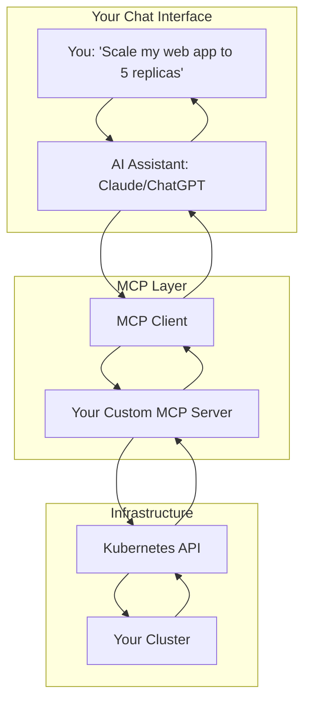

The flow:

1. **You ask**: "Scale my web app to 5 replicas"
2. **AI decides**: "I need the scale tool with these parameters"
3. **MCP Client**: Formats the request using MCP protocol
4. **Your MCP Server**: Validates request, calls Kubernetes API
5. **Kubernetes**: Performs the scaling operation
6. **Response flows back**: Success confirmation returns through the chain

Once set up, the AI handles complex requests like "Show me all failing pods and their logs" without custom code for each question.

## MCP Protocol: The Foundation

MCP uses JSON-RPC 2.0 for communication. It's a standard way for programs to exchange JSON messages.

### Core Message Types

**Initialization Messages**

```json
{
  "jsonrpc": "2.0",
  "method": "initialize",
  "params": {
    "protocolVersion": "2024-11-05",
    "capabilities": {
      "resources": {},
      "tools": {}
    }
  }
}
```

**Resource Messages** (discovering what's available)

```json
{
  "jsonrpc": "2.0",
  "method": "resources/list",
  "params": {}
}
```

**Tool Messages** (taking actions)

```json
{
  "jsonrpc": "2.0",
  "method": "tools/call",
  "params": {
    "name": "scale_deployment",
    "arguments": {
      "namespace": "default",
      "name": "web-app",
      "replicas": 5
    }
  }
}
```

Every message follows this pattern, making it predictable and debuggable.

## Understanding the Client-Server Side

When an AI assistant wants to interact with your Kubernetes cluster, there's a specific sequence of messages. Understanding this flow helps you debug issues and build better MCP servers.

### The Initialization Handshake

Every MCP session starts with a handshake where both sides declare their capabilities:

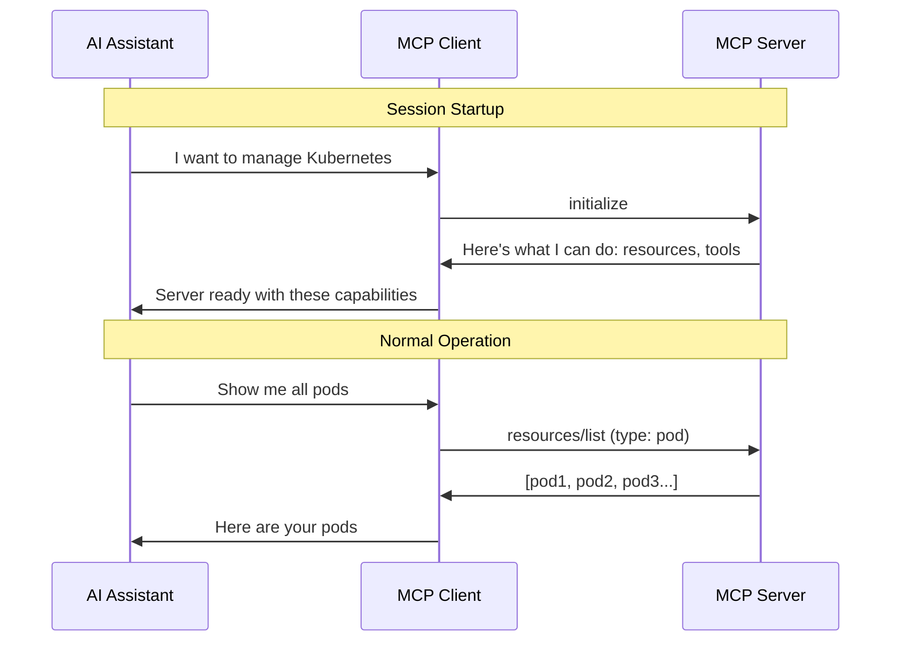

### Capabilities Explained

When your MCP server advertises capabilities:

**Resources** = Things you can query

- "What pods are running?"
- "Show me deployment details"
- "List all services"

**Tools** = Actions you can take

- "Scale this deployment to 3 replicas"
- "Restart all pods"
- "Create a new secret"

Your Kubernetes MCP server needs both capabilities since you want the AI to discover information and take actions.

### Transport Options

MCP supports three message transport methods:

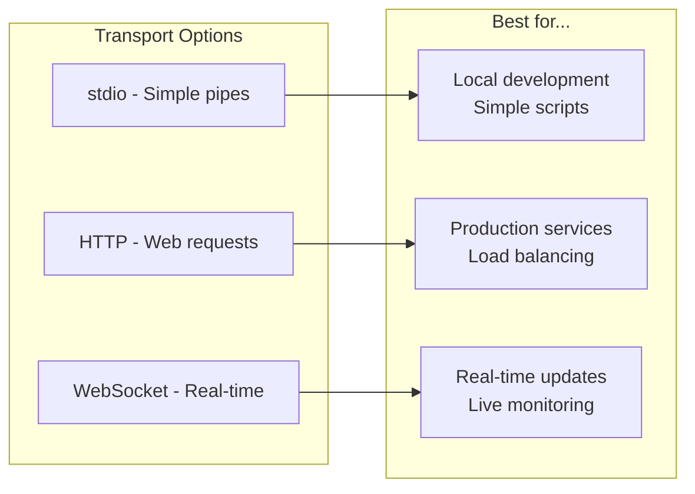

We'll start with **stdio** since it's simple and works well with VS Code and GitHub Copilot. Later chapters will cover HTTP for production deployments.

## Resources: Making Your Infrastructure Discoverable

Resources are like a catalog of things the AI can ask about. For Kubernetes, this means pods, services, deployments, and everything else in your cluster.

### Resource Lifecycle

Here's what happens when an AI asks "What deployments are running in the production namespace?":

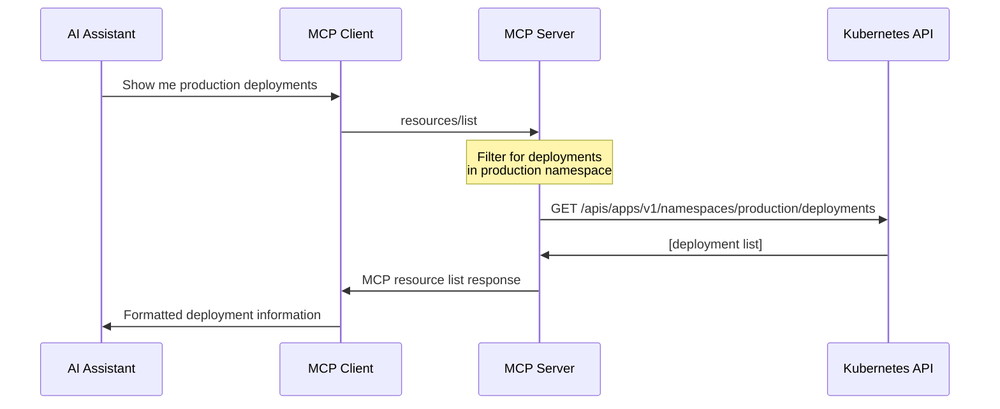

### Resource Structure That Works

Your MCP server needs to present Kubernetes objects in a way that's useful for AI:

```json
{
  "uri": "k8s://pod/production/web-app-7d8f9c-xyz123",
  "name": "web-app-7d8f9c-xyz123",
  "description": "Pod: web-app-7d8f9c-xyz123 in production namespace",
  "mimeType": "application/json"
}
```

**Why this structure works:**

- **URI**: Unique identifier the AI can reference later
- **Name**: Human-readable identifier
- **Description**: Context that helps the AI understand what this is
- **MimeType**: Tells the client how to interpret the data

### Making Resources AI-Friendly

Design resource descriptions for AI understanding. Instead of just "nginx-deployment", use "nginx-deployment (3/3 replicas ready) in production namespace". The AI can now understand health and context without additional queries.

## Tools: Where Actions Happen

Tools let the AI actually *do* things in your infrastructure. Each tool is a function the AI can call with parameters.

### Tool Design Principles

Good MCP tools follow these rules:

1. **Clear purpose**: Each tool does one thing well
2. **Safe defaults**: Tools should be hard to use dangerously
3. **Rich feedback**: Always tell the AI what actually happened

### Tool Execution Flow

Here's what happens when the AI decides to scale a deployment:

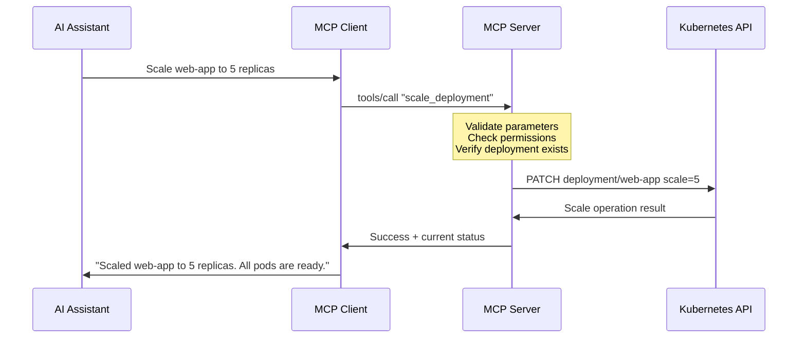

### Tool Input Schema

Your tools need to define what parameters they accept. This example balances flexibility with safety:

```json
{
  "name": "scale_deployment",
  "description": "Scale a Kubernetes deployment to specified replica count",
  "inputSchema": {
    "type": "object",
    "properties": {
      "namespace": {
        "type": "string",
        "description": "Kubernetes namespace",
        "default": "default"
      },
      "name": {
        "type": "string", 
        "description": "Deployment name"
      },
      "replicas": {
        "type": "integer",
        "minimum": 0,
        "maximum": 50,
        "description": "Target replica count"
      }
    },
    "required": ["name", "replicas"]
  }
}
```

**Design decisions:**

- **Default namespace**: Reduces errors for simple operations
- **Replica limits**: Prevents accidental massive scaling
- **Required fields**: Forces the AI to provide essential information

## Error Handling: When Things Go Wrong

In production, things break. Your MCP server needs to handle failures gracefully and give the AI useful information to help users.

### Error Categories

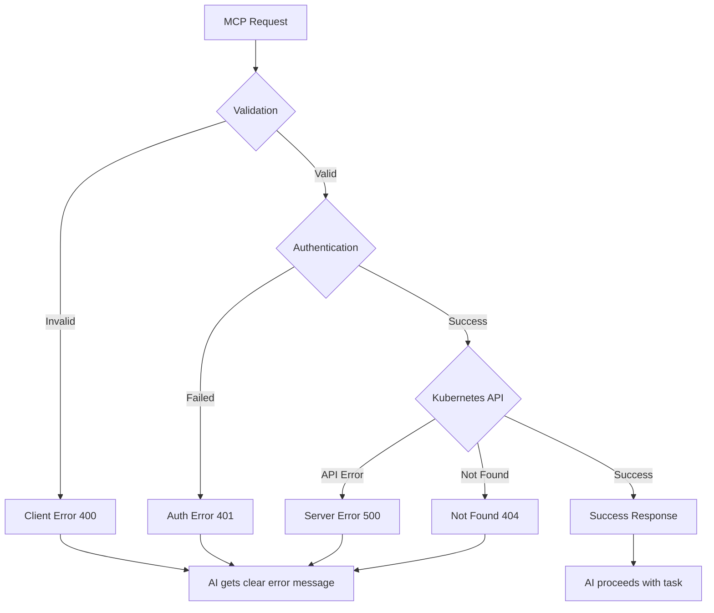

### Helpful Error Responses

Instead of generic errors, provide context the AI can use:

**Bad:**

```json
{"error": "Failed to scale deployment"}
```

**Good:**

```json
{
  "error": {
    "code": -32000,
    "message": "Cannot scale deployment 'web-app' in namespace 'production'",
    "data": {
      "reason": "deployment not found",
      "suggestions": [
        "Check if deployment name is correct",
        "Verify you have access to 'production' namespace",
        "List available deployments with 'kubectl get deployments -n production'"
      ]
    }
  }
}
```

The AI can now understand what went wrong and suggest fixes to the user.

### Graceful Degradation

When your Kubernetes cluster has issues, your MCP server shouldn't crash. Handle partial failures:

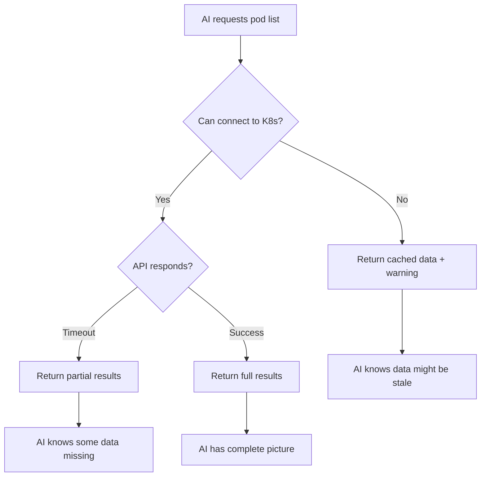

This way, the AI can still help users even when the cluster is having problems.

## Protocol Compliance: Following the Rules

MCP has specific requirements for message formats and sequences. Following these ensures your server works reliably with any MCP client.

### Required Message Flow

Every MCP server must handle this sequence:

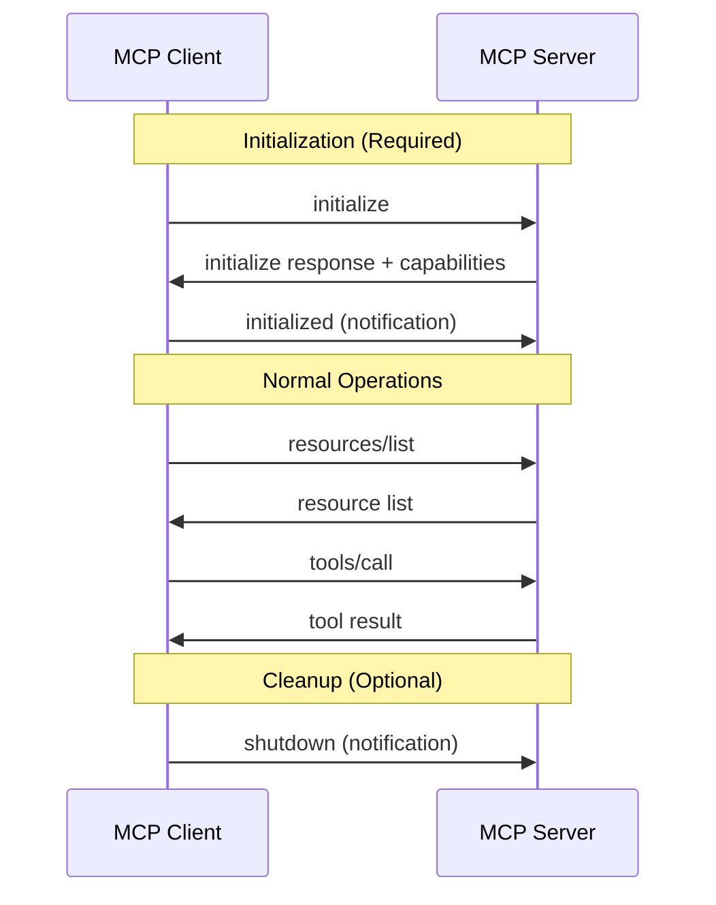

**Critical points:**

- Always respond to `initialize` with your capabilities
- The `initialized` notification confirms the handshake
- `shutdown` is optional but good practice

### JSON-RPC Compliance

Your responses must follow JSON-RPC 2.0 format exactly:

```json
{
  "jsonrpc": "2.0",
  "id": 123,
  "result": {
    "resources": [...]
  }
}
```

**Common mistakes:**

- Missing `jsonrpc` field
- Wrong `id` (must match the request)
- Using `result` and `error` in the same response

## Debugging MCP Communications

When things don't work, you need to see what's happening in the protocol layer.

### Message Tracing

Log every message to debug issues:

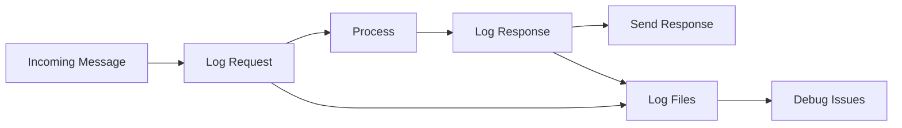

### Common Issues

**Problem**: AI says "Server not responding"
**Debug**: Check if your server sends the initialization response correctly

**Problem**: AI can't see your tools
**Debug**: Verify your capabilities include `{"tools": {}}` in the initialize response

**Problem**: Tool calls fail silently
**Debug**: Make sure you're returning proper JSON-RPC responses with matching IDs

### Testing Protocol Implementation

Test your server before connecting to AI clients:

```bash
# Send initialize message
echo '{"jsonrpc":"2.0","id":1,"method":"initialize","params":{"protocolVersion":"2024-11-05"}}' | your-mcp-server

# Should get back: initialize response + capabilities
```

This catches most protocol compliance issues early.

## Hands-On Lab: Exploring MCP in Action

Let's analyze real MCP communications and build a simple client to understand the protocol from both sides.

### Lab Setup

```bash
# Create lab directory
mkdir mcp-architecture-lab
cd mcp-architecture-lab

# Install test MCP server
npm install @modelcontextprotocol/server-filesystem
```

### Lab 1: Message Flow Analysis

Watch real MCP messages:

```bash
# Start filesystem MCP server with debug logging
echo '{"jsonrpc":"2.0","id":1,"method":"initialize","params":{"protocolVersion":"2024-11-05","capabilities":{}}}' | \
  npx @modelcontextprotocol/server-filesystem /tmp > mcp-session.log 2>&1 &

# Analyze the output
cat mcp-session.log
```

**You'll see:**

1. Initialize request → Initialize response with capabilities
2. Resource structure for files and directories
3. JSON-RPC message format in practice

### Lab 2: Build a Simple MCP Client

Create a basic MCP client:

```go
// mcp-client.go
package main

import (
    "bufio"
    "encoding/json"
    "fmt"
    "os"
    "os/exec"
)

type JsonRPCRequest struct {
    JsonRPC string      `json:"jsonrpc"`
    ID      int         `json:"id"`
    Method  string      `json:"method"`
    Params  interface{} `json:"params"`
}

type JsonRPCResponse struct {
    JsonRPC string      `json:"jsonrpc"`
    ID      int         `json:"id"`
    Result  interface{} `json:"result,omitempty"`
    Error   interface{} `json:"error,omitempty"`
}

func main() {
    // Start the filesystem MCP server
    cmd := exec.Command("npx", "@modelcontextprotocol/server-filesystem", "/tmp")
    stdin, _ := cmd.StdinPipe()
    stdout, _ := cmd.StdoutPipe()
    cmd.Start()

    // Send initialize request
    initReq := JsonRPCRequest{
        JsonRPC: "2.0",
        ID:      1,
        Method:  "initialize",
        Params: map[string]interface{}{
            "protocolVersion": "2024-11-05",
            "capabilities":    map[string]interface{}{},
        },
    }
  
    reqBytes, _ := json.Marshal(initReq)
    fmt.Fprintln(stdin, string(reqBytes))
  
    // Read response
    scanner := bufio.NewScanner(stdout)
    if scanner.Scan() {
        var resp JsonRPCResponse
        json.Unmarshal(scanner.Bytes(), &resp)
        fmt.Printf("Server capabilities: %+v\n", resp.Result)
    }
}
```

Run this client and observe:

- How initialization works from the client side
- What capabilities the server advertises
- The exact JSON-RPC message format

### Lab 3: Protocol Debugging

Create a debugging proxy that sits between client and server:

```bash
# Create debug-proxy.py
cat > debug-proxy.py << 'EOF'
#!/usr/bin/env python3
import json
import sys
import subprocess
import threading

def log_message(direction, message):
    try:
        parsed = json.loads(message.strip())
        print(f"[{direction}] {json.dumps(parsed, indent=2)}", file=sys.stderr)
    except:
        print(f"[{direction}] {message.strip()}", file=sys.stderr)

def forward_messages(source, destination, direction):
    for line in source:
        log_message(direction, line)
        destination.write(line)
        destination.flush()

# Start the target MCP server
server = subprocess.Popen(['npx', '@modelcontextprotocol/server-filesystem', '/tmp'], 
                         stdin=subprocess.PIPE, stdout=subprocess.PIPE, text=True)

# Forward stdin to server, stdout from server
threading.Thread(target=forward_messages, 
                args=(sys.stdin, server.stdin, "CLIENT->SERVER")).start()
threading.Thread(target=forward_messages, 
                args=(server.stdout, sys.stdout, "SERVER->CLIENT")).start()

server.wait()
EOF

chmod +x debug-proxy.py
```

Use this proxy to see all messages:

```bash
echo '{"jsonrpc":"2.0","id":1,"method":"initialize","params":{"protocolVersion":"2024-11-05"}}' | \
  ./debug-proxy.py
```

### Lab Results

After completing these labs, you understand:

1. **Message Structure**: How JSON-RPC wraps MCP concepts
2. **Capability Negotiation**: How client and server agree on features
3. **Error Patterns**: What happens when things go wrong
4. **Debugging Techniques**: How to trace protocol issues

## Real-World Architecture Patterns

Now that you understand the protocol, let's look at how successful teams structure their MCP implementations.

### Pattern 1: Layered Architecture

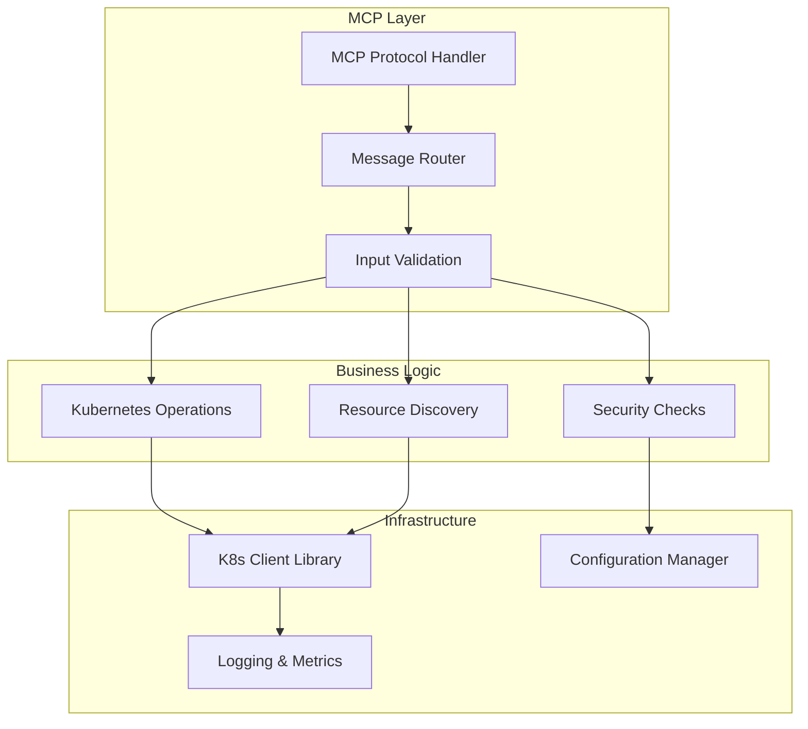

**Why this works:**

- Clean separation between protocol and business logic
- Easy to test each layer independently
- Simple to add new capabilities

### Pattern 2: Resource-Centric Design

Think in terms of Kubernetes resources instead of API endpoints:

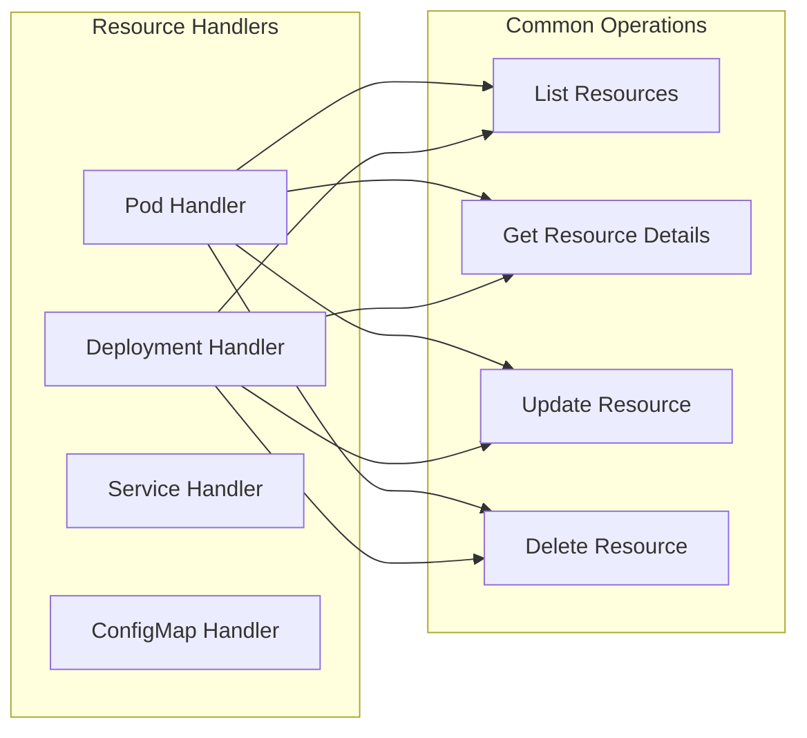

Each handler knows how to work with one type of Kubernetes resource, making the code predictable and maintainable.

## What's Next?

You now understand how MCP works under the hood. In the next chapter, we'll put this knowledge to work by building a real Kubernetes MCP server in Go.

Key concepts to remember:

- **MCP is JSON-RPC**: Simple request/response over various transports
- **Resources are discoverable**: They let the AI explore what's available
- **Tools are actionable**: They let the AI make changes
- **Error handling matters**: Good errors help the AI help users
- **Protocol compliance is critical**: Follow the rules for reliable operation

The architecture patterns we covered will guide our implementation in Chapter 3, where we'll build a production-ready MCP server that follows these best practices.

---

**Next**: [Chapter 3: Building MCP Server with Go &amp; Kubernetes](03-building-mcp-server-go-kubernetes.md)

---

## 📚 Support This Work

[](https://github.com/sponsors/hoalongnatsu)

> Consider [sponsoring this work](https://github.com/sponsors/hoalongnatsu) or check out my book [&#34;PromptOps: From YAML to AI&#34;](https://leanpub.com/promptops-from-yaml-to-ai) to help create more AI-powered DevOps resources.