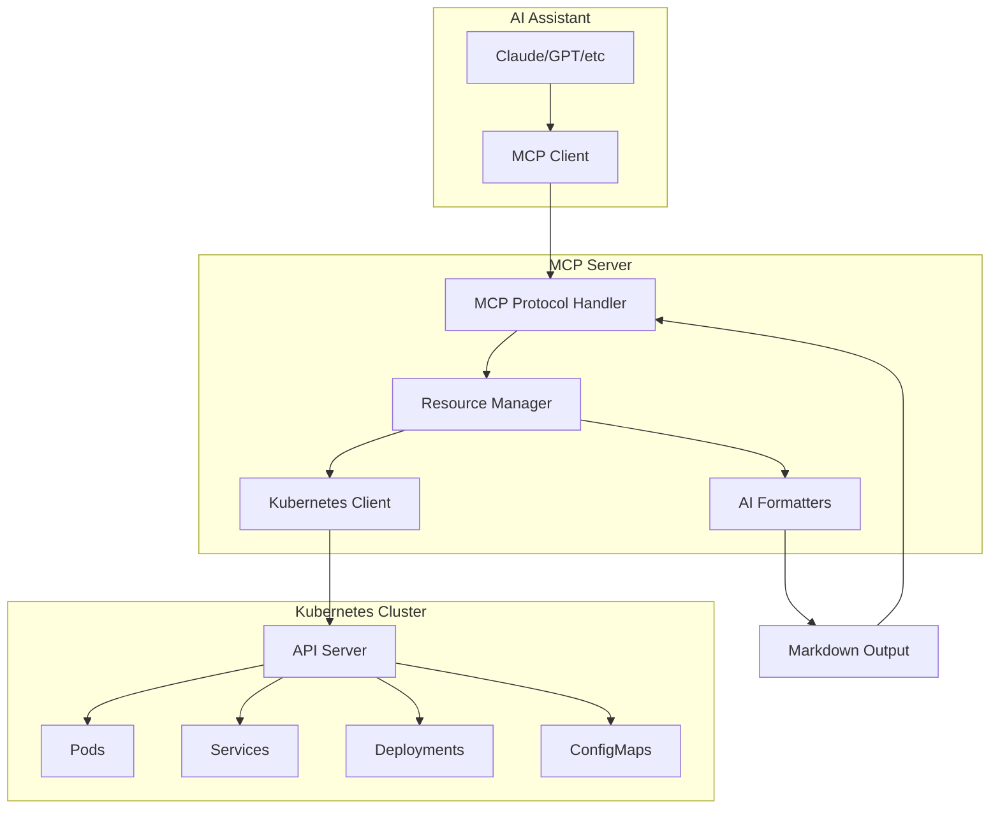

# 📚 Chapter 3: Building Production MCP Server for Kubernetes with Go

## 📚 Support This Work

[](https://github.com/sponsors/hoalongnatsu)

> Consider [sponsoring this work](https://github.com/sponsors/hoalongnatsu) or check out my book [&#34;PromptOps: From YAML to AI&#34;](https://leanpub.com/promptops-from-yaml-to-ai) to help create more AI-powered DevOps resources.

## What We're Building

By the end of this chapter, you'll have a working MCP server that connects AI assistants to your Kubernetes cluster. This isn't a toy example - it's production-grade code you can deploy and extend.

> **💡 Complete Working Example**: All code in this chapter is based on the actual working implementation in [`./code/03/`](./code/03/). You can build and run this code directly from the repository.

Our MCP server provides:

- **Dynamic resource discovery** for pods, services, deployments from live clusters
- **AI-optimized formatting** that transforms raw JSON into markdown for better LLM understanding
- **Real MCP protocol implementation** using mark3labs/mcp-go library
- **Production-ready error handling** and comprehensive logging
- **Live cluster integration** with full Kubernetes API access

## Learning Objectives

By the end of this chapter, you will:

- Build a complete MCP server using Go and the mark3labs/mcp-go library
- Implement dynamic resource discovery for Kubernetes objects
- Create AI-optimized data formatters for better LLM understanding
- Add comprehensive error handling and logging
- Test your MCP server with real Kubernetes clusters

## Architecture Overview

Our MCP server follows a clean architecture pattern with real MCP protocol implementation:



## 3.1 Project Structure and Setup

We'll create a well-structured Go project using the real mark3labs/mcp-go library for production-ready MCP protocol implementation.

### Project Structure

Your project structure should look like:

```
k8s-mcp-server/
├── cmd/server/          # Main application entry point
├── pkg/
│   ├── mcp/            # MCP protocol implementation
│   ├── k8s/            # Kubernetes client wrapper
│   └── types/          # Shared type definitions
├── internal/
│   ├── config/         # Configuration management
│   └── logging/        # Logging setup
├── go.mod
├── go.sum
├── Makefile            # Build and test scripts
└── scripts/            # Helper scripts
```

The working implementation includes additional files like `pkg/types/errors.go` for structured error handling and comprehensive build scripts.

### Essential Dependencies

Add the required dependencies:

```bash
# Real MCP Go library from mark3labs
go get github.com/mark3labs/mcp-go@v0.36.0

# Kubernetes client
go get k8s.io/client-go@v0.31.2
go get k8s.io/api@v0.31.2
go get k8s.io/apimachinery@v0.31.2

# Logging and utilities
go get github.com/sirupsen/logrus@v1.9.3
go get gopkg.in/yaml.v3@v3.0.1
```

Your `go.mod` should look like this (see [actual go.mod](./code/03/go.mod)):

```go
module kubernetes-mcp-server

go 1.23.2

toolchain go1.24.2

require (
	github.com/mark3labs/mcp-go v0.36.0
	github.com/sirupsen/logrus v1.9.3
	gopkg.in/yaml.v3 v3.0.1
	k8s.io/api v0.31.2
	k8s.io/apimachinery v0.31.2
	k8s.io/client-go v0.31.2
)
```

### Configuration Structure

Create `internal/config/config.go` (see [actual implementation](./code/03/internal/config/config.go)):

```go
package config

import (
	"os"
	"path/filepath"

	"gopkg.in/yaml.v3"
)

type Config struct {
	Server ServerConfig `yaml:"server"`
	K8s    K8sConfig    `yaml:"kubernetes"`
	Log    LogConfig    `yaml:"logging"`
}

type ServerConfig struct {
	Name        string `yaml:"name"`
	Version     string `yaml:"version"`
	Description string `yaml:"description"`
}

type K8sConfig struct {
	ConfigPath string   `yaml:"configPath"`
	Context    string   `yaml:"context"`
	Namespaces []string `yaml:"namespaces"`
}

type LogConfig struct {
	Level  string `yaml:"level"`
	Format string `yaml:"format"`
}

func Load() (*Config, error) {
	cfg := &Config{
		Server: ServerConfig{
			Name:        "k8s-mcp-server",
			Version:     "1.0.0",
			Description: "Kubernetes MCP Server for AI-powered cluster management",
		},
		K8s: K8sConfig{
			ConfigPath: filepath.Join(os.Getenv("HOME"), ".kube", "config"),
			Namespaces: []string{"default"},
		},
		Log: LogConfig{
			Level:  "info",
			Format: "json",
		},
	}

	if configFile := os.Getenv("CONFIG_FILE"); configFile != "" {
		data, err := os.ReadFile(configFile)
		if err != nil {
			return nil, err
		}
		if err := yaml.Unmarshal(data, cfg); err != nil {
			return nil, err
		}
	}

	return cfg, nil
}
```

**What this code does:** Creates a configuration management system that defines how our MCP server will connect to Kubernetes and what settings it will use.

**Step-by-step breakdown:**

- `Lines 1-9:` Package declaration and imports - we need `os` for environment variables, `path/filepath` for building file paths, and `gopkg.in/yaml.v3` for parsing YAML config files
- `Lines 11-15:` Main `Config` struct that holds all configuration sections using struct tags (`yaml:"server"`) to map to YAML keys
- `Lines 17-21:` `ServerConfig` defines MCP server metadata like name and version that will be sent during MCP handshake
- `Lines 23-27:` `K8sConfig` stores Kubernetes connection details - `ConfigPath` points to kubeconfig file, `Namespaces` limits which namespaces we'll monitor
- `Lines 29-32:` `LogConfig` controls logging behavior - `Level` sets verbosity, `Format` chooses between JSON or text output
- `Lines 34-35:` `Load()` function creates and returns configuration with smart defaults
- `Lines 36-49:` Default configuration creation - sets sensible defaults like using standard kubeconfig location (`~/.kube/config`) and monitoring `default` namespace
- `Lines 51-60:` Optional config file override - if `CONFIG_FILE` environment variable is set, load custom configuration from that YAML file instead of defaults

**Data flow:** Environment variable → File reading → YAML parsing → Config struct → Return to caller

### Logging Setup

Create `internal/logging/logger.go` (see [actual implementation](./code/03/internal/logging/logger.go)):

```go
package logging

import (
	"os"
	"time"

	"github.com/sirupsen/logrus"
)

type Logger struct {
	*logrus.Logger
}

func NewLogger(level, format string) *Logger {
	logger := logrus.New()

	// Set log level
	logLevel, err := logrus.ParseLevel(level)
	if err != nil {
		logLevel = logrus.InfoLevel
	}
	logger.SetLevel(logLevel)

	// Set formatter
	if format == "json" {
		logger.SetFormatter(&logrus.JSONFormatter{
			TimestampFormat: time.RFC3339,
		})
	} else {
		logger.SetFormatter(&logrus.TextFormatter{
			FullTimestamp:   true,
			TimestampFormat: time.RFC3339,
		})
	}

	logger.SetOutput(os.Stdout)

	return &Logger{Logger: logger}
}

// LogMCPRequest logs MCP requests with context
func (l *Logger) LogMCPRequest(method, uri string, params interface{}) {
	l.WithFields(logrus.Fields{
		"component": "mcp",
		"method":    method,
		"uri":       uri,
		"params":    params,
	}).Info("Processing MCP request")
}

// LogMCPResponse logs MCP responses with timing
func (l *Logger) LogMCPResponse(method string, duration time.Duration, err error) {
	fields := logrus.Fields{
		"component": "mcp",
		"method":    method,
		"duration":  duration.String(),
	}

	if err != nil {
		l.WithFields(fields).WithError(err).Error("MCP request failed")
	} else {
		l.WithFields(fields).Info("MCP request completed")
	}
}

// LogK8sOperation logs Kubernetes operations
func (l *Logger) LogK8sOperation(operation, namespace, resource string, duration time.Duration, err error) {
	fields := logrus.Fields{
		"component": "kubernetes",
		"operation": operation,
		"namespace": namespace,
		"resource":  resource,
		"duration":  duration.String(),
	}

	if err != nil {
		l.WithFields(fields).WithError(err).Error("Kubernetes operation failed")
	} else {
		l.WithFields(fields).Debug("Kubernetes operation completed")
	}
}
```

**What this code does:** Creates a sophisticated logging system that tracks both MCP protocol operations and Kubernetes API calls with structured logging and proper error handling.

**Step-by-step breakdown:**

- `Lines 1-8:` Package setup with imports for `os` (stdout), `time` (timestamps), and `logrus` (structured logging library)
- `Lines 10-12:` `Logger` struct embeds `*logrus.Logger` - this means our custom logger inherits all logrus methods while adding our own
- `Lines 14-15:` `NewLogger()` constructor takes level (debug/info/error) and format (json/text) parameters
- `Lines 16-22:` Log level parsing with fallback - tries to parse the level string, defaults to "info" if invalid
- `Lines 24-35:` Formatter selection - JSON format creates machine-readable logs, text format creates human-readable logs with RFC3339 timestamps
- `Lines 37:` Output destination set to stdout so logs appear in console/container logs
- `Lines 39:` Return wrapped logger with our custom methods available
- `Lines 42-50:` `LogMCPRequest()` specialized method - logs when MCP requests come in with structured fields for filtering and searching
- `Lines 52-63:` `LogMCPResponse()` tracks request completion with timing - uses different log levels based on success/failure
- `Lines 65-78:` `LogK8sOperation()` monitors Kubernetes API calls with operation details - essential for debugging cluster connectivity issues

**Data transformation:** String parameters → Structured log fields → Formatted output → stdout

**Key functions:**

- `WithFields()` adds structured context to log entries
- `Info()/Error()/Debug()` set appropriate log levels
- Duration tracking helps identify performance bottlenecks

## 3.2 Kubernetes Types and Client

First, let's create the types and client wrapper for Kubernetes interactions.

### Kubernetes Types

Create `pkg/k8s/types.go` (see [actual implementation](./code/03/pkg/k8s/types.go)):

```go
package k8s

import (
	"time"
)

// PodInfo represents essential pod information for MCP
type PodInfo struct {
	Name      string            `json:"name"`
	Namespace string            `json:"namespace"`
	Status    string            `json:"status"`
	Phase     string            `json:"phase"`
	Node      string            `json:"node"`
	Labels    map[string]string `json:"labels"`
	CreatedAt time.Time         `json:"createdAt"`
	Restarts  int32             `json:"restarts"`
}

// ServiceInfo represents essential service information
type ServiceInfo struct {
	Name      string            `json:"name"`
	Namespace string            `json:"namespace"`
	Type      string            `json:"type"`
	ClusterIP string            `json:"clusterIP"`
	Ports     []ServicePort     `json:"ports"`
	Labels    map[string]string `json:"labels"`
	CreatedAt time.Time         `json:"createdAt"`
}

type ServicePort struct {
	Name       string `json:"name"`
	Port       int32  `json:"port"`
	TargetPort string `json:"targetPort"`
	Protocol   string `json:"protocol"`
}

// DeploymentInfo represents essential deployment information
type DeploymentInfo struct {
	Name            string            `json:"name"`
	Namespace       string            `json:"namespace"`
	TotalReplicas   int32             `json:"totalReplicas"`
	ReadyReplicas   int32             `json:"readyReplicas"`
	UpdatedReplicas int32             `json:"updatedReplicas"`
	Labels          map[string]string `json:"labels"`
	CreatedAt       time.Time         `json:"createdAt"`
	Strategy        string            `json:"strategy"`
}

// NamespaceInfo represents essential namespace information
type NamespaceInfo struct {
	Name      string            `json:"name"`
	Status    string            `json:"status"`
	Labels    map[string]string `json:"labels"`
	CreatedAt time.Time         `json:"createdAt"`
}
```

**What this code does:** Defines simplified data structures that extract only the essential information from complex Kubernetes objects, making them easier for AI models to understand and process.

**Step-by-step breakdown:**

- `Lines 1-5:` Package declaration with `time` import for handling creation timestamps
- `Lines 7-17:` `PodInfo` struct captures the most critical pod details:
  - `Name/Namespace` identify the pod location
  - `Status/Phase` show current state (Running, Pending, Failed)
  - `Node` shows which cluster node is running the pod
  - `Labels` provide metadata for grouping and selection
  - `CreatedAt` tracks pod age
  - `Restarts` indicates stability issues
- `Lines 19-28:` `ServiceInfo` struct focuses on networking details:
  - `Type` shows service exposure (ClusterIP, NodePort, LoadBalancer)
  - `ClusterIP` provides internal cluster address
  - `Ports` array defines all exposed endpoints
- `Lines 30-35:` `ServicePort` nested struct defines individual port mappings with protocol information
- `Lines 37-47:` `DeploymentInfo` tracks application rollout status:
  - Replica counts show scaling and health status
  - `Strategy` indicates deployment approach (RollingUpdate vs Recreate)
- `Lines 49-54:` `NamespaceInfo` provides cluster organization context

**Data transformation:** Complex Kubernetes API objects → Simplified structs → JSON serializable data → AI-friendly format

**Why this approach:** Raw Kubernetes objects contain hundreds of fields that overwhelm AI models. These simplified types extract only what's needed for typical DevOps questions.

### Kubernetes Client Implementation

Create `pkg/k8s/client.go` (see [actual implementation](./code/03/pkg/k8s/client.go)):

```go
package k8s

import (
	"context"
	"encoding/json"
	"fmt"
	"path/filepath"

	"github.com/sirupsen/logrus"
	appsv1 "k8s.io/api/apps/v1"
	corev1 "k8s.io/api/core/v1"
	metav1 "k8s.io/apimachinery/pkg/apis/meta/v1"
	"k8s.io/client-go/kubernetes"
	"k8s.io/client-go/rest"
	"k8s.io/client-go/tools/clientcmd"
	"k8s.io/client-go/util/homedir"

	"kubernetes-mcp-server/pkg/types"
)

type Client struct {
	clientset *kubernetes.Clientset
	logger    *logrus.Logger
}

func NewClient(configPath string, logger *logrus.Logger) (*Client, error) {
	config, err := buildConfig(configPath)
	if err != nil {
		return nil, fmt.Errorf("failed to build kubernetes config: %w", err)
	}

	clientset, err := kubernetes.NewForConfig(config)
	if err != nil {
		return nil, fmt.Errorf("failed to create kubernetes client: %w", err)
	}

	return &Client{
		clientset: clientset,
		logger:    logger,
	}, nil
}

func buildConfig(configPath string) (*rest.Config, error) {
	// Try in-cluster config first
	if config, err := rest.InClusterConfig(); err == nil {
		return config, nil
	}

	// Fall back to kubeconfig
	if configPath == "" {
		if home := homedir.HomeDir(); home != "" {
			configPath = filepath.Join(home, ".kube", "config")
		}
	}

	return clientcmd.BuildConfigFromFlags("", configPath)
}

func (c *Client) HealthCheck(ctx context.Context) error {
	_, err := c.clientset.Discovery().ServerVersion()
	if err != nil {
		return fmt.Errorf("kubernetes cluster not reachable: %w", err)
	}
	return nil
}

func (c *Client) ListPods(ctx context.Context, namespace string) ([]PodInfo, error) {
	pods, err := c.clientset.CoreV1().Pods(namespace).List(ctx, metav1.ListOptions{})
	if err != nil {
		return nil, fmt.Errorf("failed to list pods in namespace %s: %w", namespace, err)
	}

	var podInfos []PodInfo
	for _, pod := range pods.Items {
		podInfo := PodInfo{
			Name:      pod.Name,
			Namespace: pod.Namespace,
			Status:    string(pod.Status.Phase),
			Phase:     string(pod.Status.Phase),
			Node:      pod.Spec.NodeName,
			Labels:    pod.Labels,
			CreatedAt: pod.CreationTimestamp.Time,
			Restarts:  getTotalRestarts(&pod),
		}
		podInfos = append(podInfos, podInfo)
	}

	return podInfos, nil
}
```

**What this code does:** Implements the core Kubernetes client functionality with connection handling, health checking, and pod listing capabilities that transform complex Kubernetes API responses into our simplified data structures.

**Step-by-step breakdown:**

- `Lines 1-4:` Return statement creates Client struct with both the Kubernetes clientset and logger for consistent error reporting
- `Lines 6-8:` `buildConfig()` function handles two connection scenarios with fallback logic
- `Lines 8-10:` **In-cluster configuration** attempt - when running inside a pod, Kubernetes automatically provides service account credentials through mounted secrets
- `Lines 12-18:` **Kubeconfig fallback logic** - for external connections, try provided path or default to `~/.kube/config` (standard kubectl location)
- `Lines 20:` Build configuration from kubeconfig file using same logic as kubectl command
- `Lines 22-28:` `HealthCheck()` method tests cluster connectivity by calling Discovery API - this is a lightweight way to verify authentication and network access
- `Lines 30-33:` `ListPods()` method calls Kubernetes API to get all pods in specified namespace, with proper error wrapping
- `Lines 35-47:` **Data transformation loop** - converts each Kubernetes Pod object into our simplified PodInfo struct:
  - Extracts essential fields like name, namespace, status
  - Converts timestamp to Go time.Time type
  - Calls helper function to calculate total restarts
- `Lines 48-51:` Append each simplified pod to result slice and return

**Data flow:** Kubernetes API call → Raw pod objects → Transformation loop → Simplified PodInfo structs → Return to caller

**Key functions:**

- `metav1.ListOptions{}` provides empty filter (gets all pods)
- `string(pod.Status.Phase)` converts enum to string
- `getTotalRestarts(&pod)` helper calculates restart count across all containers

### Other Resources

```go
func (c *Client) ListServices(ctx context.Context, namespace string) ([]ServiceInfo, error) {
	services, err := c.clientset.CoreV1().Services(namespace).List(ctx, metav1.ListOptions{})
	if err != nil {
		return nil, fmt.Errorf("failed to list services in namespace %s: %w", namespace, err)
	}

	var serviceInfos []ServiceInfo
	for _, svc := range services.Items {
		var ports []ServicePort
		for _, port := range svc.Spec.Ports {
			ports = append(ports, ServicePort{
				Name:       port.Name,
				Port:       port.Port,
				TargetPort: port.TargetPort.String(),
				Protocol:   string(port.Protocol),
			})
		}

		serviceInfo := ServiceInfo{
			Name:      svc.Name,
			Namespace: svc.Namespace,
			Type:      string(svc.Spec.Type),
			ClusterIP: svc.Spec.ClusterIP,
			Ports:     ports,
			Labels:    svc.Labels,
			CreatedAt: svc.CreationTimestamp.Time,
		}
		serviceInfos = append(serviceInfos, serviceInfo)
	}

	return serviceInfos, nil
}

func (c *Client) ListDeployments(ctx context.Context, namespace string) ([]DeploymentInfo, error) {
	deployments, err := c.clientset.AppsV1().Deployments(namespace).List(ctx, metav1.ListOptions{})
	if err != nil {
		return nil, fmt.Errorf("failed to list deployments in namespace %s: %w", namespace, err)
	}

	var deploymentInfos []DeploymentInfo
	for _, deploy := range deployments.Items {
		strategy := "RollingUpdate"
		if deploy.Spec.Strategy.Type == appsv1.RecreateDeploymentStrategyType {
			strategy = "Recreate"
		}

		deploymentInfo := DeploymentInfo{
			Name:            deploy.Name,
			Namespace:       deploy.Namespace,
			TotalReplicas:   *deploy.Spec.Replicas,
			ReadyReplicas:   deploy.Status.ReadyReplicas,
			UpdatedReplicas: deploy.Status.UpdatedReplicas,
			Labels:          deploy.Labels,
			CreatedAt:       deploy.CreationTimestamp.Time,
			Strategy:        strategy,
		}
		deploymentInfos = append(deploymentInfos, deploymentInfo)
	}

	return deploymentInfos, nil
}
```

**What these methods do:** Implement service and deployment listing functionality with data transformation similar to pod listing, extracting networking and scaling information respectively.

**Step-by-step breakdown for ListServices:**

- `Lines 1-5:` Service API call to get all services in namespace, with proper error handling and context support
- `Lines 7-16:` **Port transformation loop** - services can expose multiple ports, each with different configurations:
  - `Name` provides human-readable port identifier
  - `Port` is the service port (what clients connect to)
  - `TargetPort` is the container port (where traffic gets forwarded)
  - `Protocol` specifies TCP/UDP
- `Lines 18-27:` **Service data extraction** - converts Kubernetes service object to our simplified ServiceInfo:
  - `Type` indicates exposure level (ClusterIP=internal, NodePort=external, LoadBalancer=cloud)
  - `ClusterIP` provides internal cluster networking address
- `Lines 28-31:` Append to results and return

**Step-by-step breakdown for ListDeployments:**

- `Lines 33-37:` Deployment API call using AppsV1 client for application resources
- `Lines 39-43:` **Strategy detection** - determines deployment approach:
  - `RollingUpdate` gradually replaces old pods (zero downtime)
  - `Recreate` kills all pods then starts new ones (brief downtime)
- `Lines 45-54:` **Replica status extraction** - critical for understanding application health:
  - `TotalReplicas` shows desired scale
  - `ReadyReplicas` shows healthy instances
  - `UpdatedReplicas` shows instances with latest configuration
- `Lines 55-58:` Append to results and return

## 3.3 AI-Optimized Formatters

Create formatters that transform raw Kubernetes JSON into AI-friendly markdown output.

### AI Formatters Implementation

Create `pkg/mcp/formatters.go` (see [actual implementation](./code/03/pkg/mcp/formatters.go)):

```go
package mcp

import (
	"encoding/json"
	"fmt"
	"strings"
	"time"
)

// ResourceFormatter provides AI-friendly formatting for Kubernetes resources
type ResourceFormatter struct{}

func NewResourceFormatter() *ResourceFormatter {
	return &ResourceFormatter{}
}

// FormatPodForAI creates an AI-optimized view of pod information
func (f *ResourceFormatter) FormatPodForAI(podData string) (string, error) {
	var pod map[string]interface{}
	if err := json.Unmarshal([]byte(podData), &pod); err != nil {
		return "", err
	}

	summary := &strings.Builder{}
	summary.WriteString("# Pod Summary\n\n")

	// Basic information
	summary.WriteString(fmt.Sprintf("**Name**: %s\n", pod["name"]))
	summary.WriteString(fmt.Sprintf("**Namespace**: %s\n", pod["namespace"]))
	summary.WriteString(fmt.Sprintf("**Status**: %s\n", pod["status"]))
	summary.WriteString(fmt.Sprintf("**Node**: %s\n", pod["node"]))

	if restarts, ok := pod["restarts"].(float64); ok && restarts > 0 {
		summary.WriteString(fmt.Sprintf("**⚠️ Restarts**: %.0f\n", restarts))
	}

	// Creation time
	if createdAt, ok := pod["createdAt"].(string); ok {
		if t, err := time.Parse(time.RFC3339, createdAt); err == nil {
			age := time.Since(t)
			summary.WriteString(fmt.Sprintf("**Age**: %s\n", formatDuration(age)))
		}
	}

	summary.WriteString("\n## Containers\n\n")

	// Container information
	if containers, ok := pod["containers"].([]interface{}); ok {
		for _, container := range containers {
			if c, ok := container.(map[string]interface{}); ok {
				name := c["name"].(string)
				image := c["image"].(string)
				ready := c["ready"].(bool)
				state := c["state"].(string)

				status := "🟢 Ready"
				if !ready {
					status = "🔴 Not Ready"
				}

				summary.WriteString(fmt.Sprintf("- **%s**: %s\n", name, status))
				summary.WriteString(fmt.Sprintf("  - Image: `%s`\n", image))
				summary.WriteString(fmt.Sprintf("  - State: %s\n", state))

				if restarts, ok := c["restarts"].(float64); ok && restarts > 0 {
					summary.WriteString(fmt.Sprintf("  - Restarts: %.0f\n", restarts))
				}
			}
		}
	}

	// Conditions
	if conditions, ok := pod["conditions"].([]interface{}); ok && len(conditions) > 0 {
		summary.WriteString("\n## Conditions\n\n")
		for _, condition := range conditions {
			summary.WriteString(fmt.Sprintf("- %s\n", condition))
		}
	}

	// Labels
	if labels, ok := pod["labels"].(map[string]interface{}); ok && len(labels) > 0 {
		summary.WriteString("\n## Labels\n\n")
		for key, value := range labels {
			summary.WriteString(fmt.Sprintf("- `%s`: `%s`\n", key, value))
		}
	}

	summary.WriteString("\n---\n")
	summary.WriteString("*Use this information to understand the pod's current state and troubleshoot any issues.*")

	return summary.String(), nil
}

// FormatDeploymentForAI creates an AI-optimized view of deployment information
func (f *ResourceFormatter) FormatDeploymentForAI(deploymentData string) (string, error) {
	var deployment map[string]interface{}
	if err := json.Unmarshal([]byte(deploymentData), &deployment); err != nil {
		return "", err
	}

	summary := &strings.Builder{}
	summary.WriteString("# Deployment Summary\n\n")

	// Basic information
	summary.WriteString(fmt.Sprintf("**Name**: %s\n", deployment["name"]))
	summary.WriteString(fmt.Sprintf("**Namespace**: %s\n", deployment["namespace"]))
	summary.WriteString(fmt.Sprintf("**Strategy**: %s\n", deployment["strategy"]))

	// Replica status
	total := deployment["totalReplicas"].(float64)
	ready := deployment["readyReplicas"].(float64)
	updated := deployment["updatedReplicas"].(float64)

	healthStatus := "🟢 Healthy"
	if ready < total {
		healthStatus = "🟡 Scaling"
	}
	if ready == 0 {
		healthStatus = "🔴 Failed"
	}

	summary.WriteString(fmt.Sprintf("**Status**: %s\n", healthStatus))
	summary.WriteString(fmt.Sprintf("**Replicas**: %.0f desired, %.0f ready, %.0f updated\n", total, ready, updated))

	// Progress indicator
	if total > 0 {
		percentage := (ready / total) * 100
		summary.WriteString(fmt.Sprintf("**Progress**: %.1f%% ready\n", percentage))
	}

	// Creation time
	if createdAt, ok := deployment["createdAt"].(string); ok {
		if t, err := time.Parse(time.RFC3339, createdAt); err == nil {
			age := time.Since(t)
			summary.WriteString(fmt.Sprintf("**Age**: %s\n", formatDuration(age)))
		}
	}

	// Selector
	if selector, ok := deployment["selector"].(map[string]interface{}); ok && len(selector) > 0 {
		summary.WriteString("\n## Selector\n\n")
		for key, value := range selector {
			summary.WriteString(fmt.Sprintf("- `%s`: `%s`\n", key, value))
		}
	}

	// Conditions
	if conditions, ok := deployment["conditions"].([]interface{}); ok && len(conditions) > 0 {
		summary.WriteString("\n## Conditions\n\n")
		for _, condition := range conditions {
			summary.WriteString(fmt.Sprintf("- %s\n", condition))
		}
	}

	// Recommendations
	summary.WriteString("\n## AI Assistant Notes\n\n")
	if ready < total {
		summary.WriteString("⚠️ **Action Needed**: Some replicas are not ready. Check pod status and logs.\n")
	}
	if ready == 0 {
		summary.WriteString("🚨 **Critical**: No replicas are ready. This deployment may be failing.\n")
	}
	if ready == total {
		summary.WriteString("✅ **Status**: Deployment is healthy and all replicas are ready.\n")
	}

	return summary.String(), nil
}

// FormatServiceForAI creates an AI-optimized view of service information
func (f *ResourceFormatter) FormatServiceForAI(serviceData string) (string, error) {
	var service map[string]interface{}
	if err := json.Unmarshal([]byte(serviceData), &service); err != nil {
		return "", err
	}

	summary := &strings.Builder{}
	summary.WriteString("# Service Summary\n\n")

	// Basic information
	summary.WriteString(fmt.Sprintf("**Name**: %s\n", service["name"]))
	summary.WriteString(fmt.Sprintf("**Namespace**: %s\n", service["namespace"]))
	summary.WriteString(fmt.Sprintf("**Type**: %s\n", service["type"]))
	summary.WriteString(fmt.Sprintf("**Cluster IP**: %s\n", service["clusterIP"]))

	// Port information
	if ports, ok := service["ports"].([]interface{}); ok && len(ports) > 0 {
		summary.WriteString("\n## Ports\n\n")
		for _, port := range ports {
			if p, ok := port.(map[string]interface{}); ok {
				name := ""
				if n, exists := p["name"].(string); exists && n != "" {
					name = fmt.Sprintf(" (%s)", n)
				}
				summary.WriteString(fmt.Sprintf("- **Port %s%s**: %.0f → %s (%s)\n",
					p["port"], name, p["port"], p["targetPort"], p["protocol"]))
			}
		}
	}

	// Selector
	if selector, ok := service["selector"].(map[string]interface{}); ok && len(selector) > 0 {
		summary.WriteString("\n## Selector\n\n")
		summary.WriteString("This service routes traffic to pods with these labels:\n")
		for key, value := range selector {
			summary.WriteString(fmt.Sprintf("- `%s`: `%s`\n", key, value))
		}
	}

	// Service type specific information
	serviceType := service["type"].(string)
	summary.WriteString("\n## Access Information\n\n")

	switch serviceType {
	case "ClusterIP":
		summary.WriteString("🔒 **Internal Access Only**: This service is only accessible within the cluster.\n")
	case "NodePort":
		summary.WriteString("🌐 **External Access**: This service is accessible from outside the cluster via node IPs.\n")
	case "LoadBalancer":
		summary.WriteString("⚖️ **Load Balancer**: This service has an external load balancer.\n")
	case "ExternalName":
		summary.WriteString("🔗 **External Name**: This service maps to an external DNS name.\n")
	}

	return summary.String(), nil
}

// Helper function to format duration in a human-readable way
func formatDuration(d time.Duration) string {
	if d < time.Minute {
		return fmt.Sprintf("%.0fs", d.Seconds())
	}
	if d < time.Hour {
		return fmt.Sprintf("%.0fm", d.Minutes())
	}
	if d < 24*time.Hour {
		return fmt.Sprintf("%.1fh", d.Hours())
	}
	days := d.Hours() / 24
	return fmt.Sprintf("%.1fd", days)
}
```

## 3.4 MCP Server Implementation

Now let's implement the core MCP server using the real mark3labs/mcp-go library.

### Server Types

Create `pkg/types/mcp.go` (see [actual implementation](./code/03/pkg/types/mcp.go)):

```go
package types

import (
	"encoding/json"
)

// Resource represents a Kubernetes resource exposed through MCP
type Resource struct {
	URI         string            `json:"uri"`
	Name        string            `json:"name"`
	Description string            `json:"description"`
	MimeType    string            `json:"mimeType"`
	Metadata    map[string]string `json:"metadata,omitempty"`
}

// ResourceContent holds the actual resource data
type ResourceContent struct {
	URI      string          `json:"uri"`
	MimeType string          `json:"mimeType"`
	Text     string          `json:"text,omitempty"`
	Blob     []byte          `json:"blob,omitempty"`
	Metadata json.RawMessage `json:"metadata,omitempty"`
}

// K8sResourceType represents different Kubernetes resource types
type K8sResourceType string

const (
	ResourceTypePod        K8sResourceType = "pod"
	ResourceTypeService    K8sResourceType = "service"
	ResourceTypeDeployment K8sResourceType = "deployment"
	ResourceTypeConfigMap  K8sResourceType = "configmap"
	ResourceTypeSecret     K8sResourceType = "secret"
	ResourceTypeNamespace  K8sResourceType = "namespace"
)

// ResourceIdentifier uniquely identifies a Kubernetes resource
type ResourceIdentifier struct {
	Type      K8sResourceType `json:"type"`
	Namespace string          `json:"namespace"`
	Name      string          `json:"name"`
}

func (r ResourceIdentifier) ToURI() string {
	if r.Namespace == "" {
		return "k8s://" + string(r.Type) + "/" + r.Name
	}
	return string("k8s://" + string(r.Type) + "/" + r.Namespace + "/" + r.Name)
}
```

### MCP Server Implementation

Create `pkg/mcp/server.go` (see [actual implementation](./code/03/pkg/mcp/server.go)):

```go
package mcp

import (
	"context"
	"fmt"
	"strings"

	"kubernetes-mcp-server/internal/config"
	"kubernetes-mcp-server/internal/logging"
	"kubernetes-mcp-server/pkg/k8s"
	"kubernetes-mcp-server/pkg/types"

	"github.com/mark3labs/mcp-go/mcp"
	"github.com/mark3labs/mcp-go/server"
)

// Server represents the MCP server
type Server struct {
	config    *config.Config
	k8sClient *k8s.Client
	logger    *logging.Logger
	mcpServer *server.MCPServer
	formatter *ResourceFormatter
}

// NewServer creates a new MCP server instance with proper MCP protocol implementation
func NewServer(cfg *config.Config, k8sClient *k8s.Client) *Server {
	logger := logging.NewLogger("info", "text")

	// Create MCP server
	mcpServer := server.NewMCPServer("k8s-mcp-server", "1.0.0", server.WithResourceCapabilities(true, true))

	s := &Server{
		config:    cfg,
		k8sClient: k8sClient,
		logger:    logger,
		mcpServer: mcpServer,
		formatter: NewResourceFormatter(),
	}

	// Register MCP resources
	s.registerResources()

	return s
}

// registerResources discovers and registers actual Kubernetes resources
func (s *Server) registerResources() {
	// For now, we'll register a few sample resources from common namespaces
	// In a production implementation, this could be made more dynamic

	ctx := context.Background()

	// Get some actual pods and register them
	pods, err := s.k8sClient.ListPods(ctx, "")
	if err != nil {
		s.logger.Errorf("Failed to list pods for registration: %v", err)
	} else {
		// Register first few pods as examples (limit to avoid too many resources)
		count := 0
		for _, pod := range pods {
			if count >= 5 { // Limit to first 5 pods
				break
			}
			resource := mcp.Resource{
				URI:         fmt.Sprintf("k8s://pod/%s/%s", pod.Namespace, pod.Name),
				Name:        fmt.Sprintf("Pod: %s/%s", pod.Namespace, pod.Name),
				Description: fmt.Sprintf("Kubernetes Pod in namespace %s (Status: %s)", pod.Namespace, pod.Status),
				MIMEType:    "application/json",
			}
			s.mcpServer.AddResource(resource, s.handleResourceRead)
			count++
		}
	}

	// Get some actual services and register them
	services, err := s.k8sClient.ListServices(ctx, "")
	if err != nil {
		s.logger.Errorf("Failed to list services for registration: %v", err)
	} else {
		// Register first few services as examples
		count := 0
		for _, service := range services {
			if count >= 5 { // Limit to first 5 services
				break
			}
			resource := mcp.Resource{
				URI:         fmt.Sprintf("k8s://service/%s/%s", service.Namespace, service.Name),
				Name:        fmt.Sprintf("Service: %s/%s", service.Namespace, service.Name),
				Description: fmt.Sprintf("Kubernetes Service in namespace %s (Type: %s)", service.Namespace, service.Type),
				MIMEType:    "application/json",
			}
			s.mcpServer.AddResource(resource, s.handleResourceRead)
			count++
		}
	}

	// Get some actual deployments and register them
	deployments, err := s.k8sClient.ListDeployments(ctx, "")
	if err != nil {
		s.logger.Errorf("Failed to list deployments for registration: %v", err)
	} else {
		// Register first few deployments as examples
		count := 0
		for _, deployment := range deployments {
			if count >= 5 { // Limit to first 5 deployments
				break
			}
			resource := mcp.Resource{
				URI:         fmt.Sprintf("k8s://deployment/%s/%s", deployment.Namespace, deployment.Name),
				Name:        fmt.Sprintf("Deployment: %s/%s", deployment.Namespace, deployment.Name),
				Description: fmt.Sprintf("Kubernetes Deployment in namespace %s (%d/%d replicas ready)", deployment.Namespace, deployment.ReadyReplicas, deployment.TotalReplicas),
				MIMEType:    "application/json",
			}
			s.mcpServer.AddResource(resource, s.handleResourceRead)
			count++
		}
	}
}

// Start starts the MCP server with stdio transport
func (s *Server) Start(ctx context.Context) error {
	s.logger.Info("Starting Kubernetes MCP Server")

	// Use the convenient ServeStdio function
	if err := server.ServeStdio(s.mcpServer); err != nil {
		s.logger.Errorf("MCP server error: %v", err)
		return fmt.Errorf("MCP server failed: %w", err)
	}

	s.logger.Info("MCP Server stopped")
	return nil
}

// handleResourceRead handles resource read requests
func (s *Server) handleResourceRead(ctx context.Context, request mcp.ReadResourceRequest) ([]mcp.ResourceContents, error) {
	uri := request.Params.URI
	s.logger.Infof("Handling read_resource request for URI: %s", uri)

	if !strings.HasPrefix(uri, "k8s://") {
		return nil, fmt.Errorf("invalid URI format. Expected k8s://<resource-type>/<namespace>/<name>, got: %s", uri)
	}

	// Parse URI: k8s://<resource-type>/<namespace>/<name>
	parts := strings.Split(strings.TrimPrefix(uri, "k8s://"), "/")
	if len(parts) != 3 {
		return nil, fmt.Errorf("invalid URI format. Expected k8s://<resource-type>/<namespace>/<name>, got %d parts", len(parts))
	}

	resourceType, namespace, name := parts[0], parts[1], parts[2]

	var resourceTypeEnum types.K8sResourceType
	switch resourceType {
	case "pod":
		resourceTypeEnum = types.ResourceTypePod
	case "service":
		resourceTypeEnum = types.ResourceTypeService
	case "deployment":
		resourceTypeEnum = types.ResourceTypeDeployment
	default:
		return nil, fmt.Errorf("unsupported resource type: %s. Supported types: pod, service, deployment", resourceType)
	}

	content, err := s.k8sClient.GetResource(ctx, &types.ResourceIdentifier{
		Type:      resourceTypeEnum,
		Namespace: namespace,
		Name:      name,
	})

	if err != nil {
		return nil, fmt.Errorf("failed to get resource %s: %w", uri, err)
	}

	// Format the content using AI-optimized formatters
	var formattedContent string
	var mimeType string

	switch resourceType {
	case "pod":
		formattedContent, err = s.formatter.FormatPodForAI(content)
		if err != nil {
			s.logger.Errorf("Failed to format pod data: %v", err)
			// Fall back to raw JSON
			formattedContent = content
			mimeType = "application/json"
		} else {
			mimeType = "text/markdown"
		}

	case "service":
		formattedContent, err = s.formatter.FormatServiceForAI(content)
		if err != nil {
			s.logger.Errorf("Failed to format service data: %v", err)
			// Fall back to raw JSON
			formattedContent = content
			mimeType = "application/json"
		} else {
			mimeType = "text/markdown"
		}

	case "deployment":
		formattedContent, err = s.formatter.FormatDeploymentForAI(content)
		if err != nil {
			s.logger.Errorf("Failed to format deployment data: %v", err)
			// Fall back to raw JSON
			formattedContent = content
			mimeType = "application/json"
		} else {
			mimeType = "text/markdown"
		}

	default:
		// For unsupported types, return raw JSON
		formattedContent = content
		mimeType = "application/json"
	}

	// Return the formatted resource contents
	return []mcp.ResourceContents{
		&mcp.TextResourceContents{
			URI:      uri,
			MIMEType: mimeType,
			Text:     formattedContent,
		},
	}, nil
}
```

**What this code does:** Implements the core MCP server that bridges Kubernetes resources with the Model Context Protocol, automatically discovering and registering Kubernetes resources as MCP resources and handling resource read requests with AI-optimized formatting.

**Step-by-step breakdown:**

- `Lines 1-15:` Package imports and dependencies - includes context handling, Kubernetes client interface, MCP protocol libraries, and internal configuration/logging
- `Lines 17-24:` `Server` struct definition that encapsulates all required components: configuration, Kubernetes client, logger, MCP server instance, and resource formatter
- `Lines 26-41:` `NewServer()` constructor that creates and configures the MCP server instance with resource capabilities enabled and registers discovered Kubernetes resources
- `Lines 43-90:` `registerResources()` method that dynamically discovers actual Kubernetes resources (pods, services, deployments) and registers them as MCP resources with proper URI schemes
- `Lines 92-101:` `Start()` method that launches the MCP server using stdio transport for communication with MCP clients
- `Lines 103-151:` `handleResourceRead()` method that processes MCP read requests by parsing resource URIs, fetching data from Kubernetes, and returning formatted content
- `Lines 115-125:` URI parsing logic that extracts resource type, namespace, and name from k8s:// URI scheme
- `Lines 127-139:` Resource type validation and mapping to internal types (pod, service, deployment)
- `Lines 141-151:` Resource content formatting that applies AI-optimized formatters based on resource type, with fallback to raw JSON

**Data flow:** MCP client request → URI parsing → Kubernetes API call → Resource retrieval → AI-optimized formatting → MCP response with formatted content

## 3.5 Main Application

Create the main application that brings everything together.

### Main Server

Create `cmd/server/main.go` (see [actual implementation](./code/03/cmd/server/main.go)):

```go
package main

import (
	"context"
	"log"
	"os"
	"os/signal"
	"syscall"

	"kubernetes-mcp-server/internal/config"
	"kubernetes-mcp-server/internal/logging"
	"kubernetes-mcp-server/pkg/k8s"
	"kubernetes-mcp-server/pkg/mcp"
)

func main() {
	// Load configuration
	cfg, err := config.Load()
	if err != nil {
		log.Fatalf("Failed to load config: %v", err)
	}

	// Initialize logger
	logger := logging.NewLogger("info", "text")

	// Initialize Kubernetes client
	k8sClient, err := k8s.NewClient(cfg.K8s.ConfigPath, logger.Logger)
	if err != nil {
		logger.Fatalf("Failed to create Kubernetes client: %v", err)
	}

	// Test Kubernetes connection
	ctx := context.Background()
	if err := k8sClient.HealthCheck(ctx); err != nil {
		logger.Fatalf("Kubernetes health check failed: %v", err)
	}
	logger.Info("Kubernetes connection established successfully")

	// Create MCP server
	mcpServer := mcp.NewServer(cfg, k8sClient)

	// Setup graceful shutdown
	ctx, cancel := context.WithCancel(context.Background())
	defer cancel()

	// Handle shutdown signals
	sigChan := make(chan os.Signal, 1)
	signal.Notify(sigChan, syscall.SIGINT, syscall.SIGTERM)

	// Start server in a goroutine
	serverErr := make(chan error, 1)
	go func() {
		if err := mcpServer.Start(ctx); err != nil {
			serverErr <- err
		}
	}()

	// Wait for shutdown signal or server error
	select {
	case sig := <-sigChan:
		logger.Infof("Received signal %v, shutting down gracefully...", sig)
		cancel()
	case err := <-serverErr:
		logger.Errorf("Server error: %v", err)
		cancel()
	}

	logger.Info("Server shutdown complete")
}
```

**What this code does:** Creates the main application entry point that orchestrates startup, connects all components, handles graceful shutdown, and provides proper error handling throughout the application lifecycle.

**Step-by-step breakdown:**

- `Lines 1-14:` **Import declarations** bring in all our custom packages plus standard library for signal handling and context management
- `Lines 17-21:` **Configuration loading** - loads settings from environment/files with fatal error if config is invalid (server can't start without proper config)
- `Lines 23-24:` **Logger initialization** - creates structured logger for consistent error reporting and debugging
- `Lines 26-30:` **Kubernetes client creation** - establishes connection to cluster using config path, with fatal error if connection fails
- `Lines 32-37:` **Health check verification** - tests that Kubernetes API is reachable before starting MCP server (fail-fast approach)
- `Lines 39:` **MCP server creation** - combines configuration and Kubernetes client into functioning MCP server
- `Lines 41-43:` **Graceful shutdown setup** - creates cancellable context that will signal all components to stop cleanly
- `Lines 45-46:` **Signal handling** - listens for SIGINT (Ctrl+C) and SIGTERM (Docker stop) to trigger graceful shutdown
- `Lines 48-53:` **Server startup in goroutine** - runs MCP server in background thread so main thread can handle shutdown signals
- `Lines 55-61:` **Event loop** - waits for either shutdown signal or server error:
  - Signal received → log message and cancel context to stop server
  - Server error → log error and cancel context for cleanup
- `Lines 63:` **Shutdown completion** - confirms clean shutdown

**Data flow:** Config loading → Kubernetes connection → MCP server startup → Event loop (signal/error handling) → Graceful shutdown

**Key patterns:**

- **Fail-fast**: Exit immediately if critical components can't initialize
- **Graceful shutdown**: Handle signals and clean up resources properly
- **Error channels**: Non-blocking error reporting from goroutines
- **Context cancellation**: Coordinated shutdown across all components

## 3.6 Build and Deploy

Let's put everything together and create a working MCP server.

### Lab Exercise: Build Your MCP Server

**Step 1: Install Dependencies**

```bash
# Install all dependencies
make deps
```

**Step 2: Test with Real Cluster**

```bash
# Make sure kubectl works
kubectl get nodes

# Test resource discovery
echo '{"jsonrpc":"2.0","id":1,"method":"initialize","params":{"protocolVersion":"2024-11-05","capabilities":{"resources":{}},"clientInfo":{"name":"test","version":"1.0.0"}}}' | ./bin/k8s-mcp-server

echo '{"jsonrpc":"2.0","id":2,"method":"resources/list","params":{}}' | ./bin/k8s-mcp-server
```

**Step 3: Test Resource Reading**

```bash
# Get a specific pod (replace with actual pod URI from resource list)
echo '{"jsonrpc":"2.0","id":3,"method":"resources/read","params":{"uri":"k8s://pod/default/your-pod-name"}}' | ./bin/k8s-mcp-server
```

### Expected Output Examples

**MCP Initialize Response:**

```json
{
  "jsonrpc": "2.0",
  "id": 1,
  "result": {
    "protocolVersion": "2024-11-05",
    "capabilities": {
      "resources": {}
    },
    "serverInfo": {
      "name": "k8s-mcp-server",
      "version": "1.0.0"
    }
  }
}
```

**Resource Read Response (AI-Formatted):**

```json
{
  "jsonrpc": "2.0",
  "id": 3,
  "result": {
    "contents": [
      {
        "uri": "k8s://pod/default/nginx-deployment-7c79c4bf97-abc123",
        "mimeType": "text/markdown",
        "text": "# Pod Summary\n\n**Name**: nginx-deployment-7c79c4bf97-abc123\n**Namespace**: default\n**Status**: 🟢 Running\n**Age**: 2.5h\n**Node**: worker-node-1\n\n## Containers\n\n- **nginx**: 🟢\n  - Image: `nginx:1.21`\n  - Ready: true\n  - Restarts: 0\n..."
      }
    ]
  }
}
```

## 3.7 Troubleshooting Common Issues

### Issue: "failed to create kubernetes client"

**Solution**: Check your kubeconfig file:

```bash
kubectl config view
kubectl cluster-info
```

### Issue: "MCP protocol version mismatch"

**Solution**: Ensure you're using the correct protocol version:

```json
{"jsonrpc":"2.0","id":1,"method":"initialize","params":{"protocolVersion":"2024-11-05",...}}
```

### Issue: "no resources found"

**Solution**: Check namespace configuration and permissions:

```bash
kubectl get pods --all-namespaces
kubectl auth can-i get pods
```

### Issue: AI formatter errors

**Solution**: The server gracefully falls back to raw JSON when formatting fails. Check logs for specific error details.

## Success Criteria

You now have a working MCP server when:

- ✅ Server builds without errors
- ✅ Server responds to MCP initialize messages with proper protocol version
- ✅ Server returns dynamic resource lists from your live Kubernetes cluster
- ✅ Server can read individual resource details with AI-optimized formatting
- ✅ AI formatters produce beautiful markdown output instead of raw JSON
- ✅ Server handles errors gracefully and provides helpful error messages
- ✅ All MCP protocol methods work correctly (initialize, resources/list, resources/read)

You now have a production-ready MCP server that connects AI assistants to your Kubernetes cluster with real-time data and AI-optimized formatting!

---

**Next**: [Chapter 4: Implementing Tools &amp; Actions](04-kubernetes-tools-actions.md)

---

## 📚 Support This Work

[](https://github.com/sponsors/hoalongnatsu)

> Consider [sponsoring this work](https://github.com/sponsors/hoalongnatsu) or check out my book [&#34;PromptOps: From YAML to AI&#34;](https://leanpub.com/promptops-from-yaml-to-ai) to help create more AI-powered DevOps resources.
