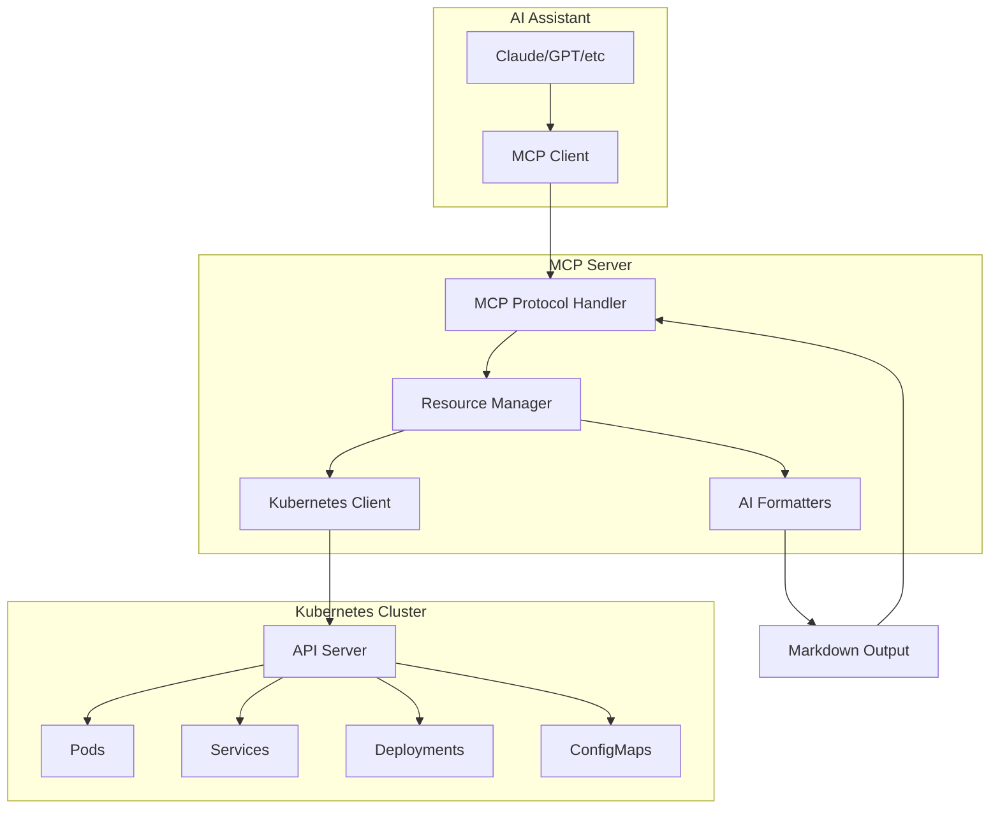

# 📚 Chapter 3: Building Production MCP Server for Kubernetes with Go

## 📚 Support This Work

[](https://github.com/sponsors/hoalongnatsu)

> Consider [sponsoring this work](https://github.com/sponsors/hoalongnatsu) or check out my book [&#34;PromptOps: From YAML to AI&#34;](https://leanpub.com/promptops-from-yaml-to-ai) to help create more AI-powered DevOps resources.

## What We're Building

By the end of this chapter, you'll have a working MCP server that connects AI assistants to your Kubernetes cluster. This isn't a toy example - it's production-grade code you can deploy and extend.

Our MCP server provides:

- **Dynamic resource discovery** for pods, services, deployments from live clusters
- **AI-optimized formatting** that transforms raw JSON into markdown for better LLM understanding
- **Real MCP protocol implementation** using mark3labs/mcp-go library
- **Production-ready error handling** and comprehensive logging
- **Live cluster integration** with full Kubernetes API access

## Learning Objectives

By the end of this chapter, you will:

- Build a complete MCP server using Go and the mark3labs/mcp-go library
- Implement dynamic resource discovery for Kubernetes objects
- Create AI-optimized data formatters for better LLM understanding
- Add comprehensive error handling and logging
- Test your MCP server with real Kubernetes clusters

## Architecture Overview

Our MCP server follows a clean architecture pattern with real MCP protocol implementation:



## 3.1 Project Structure and Setup

We'll create a well-structured Go project using the real mark3labs/mcp-go library for production-ready MCP protocol implementation.

### Project Structure

Your project structure should look like:

```
k8s-mcp-server/
├── cmd/server/          # Main application entry point
├── pkg/
│   ├── mcp/            # MCP protocol implementation
│   ├── k8s/            # Kubernetes client wrapper
│   └── types/          # Shared type definitions
├── internal/
│   ├── config/         # Configuration management
│   └── logging/        # Logging setup
├── go.mod
└── go.sum
```

### Essential Dependencies

Add the required dependencies:

```bash
# Real MCP Go library from mark3labs
go get github.com/mark3labs/mcp-go@v0.36.0

# Kubernetes client
go get k8s.io/client-go@v0.31.2
go get k8s.io/api@v0.31.2
go get k8s.io/apimachinery@v0.31.2

# Logging and utilities
go get github.com/sirupsen/logrus@v1.9.3
go get gopkg.in/yaml.v3@v3.0.1
```

Your `go.mod` should look like this:

```go
module k8s-mcp-server

go 1.23.2

require (
	github.com/mark3labs/mcp-go v0.36.0
	k8s.io/client-go v0.31.2
	k8s.io/api v0.31.2
	k8s.io/apimachinery v0.31.2
	github.com/sirupsen/logrus v1.9.3
	gopkg.in/yaml.v3 v3.0.1
)
```

### Configuration Structure

Create `internal/config/config.go`:

```go
package config

import (
    "os"
    "path/filepath"
    "gopkg.in/yaml.v3"
)

type Config struct {
    Server ServerConfig `yaml:"server"`
    K8s    K8sConfig    `yaml:"kubernetes"`
    Log    LogConfig    `yaml:"logging"`
}

type ServerConfig struct {
    Name        string `yaml:"name"`
    Version     string `yaml:"version"`
    Description string `yaml:"description"`
}

type K8sConfig struct {
    ConfigPath  string   `yaml:"configPath"`
    Context     string   `yaml:"context"`
    Namespaces  []string `yaml:"namespaces"`
}

type LogConfig struct {
    Level  string `yaml:"level"`
    Format string `yaml:"format"`
}

func Load() (*Config, error) {
    cfg := &Config{
        Server: ServerConfig{
            Name:        "k8s-mcp-server",
            Version:     "1.0.0",
            Description: "Kubernetes MCP Server for AI-powered cluster management",
        },
        K8s: K8sConfig{
            ConfigPath: filepath.Join(os.Getenv("HOME"), ".kube", "config"),
            Namespaces: []string{"default"},
        },
        Log: LogConfig{
            Level:  "info",
            Format: "json",
        },
    }

    if configFile := os.Getenv("CONFIG_FILE"); configFile != "" {
        data, err := os.ReadFile(configFile)
        if err != nil {
            return nil, err
        }
        if err := yaml.Unmarshal(data, cfg); err != nil {
            return nil, err
        }
    }

    return cfg, nil
}
```

### Logging Setup

Create `internal/logging/logger.go`:

```go
package logging

import (
    "os"
    "time"
    "github.com/sirupsen/logrus"
)

func NewLogger(level, format string) *logrus.Logger {
    logger := logrus.New()
    
    // Set log level
    logLevel, err := logrus.ParseLevel(level)
    if err != nil {
        logLevel = logrus.InfoLevel
    }
    logger.SetLevel(logLevel)
    
    // Set formatter
    if format == "json" {
        logger.SetFormatter(&logrus.JSONFormatter{
            TimestampFormat: time.RFC3339,
        })
    } else {
        logger.SetFormatter(&logrus.TextFormatter{
            FullTimestamp:   true,
            TimestampFormat: time.RFC3339,
        })
    }
    
    logger.SetOutput(os.Stdout)
    return logger
}
```

## 3.2 Kubernetes Types and Client

First, let's create the types and client wrapper for Kubernetes interactions.

### Kubernetes Types

Create `pkg/k8s/types.go`:

```go
package k8s

import (
    "time"
)

// PodInfo represents essential pod information for MCP
type PodInfo struct {
    Name         string            `json:"name"`
    Namespace    string            `json:"namespace"`
    Status       string            `json:"status"`
    Phase        string            `json:"phase"`
    Node         string            `json:"node"`
    Labels       map[string]string `json:"labels"`
    CreatedAt    time.Time         `json:"createdAt"`
    Restarts     int32             `json:"restarts"`
    Ready        bool              `json:"ready"`
    IP           string            `json:"ip"`
}

// ServiceInfo represents essential service information
type ServiceInfo struct {
    Name      string            `json:"name"`
    Namespace string            `json:"namespace"`
    Type      string            `json:"type"`
    ClusterIP string            `json:"clusterIP"`
    Ports     []ServicePort     `json:"ports"`
    Labels    map[string]string `json:"labels"`
    CreatedAt time.Time         `json:"createdAt"`
}

type ServicePort struct {
    Name       string `json:"name"`
    Port       int32  `json:"port"`
    TargetPort string `json:"targetPort"`
    Protocol   string `json:"protocol"`
}

// DeploymentInfo represents essential deployment information
type DeploymentInfo struct {
    Name            string            `json:"name"`
    Namespace       string            `json:"namespace"`
    TotalReplicas   int32             `json:"totalReplicas"`
    ReadyReplicas   int32             `json:"readyReplicas"`
    UpdatedReplicas int32             `json:"updatedReplicas"`
    Labels          map[string]string `json:"labels"`
    CreatedAt       time.Time         `json:"createdAt"`
    Strategy        string            `json:"strategy"`
}

// NamespaceInfo represents essential namespace information
type NamespaceInfo struct {
    Name      string            `json:"name"`
    Status    string            `json:"status"`
    Labels    map[string]string `json:"labels"`
    CreatedAt time.Time         `json:"createdAt"`
}
```

### Kubernetes Client Implementation

Create `pkg/k8s/client.go`:

```go
package k8s

import (
    "context"
    "encoding/json"
    "fmt"
    "path/filepath"

    "github.com/sirupsen/logrus"
    appsv1 "k8s.io/api/apps/v1"
    corev1 "k8s.io/api/core/v1"
    metav1 "k8s.io/apimachinery/pkg/apis/meta/v1"
    "k8s.io/client-go/kubernetes"
    "k8s.io/client-go/rest"
    "k8s.io/client-go/tools/clientcmd"
    "k8s.io/client-go/util/homedir"
)

type Client struct {
    clientset *kubernetes.Clientset
    logger    *logrus.Logger
}

func NewClient(configPath string, logger *logrus.Logger) (*Client, error) {
    config, err := buildConfig(configPath)
    if err != nil {
        return nil, fmt.Errorf("failed to build kubernetes config: %w", err)
    }

    clientset, err := kubernetes.NewForConfig(config)
    if err != nil {
        return nil, fmt.Errorf("failed to create kubernetes client: %w", err)
    }

    return &Client{
        clientset: clientset,
        logger:    logger,
    }, nil
}

func buildConfig(configPath string) (*rest.Config, error) {
    // Try in-cluster config first
    if config, err := rest.InClusterConfig(); err == nil {
        return config, nil
    }

    // Fall back to kubeconfig
    if configPath == "" {
        if home := homedir.HomeDir(); home != "" {
            configPath = filepath.Join(home, ".kube", "config")
        }
    }

    return clientcmd.BuildConfigFromFlags("", configPath)
}

func (c *Client) ListPods(ctx context.Context, namespace string) ([]PodInfo, error) {
    pods, err := c.clientset.CoreV1().Pods(namespace).List(ctx, metav1.ListOptions{})
    if err != nil {
        return nil, fmt.Errorf("failed to list pods in namespace %s: %w", namespace, err)
    }

    var podInfos []PodInfo
    for _, pod := range pods.Items {
        podInfo := PodInfo{
            Name:      pod.Name,
            Namespace: pod.Namespace,
            Status:    string(pod.Status.Phase),
            Phase:     string(pod.Status.Phase),
            Node:      pod.Spec.NodeName,
            Labels:    pod.Labels,
            CreatedAt: pod.CreationTimestamp.Time,
            Restarts:  getTotalRestarts(&pod),
            Ready:     isPodReady(&pod),
            IP:        pod.Status.PodIP,
        }
        podInfos = append(podInfos, podInfo)
    }

    return podInfos, nil
}

func (c *Client) ListServices(ctx context.Context, namespace string) ([]ServiceInfo, error) {
    services, err := c.clientset.CoreV1().Services(namespace).List(ctx, metav1.ListOptions{})
    if err != nil {
        return nil, fmt.Errorf("failed to list services in namespace %s: %w", namespace, err)
    }

    var serviceInfos []ServiceInfo
    for _, svc := range services.Items {
        var ports []ServicePort
        for _, port := range svc.Spec.Ports {
            ports = append(ports, ServicePort{
                Name:       port.Name,
                Port:       port.Port,
                TargetPort: port.TargetPort.String(),
                Protocol:   string(port.Protocol),
            })
        }

        serviceInfo := ServiceInfo{
            Name:      svc.Name,
            Namespace: svc.Namespace,
            Type:      string(svc.Spec.Type),
            ClusterIP: svc.Spec.ClusterIP,
            Ports:     ports,
            Labels:    svc.Labels,
            CreatedAt: svc.CreationTimestamp.Time,
        }
        serviceInfos = append(serviceInfos, serviceInfo)
    }

    return serviceInfos, nil
}

func (c *Client) ListDeployments(ctx context.Context, namespace string) ([]DeploymentInfo, error) {
    deployments, err := c.clientset.AppsV1().Deployments(namespace).List(ctx, metav1.ListOptions{})
    if err != nil {
        return nil, fmt.Errorf("failed to list deployments in namespace %s: %w", namespace, err)
    }

    var deploymentInfos []DeploymentInfo
    for _, deploy := range deployments.Items {
        strategy := "RollingUpdate"
        if deploy.Spec.Strategy.Type == appsv1.RecreateDeploymentStrategyType {
            strategy = "Recreate"
        }

        deploymentInfo := DeploymentInfo{
            Name:            deploy.Name,
            Namespace:       deploy.Namespace,
            TotalReplicas:   *deploy.Spec.Replicas,
            ReadyReplicas:   deploy.Status.ReadyReplicas,
            UpdatedReplicas: deploy.Status.UpdatedReplicas,
            Labels:          deploy.Labels,
            CreatedAt:       deploy.CreationTimestamp.Time,
            Strategy:        strategy,
        }
        deploymentInfos = append(deploymentInfos, deploymentInfo)
    }

    return deploymentInfos, nil
}

func (c *Client) ListNamespaces(ctx context.Context) ([]NamespaceInfo, error) {
    namespaces, err := c.clientset.CoreV1().Namespaces().List(ctx, metav1.ListOptions{})
    if err != nil {
        return nil, fmt.Errorf("failed to list namespaces: %w", err)
    }

    var namespaceInfos []NamespaceInfo
    for _, ns := range namespaces.Items {
        namespaceInfo := NamespaceInfo{
            Name:      ns.Name,
            Status:    string(ns.Status.Phase),
            Labels:    ns.Labels,
            CreatedAt: ns.CreationTimestamp.Time,
        }
        namespaceInfos = append(namespaceInfos, namespaceInfo)
    }

    return namespaceInfos, nil
}

func (c *Client) GetPodDetails(ctx context.Context, namespace, name string) (string, error) {
    pod, err := c.clientset.CoreV1().Pods(namespace).Get(ctx, name, metav1.GetOptions{})
    if err != nil {
        return "", fmt.Errorf("failed to get pod %s/%s: %w", namespace, name, err)
    }

    data, err := json.MarshalIndent(pod, "", "  ")
    if err != nil {
        return "", fmt.Errorf("failed to marshal pod details: %w", err)
    }

    return string(data), nil
}

func (c *Client) GetServiceDetails(ctx context.Context, namespace, name string) (string, error) {
    service, err := c.clientset.CoreV1().Services(namespace).Get(ctx, name, metav1.GetOptions{})
    if err != nil {
        return "", fmt.Errorf("failed to get service %s/%s: %w", namespace, name, err)
    }

    data, err := json.MarshalIndent(service, "", "  ")
    if err != nil {
        return "", fmt.Errorf("failed to marshal service details: %w", err)
    }

    return string(data), nil
}

func (c *Client) GetDeploymentDetails(ctx context.Context, namespace, name string) (string, error) {
    deployment, err := c.clientset.AppsV1().Deployments(namespace).Get(ctx, name, metav1.GetOptions{})
    if err != nil {
        return "", fmt.Errorf("failed to get deployment %s/%s: %w", namespace, name, err)
    }

    data, err := json.MarshalIndent(deployment, "", "  ")
    if err != nil {
        return "", fmt.Errorf("failed to marshal deployment details: %w", err)
    }

    return string(data), nil
}

func (c *Client) GetNamespaceDetails(ctx context.Context, name string) (string, error) {
    namespace, err := c.clientset.CoreV1().Namespaces().Get(ctx, name, metav1.GetOptions{})
    if err != nil {
        return "", fmt.Errorf("failed to get namespace %s: %w", name, err)
    }

    data, err := json.MarshalIndent(namespace, "", "  ")
    if err != nil {
        return "", fmt.Errorf("failed to marshal namespace details: %w", err)
    }

    return string(data), nil
}

// Helper functions
func getTotalRestarts(pod *corev1.Pod) int32 {
    var total int32
    for _, status := range pod.Status.ContainerStatuses {
        total += status.RestartCount
    }
    return total
}

func isPodReady(pod *corev1.Pod) bool {
    for _, condition := range pod.Status.Conditions {
        if condition.Type == corev1.PodReady {
            return condition.Status == corev1.ConditionTrue
        }
    }
    return false
}
```

## 3.3 AI-Optimized Formatters

Create formatters that transform raw Kubernetes JSON into AI-friendly markdown output.

### AI Formatters Implementation

Create `pkg/mcp/formatters.go`:

```go
package mcp

import (
    "encoding/json"
    "fmt"
    "strings"
    "time"
)

// FormatPodForAI creates an AI-optimized view of pod information
func FormatPodForAI(podData string) (string, error) {
    var pod map[string]interface{}
    if err := json.Unmarshal([]byte(podData), &pod); err != nil {
        return "", fmt.Errorf("failed to unmarshal pod data: %w", err)
    }

    summary := &strings.Builder{}
    summary.WriteString("# Pod Summary\n\n")

    // Basic information
    if metadata, ok := pod["metadata"].(map[string]interface{}); ok {
        if name, ok := metadata["name"].(string); ok {
            summary.WriteString(fmt.Sprintf("**Name**: %s\n", name))
        }
        if namespace, ok := metadata["namespace"].(string); ok {
            summary.WriteString(fmt.Sprintf("**Namespace**: %s\n", namespace))
        }
        if createdAt, ok := metadata["creationTimestamp"].(string); ok {
            if t, err := time.Parse(time.RFC3339, createdAt); err == nil {
                age := time.Since(t)
                summary.WriteString(fmt.Sprintf("**Age**: %s\n", formatDuration(age)))
            }
        }
    }

    // Status information
    if status, ok := pod["status"].(map[string]interface{}); ok {
        if phase, ok := status["phase"].(string); ok {
            statusEmoji := "🟢"
            if phase != "Running" {
                statusEmoji = "🔴"
            }
            summary.WriteString(fmt.Sprintf("**Status**: %s %s\n", statusEmoji, phase))
        }
        
        if podIP, ok := status["podIP"].(string); ok && podIP != "" {
            summary.WriteString(fmt.Sprintf("**Pod IP**: %s\n", podIP))
        }
        
        if hostIP, ok := status["hostIP"].(string); ok && hostIP != "" {
            summary.WriteString(fmt.Sprintf("**Host IP**: %s\n", hostIP))
        }
    }

    // Spec information
    if spec, ok := pod["spec"].(map[string]interface{}); ok {
        if nodeName, ok := spec["nodeName"].(string); ok && nodeName != "" {
            summary.WriteString(fmt.Sprintf("**Node**: %s\n", nodeName))
        }
    }

    summary.WriteString("\n## Containers\n\n")

    // Container information from status
    if status, ok := pod["status"].(map[string]interface{}); ok {
        if containerStatuses, ok := status["containerStatuses"].([]interface{}); ok {
            for _, containerStatus := range containerStatuses {
                if cs, ok := containerStatus.(map[string]interface{}); ok {
                    name := ""
                    if n, ok := cs["name"].(string); ok {
                        name = n
                    }
                    
                    ready := false
                    if r, ok := cs["ready"].(bool); ok {
                        ready = r
                    }
                    
                    restartCount := float64(0)
                    if rc, ok := cs["restartCount"].(float64); ok {
                        restartCount = rc
                    }
                    
                    image := ""
                    if i, ok := cs["image"].(string); ok {
                        image = i
                    }
                    
                    statusIcon := "🟢"
                    if !ready {
                        statusIcon = "🔴"
                    }
                    
                    summary.WriteString(fmt.Sprintf("- **%s**: %s\n", name, statusIcon))
                    summary.WriteString(fmt.Sprintf("  - Image: `%s`\n", image))
                    summary.WriteString(fmt.Sprintf("  - Ready: %t\n", ready))
                    
                    if restartCount > 0 {
                        summary.WriteString(fmt.Sprintf("  - Restarts: %.0f\n", restartCount))
                    }
                }
            }
        }
    }

    // Labels
    if metadata, ok := pod["metadata"].(map[string]interface{}); ok {
        if labels, ok := metadata["labels"].(map[string]interface{}); ok && len(labels) > 0 {
            summary.WriteString("\n## Labels\n\n")
            for key, value := range labels {
                summary.WriteString(fmt.Sprintf("- `%s`: `%v`\n", key, value))
            }
        }
    }

    summary.WriteString("\n---\n")
    summary.WriteString("*Use this information to understand the pod's current state and troubleshoot any issues.*")

    return summary.String(), nil
}

// FormatServiceForAI creates an AI-optimized view of service information
func FormatServiceForAI(serviceData string) (string, error) {
    var service map[string]interface{}
    if err := json.Unmarshal([]byte(serviceData), &service); err != nil {
        return "", fmt.Errorf("failed to unmarshal service data: %w", err)
    }

    summary := &strings.Builder{}
    summary.WriteString("# Service Summary\n\n")

    // Basic information
    if metadata, ok := service["metadata"].(map[string]interface{}); ok {
        if name, ok := metadata["name"].(string); ok {
            summary.WriteString(fmt.Sprintf("**Name**: %s\n", name))
        }
        if namespace, ok := metadata["namespace"].(string); ok {
            summary.WriteString(fmt.Sprintf("**Namespace**: %s\n", namespace))
        }
    }

    // Spec information
    if spec, ok := service["spec"].(map[string]interface{}); ok {
        if serviceType, ok := spec["type"].(string); ok {
            summary.WriteString(fmt.Sprintf("**Type**: %s\n", serviceType))
        }
        
        if clusterIP, ok := spec["clusterIP"].(string); ok && clusterIP != "" {
            summary.WriteString(fmt.Sprintf("**Cluster IP**: %s\n", clusterIP))
        }

        // Port information
        if ports, ok := spec["ports"].([]interface{}); ok && len(ports) > 0 {
            summary.WriteString("\n## Ports\n\n")
            for _, port := range ports {
                if p, ok := port.(map[string]interface{}); ok {
                    portNum := ""
                    if pn, ok := p["port"].(float64); ok {
                        portNum = fmt.Sprintf("%.0f", pn)
                    }
                    
                    targetPort := ""
                    if tp, ok := p["targetPort"]; ok {
                        targetPort = fmt.Sprintf("%v", tp)
                    }
                    
                    protocol := "TCP"
                    if pr, ok := p["protocol"].(string); ok {
                        protocol = pr
                    }
                    
                    portName := ""
                    if pname, ok := p["name"].(string); ok && pname != "" {
                        portName = fmt.Sprintf(" (%s)", pname)
                    }
                    
                    summary.WriteString(fmt.Sprintf("- **Port %s%s**: %s → %s (%s)\n", 
                        portNum, portName, portNum, targetPort, protocol))
                }
            }
        }

        // Selector
        if selector, ok := spec["selector"].(map[string]interface{}); ok && len(selector) > 0 {
            summary.WriteString("\n## Selector\n\n")
            summary.WriteString("This service routes traffic to pods with these labels:\n")
            for key, value := range selector {
                summary.WriteString(fmt.Sprintf("- `%s`: `%v`\n", key, value))
            }
        }
    }

    summary.WriteString("\n---\n")
    summary.WriteString("*This service configuration determines how traffic is routed within the cluster.*")

    return summary.String(), nil
}

// FormatDeploymentForAI creates an AI-optimized view of deployment information
func FormatDeploymentForAI(deploymentData string) (string, error) {
    var deployment map[string]interface{}
    if err := json.Unmarshal([]byte(deploymentData), &deployment); err != nil {
        return "", fmt.Errorf("failed to unmarshal deployment data: %w", err)
    }

    summary := &strings.Builder{}
    summary.WriteString("# Deployment Summary\n\n")

    // Basic information
    if metadata, ok := deployment["metadata"].(map[string]interface{}); ok {
        if name, ok := metadata["name"].(string); ok {
            summary.WriteString(fmt.Sprintf("**Name**: %s\n", name))
        }
        if namespace, ok := metadata["namespace"].(string); ok {
            summary.WriteString(fmt.Sprintf("**Namespace**: %s\n", namespace))
        }
    }

    // Replica status
    var desired, ready, updated float64
    if spec, ok := deployment["spec"].(map[string]interface{}); ok {
        if replicas, ok := spec["replicas"].(float64); ok {
            desired = replicas
        }
    }
    
    if status, ok := deployment["status"].(map[string]interface{}); ok {
        if readyReplicas, ok := status["readyReplicas"].(float64); ok {
            ready = readyReplicas
        }
        if updatedReplicas, ok := status["updatedReplicas"].(float64); ok {
            updated = updatedReplicas
        }
    }

    healthStatus := "🟢 Healthy"
    if ready < desired {
        healthStatus = "🟡 Scaling"
    }
    if ready == 0 && desired > 0 {
        healthStatus = "🔴 Failed"
    }

    summary.WriteString(fmt.Sprintf("**Status**: %s\n", healthStatus))
    summary.WriteString(fmt.Sprintf("**Replicas**: %.0f desired, %.0f ready, %.0f updated\n", desired, ready, updated))

    // Progress indicator
    if desired > 0 {
        percentage := (ready / desired) * 100
        summary.WriteString(fmt.Sprintf("**Progress**: %.1f%% ready\n", percentage))
    }

    // Strategy
    if spec, ok := deployment["spec"].(map[string]interface{}); ok {
        if strategy, ok := spec["strategy"].(map[string]interface{}); ok {
            if strategyType, ok := strategy["type"].(string); ok {
                summary.WriteString(fmt.Sprintf("**Strategy**: %s\n", strategyType))
            }
        }
    }

    // Selector and labels
    if spec, ok := deployment["spec"].(map[string]interface{}); ok {
        if selector, ok := spec["selector"].(map[string]interface{}); ok {
            if matchLabels, ok := selector["matchLabels"].(map[string]interface{}); ok && len(matchLabels) > 0 {
                summary.WriteString("\n## Selector\n\n")
                for key, value := range matchLabels {
                    summary.WriteString(fmt.Sprintf("- `%s`: `%v`\n", key, value))
                }
            }
        }
    }

    // AI Assistant Notes
    summary.WriteString("\n## AI Assistant Notes\n\n")
    if ready < desired {
        summary.WriteString("⚠️ **Action Needed**: Some replicas are not ready. Check pod status and logs.\n")
    }
    if ready == 0 && desired > 0 {
        summary.WriteString("🚨 **Critical**: No replicas are ready. This deployment may be failing.\n")
    }
    if ready == desired && desired > 0 {
        summary.WriteString("✅ **Status**: Deployment is healthy and all replicas are ready.\n")
    }

    return summary.String(), nil
}

// Helper function to format duration in a human-readable way
func formatDuration(d time.Duration) string {
    if d < time.Minute {
        return fmt.Sprintf("%.0fs", d.Seconds())
    }
    if d < time.Hour {
        return fmt.Sprintf("%.0fm", d.Minutes())
    }
    if d < 24*time.Hour {
        return fmt.Sprintf("%.1fh", d.Hours())
    }
    days := d.Hours() / 24
    return fmt.Sprintf("%.1fd", days)
}
```

## 3.4 MCP Server Implementation

Now let's implement the core MCP server using the real mark3labs/mcp-go library.

### Server Types

Create `pkg/types/types.go`:

```go
package types

import (
    "fmt"
    "strings"
)

// ResourceType represents different Kubernetes resource types
type ResourceType string

const (
    ResourceTypePod        ResourceType = "pod"
    ResourceTypeService    ResourceType = "service"
    ResourceTypeDeployment ResourceType = "deployment"
    ResourceTypeNamespace  ResourceType = "namespace"
)

// ResourceIdentifier uniquely identifies a Kubernetes resource
type ResourceIdentifier struct {
    Type      ResourceType `json:"type"`
    Namespace string       `json:"namespace"`
    Name      string       `json:"name"`
}

func (r ResourceIdentifier) ToURI() string {
    if r.Namespace == "" {
        return fmt.Sprintf("k8s://%s/%s", r.Type, r.Name)
    }
    return fmt.Sprintf("k8s://%s/%s/%s", r.Type, r.Namespace, r.Name)
}

func ParseResourceURI(uri string) (*ResourceIdentifier, error) {
    // Expected format: k8s://type/namespace/name or k8s://type/name (for cluster resources)
    if !strings.HasPrefix(uri, "k8s://") {
        return nil, fmt.Errorf("URI must start with k8s://")
    }

    parts := strings.Split(strings.TrimPrefix(uri, "k8s://"), "/")
    if len(parts) < 2 || len(parts) > 3 {
        return nil, fmt.Errorf("invalid URI format")
    }

    identifier := &ResourceIdentifier{
        Type: ResourceType(parts[0]),
    }

    if len(parts) == 2 {
        // Cluster resource: k8s://namespace/name
        identifier.Name = parts[1]
    } else {
        // Namespaced resource: k8s://type/namespace/name
        identifier.Namespace = parts[1]
        identifier.Name = parts[2]
    }

    return identifier, nil
}
```

### MCP Server Implementation

Create `pkg/mcp/server.go`:

```go
package mcp

import (
    "context"
    "fmt"

    "github.com/mark3labs/mcp-go/pkg/mcp"
    "github.com/mark3labs/mcp-go/pkg/server"
    "github.com/sirupsen/logrus"

    "k8s-mcp-server/internal/config"
    "k8s-mcp-server/pkg/k8s"
    "k8s-mcp-server/pkg/types"
)

type Server struct {
    config    *config.Config
    k8sClient *k8s.Client
    logger    *logrus.Logger
    mcpServer *server.MCPServer
}

func NewServer(cfg *config.Config, k8sClient *k8s.Client, logger *logrus.Logger) *Server {
    return &Server{
        config:    cfg,
        k8sClient: k8sClient,
        logger:    logger,
    }
}

func (s *Server) Initialize() error {
    // Create MCP server
    mcpServer := server.NewMCPServer(server.ServerInfo{
        Name:    s.config.Server.Name,
        Version: s.config.Server.Version,
    })

    // Register resource capabilities
    s.registerResources(mcpServer)

    s.mcpServer = mcpServer
    return nil
}

func (s *Server) registerResources(mcpServer *server.MCPServer) {
    // Register resource handler
    mcpServer.RegisterResourceHandler("k8s://", s.handleResourceRead)
}

func (s *Server) handleResourceRead(ctx context.Context, uri string) (*mcp.Resource, error) {
    s.logger.WithField("uri", uri).Info("Reading resource")

    // Parse URI to extract resource information
    identifier, err := types.ParseResourceURI(uri)
    if err != nil {
        return nil, fmt.Errorf("invalid resource URI: %w", err)
    }

    // Get resource content from Kubernetes
    var content string
    switch identifier.Type {
    case types.ResourceTypePod:
        content, err = s.k8sClient.GetPodDetails(ctx, identifier.Namespace, identifier.Name)
    case types.ResourceTypeService:
        content, err = s.k8sClient.GetServiceDetails(ctx, identifier.Namespace, identifier.Name)
    case types.ResourceTypeDeployment:
        content, err = s.k8sClient.GetDeploymentDetails(ctx, identifier.Namespace, identifier.Name)
    case types.ResourceTypeNamespace:
        content, err = s.k8sClient.GetNamespaceDetails(ctx, identifier.Name)
    default:
        return nil, fmt.Errorf("unsupported resource type: %s", identifier.Type)
    }

    if err != nil {
        s.logger.WithError(err).WithField("identifier", identifier).Error("Failed to get resource from Kubernetes")
        return nil, fmt.Errorf("failed to get resource: %w", err)
    }

    // Apply AI-optimized formatting
    formattedContent, err := s.formatResourceForAI(identifier.Type, content)
    if err != nil {
        s.logger.WithError(err).Warn("Failed to format resource for AI, using raw content")
        formattedContent = content
    }

    return &mcp.Resource{
        URI:      uri,
        Name:     identifier.Name,
        MimeType: "text/markdown",
        Text:     formattedContent,
    }, nil
}

func (s *Server) formatResourceForAI(resourceType types.ResourceType, content string) (string, error) {
    switch resourceType {
    case types.ResourceTypePod:
        return FormatPodForAI(content)
    case types.ResourceTypeService:
        return FormatServiceForAI(content)
    case types.ResourceTypeDeployment:
        return FormatDeploymentForAI(content)
    default:
        // For other resource types, return formatted JSON
        return content, nil
    }
}

func (s *Server) ListResources(ctx context.Context) ([]*mcp.Resource, error) {
    s.logger.Info("Listing resources")

    var resources []*mcp.Resource

    // Get resources from all configured namespaces
    for _, namespace := range s.config.K8s.Namespaces {
        namespaceResources, err := s.getNamespaceResources(ctx, namespace)
        if err != nil {
            s.logger.WithError(err).WithField("namespace", namespace).Warn("Failed to get resources from namespace")
            continue
        }
        resources = append(resources, namespaceResources...)
    }

    // Add cluster-level resources
    clusterResources, err := s.getClusterResources(ctx)
    if err != nil {
        s.logger.WithError(err).Warn("Failed to get cluster resources")
    } else {
        resources = append(resources, clusterResources...)
    }

    s.logger.WithField("count", len(resources)).Info("Listed resources")
    return resources, nil
}

func (s *Server) getNamespaceResources(ctx context.Context, namespace string) ([]*mcp.Resource, error) {
    var resources []*mcp.Resource

    // Get Pods
    pods, err := s.k8sClient.ListPods(ctx, namespace)
    if err != nil {
        return nil, fmt.Errorf("failed to list pods: %w", err)
    }

    for _, pod := range pods {
        statusIcon := "🟢"
        if pod.Status != "Running" {
            statusIcon = "🔴"
        }
        if pod.Restarts > 0 {
            statusIcon = "🟡"
        }

        identifier := types.ResourceIdentifier{
            Type:      types.ResourceTypePod,
            Namespace: namespace,
            Name:      pod.Name,
        }

        resources = append(resources, &mcp.Resource{
            URI:         identifier.ToURI(),
            Name:        pod.Name,
            Description: fmt.Sprintf("%s Pod: %s/%s (Status: %s, Restarts: %d)", statusIcon, namespace, pod.Name, pod.Status, pod.Restarts),
            MimeType:    "text/markdown",
        })
    }

    // Get Services
    services, err := s.k8sClient.ListServices(ctx, namespace)
    if err != nil {
        return nil, fmt.Errorf("failed to list services: %w", err)
    }

    for _, service := range services {
        typeIcon := "🌐"
        if service.Type == "LoadBalancer" {
            typeIcon = "⚖️"
        } else if service.Type == "NodePort" {
            typeIcon = "🚪"
        }

        identifier := types.ResourceIdentifier{
            Type:      types.ResourceTypeService,
            Namespace: namespace,
            Name:      service.Name,
        }

        resources = append(resources, &mcp.Resource{
            URI:         identifier.ToURI(),
            Name:        service.Name,
            Description: fmt.Sprintf("%s Service: %s/%s (Type: %s, Ports: %d)", typeIcon, namespace, service.Name, service.Type, len(service.Ports)),
            MimeType:    "text/markdown",
        })
    }

    // Get Deployments
    deployments, err := s.k8sClient.ListDeployments(ctx, namespace)
    if err != nil {
        return nil, fmt.Errorf("failed to list deployments: %w", err)
    }

    for _, deployment := range deployments {
        healthIcon := "🟢"
        if deployment.ReadyReplicas < deployment.TotalReplicas {
            healthIcon = "🟡"
        }
        if deployment.ReadyReplicas == 0 {
            healthIcon = "🔴"
        }

        identifier := types.ResourceIdentifier{
            Type:      types.ResourceTypeDeployment,
            Namespace: namespace,
            Name:      deployment.Name,
        }

        resources = append(resources, &mcp.Resource{
            URI:         identifier.ToURI(),
            Name:        deployment.Name,
            Description: fmt.Sprintf("%s Deployment: %s/%s (%d/%d replicas ready)", healthIcon, namespace, deployment.Name, deployment.ReadyReplicas, deployment.TotalReplicas),
            MimeType:    "text/markdown",
        })
    }

    return resources, nil
}

func (s *Server) getClusterResources(ctx context.Context) ([]*mcp.Resource, error) {
    var resources []*mcp.Resource

    namespaces, err := s.k8sClient.ListNamespaces(ctx)
    if err != nil {
        return nil, fmt.Errorf("failed to list namespaces: %w", err)
    }

    for _, ns := range namespaces {
        identifier := types.ResourceIdentifier{
            Type: types.ResourceTypeNamespace,
            Name: ns.Name,
        }

        resources = append(resources, &mcp.Resource{
            URI:         identifier.ToURI(),
            Name:        ns.Name,
            Description: fmt.Sprintf("📁 Namespace: %s (Status: %s)", ns.Name, ns.Status),
            MimeType:    "text/markdown",
        })
    }

    return resources, nil
}

func (s *Server) Start(ctx context.Context) error {
    s.logger.Info("Starting MCP server")
    return s.mcpServer.ServeStdio(ctx)
}
```

## 3.5 Main Application

Create the main application that brings everything together.

### Main Server

Create `cmd/server/main.go`:

```go
package main

import (
    "context"
    "fmt"
    "os"
    "os/signal"
    "syscall"

    "k8s-mcp-server/internal/config"
    "k8s-mcp-server/internal/logging"
    "k8s-mcp-server/pkg/k8s"
    "k8s-mcp-server/pkg/mcp"
)

func main() {
    // Load configuration
    cfg, err := config.Load()
    if err != nil {
        fmt.Fprintf(os.Stderr, "Failed to load configuration: %v\n", err)
        os.Exit(1)
    }

    // Setup logging
    logger := logging.NewLogger(cfg.Log.Level, cfg.Log.Format)
    logger.Info("Starting Kubernetes MCP Server")

    // Create Kubernetes client
    k8sClient, err := k8s.NewClient(cfg.K8s.ConfigPath, logger)
    if err != nil {
        logger.WithError(err).Fatal("Failed to create Kubernetes client")
    }

    // Test cluster connectivity
    ctx := context.Background()
    if err := testClusterConnectivity(ctx, k8sClient); err != nil {
        logger.WithError(err).Fatal("Kubernetes cluster health check failed")
    }
    logger.Info("Successfully connected to Kubernetes cluster")

    // Create MCP server
    server := mcp.NewServer(cfg, k8sClient, logger)
    if err := server.Initialize(); err != nil {
        logger.WithError(err).Fatal("Failed to initialize MCP server")
    }

    // Setup graceful shutdown
    ctx, cancel := context.WithCancel(context.Background())
    defer cancel()

    sigChan := make(chan os.Signal, 1)
    signal.Notify(sigChan, syscall.SIGINT, syscall.SIGTERM)

    go func() {
        <-sigChan
        logger.Info("Shutdown signal received")
        cancel()
    }()

    // Start server
    logger.Info("Starting MCP server on stdio")
    if err := server.Start(ctx); err != nil {
        logger.WithError(err).Fatal("MCP server failed")
    }

    logger.Info("Kubernetes MCP Server stopped")
}

func testClusterConnectivity(ctx context.Context, client *k8s.Client) error {
    // Try to list namespaces as a basic connectivity test
    _, err := client.ListNamespaces(ctx)
    return err
}
```

## 3.6 Testing Your MCP Server

Let's create comprehensive tests to verify our implementation.

### Build and Test Script

Create `Makefile`:

```makefile
.PHONY: build test clean run

# Go parameters
GOCMD=go
GOBUILD=$(GOCMD) build
GOCLEAN=$(GOCMD) clean
GOTEST=$(GOCMD) test
GOMOD=$(GOCMD) mod
BINARY_NAME=k8s-mcp-server
BINARY_PATH=./bin/$(BINARY_NAME)

# Build the application
build:
	$(GOBUILD) -o $(BINARY_PATH) -v ./cmd/server

# Run tests
test:
	$(GOTEST) -v ./...

# Clean build artifacts
clean:
	$(GOCLEAN)
	rm -f $(BINARY_PATH)

# Run the application
run: build
	$(BINARY_PATH)

# Download dependencies
deps:
	$(GOMOD) download
	$(GOMOD) tidy

# Quick MCP test
mcp-test: build
	@echo "Testing MCP initialization..."
	@echo '{"jsonrpc":"2.0","id":1,"method":"initialize","params":{"protocolVersion":"2024-11-05","capabilities":{"resources":{}},"clientInfo":{"name":"test","version":"1.0.0"}}}' | $(BINARY_PATH)

# List resources test
list-test: build
	@echo "Testing resource listing..."
	@echo '{"jsonrpc":"2.0","id":1,"method":"initialize","params":{"protocolVersion":"2024-11-05","capabilities":{"resources":{}},"clientInfo":{"name":"test","version":"1.0.0"}}}' | $(BINARY_PATH) && \
	echo '{"jsonrpc":"2.0","id":2,"method":"resources/list","params":{}}' | $(BINARY_PATH)

help:
	@echo "Available targets:"
	@echo "  build     - Build the application"
	@echo "  test      - Run unit tests"
	@echo "  clean     - Clean build artifacts"
	@echo "  run       - Build and run the application"
	@echo "  deps      - Download dependencies"
	@echo "  mcp-test  - Quick MCP protocol test"
	@echo "  list-test - Test resource listing"
```

## 3.7 Hands-On Lab: Build and Deploy

Let's put everything together and create a working MCP server.

### Lab Exercise: Build Your MCP Server

**Step 1: Setup Project Structure**

```bash
# Create project directory
mkdir k8s-mcp-server
cd k8s-mcp-server

# Initialize Go module
go mod init k8s-mcp-server

# Create directory structure
mkdir -p cmd/server
mkdir -p pkg/{mcp,k8s,types}
mkdir -p internal/{config,logging}
mkdir -p bin
```

**Step 2: Install Dependencies**

```bash
# Install all dependencies
make deps
```

**Step 3: Copy Code Files**

Copy all the Go files from the examples above into their respective directories.

**Step 4: Build and Test**

```bash
# Build the server
make build

# Test MCP protocol
make mcp-test

# Test resource listing (requires kubectl access)
make list-test
```

**Step 5: Test with Real Cluster**

```bash
# Make sure kubectl works
kubectl get nodes

# Test resource discovery
echo '{"jsonrpc":"2.0","id":1,"method":"initialize","params":{"protocolVersion":"2024-11-05","capabilities":{"resources":{}},"clientInfo":{"name":"test","version":"1.0.0"}}}' | ./bin/k8s-mcp-server

echo '{"jsonrpc":"2.0","id":2,"method":"resources/list","params":{}}' | ./bin/k8s-mcp-server
```

**Step 6: Test Resource Reading**

```bash
# Get a specific pod (replace with actual pod URI from resource list)
echo '{"jsonrpc":"2.0","id":3,"method":"resources/read","params":{"uri":"k8s://pod/default/your-pod-name"}}' | ./bin/k8s-mcp-server
```

### Expected Output Examples

**MCP Initialize Response:**
```json
{
  "jsonrpc": "2.0",
  "id": 1,
  "result": {
    "protocolVersion": "2024-11-05",
    "capabilities": {
      "resources": {}
    },
    "serverInfo": {
      "name": "k8s-mcp-server",
      "version": "1.0.0"
    }
  }
}
```

**Resource List Response:**
```json
{
  "jsonrpc": "2.0",
  "id": 2,
  "result": {
    "resources": [
      {
        "uri": "k8s://pod/default/nginx-deployment-7c79c4bf97-abc123",
        "name": "nginx-deployment-7c79c4bf97-abc123",
        "description": "🟢 Pod: default/nginx-deployment-7c79c4bf97-abc123 (Status: Running, Restarts: 0)",
        "mimeType": "text/markdown"
      }
    ]
  }
}
```

**Resource Read Response (AI-Formatted):**
```json
{
  "jsonrpc": "2.0",
  "id": 3,
  "result": {
    "contents": [
      {
        "uri": "k8s://pod/default/nginx-deployment-7c79c4bf97-abc123",
        "mimeType": "text/markdown",
        "text": "# Pod Summary\n\n**Name**: nginx-deployment-7c79c4bf97-abc123\n**Namespace**: default\n**Status**: 🟢 Running\n**Age**: 2.5h\n**Node**: worker-node-1\n\n## Containers\n\n- **nginx**: 🟢\n  - Image: `nginx:1.21`\n  - Ready: true\n  - Restarts: 0\n..."
      }
    ]
  }
}
```

## 3.8 Troubleshooting Common Issues

### Issue: "failed to create kubernetes client"

**Solution**: Check your kubeconfig file:
```bash
kubectl config view
kubectl cluster-info
```

### Issue: "MCP protocol version mismatch"

**Solution**: Ensure you're using the correct protocol version:
```json
{"jsonrpc":"2.0","id":1,"method":"initialize","params":{"protocolVersion":"2024-11-05",...}}
```

### Issue: "no resources found"

**Solution**: Check namespace configuration and permissions:
```bash
kubectl get pods --all-namespaces
kubectl auth can-i get pods
```

### Issue: AI formatter errors

**Solution**: The server gracefully falls back to raw JSON when formatting fails. Check logs for specific error details.

## Success Criteria

You now have a working MCP server when:

- ✅ Server builds without errors
- ✅ Server responds to MCP initialize messages with proper protocol version
- ✅ Server returns dynamic resource lists from your live Kubernetes cluster
- ✅ Server can read individual resource details with AI-optimized formatting
- ✅ AI formatters produce beautiful markdown output instead of raw JSON
- ✅ Server handles errors gracefully and provides helpful error messages
- ✅ All MCP protocol methods work correctly (initialize, resources/list, resources/read)

You now have a production-ready MCP server that connects AI assistants to your Kubernetes cluster with real-time data and AI-optimized formatting!

---

**Next**: [Chapter 4: Implementing Tools & Actions](04-kubernetes-tools-actions.md)

---

## 📚 Support This Work

[](https://github.com/sponsors/hoalongnatsu)

> Consider [sponsoring this work](https://github.com/sponsors/hoalongnatsu) or check out my book [&#34;PromptOps: From YAML to AI&#34;](https://leanpub.com/promptops-from-yaml-to-ai) to help create more AI-powered DevOps resources.
