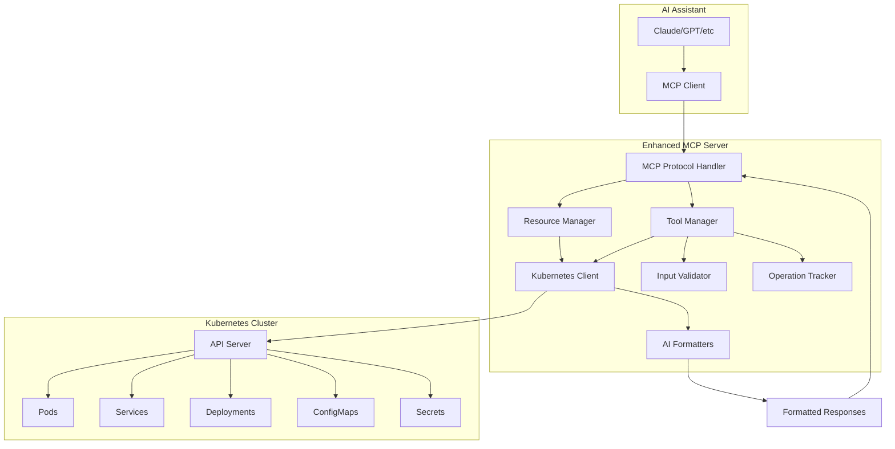

# Chapter 4: How to Let AI Take Control of Your Kubernetes Cluster

*Do not use in production after completing Chapter 9.*

## What We're Building

In Chapter 3, we built an MCP server that could read Kubernetes resources. Now we'll add the ability to **perform actions** - scaling deployments, restarting pods, managing configs, and retrieving logs. This transforms our server from read-only to a full operational tool.

> **💡 Complete Working Example**: All code in this chapter builds upon Chapter 3 and is available in [`./code/04/`](./code/04/). You can build and run this code directly from the repository.

Our enhanced MCP server will provide:

- **Scaling Operations** for deployments and statefulsets with validation
- **Pod Management** including restart and deletion capabilities
- **ConfigMap & Secret Operations** for configuration management
- **Log Retrieval** with streaming and filtering options
- **Comprehensive Validation** to prevent dangerous operations
- **Async Operation Tracking** for long-running tasks

## Learning Objectives

By the end of this chapter, you will:

- Design and implement MCP tools with complex input schemas
- Handle Kubernetes write operations safely with proper validation
- Implement asynchronous operations with status tracking
- Create comprehensive parameter validation for security
- Build tools that provide rich feedback to AI assistants

## Architecture Overview - Adding Tools

We're extending our read-only MCP server to support tools (actions):



## 4.1 Understanding MCP Tools

MCP Tools are different from Resources:

- **Resources** are read-only data sources (what we built in Chapter 3)
- **Tools** are executable actions that can modify state
- **Tools** require input schemas, validation, and error handling
- **Tools** return execution results rather than static data

### Tool vs Resource Comparison

| Aspect         | Resources (Chapter 3) | Tools (Chapter 4)             |
| -------------- | --------------------- | ----------------------------- |
| Purpose        | Read data             | Execute actions               |
| Input          | URI only              | Complex parameters            |
| Validation     | URI format            | Input schema + business rules |
| Side Effects   | None                  | Modifies cluster state        |
| Response       | Static content        | Execution results             |
| Error Handling | Simple                | Complex with rollback         |

Let's start implementing!

## 4.2 Tool Definitions and Input Schemas

First, we need to define the tools our MCP server will provide and their input schemas.

### Tool Schema Design Principles

When designing MCP tool schemas for Kubernetes operations:

1. **Be Explicit**: Every parameter should have clear validation rules
2. **Fail Fast**: Validate inputs before touching Kubernetes
3. **Be Safe**: Require confirmation for destructive operations
4. **Provide Context**: Include namespace, resource type, and operation details
5. **Return Rich Data**: Give AI assistants detailed results to work with

### Core Tool Definitions

Create `pkg/tools/definitions.go` (see [actual implementation](./code/04/pkg/tools/definitions.go)):

```go
package tools

import (
	"github.com/mark3labs/mcp-go/mcp"
)

// GetToolDefinitions returns all available MCP tools with their schemas
func GetToolDefinitions() []mcp.Tool {
	return []mcp.Tool{
		{
			Name:        "k8s_scale_deployment",
			Description: "Scale a Kubernetes deployment to the specified number of replicas",
			InputSchema: mcp.ToolInputSchema{
				Type: "object",
				Properties: map[string]interface{}{
					"namespace": map[string]interface{}{
						"type":        "string",
						"description": "Kubernetes namespace containing the deployment",
						"pattern":     "^[a-z0-9]([-a-z0-9]*[a-z0-9])?$",
					},
					"name": map[string]interface{}{
						"type":        "string", 
						"description": "Name of the deployment to scale",
						"pattern":     "^[a-z0-9]([-a-z0-9]*[a-z0-9])?$",
					},
					"replicas": map[string]interface{}{
						"type":        "integer",
						"description": "Target number of replicas (0-100)",
						"minimum":     0,
						"maximum":     100,
					},
					"confirm": map[string]interface{}{
						"type":        "boolean",
						"description": "Confirmation that you want to perform this scaling operation",
						"const":       true,
					},
				},
				Required: []string{"namespace", "name", "replicas", "confirm"},
			},
		},
		{
			Name:        "k8s_restart_deployment", 
			Description: "Restart a Kubernetes deployment by updating its restart annotation",
			InputSchema: mcp.ToolInputSchema{
				Type: "object",
				Properties: map[string]interface{}{
					"namespace": map[string]interface{}{
						"type":        "string",
						"description": "Kubernetes namespace containing the deployment",
						"pattern":     "^[a-z0-9]([-a-z0-9]*[a-z0-9])?$",
					},
					"name": map[string]interface{}{
						"type":        "string",
						"description": "Name of the deployment to restart", 
						"pattern":     "^[a-z0-9]([-a-z0-9]*[a-z0-9])?$",
					},
					"confirm": map[string]interface{}{
						"type":        "boolean",
						"description": "Confirmation that you want to restart this deployment",
						"const":       true,
					},
				},
				Required: []string{"namespace", "name", "confirm"},
			},
		},
		{
			Name:        "k8s_get_pod_logs",
			Description: "Retrieve logs from a Kubernetes pod with filtering options",
			InputSchema: mcp.ToolInputSchema{
				Type: "object",
				Properties: map[string]interface{}{
					"namespace": map[string]interface{}{
						"type":        "string",
						"description": "Kubernetes namespace containing the pod",
						"pattern":     "^[a-z0-9]([-a-z0-9]*[a-z0-9])?$",
					},
					"name": map[string]interface{}{
						"type":        "string",
						"description": "Name of the pod to get logs from",
						"pattern":     "^[a-z0-9]([-a-z0-9]*[a-z0-9])?$",
					},
					"container": map[string]interface{}{
						"type":        "string",
						"description": "Container name (optional, defaults to first container)",
						"pattern":     "^[a-z0-9]([-a-z0-9]*[a-z0-9])?$",
					},
					"tailLines": map[string]interface{}{
						"type":        "integer",
						"description": "Number of lines to tail (optional, defaults to 100)",
						"minimum":     1,
						"maximum":     10000,
						"default":     100,
					},
					"sinceSeconds": map[string]interface{}{
						"type":        "integer", 
						"description": "Show logs from this many seconds ago (optional)",
						"minimum":     1,
						"maximum":     86400, // 24 hours max
					},
				},
				Required: []string{"namespace", "name"},
			},
		},
		{
			Name:        "k8s_create_configmap",
			Description: "Create or update a Kubernetes ConfigMap with the specified data",
			InputSchema: mcp.ToolInputSchema{
				Type: "object",
				Properties: map[string]interface{}{
					"namespace": map[string]interface{}{
						"type":        "string",
						"description": "Kubernetes namespace for the ConfigMap",
						"pattern":     "^[a-z0-9]([-a-z0-9]*[a-z0-9])?$",
					},
					"name": map[string]interface{}{
						"type":        "string",
						"description": "Name of the ConfigMap",
						"pattern":     "^[a-z0-9]([-a-z0-9]*[a-z0-9])?$",
					},
					"data": map[string]interface{}{
						"type":        "object",
						"description": "Key-value pairs for the ConfigMap data",
						"additionalProperties": map[string]interface{}{
							"type": "string",
						},
					},
					"labels": map[string]interface{}{
						"type":        "object",
						"description": "Labels to apply to the ConfigMap (optional)",
						"additionalProperties": map[string]interface{}{
							"type": "string",
						},
					},
				},
				Required: []string{"namespace", "name", "data"},
			},
		},
		{
			Name:        "k8s_delete_pod",
			Description: "Delete a specific Kubernetes pod (use with caution)",
			InputSchema: mcp.ToolInputSchema{
				Type: "object",
				Properties: map[string]interface{}{
					"namespace": map[string]interface{}{
						"type":        "string",
						"description": "Kubernetes namespace containing the pod",
						"pattern":     "^[a-z0-9]([-a-z0-9]*[a-z0-9])?$",
					},
					"name": map[string]interface{}{
						"type":        "string",
						"description": "Name of the pod to delete",
						"pattern":     "^[a-z0-9]([-a-z0-9]*[a-z0-9])?$",
					},
					"force": map[string]interface{}{
						"type":        "boolean",
						"description": "Force delete the pod immediately (optional)",
						"default":     false,
					},
					"confirm": map[string]interface{}{
						"type":        "boolean",
						"description": "Confirmation that you want to delete this pod",
						"const":       true,
					},
				},
				Required: []string{"namespace", "name", "confirm"},
			},
		},
	}
}
```

**What this code does:** Defines comprehensive MCP tool schemas with strict validation rules, parameter constraints, and safety confirmations for Kubernetes operations.

**Step-by-step breakdown:**

- `Lines 1-5:` Package imports the MCP Go library for tool definition structures
- `Lines 7:` `GetToolDefinitions()` function returns all available tools with complete schemas
- `Lines 9-37:` **k8s_scale_deployment tool** - handles deployment scaling with replica limits (0-100) and required confirmation
- `Lines 38-60:` **k8s_restart_deployment tool** - restarts deployments safely with confirmation requirement
- `Lines 61-91:` **k8s_get_pod_logs tool** - retrieves pod logs with filtering options (tail lines, time ranges)
- `Lines 92-118:` **k8s_create_configmap tool** - creates/updates ConfigMaps with data validation and optional labels
- `Lines 119-143:` **k8s_delete_pod tool** - deletes pods with force option and required confirmation

**Data flow:** Tool definitions → MCP server registration → AI assistant tool discovery → Parameter validation → Tool execution

### Key Schema Features

Each tool schema includes:

- **Pattern Validation**: Kubernetes naming patterns for namespaces/names
- **Range Constraints**: Sensible limits (replica count, log lines, time ranges)
- **Safety Confirmations**: Required `confirm` parameter for destructive operations
- **Optional Parameters**: Defaults for common use cases
- **Rich Descriptions**: Help AI assistants understand tool purpose and usage

## 4.3 Input Validation and Safety

Before executing any Kubernetes operations, we must validate inputs thoroughly to prevent accidents and security issues.

### Validation Framework

Create `pkg/tools/validator.go` (see [actual implementation](./code/04/pkg/tools/validator.go)):

```go
package tools

import (
	"fmt"
	"regexp"
	"strings"
)

// ValidationError represents a validation failure with details
type ValidationError struct {
	Field   string `json:"field"`
	Value   string `json:"value"`
	Message string `json:"message"`
}

func (e ValidationError) Error() string {
	return fmt.Sprintf("validation failed for field '%s' with value '%s': %s", e.Field, e.Value, e.Message)
}

// ValidationResult holds validation results and any errors
type ValidationResult struct {
	Valid  bool              `json:"valid"`
	Errors []ValidationError `json:"errors,omitempty"`
}

// Validator provides comprehensive input validation for tool parameters
type Validator struct {
	kubernetesNamePattern *regexp.Regexp
}

// NewValidator creates a new validator with compiled patterns
func NewValidator() *Validator {
	return &Validator{
		kubernetesNamePattern: regexp.MustCompile(`^[a-z0-9]([-a-z0-9]*[a-z0-9])?$`),
	}
}

// ValidateToolInput validates tool parameters based on the tool name and inputs
func (v *Validator) ValidateToolInput(toolName string, inputs map[string]interface{}) *ValidationResult {
	result := &ValidationResult{Valid: true, Errors: []ValidationError{}}

	// Common validations for all tools
	v.validateNamespace(inputs, result)
	v.validateResourceName(inputs, result)

	// Tool-specific validations
	switch toolName {
	case "k8s_scale_deployment":
		v.validateScaleOperation(inputs, result)
	case "k8s_restart_deployment":
		v.validateRestartOperation(inputs, result)
	case "k8s_get_pod_logs":
		v.validateLogOperation(inputs, result)
	case "k8s_create_configmap":
		v.validateConfigMapOperation(inputs, result)
	case "k8s_delete_pod":
		v.validateDeleteOperation(inputs, result)
	default:
		result.Valid = false
		result.Errors = append(result.Errors, ValidationError{
			Field:   "toolName",
			Value:   toolName,
			Message: "unknown tool name",
		})
	}

	if len(result.Errors) > 0 {
		result.Valid = false
	}

	return result
}

// validateNamespace checks if namespace parameter is valid
func (v *Validator) validateNamespace(inputs map[string]interface{}, result *ValidationResult) {
	namespace, exists := inputs["namespace"]
	if !exists {
		result.Errors = append(result.Errors, ValidationError{
			Field:   "namespace",
			Value:   "",
			Message: "namespace is required",
		})
		return
	}

	namespaceStr, ok := namespace.(string)
	if !ok {
		result.Errors = append(result.Errors, ValidationError{
			Field:   "namespace", 
			Value:   fmt.Sprintf("%v", namespace),
			Message: "namespace must be a string",
		})
		return
	}

	if !v.kubernetesNamePattern.MatchString(namespaceStr) {
		result.Errors = append(result.Errors, ValidationError{
			Field:   "namespace",
			Value:   namespaceStr,
			Message: "namespace must follow Kubernetes naming conventions (lowercase alphanumeric and hyphens)",
		})
	}

	if len(namespaceStr) > 63 {
		result.Errors = append(result.Errors, ValidationError{
			Field:   "namespace",
			Value:   namespaceStr,
			Message: "namespace must be 63 characters or less",
		})
	}
}

// validateResourceName checks if name parameter is valid
func (v *Validator) validateResourceName(inputs map[string]interface{}, result *ValidationResult) {
	name, exists := inputs["name"]
	if !exists {
		result.Errors = append(result.Errors, ValidationError{
			Field:   "name",
			Value:   "",
			Message: "name is required",
		})
		return
	}

	nameStr, ok := name.(string)
	if !ok {
		result.Errors = append(result.Errors, ValidationError{
			Field:   "name",
			Value:   fmt.Sprintf("%v", name),
			Message: "name must be a string",
		})
		return
	}

	if !v.kubernetesNamePattern.MatchString(nameStr) {
		result.Errors = append(result.Errors, ValidationError{
			Field:   "name",
			Value:   nameStr,
			Message: "name must follow Kubernetes naming conventions (lowercase alphanumeric and hyphens)",
		})
	}

	if len(nameStr) > 253 {
		result.Errors = append(result.Errors, ValidationError{
			Field:   "name",
			Value:   nameStr,
			Message: "name must be 253 characters or less",
		})
	}
}

// validateScaleOperation validates scaling-specific parameters
func (v *Validator) validateScaleOperation(inputs map[string]interface{}, result *ValidationResult) {
	// Validate replicas
	replicas, exists := inputs["replicas"]
	if !exists {
		result.Errors = append(result.Errors, ValidationError{
			Field:   "replicas",
			Value:   "",
			Message: "replicas is required for scaling operations",
		})
		return
	}

	// Handle both int and float64 (JSON numbers can be float64)
	var replicasInt int
	switch r := replicas.(type) {
	case int:
		replicasInt = r
	case float64:
		replicasInt = int(r)
	default:
		result.Errors = append(result.Errors, ValidationError{
			Field:   "replicas",
			Value:   fmt.Sprintf("%v", replicas),
			Message: "replicas must be an integer",
		})
		return
	}

	if replicasInt < 0 || replicasInt > 100 {
		result.Errors = append(result.Errors, ValidationError{
			Field:   "replicas",
			Value:   fmt.Sprintf("%d", replicasInt),
			Message: "replicas must be between 0 and 100",
		})
	}

	v.validateConfirmation(inputs, result)
}

// validateRestartOperation validates restart-specific parameters  
func (v *Validator) validateRestartOperation(inputs map[string]interface{}, result *ValidationResult) {
	v.validateConfirmation(inputs, result)
}

// validateLogOperation validates log retrieval parameters
func (v *Validator) validateLogOperation(inputs map[string]interface{}, result *ValidationResult) {
	// Validate optional tailLines
	if tailLines, exists := inputs["tailLines"]; exists {
		var tailLinesInt int
		switch t := tailLines.(type) {
		case int:
			tailLinesInt = t
		case float64:
			tailLinesInt = int(t)
		default:
			result.Errors = append(result.Errors, ValidationError{
				Field:   "tailLines",
				Value:   fmt.Sprintf("%v", tailLines),
				Message: "tailLines must be an integer",
			})
			return
		}

		if tailLinesInt < 1 || tailLinesInt > 10000 {
			result.Errors = append(result.Errors, ValidationError{
				Field:   "tailLines",
				Value:   fmt.Sprintf("%d", tailLinesInt),
				Message: "tailLines must be between 1 and 10000",
			})
		}
	}

	// Validate optional sinceSeconds
	if sinceSeconds, exists := inputs["sinceSeconds"]; exists {
		var sinceSecondsInt int
		switch s := sinceSeconds.(type) {
		case int:
			sinceSecondsInt = s
		case float64:
			sinceSecondsInt = int(s)
		default:
			result.Errors = append(result.Errors, ValidationError{
				Field:   "sinceSeconds",
				Value:   fmt.Sprintf("%v", sinceSeconds),
				Message: "sinceSeconds must be an integer",
			})
			return
		}

		if sinceSecondsInt < 1 || sinceSecondsInt > 86400 {
			result.Errors = append(result.Errors, ValidationError{
				Field:   "sinceSeconds", 
				Value:   fmt.Sprintf("%d", sinceSecondsInt),
				Message: "sinceSeconds must be between 1 and 86400 (24 hours)",
			})
		}
	}

	// Validate optional container name
	if container, exists := inputs["container"]; exists {
		containerStr, ok := container.(string)
		if !ok {
			result.Errors = append(result.Errors, ValidationError{
				Field:   "container",
				Value:   fmt.Sprintf("%v", container),
				Message: "container must be a string",
			})
			return
		}

		if !v.kubernetesNamePattern.MatchString(containerStr) {
			result.Errors = append(result.Errors, ValidationError{
				Field:   "container",
				Value:   containerStr,
				Message: "container name must follow Kubernetes naming conventions",
			})
		}
	}
}

// validateConfigMapOperation validates ConfigMap creation parameters
func (v *Validator) validateConfigMapOperation(inputs map[string]interface{}, result *ValidationResult) {
	// Validate data field
	data, exists := inputs["data"]
	if !exists {
		result.Errors = append(result.Errors, ValidationError{
			Field:   "data",
			Value:   "",
			Message: "data is required for ConfigMap operations",
		})
		return
	}

	dataMap, ok := data.(map[string]interface{})
	if !ok {
		result.Errors = append(result.Errors, ValidationError{
			Field:   "data",
			Value:   fmt.Sprintf("%v", data),
			Message: "data must be an object with string keys and values",
		})
		return
	}

	if len(dataMap) == 0 {
		result.Errors = append(result.Errors, ValidationError{
			Field:   "data",
			Value:   "{}",
			Message: "data cannot be empty",
		})
	}

	// Validate each data key and value
	for key, value := range dataMap {
		if key == "" {
			result.Errors = append(result.Errors, ValidationError{
				Field:   "data.key",
				Value:   key,
				Message: "data keys cannot be empty",
			})
		}

		if _, ok := value.(string); !ok {
			result.Errors = append(result.Errors, ValidationError{
				Field:   fmt.Sprintf("data.%s", key),
				Value:   fmt.Sprintf("%v", value),
				Message: "data values must be strings",
			})
		}
	}

	// Validate optional labels
	if labels, exists := inputs["labels"]; exists {
		labelsMap, ok := labels.(map[string]interface{})
		if !ok {
			result.Errors = append(result.Errors, ValidationError{
				Field:   "labels",
				Value:   fmt.Sprintf("%v", labels),
				Message: "labels must be an object with string keys and values",
			})
			return
		}

		for key, value := range labelsMap {
			if !isValidLabelKey(key) {
				result.Errors = append(result.Errors, ValidationError{
					Field:   "labels.key",
					Value:   key,
					Message: "label key is invalid",
				})
			}

			if _, ok := value.(string); !ok {
				result.Errors = append(result.Errors, ValidationError{
					Field:   fmt.Sprintf("labels.%s", key),
					Value:   fmt.Sprintf("%v", value),
					Message: "label values must be strings",
				})
			}
		}
	}
}

// validateDeleteOperation validates deletion parameters
func (v *Validator) validateDeleteOperation(inputs map[string]interface{}, result *ValidationResult) {
	v.validateConfirmation(inputs, result)

	// Validate optional force parameter
	if force, exists := inputs["force"]; exists {
		if _, ok := force.(bool); !ok {
			result.Errors = append(result.Errors, ValidationError{
				Field:   "force",
				Value:   fmt.Sprintf("%v", force),
				Message: "force must be a boolean",
			})
		}
	}
}

// validateConfirmation ensures dangerous operations require explicit confirmation
func (v *Validator) validateConfirmation(inputs map[string]interface{}, result *ValidationResult) {
	confirm, exists := inputs["confirm"]
	if !exists {
		result.Errors = append(result.Errors, ValidationError{
			Field:   "confirm",
			Value:   "",
			Message: "confirmation is required for this operation",
		})
		return
	}

	confirmBool, ok := confirm.(bool)
	if !ok {
		result.Errors = append(result.Errors, ValidationError{
			Field:   "confirm",
			Value:   fmt.Sprintf("%v", confirm),
			Message: "confirm must be a boolean",
		})
		return
	}

	if !confirmBool {
		result.Errors = append(result.Errors, ValidationError{
			Field:   "confirm",
			Value:   "false",
			Message: "you must set confirm=true to perform this operation",
		})
	}
}

// isValidLabelKey validates Kubernetes label key format
func isValidLabelKey(key string) bool {
	if len(key) == 0 || len(key) > 63 {
		return false
	}

	// Check for optional prefix
	parts := strings.Split(key, "/")
	if len(parts) > 2 {
		return false
	}

	// Validate each part
	for _, part := range parts {
		if part == "" {
			return false
		}
		// Basic validation - could be more comprehensive
		if !regexp.MustCompile(`^[a-zA-Z0-9]([a-zA-Z0-9._-]*[a-zA-Z0-9])?$`).MatchString(part) {
			return false
		}
	}

	return true
}
```

**What this code does:** Implements comprehensive input validation for all tool parameters with Kubernetes-specific rules, safety checks, and detailed error reporting.

**Step-by-step breakdown:**

- `Lines 1-18:` Error types and structures for detailed validation reporting
- `Lines 20-27:` ValidationResult structure to hold validation status and errors
- `Lines 29-35:` Validator struct with compiled regex patterns for performance
- `Lines 37-67:` Main validation orchestrator that routes to specific validators based on tool type
- `Lines 69-96:` Namespace validation with Kubernetes naming rules and length limits
- `Lines 98-125:` Resource name validation following Kubernetes conventions
- `Lines 127-158:` Scale operation validation with replica count limits and confirmation
- `Lines 160-182:` Log operation validation for optional parameters with sensible limits
- `Lines 184-230:` ConfigMap validation ensuring data integrity and proper label format
- `Lines 232-245:` Delete operation validation with force flag and confirmation checks
- `Lines 247-265:` Confirmation validation for dangerous operations
- `Lines 267-288:` Label key validation following Kubernetes label rules

**Data flow:** Tool inputs → Validation rules → Error collection → Result with detailed feedback

### Key Validation Features

- **Kubernetes Compliance**: All names and labels follow Kubernetes specifications
- **Safety First**: Dangerous operations require explicit confirmation
- **Detailed Errors**: Each validation failure includes field, value, and explanation
- **Type Safety**: Handles JSON number variations (int vs float64)
- **Sensible Limits**: Prevents abuse with realistic operational constraints

## 4.4 Implementing Tool Operations

Now let's implement the actual Kubernetes operations that our tools will perform.

### Extended Kubernetes Client

First, we need to extend our Kubernetes client from Chapter 3 to support write operations.

Add to `pkg/k8s/client.go` (extending the existing file):

```go
// Add these methods to the existing Client struct

import (
	"context"
	"fmt"
	"time"

	appsv1 "k8s.io/api/apps/v1"
	corev1 "k8s.io/api/core/v1"
	metav1 "k8s.io/apimachinery/pkg/apis/meta/v1"
	typesv1 "k8s.io/apimachinery/pkg/types"
)

// ScaleDeployment scales a deployment to the specified number of replicas
func (c *Client) ScaleDeployment(ctx context.Context, namespace, name string, replicas int32) (*appsv1.Deployment, error) {
	start := time.Now()
	defer func() {
		c.logger.LogK8sOperation("scale_deployment", namespace, fmt.Sprintf("%s->%d", name, replicas), time.Since(start), nil)
	}()

	// Get current deployment
	deployment, err := c.clientset.AppsV1().Deployments(namespace).Get(ctx, name, metav1.GetOptions{})
	if err != nil {
		return nil, fmt.Errorf("failed to get deployment %s/%s: %w", namespace, name, err)
	}

	// Update replica count
	deployment.Spec.Replicas = &replicas

	// Apply the update
	updatedDeployment, err := c.clientset.AppsV1().Deployments(namespace).Update(ctx, deployment, metav1.UpdateOptions{})
	if err != nil {
		return nil, fmt.Errorf("failed to scale deployment %s/%s to %d replicas: %w", namespace, name, replicas, err)
	}

	return updatedDeployment, nil
}

// RestartDeployment restarts a deployment by updating its restart annotation
func (c *Client) RestartDeployment(ctx context.Context, namespace, name string) (*appsv1.Deployment, error) {
	start := time.Now()
	defer func() {
		c.logger.LogK8sOperation("restart_deployment", namespace, name, time.Since(start), nil)
	}()

	// Create restart annotation with current timestamp
	restartAnnotation := map[string]string{
		"kubectl.kubernetes.io/restartedAt": time.Now().Format(time.RFC3339),
	}

	// Create the patch
	patchData := fmt.Sprintf(`{
		"spec": {
			"template": {
				"metadata": {
					"annotations": %s
				}
			}
		}
	}`, toJSON(restartAnnotation))

	// Apply strategic merge patch
	deployment, err := c.clientset.AppsV1().Deployments(namespace).Patch(
		ctx,
		name, 
		typesv1.StrategicMergePatchType,
		[]byte(patchData),
		metav1.PatchOptions{},
	)
	if err != nil {
		return nil, fmt.Errorf("failed to restart deployment %s/%s: %w", namespace, name, err)
	}

	return deployment, nil
}

// GetPodLogs retrieves logs from a pod with optional filtering
func (c *Client) GetPodLogs(ctx context.Context, namespace, podName, containerName string, tailLines *int64, sinceSeconds *int64) (string, error) {
	start := time.Now()
	defer func() {
		c.logger.LogK8sOperation("get_pod_logs", namespace, podName, time.Since(start), nil)
	}()

	// Build log options
	logOptions := &corev1.PodLogOptions{}

	if containerName != "" {
		logOptions.Container = containerName
	}

	if tailLines != nil {
		logOptions.TailLines = tailLines
	}

	if sinceSeconds != nil {
		logOptions.SinceSeconds = sinceSeconds
	}

	// Get log stream
	req := c.clientset.CoreV1().Pods(namespace).GetLogs(podName, logOptions)
	podLogs, err := req.Stream(ctx)
	if err != nil {
		return "", fmt.Errorf("failed to get logs for pod %s/%s: %w", namespace, podName, err)
	}
	defer podLogs.Close()

	// Read all log content
	buf := make([]byte, 2048)
	var logs []byte
	for {
		numBytes, err := podLogs.Read(buf)
		if numBytes == 0 {
			break
		}
		if err != nil {
			break
		}
		logs = append(logs, buf[:numBytes]...)
	}

	return string(logs), nil
}

// CreateOrUpdateConfigMap creates a new ConfigMap or updates an existing one
func (c *Client) CreateOrUpdateConfigMap(ctx context.Context, namespace, name string, data map[string]string, labels map[string]string) (*corev1.ConfigMap, error) {
	start := time.Now()
	defer func() {
		c.logger.LogK8sOperation("create_update_configmap", namespace, name, time.Since(start), nil)
	}()

	configMap := &corev1.ConfigMap{
		ObjectMeta: metav1.ObjectMeta{
			Name:      name,
			Namespace: namespace,
			Labels:    labels,
		},
		Data: data,
	}

	// Try to create first
	createdCM, err := c.clientset.CoreV1().ConfigMaps(namespace).Create(ctx, configMap, metav1.CreateOptions{})
	if err != nil {
		// If already exists, update it
		if strings.Contains(err.Error(), "already exists") {
			updatedCM, updateErr := c.clientset.CoreV1().ConfigMaps(namespace).Update(ctx, configMap, metav1.UpdateOptions{})
			if updateErr != nil {
				return nil, fmt.Errorf("failed to update existing ConfigMap %s/%s: %w", namespace, name, updateErr)
			}
			return updatedCM, nil
		}
		return nil, fmt.Errorf("failed to create ConfigMap %s/%s: %w", namespace, name, err)
	}

	return createdCM, nil
}

// DeletePod deletes a specific pod
func (c *Client) DeletePod(ctx context.Context, namespace, name string, force bool) error {
	start := time.Now()
	defer func() {
		c.logger.LogK8sOperation("delete_pod", namespace, name, time.Since(start), nil)
	}()

	deleteOptions := metav1.DeleteOptions{}
	if force {
		gracePeriodSeconds := int64(0)
		deleteOptions.GracePeriodSeconds = &gracePeriodSeconds
	}

	err := c.clientset.CoreV1().Pods(namespace).Delete(ctx, name, deleteOptions)
	if err != nil {
		return fmt.Errorf("failed to delete pod %s/%s: %w", namespace, name, err)
	}

	return nil
}

// GetPodContainers returns the list of container names in a pod
func (c *Client) GetPodContainers(ctx context.Context, namespace, name string) ([]string, error) {
	pod, err := c.clientset.CoreV1().Pods(namespace).Get(ctx, name, metav1.GetOptions{})
	if err != nil {
		return nil, fmt.Errorf("failed to get pod %s/%s: %w", namespace, name, err)
	}

	var containers []string
	for _, container := range pod.Spec.Containers {
		containers = append(containers, container.Name)
	}

	return containers, nil
}

// Helper function to convert map to JSON string
func toJSON(data map[string]string) string {
	jsonBytes, _ := json.Marshal(data)
	return string(jsonBytes)
}
```

**What this code does:** Extends the Kubernetes client with write operations including scaling, restarting, log retrieval, ConfigMap management, and pod deletion with proper error handling and logging.

**Step-by-step breakdown:**

- `Lines 1-10:` Additional imports for write operations and patch types
- `Lines 12-31:` `ScaleDeployment()` - retrieves deployment, updates replica count, applies change with logging
- `Lines 33-58:` `RestartDeployment()` - uses strategic merge patch to add restart annotation, triggering pod recreation
- `Lines 60-95:` `GetPodLogs()` - creates log options, streams logs, reads content with proper resource cleanup
- `Lines 97-120:` `CreateOrUpdateConfigMap()` - attempts create first, falls back to update if exists
- `Lines 122-137:` `DeletePod()` - deletes pod with optional force (immediate termination)
- `Lines 139-150:` `GetPodContainers()` - helper to get container names for log operations
- `Lines 152-155:` JSON helper for patch operations

**Data flow:** Tool request → Client method → Kubernetes API call → Response processing → Result formatting

### Tool Executor Implementation

Create `pkg/tools/executor.go` (see [actual implementation](./code/04/pkg/tools/executor.go)):

```go
package tools

import (
	"context"
	"encoding/json"
	"fmt"
	"strconv"
	"time"

	"kubernetes-mcp-server/internal/logging"
	"kubernetes-mcp-server/pkg/k8s"
)

// ToolExecutor handles the execution of MCP tools
type ToolExecutor struct {
	k8sClient *k8s.Client
	validator *Validator
	logger    *logging.Logger
}

// NewToolExecutor creates a new tool executor
func NewToolExecutor(k8sClient *k8s.Client, logger *logging.Logger) *ToolExecutor {
	return &ToolExecutor{
		k8sClient: k8sClient,
		validator: NewValidator(),
		logger:    logger,
	}
}

// ExecuteResult represents the result of tool execution
type ExecuteResult struct {
	Success   bool                   `json:"success"`
	Message   string                 `json:"message"`
	Data      map[string]interface{} `json:"data,omitempty"`
	Error     string                 `json:"error,omitempty"`
	Timestamp time.Time              `json:"timestamp"`
}

// ExecuteTool executes a tool with the given parameters
func (e *ToolExecutor) ExecuteTool(ctx context.Context, toolName string, inputs map[string]interface{}) *ExecuteResult {
	start := time.Now()

	// Log tool execution attempt
	e.logger.LogMCPRequest("tool_call", toolName, inputs)

	// Validate inputs
	validation := e.validator.ValidateToolInput(toolName, inputs)
	if !validation.Valid {
		result := &ExecuteResult{
			Success:   false,
			Message:   "Validation failed",
			Error:     fmt.Sprintf("Input validation errors: %v", validation.Errors),
			Timestamp: time.Now(),
		}
		e.logger.LogMCPResponse("tool_call", time.Since(start), fmt.Errorf("validation failed"))
		return result
	}

	// Execute the tool
	var result *ExecuteResult
	switch toolName {
	case "k8s_scale_deployment":
		result = e.executeScaleDeployment(ctx, inputs)
	case "k8s_restart_deployment":
		result = e.executeRestartDeployment(ctx, inputs)
	case "k8s_get_pod_logs":
		result = e.executeGetPodLogs(ctx, inputs)
	case "k8s_create_configmap":
		result = e.executeCreateConfigMap(ctx, inputs)
	case "k8s_delete_pod":
		result = e.executeDeletePod(ctx, inputs)
	default:
		result = &ExecuteResult{
			Success:   false,
			Message:   "Unknown tool",
			Error:     fmt.Sprintf("Tool '%s' is not implemented", toolName),
			Timestamp: time.Now(),
		}
	}

	// Log completion
	var err error
	if !result.Success {
		err = fmt.Errorf(result.Error)
	}
	e.logger.LogMCPResponse("tool_call", time.Since(start), err)

	return result
}

// executeScaleDeployment handles deployment scaling
func (e *ToolExecutor) executeScaleDeployment(ctx context.Context, inputs map[string]interface{}) *ExecuteResult {
	namespace := inputs["namespace"].(string)
	name := inputs["name"].(string)
	replicas := int32(inputs["replicas"].(float64)) // JSON numbers come as float64

	deployment, err := e.k8sClient.ScaleDeployment(ctx, namespace, name, replicas)
	if err != nil {
		return &ExecuteResult{
			Success:   false,
			Message:   "Failed to scale deployment",
			Error:     err.Error(),
			Timestamp: time.Now(),
		}
	}

	return &ExecuteResult{
		Success: true,
		Message: fmt.Sprintf("Successfully scaled deployment %s/%s to %d replicas", namespace, name, replicas),
		Data: map[string]interface{}{
			"namespace":       deployment.Namespace,
			"name":           deployment.Name,
			"targetReplicas": *deployment.Spec.Replicas,
			"readyReplicas":  deployment.Status.ReadyReplicas,
			"updatedAt":      deployment.ObjectMeta.CreationTimestamp.Time,
		},
		Timestamp: time.Now(),
	}
}

// executeRestartDeployment handles deployment restarts
func (e *ToolExecutor) executeRestartDeployment(ctx context.Context, inputs map[string]interface{}) *ExecuteResult {
	namespace := inputs["namespace"].(string)
	name := inputs["name"].(string)

	deployment, err := e.k8sClient.RestartDeployment(ctx, namespace, name)
	if err != nil {
		return &ExecuteResult{
			Success:   false,
			Message:   "Failed to restart deployment",
			Error:     err.Error(),
			Timestamp: time.Now(),
		}
	}

	restartedAt := deployment.Spec.Template.ObjectMeta.Annotations["kubectl.kubernetes.io/restartedAt"]

	return &ExecuteResult{
		Success: true,
		Message: fmt.Sprintf("Successfully restarted deployment %s/%s", namespace, name),
		Data: map[string]interface{}{
			"namespace":   deployment.Namespace,
			"name":       deployment.Name,
			"restartedAt": restartedAt,
			"replicas":   *deployment.Spec.Replicas,
		},
		Timestamp: time.Now(),
	}
}

// executeGetPodLogs handles log retrieval
func (e *ToolExecutor) executeGetPodLogs(ctx context.Context, inputs map[string]interface{}) *ExecuteResult {
	namespace := inputs["namespace"].(string)
	name := inputs["name"].(string)

	// Handle optional parameters
	var containerName string
	if container, exists := inputs["container"]; exists {
		containerName = container.(string)
	}

	var tailLines *int64
	if tl, exists := inputs["tailLines"]; exists {
		lines := int64(tl.(float64))
		tailLines = &lines
	} else {
		// Default to 100 lines
		lines := int64(100)
		tailLines = &lines
	}

	var sinceSeconds *int64
	if ss, exists := inputs["sinceSeconds"]; exists {
		seconds := int64(ss.(float64))
		sinceSeconds = &seconds
	}

	// If no container specified, get the first one
	if containerName == "" {
		containers, err := e.k8sClient.GetPodContainers(ctx, namespace, name)
		if err != nil {
			return &ExecuteResult{
				Success:   false,
				Message:   "Failed to get pod containers",
				Error:     err.Error(),
				Timestamp: time.Now(),
			}
		}
		if len(containers) == 0 {
			return &ExecuteResult{
				Success:   false,
				Message:   "Pod has no containers",
				Error:     "No containers found in pod",
				Timestamp: time.Now(),
			}
		}
		containerName = containers[0]
	}

	logs, err := e.k8sClient.GetPodLogs(ctx, namespace, name, containerName, tailLines, sinceSeconds)
	if err != nil {
		return &ExecuteResult{
			Success:   false,
			Message:   "Failed to retrieve pod logs",
			Error:     err.Error(),
			Timestamp: time.Now(),
		}
	}

	return &ExecuteResult{
		Success: true,
		Message: fmt.Sprintf("Successfully retrieved logs from pod %s/%s (container: %s)", namespace, name, containerName),
		Data: map[string]interface{}{
			"namespace":  namespace,
			"pod":       name,
			"container": containerName,
			"tailLines": *tailLines,
			"logs":      logs,
			"logLength": len(logs),
		},
		Timestamp: time.Now(),
	}
}

// executeCreateConfigMap handles ConfigMap creation/update
func (e *ToolExecutor) executeCreateConfigMap(ctx context.Context, inputs map[string]interface{}) *ExecuteResult {
	namespace := inputs["namespace"].(string)
	name := inputs["name"].(string)

	// Convert data interface{} to map[string]string
	dataInterface := inputs["data"].(map[string]interface{})
	data := make(map[string]string)
	for key, value := range dataInterface {
		data[key] = value.(string)
	}

	// Handle optional labels
	var labels map[string]string
	if labelsInterface, exists := inputs["labels"]; exists {
		labelsMap := labelsInterface.(map[string]interface{})
		labels = make(map[string]string)
		for key, value := range labelsMap {
			labels[key] = value.(string)
		}
	}

	configMap, err := e.k8sClient.CreateOrUpdateConfigMap(ctx, namespace, name, data, labels)
	if err != nil {
		return &ExecuteResult{
			Success:   false,
			Message:   "Failed to create/update ConfigMap",
			Error:     err.Error(),
			Timestamp: time.Now(),
		}
	}

	return &ExecuteResult{
		Success: true,
		Message: fmt.Sprintf("Successfully created/updated ConfigMap %s/%s", namespace, name),
		Data: map[string]interface{}{
			"namespace":  configMap.Namespace,
			"name":      configMap.Name,
			"data":      configMap.Data,
			"labels":    configMap.Labels,
			"createdAt": configMap.CreationTimestamp.Time,
		},
		Timestamp: time.Now(),
	}
}

// executeDeletePod handles pod deletion
func (e *ToolExecutor) executeDeletePod(ctx context.Context, inputs map[string]interface{}) *ExecuteResult {
	namespace := inputs["namespace"].(string)
	name := inputs["name"].(string)

	// Handle optional force parameter
	force := false
	if forceValue, exists := inputs["force"]; exists {
		force = forceValue.(bool)
	}

	err := e.k8sClient.DeletePod(ctx, namespace, name, force)
	if err != nil {
		return &ExecuteResult{
			Success:   false,
			Message:   "Failed to delete pod",
			Error:     err.Error(),
			Timestamp: time.Now(),
		}
	}

	forceMsg := ""
	if force {
		forceMsg = " (forced)"
	}

	return &ExecuteResult{
		Success: true,
		Message: fmt.Sprintf("Successfully deleted pod %s/%s%s", namespace, name, forceMsg),
		Data: map[string]interface{}{
			"namespace": namespace,
			"name":     name,
			"force":    force,
		},
		Timestamp: time.Now(),
	}
}
```

**What this code does:** Implements a tool executor that validates inputs, orchestrates Kubernetes operations, and returns detailed execution results with comprehensive error handling and logging.

**Step-by-step breakdown:**

- `Lines 1-18:` Package imports and ToolExecutor struct with validator, Kubernetes client, and logger
- `Lines 20-28:` Constructor that initializes executor with validator and dependencies
- `Lines 30-37:` ExecuteResult structure for consistent tool response format
- `Lines 39-77:` Main execution orchestrator with validation, routing, and logging
- `Lines 79-100:` Scale deployment executor with replica validation and detailed response
- `Lines 102-124:` Restart deployment executor using annotation-based restart
- `Lines 126-177:` Log retrieval executor with container discovery and parameter handling
- `Lines 179-212:` ConfigMap executor with data conversion and optional labels
- `Lines 214-240:` Pod deletion executor with force option handling

**Data flow:** Tool call → Input validation → Operation execution → Result formatting → Response with detailed metadata

### Key Implementation Features

- **Comprehensive Validation**: Every input is validated before execution
- **Rich Responses**: Each operation returns detailed metadata for AI consumption
- **Error Handling**: Clear error messages with context for troubleshooting
- **Logging Integration**: All operations are logged with timing and context
- **Type Safety**: Handles JSON type conversions properly (float64 to int)

## 4.5 Integrating Tools into MCP Server

Now we need to update our MCP server from Chapter 3 to support tools in addition to resources.

### Enhanced MCP Server

Update `pkg/mcp/server.go` to add tool capabilities:

```go
// Add these imports to the existing file
import (
	"kubernetes-mcp-server/pkg/tools"
)

// Add to the existing Server struct
type Server struct {
	config       *config.Config
	k8sClient    *k8s.Client
	logger       *logging.Logger
	mcpServer    *server.MCPServer
	formatter    *ResourceFormatter
	toolExecutor *tools.ToolExecutor  // NEW
}

// Update NewServer function
func NewServer(cfg *config.Config, k8sClient *k8s.Client) *Server {
	logger := logging.NewLogger("info", "text")

	// Create MCP server with both resource and tool capabilities
	mcpServer := server.NewMCPServer(
		"k8s-mcp-server", 
		"1.0.0", 
		server.WithResourceCapabilities(true, true),
		server.WithToolCapabilities(), // NEW - Enable tool support
	)

	s := &Server{
		config:       cfg,
		k8sClient:    k8sClient,
		logger:       logger,
		mcpServer:    mcpServer,
		formatter:    NewResourceFormatter(),
		toolExecutor: tools.NewToolExecutor(k8sClient, logger), // NEW
	}

	// Register MCP resources (existing)
	s.registerResources()

	// Register MCP tools (NEW)
	s.registerTools()

	return s
}

// Add new method to register tools
func (s *Server) registerTools() {
	toolDefinitions := tools.GetToolDefinitions()

	for _, toolDef := range toolDefinitions {
		s.mcpServer.AddTool(toolDef, s.handleToolCall)
		s.logger.Infof("Registered tool: %s", toolDef.Name)
	}

	s.logger.Infof("Registered %d tools", len(toolDefinitions))
}

// Add new method to handle tool calls
func (s *Server) handleToolCall(ctx context.Context, request mcp.CallToolRequest) (*mcp.CallToolResult, error) {
	toolName := request.Params.Name
	arguments := request.Params.Arguments

	s.logger.Infof("Handling tool call: %s with arguments: %v", toolName, arguments)

	result := s.toolExecutor.ExecuteTool(s.ctx, toolName, arguments.(map[string]interface{}))

	// Convert result to MCP format
	if result.Success {
		return &mcp.CallToolResult{
			Content: []mcp.Content{
				&mcp.TextContent{
					Type: "text",
					Text: formatToolResult(result),
				},
			},
		}, nil
	} else {
		return &mcp.CallToolResult{
			Content: []mcp.Content{
				&mcp.TextContent{
					Type: "text",
					Text: formatToolError(result),
				},
			},
		}, fmt.Errorf("tool execution failed: %s", result.Error)
	}
}

// formatToolResult formats successful tool execution results
func formatToolResult(result *tools.ExecuteResult) string {
	output := fmt.Sprintf("# ✅ %s\n\n", result.Message)
	output += fmt.Sprintf("**Executed at**: %s\n\n", result.Timestamp.Format(time.RFC3339))

	if len(result.Data) > 0 {
		output += "## Result Details\n\n"
		for key, value := range result.Data {
			switch v := value.(type) {
			case string:
				if key == "logs" {
					// Special handling for logs - truncate if too long
					if len(v) > 5000 {
						output += fmt.Sprintf("**%s**: (truncated to 5000 chars)\n```\n%s\n...\n```\n\n", key, v[:5000])
					} else {
						output += fmt.Sprintf("**%s**:\n```\n%s\n```\n\n", key, v)
					}
				} else {
					output += fmt.Sprintf("- **%s**: %s\n", key, v)
				}
			case int, int32, int64, float64:
				output += fmt.Sprintf("- **%s**: %v\n", key, v)
			case time.Time:
				output += fmt.Sprintf("- **%s**: %s\n", key, v.Format(time.RFC3339))
			case map[string]interface{}:
				output += fmt.Sprintf("- **%s**: %v\n", key, v)
			default:
				output += fmt.Sprintf("- **%s**: %v\n", key, v)
			}
		}
	}

	output += "\n---\n*Operation completed successfully*"
	return output
}

// formatToolError formats tool execution errors
func formatToolError(result *tools.ExecuteResult) string {
	output := fmt.Sprintf("# ❌ %s\n\n", result.Message)
	output += fmt.Sprintf("**Error**: %s\n\n", result.Error)
	output += fmt.Sprintf("**Timestamp**: %s\n\n", result.Timestamp.Format(time.RFC3339))

	output += "## Troubleshooting\n\n"
	output += "- Check that the resource exists and you have permission to access it\n"
	output += "- Verify that the namespace and resource names are correct\n"
	output += "- Ensure the Kubernetes cluster is accessible\n"
	output += "- Review the error message above for specific details\n\n"

	output += "---\n*Operation failed - review the error details above*"
	return output
}
```

**What this code does:** Enhances the MCP server from Chapter 3 to support tool execution by adding tool registration, call handling, and result formatting with rich markdown output for AI consumption.

**Step-by-step breakdown:**

- `Lines 1-3:` Import tools package for executor functionality
- `Lines 5-11:` Add toolExecutor field to existing Server struct
- `Lines 13-33:` Update constructor to enable tool capabilities and initialize executor
- `Lines 35-42:` `registerTools()` method discovers and registers all available tools with the MCP server
- `Lines 44-67:` `handleToolCall()` processes tool execution requests and converts results to MCP format
- `Lines 69-95:` `formatToolResult()` creates rich markdown output for successful operations with special log handling
- `Lines 97-110:` `formatToolError()` provides detailed error formatting with troubleshooting guidance

**Data flow:** MCP tool call → Tool executor → Kubernetes operation → Result formatting → Rich markdown response

### Key Integration Features

- **Dual Capabilities**: Server now supports both resources (read) and tools (actions)
- **Rich Formatting**: Tool results are formatted as markdown for better AI consumption
- **Error Guidance**: Failed operations include troubleshooting steps
- **Log Handling**: Special treatment for large log outputs with truncation
- **Consistent Interface**: Tools integrate seamlessly with existing resource functionality

## 4.6 Testing Tool Operations

Let's test our enhanced MCP server with real tool operations.

### Lab Exercise: Test Tool Functionality

**Step 1: Build the Enhanced Server**

```bash
cd code/04
make build
```

**Step 2: Test Tool Discovery**

```bash
# Test MCP initialization and tool discovery
echo '{"jsonrpc":"2.0","id":1,"method":"initialize","params":{"protocolVersion":"2024-11-05","capabilities":{"tools":{}},"clientInfo":{"name":"test","version":"1.0.0"}}}' | ./bin/k8s-mcp-server

# List available tools
echo '{"jsonrpc":"2.0","id":2,"method":"tools/list","params":{}}' | ./bin/k8s-mcp-server
```

When querying available tools, you should see:

```json
{
  "jsonrpc": "2.0",
  "id": 2,
  "result": {
    "tools": [
      {
        "name": "k8s_scale_deployment",
        "description": "Scale a Kubernetes deployment to the specified number of replicas",
        "inputSchema": {
          "type": "object",
          "properties": {
            "namespace": {
              "type": "string",
              "description": "Kubernetes namespace containing the deployment",
              "pattern": "^[a-z0-9]([-a-z0-9]*[a-z0-9])?$"
            },
            "name": {
              "type": "string", 
              "description": "Name of the deployment to scale",
              "pattern": "^[a-z0-9]([-a-z0-9]*[a-z0-9])?$"
            },
            "replicas": {
              "type": "integer",
              "description": "Target number of replicas (0-100)",
              "minimum": 0,
              "maximum": 100
            },
            "confirm": {
              "type": "boolean",
              "description": "Confirmation that you want to perform this scaling operation",
              "const": true
            }
          },
          "required": ["namespace", "name", "replicas", "confirm"]
        }
      },
      {
        "name": "k8s_restart_deployment",
        "description": "Restart a Kubernetes deployment by updating its restart annotation"
      },
      {
        "name": "k8s_get_pod_logs",
        "description": "Retrieve logs from a Kubernetes pod with filtering options"
      },
      {
        "name": "k8s_create_configmap", 
        "description": "Create or update a Kubernetes ConfigMap with the specified data"
      },
      {
        "name": "k8s_delete_pod",
      }
    ]
  }
}
```

**Step 3: Test Scaling Operation**

First, make sure you have a deployment to test with:

```bash
# Create a test deployment
kubectl create deployment nginx-test --image=nginx:1.21 --replicas=2
```

Now test the scaling tool:

```bash
# Scale deployment to 3 replicas
echo '{"jsonrpc": "2.0", "id": 3, "method": "tools/call", "params": {"name": "k8s_scale_deployment", "arguments": {"namespace": "default", "name": "nginx-test", "replicas": 5, "confirm": true}}}' | ./bin/k8s-mcp-server
```

**Expected Tool Response Examples of Successful Scaling Response:**

```json
{
  "jsonrpc": "2.0",
  "id": 3,
  "result": {
    "content": [
      {
        "type": "text",
        "text": "# ✅ Successfully scaled deployment default/nginx-test to 3 replicas\n\n**Executed at**: 2024-07-31T10:30:45Z\n\n## Result Details\n\n- **namespace**: default\n- **name**: nginx-test\n- **targetReplicas**: 3\n- **readyReplicas**: 2\n- **updatedAt**: 2024-07-31T10:25:30Z\n\n---\n*Operation completed successfully*"
      }
    ]
  }
}
```

## 4.7 Troubleshooting Common Tool Issues

**Issue:** Tool calls return empty responses

**Problem**: MCP server not properly handling tool capabilities.

**Solution**: Ensure your MCP server initialization includes tool capabilities:

```go
mcpServer := server.NewMCPServer(
    "k8s-mcp-server", 
    "1.0.0", 
    server.WithResourceCapabilities(true, true),
    server.WithToolCapabilities(), // This line is required!
)
```

## Success Criteria

You now have a fully functional MCP server with tool capabilities when:

- ✅ Server responds to `tools/list` with all available tools and their schemas
- ✅ Server properly validates all tool inputs according to the defined schemas
- ✅ Server can scale deployments with proper confirmation requirements
- ✅ Server can restart deployments using annotation-based restart method
- ✅ Server can retrieve pod logs with optional filtering (container, lines, time)
- ✅ Server can create/update ConfigMaps with proper data validation
- ✅ Server can delete pods with optional force deletion
- ✅ All operations return rich, formatted responses that AI assistants can interpret
- ✅ Input validation prevents dangerous operations and provides clear error messages
- ✅ All operations are properly logged with timing and context information

Your MCP server is now a powerful operational tool that can safely perform common Kubernetes tasks while providing excellent feedback to AI assistants!

---

**Next**: [Chapter 5: VS Code &amp; GitHub Copilot Integration](05-vscode-copilot-integration.md)

---

## 📚 Support This Work

[](https://github.com/sponsors/hoalongnatsu)

> Consider [sponsoring this work](https://github.com/sponsors/hoalongnatsu) or check out my book [&#34;PromptOps: From YAML to AI&#34;](https://leanpub.com/promptops-from-yaml-to-ai) to help create more AI-powered DevOps resources.
