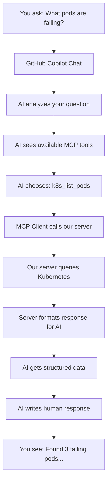
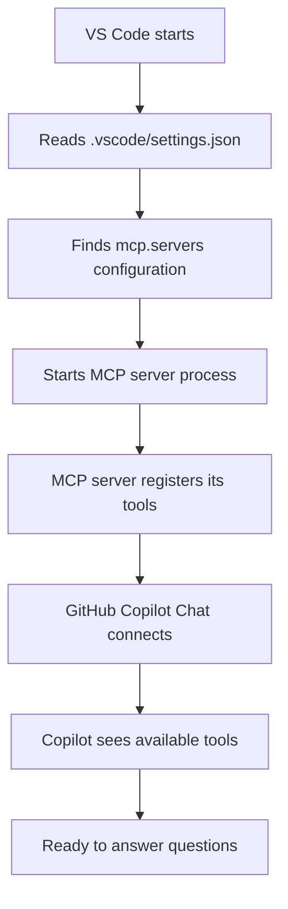

# Chapter 5: VS Code & GitHub Copilot Integration

*How to ask GitHub Copilot Chat questions and let AI automatically choose the right Kubernetes tools*

## 📚 Support This Work

[](https://github.com/sponsors/hoalongnatsu)

> Consider [sponsoring this work](https://github.com/sponsors/hoalongnatsu) or check out my book [&#34;PromptOps: From YAML to AI&#34;](https://leanpub.com/promptops-from-yaml-to-ai) to help create more AI-powered DevOps resources.

## What We're Building

In this chapter, you'll learn the **magic** of MCP integration: how to ask GitHub Copilot Chat simple questions like "What pods are running in production?" and watch the AI automatically choose and execute the right Kubernetes tools from our MCP server.

> **💡 The Key Insight**: You don't need to remember tool names or parameters. Just ask questions naturally, and the AI figures out what tools to use!

**Example of what you'll be able to do:**

```
You: "Are there any failing pods in the default namespace?"

GitHub Copilot: I'll check the pod status for you using the Kubernetes MCP server.
[AI automatically calls k8s_list_pods tool]
[Returns formatted results showing pod status]

Based on the cluster data, I found 2 pods with issues:
- web-app-xyz: CrashLoopBackOff 
- api-server-abc: Pending (insufficient resources)
```

## Learning Objectives

By the end of this chapter, you will understand:

- **How the AI decides** which MCP tools to use based on your questions
- **The exact conversation flow** from your question to tool execution to response
- **How to ask better questions** to get more accurate results
- **How to set up** VS Code so this "magic" works seamlessly

## How It Actually Works - The Complete Flow

Let's understand exactly what happens when you ask a question:



**Step-by-step breakdown:**

1. **Your Question**: You type a natural language question
2. **AI Analysis**: Copilot understands what you're asking for
3. **Tool Selection**: AI sees our MCP tools and picks the right one
4. **Tool Execution**: The chosen tool runs against your cluster
5. **Data Processing**: Results are formatted for AI understanding
6. **Human Response**: AI converts technical data into readable answer

## 5.1 Setting Up the Connection - 3 Simple Steps

Let's get this working with minimal setup. You need three things:

### Step 1: Start Your MCP Server

From your terminal in the MCP server directory:

```bash
cd 02-mcp-for-devops/code/04
go run ./cmd/server
```

You'll see output like:

```
INFO[2025-08-06T10:30:15Z] Starting Kubernetes MCP Server
INFO[2025-08-06T10:30:15Z] Connected to Kubernetes cluster
INFO[2025-08-06T10:30:15Z] MCP server listening on stdio
```

**Keep this terminal open** - this is your MCP server running.

### Step 2: Configure VS Code for MCP

Create or update `.vscode/settings.json` in your workspace:

```json
{
  "mcp.servers": {
    "kubernetes": {
      "command": "go",
      "args": ["run", "./cmd/server"],
      "cwd": "${workspaceFolder}/02-mcp-for-devops/code/04"
    }
  }
}
```

**What this does**: Tells VS Code how to connect to your MCP server.

### Step 3: Install GitHub Copilot Extension

In VS Code:

1. Open Extensions (Ctrl+Shift+X)
2. Search for "GitHub Copilot Chat"
3. Install it
4. Sign in with your GitHub account

**That's it!** Now let's understand how GitHub Copilot Chat actually finds your MCP server.

## 5.2 How GitHub Copilot Chat Discovers Your MCP Server

This is the **crucial part** that connects everything together. Here's exactly how GitHub Copilot Chat knows about your MCP server:

### The Discovery Process



### Step-by-Step Discovery

1. **VS Code Startup**: When you open VS Code in your workspace
2. **Configuration Reading**: VS Code reads `.vscode/settings.json`
3. **MCP Server Discovery**: VS Code finds the `mcp.servers` section:
   ```json
   {
     "mcp.servers": {
       "kubernetes": {
         "command": "go",
         "args": ["run", "./cmd/server"],
         "cwd": "${workspaceFolder}/02-mcp-for-devops/code/04"
       }
     }
   }
   ```
4. **Server Process Start**: VS Code automatically runs `go run ./cmd/server`
5. **Tool Registration**: Your MCP server tells VS Code about its available tools:
   - `k8s_list_pods`
   - `k8s_scale_deployment`
   - `k8s_get_pod_logs`
   - etc.
6. **Copilot Connection**: GitHub Copilot Chat connects to VS Code's MCP interface
7. **Tool Availability**: Copilot can now see and use your Kubernetes tools

### Why This Works

**VS Code acts as the bridge** between GitHub Copilot Chat and your MCP server:

```
GitHub Copilot Chat ←→ VS Code MCP Client ←→ Your MCP Server ←→ Kubernetes
```

- **GitHub Copilot Chat**: Doesn't directly connect to your MCP server
- **VS Code MCP Client**: Built into VS Code, manages MCP server connections
- **Your MCP Server**: Provides Kubernetes tools and handles requests
- **Kubernetes**: Your actual cluster that gets queried

### What Happens When You Ask a Question

1. **You type in Copilot Chat**: "What pods are running?"
2. **Copilot analyzes**: Understands you want pod information
3. **Copilot checks available tools**: Sees `k8s_list_pods` from your MCP server
4. **Copilot sends request to VS Code**: "Use k8s_list_pods tool"
5. **VS Code forwards to MCP server**: Calls your Go server
6. **Your server queries Kubernetes**: Gets actual pod data
7. **Response flows back**: Server → VS Code → Copilot → You

### Alternative Configuration Methods

Besides `.vscode/settings.json`, you can also configure MCP servers:

**User Settings (Global)**:
```json
// In VS Code User Settings
{
  "mcp.servers": {
    "kubernetes": {
      "command": "/usr/local/bin/k8s-mcp-server"
    }
  }
}
```

**Workspace Settings (Project-specific)**:
```json
// In .vscode/settings.json (recommended)
{
  "mcp.servers": {
    "kubernetes": {
      "command": "go",
      "args": ["run", "./cmd/server"],
      "cwd": "${workspaceFolder}/02-mcp-for-devops/code/04"
    }
  }
}
```

**Environment Variables**:
```bash
# Set MCP server path
export MCP_SERVER_PATH="/path/to/your/mcp/server"
```

### Troubleshooting the Connection

**If Copilot Chat doesn't see your tools:**

1. **Check VS Code Output**: View → Output → Select "MCP" from dropdown
2. **Verify server is running**: Look for "MCP server listening" message
3. **Check settings syntax**: Ensure JSON is valid in `.vscode/settings.json`
4. **Restart VS Code**: Sometimes needed after configuration changes

**Common Issues:**

❌ **MCP server not starting**:
```json
// Wrong path
"cwd": "./wrong/path"
```

✅ **Correct path**:
```json
// Correct path with workspace variable
"cwd": "${workspaceFolder}/02-mcp-for-devops/code/04"
```

❌ **Tool not found**:
- Server might not be exposing tools correctly
- Check server logs for tool registration errors

✅ **Tools working**:
- You'll see tool calls in the MCP output panel
- Copilot will successfully execute commands

## 5.3 How to Ask Questions - The Magic Starts Here

## 5.2 How to Ask Questions

The beauty of MCP is that you **don't need to learn commands**. Just ask natural questions in GitHub Copilot Chat.

### Opening Copilot Chat

1. In VS Code, press `Ctrl+Shift+I` (or `Cmd+Shift+I` on Mac)
2. This opens the Copilot Chat panel
3. You'll see a text box where you can type questions

### Basic Questions You Can Ask

Here are examples that will automatically use your MCP server:

**Question**: "What pods are running in the default namespace?"

**What happens behind the scenes:**

1. AI sees your question about pods
2. AI looks at available MCP tools
3. AI finds `k8s_list_pods` tool
4. AI calls the tool with namespace="default"
5. Your MCP server queries Kubernetes
6. AI formats the response for you

**You'll see something like:**

```
I'll check the pods in the default namespace for you.

[Tool execution: k8s_list_pods]

Here are the pods currently running in the default namespace:

✅ **nginx-deployment-abc123** - Running (Ready: 1/1)
✅ **redis-server-def456** - Running (Ready: 1/1)  
❌ **webapp-ghi789** - CrashLoopBackOff (Ready: 0/1)

I notice one pod (webapp-ghi789) is failing. Would you like me to get its logs to investigate?
```

### More Example Questions

**"Are there any failing deployments in production?"**

- AI chooses: `k8s_list_deployments`
- Filters for production namespace
- Analyzes status

**"Scale the web-app deployment to 5 replicas"**

- AI chooses: `k8s_scale_deployment`
- Asks for confirmation first
- Executes the scaling

**"Show me logs from the api-server pod"**

- AI chooses: `k8s_get_pod_logs`
- Finds the pod automatically
- Returns formatted logs

## 5.3 Understanding How AI Chooses Tools

This is the **most important concept** to understand. Let's see exactly how the AI decides what to do.

### The AI's Decision Process

When you ask "What pods are failing?", here's the AI's thought process:

```
1. Parse question: User wants pod status information
2. Check available tools:
   - k8s_list_pods ✓ (can get pod status)
   - k8s_scale_deployment ✗ (for scaling, not listing)
   - k8s_get_pod_logs ✗ (for logs, not status)
3. Choose: k8s_list_pods
4. Determine parameters: 
   - namespace: not specified, use "default"
   - filter: look for non-Running status
```

### How Tool Descriptions Help AI Choose

Remember our tool definitions from Chapter 4? The AI uses these descriptions:

```go
{
    Name: "k8s_list_pods",
    Description: "List all pods in a namespace with their current status",
    // AI sees this and knows: "This tool is for getting pod information"
}

{
    Name: "k8s_scale_deployment", 
    Description: "Scale a Kubernetes deployment to specified replicas",
    // AI sees this and knows: "This tool is for changing deployment size"
}
```

**The more descriptive your tool descriptions, the better the AI chooses!**

### When AI Asks for Clarification

Sometimes the AI needs more information:

**You ask**: "Scale the deployment"
**AI responds**: "I can help you scale a deployment. Which deployment would you like to scale, and to how many replicas?"

**You ask**: "Get logs"
**AI responds**: "I can get logs for you. Which pod would you like logs from, and from which namespace?"

This happens when:

- Required parameters are missing
- Multiple options are possible
- The action could be destructive

## 5.4 Real Conversation Examples

Let's walk through actual conversations showing the complete flow:

### Example 1: Investigating a Problem

**You**: "I'm seeing errors in production, can you help me investigate?"

**GitHub Copilot**: "I'll help you investigate the production issues. Let me start by checking the overall status of your production environment.

[Executing: k8s_list_pods with namespace="production"]

I found several issues in your production namespace:

🔴 **Critical Issues:**

- `user-service-abc123`: CrashLoopBackOff (restarted 15 times)
- `payment-api-def456`: Error (ImagePullBackOff)

🟡 **Warnings:**

- `web-frontend-ghi789`: Running but high memory usage

Would you like me to:

1. Get detailed logs from the failing pods?
2. Check the deployment configurations?
3. Look at recent events in the namespace?"

**You**: "Yes, get logs from the user-service pod"

**GitHub Copilot**: "I'll get the logs from the failing user-service pod.

[Executing: k8s_get_pod_logs with pod="user-service-abc123", namespace="production"]

Here are the recent logs showing the error:

```
2025-08-06 10:45:23 ERROR: Failed to connect to database
2025-08-06 10:45:23 ERROR: Connection timeout after 30s
2025-08-06 10:45:23 FATAL: Application shutting down
```

The issue appears to be a database connectivity problem. The pod can't reach the database and times out after 30 seconds.

Would you like me to:

1. Check if the database service is running?
2. Verify the service endpoints?
3. Look at network policies that might block the connection?"

### Example 2: Scaling During Traffic Spike

**You**: "We're getting a traffic spike, can you scale up our web servers?"

**GitHub Copilot**: "I can help scale up your web servers for the traffic spike. Let me first check the current state of your deployments to recommend the right scaling approach.

[Executing: k8s_list_deployments]

Current deployment status:

📊 **Web Services:**

- `web-frontend`: 3 replicas (all running)
- `api-gateway`: 2 replicas (all running)
- `user-service`: 1 replica (running)

Based on typical traffic patterns, I recommend:

- Scale `web-frontend` from 3 to 8 replicas
- Scale `api-gateway` from 2 to 5 replicas
- Scale `user-service` from 1 to 3 replicas

Should I proceed with these scaling recommendations?"

**You**: "Yes, scale them up"

**GitHub Copilot**: "I'll scale up your services now to handle the traffic spike.

[Executing: k8s_scale_deployment with name="web-frontend", replicas=8]
[Executing: k8s_scale_deployment with name="api-gateway", replicas=5]
[Executing: k8s_scale_deployment with name="user-service", replicas=3]

✅ Scaling completed successfully:

- `web-frontend`: 3 → 8 replicas (scaling in progress)
- `api-gateway`: 2 → 5 replicas (scaling in progress)
- `user-service`: 1 → 3 replicas (scaling in progress)

The new pods are starting up. It should take about 1-2 minutes for all replicas to be ready. Would you like me to monitor the scaling progress?"

## 5.5 Advanced Question Patterns

Once you understand the basics, you can ask more sophisticated questions:

### Compound Questions

**"What pods are failing and why?"**

- AI uses `k8s_list_pods` to find failing pods
- Then uses `k8s_get_pod_logs` to get error details
- Analyzes logs to determine root cause

**"Scale down all non-essential services during maintenance"**

- AI uses `k8s_list_deployments` to see all services
- Asks which services are non-essential
- Uses `k8s_scale_deployment` for each one

### Context-Aware Questions

**"The user-service is using too much memory, what should I do?"**

- AI understands "user-service" refers to a specific deployment
- Uses `k8s_list_pods` to check current resource usage
- Suggests scaling or resource limit adjustments
- Can execute scaling with your approval

### Troubleshooting Workflows

**"Our website is down, help me debug it"**

- AI creates a systematic debugging approach:
  1. Check ingress and load balancer status
  2. Verify backend services are running
  3. Check pod health and logs
  4. Analyze recent deployments or changes
  5. Suggest fixes based on findings

## 5.6 Understanding What's Happening Behind the Scenes

For developers who want to understand the technical details:

### The MCP Protocol Flow

```
1. You type: "What pods are running?"

2. GitHub Copilot analyzes your message and determines:
   - Intent: Get information about pods
   - Required action: List pods
   - Namespace: Not specified (default to "default")

3. Copilot looks at available MCP tools and sees:
   - Tool name: "k8s_list_pods"
   - Description: "List all pods in a namespace with their current status"
   - Required parameters: namespace (optional, defaults to "default")

4. Copilot constructs MCP call:
   {
     "method": "tools/call",
     "params": {
       "name": "k8s_list_pods",
       "arguments": {
         "namespace": "default"
       }
     }
   }

5. Your MCP server receives the call and:
   - Validates the namespace parameter
   - Calls Kubernetes API: kubectl get pods -n default
   - Formats results as markdown for AI consumption
   - Returns structured response

6. Copilot receives formatted data and creates human response:
   "Here are the pods currently running in the default namespace..."
```

### Tool Selection Logic

The AI chooses tools based on:

1. **Keywords in your question**:

   - "pods" → likely `k8s_list_pods` or `k8s_get_pod_logs`
   - "scale" → likely `k8s_scale_deployment`
   - "logs" → likely `k8s_get_pod_logs`
2. **Action verbs**:

   - "show", "list", "get" → read operations
   - "scale", "restart", "delete" → write operations
3. **Context clues**:

   - "failing pods" → list pods and filter by status
   - "scale to 5" → scale operation with specific replica count
4. **Tool descriptions and parameters**:

   - AI reads our tool descriptions to understand what each tool does
   - Checks required vs optional parameters
   - Matches your question to the most appropriate tool

## 5.7 Making Your Questions More Effective

### Be Specific About Scope

❌ **Vague**: "Check the pods"
✅ **Better**: "Check pods in the production namespace"
✅ **Best**: "Show me any failing pods in production and their error logs"

### Include Context When Needed

❌ **Unclear**: "Scale it up"
✅ **Better**: "Scale the web-app deployment up"
✅ **Best**: "Scale the web-app deployment to 5 replicas because we're expecting high traffic"

### Ask Follow-up Questions

**Good pattern:**

1. "What's the status of my production environment?"
2. "Get logs from that failing pod"
3. "What's causing the CrashLoopBackOff?"
4. "Scale down that deployment temporarily while we fix it"

### Use Natural Language

You don't need to memorize commands or syntax:

❌ **Don't do this**: "k8s_list_pods namespace=production"
✅ **Do this**: "Show me all pods in production"

❌ **Don't do this**: "k8s_scale_deployment name=web-app replicas=3"
✅ **Do this**: "Scale the web-app to 3 replicas"

## Summary

In this chapter, you learned the **core concept** of MCP integration: **natural conversation with automatic tool selection**.

### Key Takeaways

✅ **No Commands to Remember**: Just ask questions naturally
✅ **AI Chooses Tools**: The AI automatically picks the right Kubernetes operations
✅ **Real Cluster Data**: Every response uses live data from your cluster
✅ **Conversational Flow**: Ask follow-up questions to dive deeper
✅ **Safety First**: AI asks for confirmation on destructive operations

### The Magic Formula

```
Your Natural Question + AI Tool Selection + Live Cluster Data = Intelligent Response
```

### What You Can Do Now

- **Ask any Kubernetes question** and get answers with real data
- **Perform operations** like scaling and restarting through conversation
- **Debug issues** with AI-guided investigation workflows
- **Learn as you go** - AI explains what it's doing and why

### Real-World Impact

Instead of remembering kubectl commands and switching between terminals, you can now:

```
You: "Are there any issues in production?"
AI: [Checks everything automatically]
AI: "Found 2 issues: pod X is failing, deployment Y needs scaling"

You: "Fix the scaling issue"  
AI: [Scales automatically]
AI: "Scaled deployment Y from 2 to 5 replicas, monitoring progress"
```

This is the power of MCP: **turning complex infrastructure management into simple conversations**.

### Next Steps

Now that you understand how to use MCP with GitHub Copilot, let's secure it for production use:

**Next**: [Chapter 6: Authentication &amp; Security](06-authentication-security.md) - Learn how to add proper authentication, authorization, and audit logging to make your MCP server enterprise-ready.

## Summary

In this chapter, we've transformed our MCP server from a standalone tool into a fully integrated development environment. The combination of VS Code, GitHub Copilot, Claude, and our Kubernetes MCP server creates a powerful AI-assisted DevOps workflow.

### Key Achievements

✅ **Seamless Integration**: VS Code automatically connects to our MCP server
✅ **AI-Enhanced Workflows**: Custom Copilot commands for Kubernetes operations
✅ **Team Collaboration**: Shared configurations and standardized processes
✅ **Intelligent Debugging**: AI-guided troubleshooting with live cluster data
✅ **Automated Documentation**: Self-documenting investigation processes

### What You've Built

- **Complete IDE Integration** with MCP server connectivity
- **Custom AI Commands** for Kubernetes-specific operations
- **Team Workspace Configuration** for consistent development environments
- **Automated Workflows** for common DevOps tasks
- **Intelligent Context Sharing** between code and infrastructure

### Real-World Impact

Your development team can now:

- **Debug Kubernetes issues** without leaving the IDE
- **Deploy applications** with AI-generated best practices
- **Scale operations** with intelligent recommendations
- **Share knowledge** through standardized AI-assisted workflows
- **Accelerate learning** with guided problem-solving approaches

### Next Steps

With our integrated development environment complete, we're ready to tackle enterprise-grade concerns:

**Next**: [Chapter 6: Authentication &amp; Security](06-authentication-security.md) - Learn how to secure your MCP server for production use with enterprise authentication, authorization, and audit logging.

The integration we've built provides the foundation for secure, scalable, and maintainable AI-powered DevOps workflows. In the next chapter, we'll make it enterprise-ready with proper security controls.
