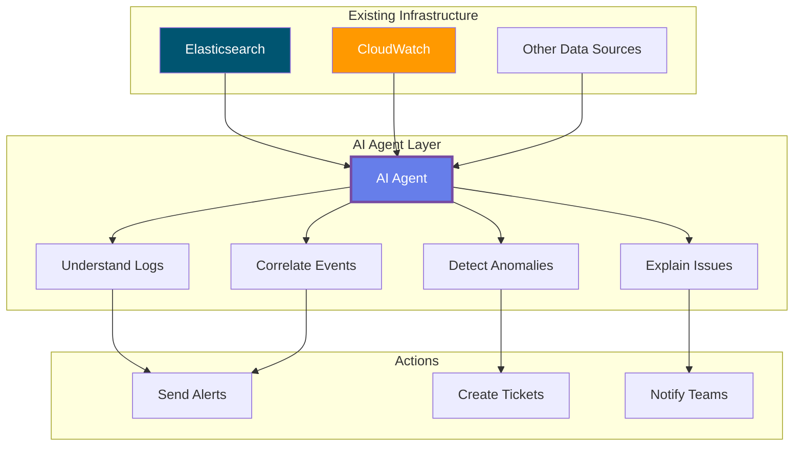
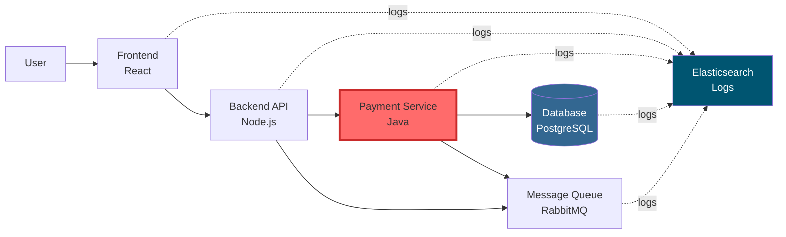
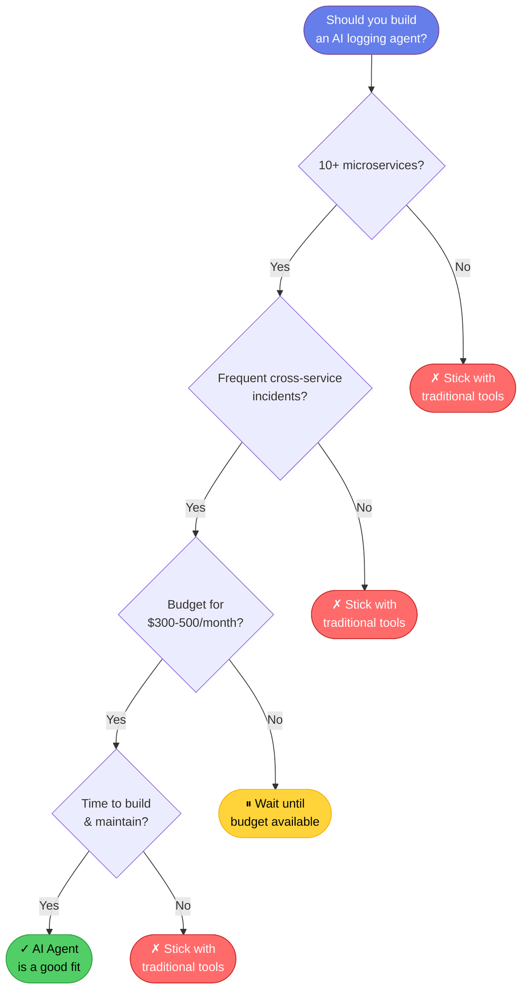
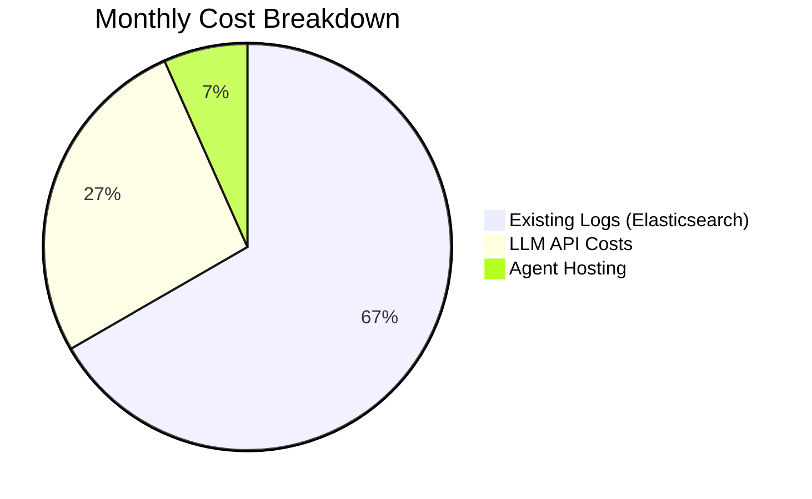
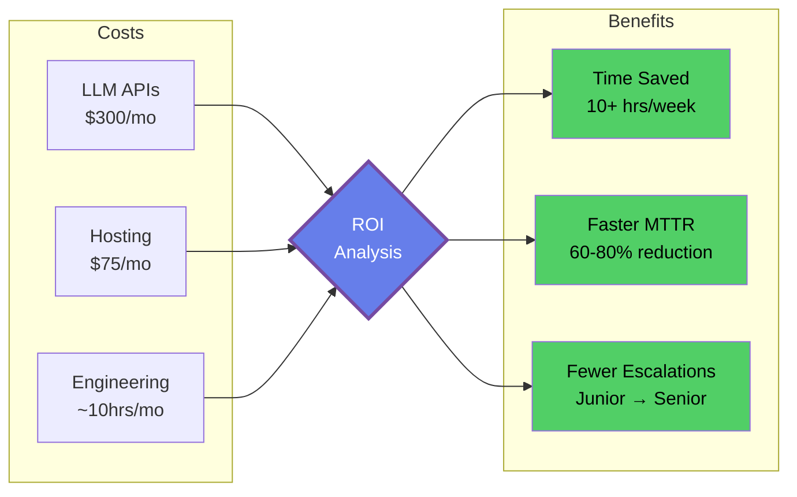
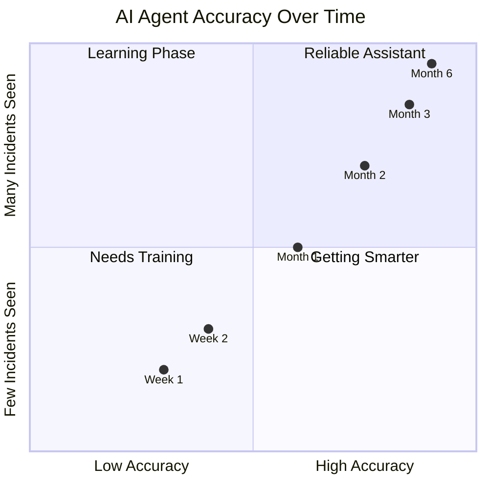
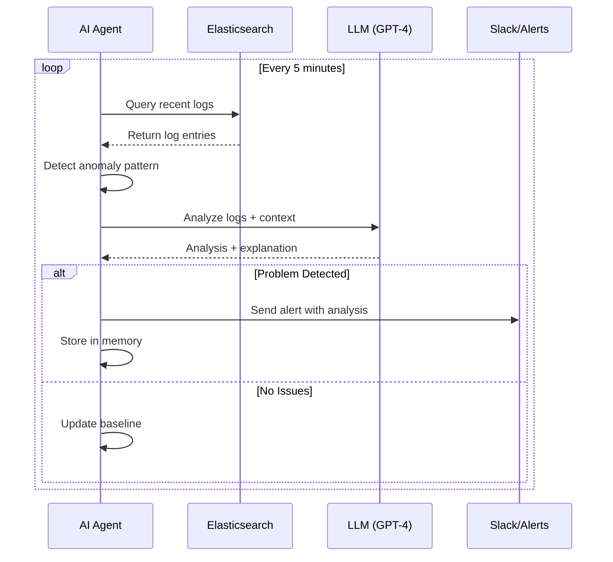

# Chapter 1: Introduction to AI Agents for Logging

## What is an AI Agent?

An AI agent is a piece of software that can think, learn, and act on its own. In the world of DevOps, an AI agent for logging reads your log files, understands what's happening in your systems, and helps you find and fix problems faster.

Think of it like having a smart assistant who watches your application logs 24/7. This assistant doesn't just search for keywords—it actually understands what your logs mean. When something goes wrong, it can connect the dots across different services and tell you what's really happening.

Here's what makes an AI agent different from regular scripts:

- It reads logs like a human would, understanding the meaning behind error messages
- It spots patterns and connections you might miss
- It learns what "normal" looks like in your system
- It can explain its findings in plain language
- It remembers past problems and uses that knowledge to solve new ones

## The Problem with Traditional Tools

Let's be honest: tools like Kibana, Datadog, and Splunk are excellent. They collect your logs, make them searchable, and show you nice dashboards. So why would you need anything else?

The answer is simple. These tools show you data, but they don't understand it.

### What You Still Have to Do Manually

When something breaks in production, here's what typically happens:

1. You get an alert that something is wrong
2. You open your logging tool
3. You search through logs trying to figure out what happened
4. You check different services one by one
5. You try to connect events across multiple systems
6. Eventually, after 30 minutes to a few hours, you find the root cause

The problem isn't the tool—it's that you need to know what to look for. You need to:

- Write the right search queries
- Know which services to check
- Understand how different errors relate to each other
- Remember similar problems from the past
- Manually connect events across your microservices

This takes time and experience. A junior engineer might struggle for hours on something a senior engineer would spot in minutes.

## How AI Agents Help

An AI agent sits on top of your existing logging infrastructure. It connects to tools like Elasticsearch or AWS CloudWatch and analyzes the logs that are already there. You're not replacing your logging system—you're adding intelligence to it.



**Figure 1.1:** AI Agent Architecture - The agent connects to existing log sources and adds an intelligence layer on top.

### What AI Does Better

Here are the specific ways AI improves log analysis:

**Understanding Natural Language**

Developers write log messages in plain English. "Connection timeout after 30 seconds" and "Failed to connect within timeout period" mean the same thing, but traditional tools treat them as different strings.

An AI agent understands both messages mean the same problem. It groups related errors together automatically, even when they're worded differently.

**Connecting Events Across Services**

Modern applications have many moving parts. A single user request might touch 10 different services. When something fails, the root cause might be three services away from where you see the error.

Traditional tools can search across all your logs, but you have to manually figure out which events are related. An AI agent does this automatically. It tracks how your services talk to each other and connects related problems.

**Finding Unknown Problems**

With traditional tools, you can only alert on problems you know about. You write a rule: "Alert me if error rate goes above 5%." But what about problems you haven't seen before?

An AI agent learns what normal behavior looks like for your system. When something unusual happens—even if you never wrote a rule for it—the agent notices and tells you.

**Remembering Past Incidents**

When you solve a problem, that knowledge usually lives in a postmortem document or someone's memory. If the same problem happens again months later, you might not remember the solution.

An AI agent remembers past incidents. When it sees similar patterns, it can tell you: "This looks like the database connection issue from March that was caused by a configuration change."

## A Real Example

Let me show you a concrete scenario where AI makes a real difference.

### The Scenario

You run an online store. The customers are reporting that checkout is slow. You have logs flowing into Elasticsearch from:

- Frontend (React app)
- Backend API (Node.js)
- Payment service (Java)
- Database (PostgreSQL)
- Message queue (RabbitMQ)



**Figure 1.2:** Microservices Architecture - The payment service (highlighted) is the source of the problem, but symptoms appear across all services.

### Without AI: Manual Investigation

You wake up to the alert and open Kibana.

First, you search for "checkout" errors. No obvious errors—everything returns 200 OK.

You check your dashboard. Response times have been climbing for the past 2 hours. But that doesn't tell you why.

You search the payment service logs. Transactions are completing successfully. Nothing looks wrong here.

You check the database logs. The connection pool is at 80%. That's high, but not at the limit yet. Is this the problem? You're not sure.

You search for "timeout" across all services. Now you find scattered timeout errors in different places. Are they related? You start piecing it together.

After 30 minutes, you figure it out:

- The payment service has a slow memory leak
- This causes occasional database connection timeouts
- The payment service retries failed transactions
- These retries create more messages in the queue
- The queue builds up
- The backend waits on the payment service
- The frontend times out waiting on the backend

Root cause: memory leak in the payment service. You restart it and everything recovers.

### With AI: Automatic Analysis

Same scenario, but now you have an AI agent connected to your Elasticsearch.

The agent has been watching your logs continuously. It notices:

- Payment service response times slowly increasing
- Database connection pool usage rising at the same rate
- Retry patterns appearing in queue messages
- Memory usage in payment service containers growing

The agent recognizes this pattern. It's seen similar resource leak signatures before. Instead of waiting for everything to break, it alerts you 10 minutes after symptoms start:

```
Alert: Resource Leak Detected
Service: payment-service
Confidence: 85%

What's happening:
Payment service is not releasing database connections properly.
This is causing cascading delays across dependent services.

Evidence:
- Payment service p95 latency up 40% over 2 hours
- DB connection pool usage rising in sync with latency
- Retry patterns in queue indicate connection failures
- Memory usage trending upward in payment-service pods
- Similar pattern seen in incident from September 15

Affected services:
- payment-service (primary)
- api-backend (secondary)
- frontend (tertiary)

What to do:
1. Restart payment-service pods immediately
2. Check recent code changes in DB connection handling
3. Review connection pool configuration
```

You restart the payment service based on the recommendation. Problem solved.

### The Difference

The AI didn't do anything magical. You would have figured out the problem eventually. The difference is speed and clarity.

The AI agent:
- Connected logs across multiple services automatically
- Recognized the pattern from past incidents
- Explained the problem in plain language
- Suggested specific actions to take

This is where AI adds real value—not by replacing your tools, but by doing the analysis work faster than you can manually.

## When AI Actually Helps

AI for logging isn't right for everyone. Let's be specific about when it makes sense.



**Figure 1.4:** Decision Tree - Use this flowchart to determine if an AI logging agent makes sense for your situation.

### Good Use Cases

**You Have Many Microservices**

If you have 10+ services that talk to each other, tracking problems across service boundaries gets hard. The more services you have, the more valuable automatic correlation becomes.

**Incidents Involve Multiple Services**

When problems span multiple services, finding the root cause takes time. If this happens weekly or more, AI can significantly reduce investigation time.

**You Get Unexpected Problems**

If you frequently encounter issues you haven't seen before, AI's ability to detect unusual patterns helps. Traditional alerts only catch known problems.

**Your Team is Growing**

New team members don't have the experience to quickly diagnose issues. An AI agent helps level the playing field by providing context and guidance.

**You Want Faster Resolution**

If reducing mean time to resolution (MTTR) is important for your business, AI can cut investigation time by 60-80%.

### When to Stick with Traditional Tools

**Your System is Simple**

If you have 5 or fewer services with straightforward interactions, manual correlation is fast enough. The extra complexity isn't worth it.

**Your Alerts Work Well**

If your current alerting catches problems quickly and false positives are rare, you might not need AI. Don't fix what isn't broken.

**Budget is Tight**

AI costs money (more on this below). If budget is limited and incidents are rare, spend your money elsewhere.

**You Don't Have Time to Build**

Building an AI agent properly takes weeks. If you can't commit that time, don't start.

## The Honest Trade-offs

Let's talk about the downsides, because there are real costs and limitations.

### Cost

Running an AI agent costs money in several ways:

**LLM API Costs**

Using services like OpenAI's GPT-4 or Anthropic's Claude costs money per request. Depending on your log volume, expect $200-500 per month for a medium-sized system.

**Hosting**

The agent needs to run somewhere. This adds $50-100 per month for compute resources.

**Your Time**

Building and tuning the agent takes several weeks of engineering time upfront, plus ongoing maintenance.

**Total Cost Example**

Here's what it might look like for a typical setup:

- Existing logging (Elasticsearch/Kibana): $500-1000/month (you already pay this)
- AI agent LLM costs: $300/month (new)
- AI agent hosting: $75/month (new)
- Engineering time: 4-6 weeks initial + 5 hours/month maintenance

Is this worth it? Do the math on your team's time. If you're spending 10+ hours per week investigating incidents, the ROI is clear. If incidents are rare, it's harder to justify.



**Figure 1.5:** Cost Distribution - Most cost is your existing logging infrastructure. AI adds about 33% to monthly costs.



**Figure 1.6:** ROI Analysis - Weigh costs against time savings and faster incident resolution.

### Complexity

An AI agent is another system to maintain. It can break. It needs monitoring. It requires updates. And here's the important part—you can't remove your existing monitoring. The AI is supplementary, not a replacement.

This means more infrastructure, not less.

### Not Perfect

AI agents make mistakes. You'll see:

**False Positives**

The agent might flag things as problems when they're actually fine. Especially in the first few weeks while it's learning your system.

**False Negatives**

Sometimes the agent misses real problems. It's not foolproof.

**Wrong Explanations**

The agent might correlate things that aren't actually related. It can sound very confident about incorrect conclusions.

**Unusual Patterns**

When something truly novel happens, the agent might struggle to make sense of it.

You need human oversight. Think of the AI as a junior engineer—helpful and fast, but you should verify its conclusions before taking major actions.



**Figure 1.7:** AI Learning Curve - The agent gets more accurate as it learns your system's normal patterns.

### When Not to Use AI

Don't build an AI agent if:

- Your logging needs are simple and well-handled
- You rarely have production incidents
- Your team is too small to maintain another system
- You're just chasing the AI hype
- You expect it to solve all problems automatically

## What You'll Build in This Series

By the end of this series, you'll have a working AI logging agent. Not a toy—something you can run against real production logs.

### How It Works

The agent connects to your existing log infrastructure:

```python
# Connect to your existing logs
agent = LoggingAgent()

agent.add_datasource(
    type="elasticsearch",
    host="logs.company.com",
    indices=["app-*", "service-*"]
)

agent.add_datasource(
    type="aws_cloudwatch",
    region="us-east-1",
    log_groups=["/aws/lambda/*"]
)

# Start analyzing
agent.start()
```

We're not building a log collector. You already have Elasticsearch or CloudWatch doing that job. We're building the intelligence layer on top.

### What the Agent Does

**Pulls Logs**

The agent queries your existing log systems at regular intervals, just like you would manually.

**Analyzes Patterns**

It uses AI to understand what the logs mean and identify patterns.

**Correlates Events**

It connects related events across different services.

**Detects Anomalies**

It flags unusual behavior, even without explicit rules.

**Explains Findings**

Instead of just alerting, it explains what's happening and why.

**Takes Action**

It can create tickets, send notifications, or trigger other workflows.



**Figure 1.8:** Agent Operation Flow - The agent continuously monitors logs, analyzes patterns, and alerts when issues are detected.

### What You'll Learn

Building this agent teaches you:

**AI Fundamentals**

How large language models work, how to use them effectively, and how to manage costs.

**Agent Design**

How to build systems that can reason and act autonomously.

**Data Integration**

How to connect to Elasticsearch, CloudWatch, and other log sources properly.

**Pattern Recognition**

How to teach AI to identify what matters in your logs.

**Production Skills**

Error handling, cost optimization, monitoring, and reliability.

---

Let's get started.
