# Chapter 2: AI Agents vs. Traditional Tools

## Understanding the Landscape

Before you build an AI logging agent, you need to know where it fits in your existing setup. You already have scripts, you probably use Elasticsearch or Splunk, and now you're looking at adding AI to the mix.

This chapter shows you the real differences between these approaches. More importantly, you'll learn the specific pieces that make an AI agent work and how they fit together.

## The Three Approaches to Log Analysis

You have three basic options when it comes to handling logs. Let me show you what each one does and where it falls short.

### Basic Scripts

Most teams start here. You write a Python or Bash script that searches log files for specific keywords, counts how many errors you're seeing, and sends an email when certain patterns show up.

**Example:**
```python
# Simple log monitoring script
def check_logs():
    with open('/var/log/app.log', 'r') as f:
        for line in f:
            if 'ERROR' in line and 'database' in line:
                send_alert("Database error found!")
```

Scripts are simple to write, they don't need external dependencies, and you have complete control over the logic. But they only find what you explicitly program them to find. They don't learn or adapt. When your log format changes, they break. And they can't handle complex patterns that span multiple services.

### Traditional Logging Tools (ELK, Splunk, Datadog)

These are the enterprise-grade platforms that collect logs from all your services, index and store them efficiently, provide search and visualization, and support alerting rules.

**Example workflow:**
```
1. Logs → Filebeat → Elasticsearch
2. Create dashboard in Kibana
3. Set alert: if error_count > 100, notify team
4. When alert fires, manually investigate
```

These tools are battle-tested and reliable. They handle massive log volumes, provide great search and visualization, and do real-time monitoring. But here's the catch: you still define all the rules. They don't automatically correlate issues across services. They can't understand context or meaning. They're limited to patterns you already know about.

### AI Agents

An AI agent is different. It connects to your existing log infrastructure, uses AI models to actually understand what the logs are saying, automatically correlates events across services, learns what normal patterns look like, and explains what it finds in plain language.

**Example workflow:**
```
1. Agent pulls logs from Elasticsearch
2. AI analyzes: "Payment service errors correlate with 
   database connection pool exhaustion"
3. Agent explains: "Memory leak in payment service causing
   cascading failures. Similar to incident on Sept 15."
4. Recommends: "Restart payment service, review recent changes"
```

This is where things get interesting. AI agents find issues you didn't anticipate. They understand context and relationships between services. They learn from past incidents. Investigation time drops significantly—what used to take 45 minutes might take 10.

But there are trade-offs. They're more complex to build and maintain. They cost money for the LLM API calls. They're not 100% accurate. And you still need human oversight to catch when they get things wrong.

**Basic Scripts:**


**Traditional Tools (ELK/Splunk):**


**AI Agents:**


**Figure 2.1:** Three Approaches - Each approach has different capabilities and complexity.

## Core Components of an AI Agent

An AI agent isn't magic. It's built from six specific pieces that you can understand and implement yourself. Let me break down each one.


**Figure 2.2:** Six Core Components - Every AI agent is built from these building blocks.

### 1. Role

Think of the role as the agent's job description. It defines what your agent is and what it's responsible for. It sets the context for everything the agent does.

**Example role definition:**
```python
role = """
You are a DevOps log analyst. Your job is to monitor application 
and system logs, identify problems, and explain root causes.

You have access to logs from multiple services and past incident data.
You understand log formats, common error patterns, and how services 
interact with each other.
"""
```

That's it. Not complicated, but it matters. The role gives the agent context about what it is and what it should focus on.

For our logging agent, the role covers monitoring logs from multiple sources, understanding DevOps terminology and patterns, identifying anomalies and correlations, and explaining findings clearly.

### 2. Focus and Tasks

The role says what the agent is. Tasks say what it actually does.

**Example tasks:**
```python
tasks = [
    "Check logs every 5 minutes for error patterns",
    "Correlate errors across frontend, backend, and database",
    "Compare current behavior to historical patterns",
    "When anomaly detected, identify root cause",
    "Generate clear explanation with evidence",
    "Suggest remediation actions"
]
```

Be specific here. "Monitor logs" is too vague. "Check logs every 5 minutes for error patterns" is clear. The more specific your tasks, the better your agent performs.

### 3. Tools

Tools are the functions your agent can call to actually do things—query databases, check metrics, send alerts. The agent decides which tools to use and when. This is where the AI adds value, because it figures out which tool makes sense for each situation.

**Example tools for a logging agent:**

```python
# Tool 1: Query Elasticsearch
def query_elasticsearch(index, query, time_range):
    """Search logs in Elasticsearch"""
    return elasticsearch_client.search(
        index=index,
        body=query,
        time_range=time_range
    )

# Tool 2: Get service metrics
def get_service_metrics(service_name, metric_type):
    """Retrieve metrics like CPU, memory, error rate"""
    return metrics_api.get(service_name, metric_type)

# Tool 3: Check past incidents
def search_incidents(keywords):
    """Find similar past incidents"""
    return incident_db.search(keywords)

# Tool 4: Send alert
def send_alert(severity, message, evidence):
    """Send alert to Slack or PagerDuty"""
    return alert_system.send(severity, message, evidence)
```

You give the agent a toolbox. When it encounters a problem, it picks the right tool for the job.


**Figure 2.3:** Tool Selection - Agent decides which tools to use based on the situation.

### 4. Memory

Memory lets the agent remember things—both from the current investigation and from the past. Without memory, the agent starts from scratch every time. With it, the agent learns.

**Two types of memory:**

Short-term memory is what's happening right now—the current conversation or analysis session. Long-term memory is historical context—past incidents, learned patterns, and what normal behavior looks like.

**Short-term memory:** Current conversation or analysis session
```python
# Example short-term memory
current_session = {
    "logs_analyzed": [...],
    "patterns_found": [...],
    "hypotheses": [...],
    "tools_used": [...]
}
```

**Long-term memory:** Past incidents, learned patterns, historical context
```python
# Example long-term memory
knowledge_base = {
    "past_incidents": [
        {
            "date": "2024-09-15",
            "issue": "Database connection leak",
            "symptoms": ["timeouts", "pool exhaustion"],
            "solution": "Restart service, fix connection handling"
        }
    ],
    "normal_patterns": {
        "payment_service": {
            "avg_response_time": 150,
            "error_rate": 0.1
        }
    }
}
```

This is what lets the agent say things like: "This looks like the incident from September 15." It's connecting past knowledge to present problems.


**Figure 2.4:** Memory Types - Short-term for current session, long-term for historical knowledge.

### 5. Guardrails

Guardrails stop the agent from doing harmful or expensive things. An AI agent without proper guardrails can spam your team with alerts, rack up a huge API bill, give you wrong information with complete confidence, or try to take actions you didn't intend.

You need guardrails.

**Example guardrails:**

```python
guardrails = {
    # Don't restart production services automatically
    "no_auto_restart": True,
    
    # Always require human approval for destructive actions
    "require_approval_for": ["restart", "deploy", "delete"],
    
    # Limit how many API calls the agent can make per minute
    "rate_limit": {
        "elasticsearch": 10,
        "metrics_api": 20
    },
    
    # Don't send more than 5 alerts in 10 minutes
    "alert_throttle": {
        "max_alerts": 5,
        "time_window": 600  # seconds
    },
    
    # Validate all outputs before sending
    "output_validation": True
}
```

These checks run before every action. Rate limits prevent API spam. Alert throttles prevent notification fatigue. Approval requirements prevent destructive actions. Validation catches bad outputs before they go anywhere.

```mermaid
graph LR
    Agent[Agent Action] --> G{Guardrails<br/>Check}
    
    G -->|Rate limit OK?| G2{Alert throttle OK?}
    G2 -->|Safe action?| G3{Valid output?}
    G3 -->|Pass| Allow[✓ Allow Action]
    
    G -->|Too many calls| Block[✗ Block Action]
    G2 -->|Too many alerts| Block
    G3 -->|Invalid| Block
    
    style G fill:#ffd43b,stroke:#fab005,color:#000
    style G2 fill:#ffd43b,stroke:#fab005,color:#000
    style G3 fill:#ffd43b,stroke:#fab005,color:#000
    style Allow fill:#51cf66,stroke:#2f9e44,color:#000
    style Block fill:#ff6b6b,stroke:#c92a2a,color:#fff
```



**Figure 2.5:** Guardrails in Action - Multiple safety checks before allowing actions.

### 6. Cooperation (Optional)

In more advanced setups, you can have multiple agents work together, each with a specialized role. One agent might parse logs, another finds patterns, a third determines root cause, and a fourth communicates the results.

**Example multi-agent setup:**

```python
# Agent 1: Log Parser
log_parser_agent = {
    "role": "Parse and categorize logs",
    "focus": ["Extract structured data", "Identify log types"]
}

# Agent 2: Pattern Analyzer
pattern_agent = {
    "role": "Identify patterns and correlations",
    "focus": ["Cross-service correlation", "Trend detection"]
}

# Agent 3: Root Cause Analyzer
root_cause_agent = {
    "role": "Determine root cause of issues",
    "focus": ["Hypothesis generation", "Evidence gathering"]
}

# Agent 4: Communicator
comm_agent = {
    "role": "Explain findings to humans",
    "focus": ["Clear explanations", "Actionable recommendations"]
}
```

For this series, we're building a single agent. That's simpler and works fine for most teams. Once you have that working, you can always split it into multiple specialized agents if you need to scale.

**Single Agent (Simple):**


**Multi-Agent (Advanced):**


**Figure 2.6:** Single vs Multi-Agent - Start simple with one agent, expand to specialists later.

## How the Components Work Together

Now that you know the six pieces, let me show you how they work together when something actually goes wrong.

**Scenario:** Error rate spike in your API service


**Figure 2.7:** Component Flow - How components interact during a real incident.

Here's what happens step by step. Error logs appear—that's the trigger. The agent checks its role and confirms it's responsible for this. It follows its defined tasks. It queries memory to see if it's seen similar patterns before. It finds a past incident that looks related.

Now it needs more information. It uses tools to query Elasticsearch for log details, get metrics to see system health, and search past incidents for solutions. The AI model processes all this data and identifies the pattern. Guardrails validate that the actions are safe. The agent updates its memory with what it learned. Finally, it sends an alert with a clear explanation.

That's the flow. All the components working together, not in isolation.

## Design Patterns for AI Agents

A design pattern is a proven way to solve a common problem. For AI agents, patterns describe how the agent makes decisions and takes actions. Here are the five main patterns you'll see.

### Pattern Overview

```mermaid
graph TB
    Start[Choose a Pattern]
    
    Start --> R[Reflection<br/>Self-check accuracy]
    Start --> T[Tool Use<br/>Gather information]
    Start --> RE[ReAct<br/>Think then act]
    Start --> P[Planning<br/>Multi-step approach]
    Start --> M[Multi-Agent<br/>Specialized agents]
    
    R --> RU[High accuracy needed]
    T --> TU[Multiple data sources]
    RE --> REU[General purpose<br/>⭐ Recommended]
    P --> PU[Complex investigations]
    M --> MU[Large scale systems]
    
    style RE fill:#51cf66,stroke:#2f9e44,color:#000,stroke-width:3px
    style REU fill:#51cf66,stroke:#2f9e44,color:#000
    style Start fill:#667eea,stroke:#764ba2,color:#fff
```



**Figure 2.8:** Design Patterns Overview - ReAct is recommended for most use cases.

### 1. Reflection Pattern

With the reflection pattern, the agent checks its own work before committing to an answer. It analyzes the logs, forms a hypothesis, then stops and asks itself: "Wait, is this actually correct? What evidence contradicts this?"

Maybe it realizes the timeline doesn't match, or the symptoms don't fully align. So it revises its answer to something more accurate. You use this pattern when accuracy matters more than speed.

**How it works:**
```
1. Agent analyzes logs and forms a hypothesis
2. Agent asks itself: "Is this conclusion correct?"
3. Agent checks for contradictory evidence
4. Agent revises hypothesis if needed
5. Agent provides final answer with confidence level
```

**Example:**
```python
# First analysis
hypothesis = "Database connection pool exhausted"

# Reflection
reflection = """
Wait, let me verify this hypothesis:
- Connection pool shows 80% usage, not 100%
- Errors started before pool was stressed
- Timeline doesn't match

Let me reconsider... The connection pool issue is a 
symptom, not the cause. The real issue is the memory 
leak causing timeouts, which then stresses the pool.
"""

# Revised conclusion
conclusion = "Memory leak in payment service causing 
              connection timeouts, leading to pool stress"
```

The agent doesn't just give you its first answer. It double-checks itself and gives you the revised, more accurate conclusion.

**When to use:** When accuracy is more important than speed.


**Figure 2.9:** Reflection Pattern - Agent double-checks its own conclusions.

### 2. Tool Use Pattern

The tool use pattern is about the agent deciding which tools to use based on what it's trying to figure out. You're investigating an error spike. The agent has four tools: query logs, get metrics, check deployments, search past incidents. It picks which ones to use and in what order based on what it learns at each step.

The key is you don't hard-code the sequence. The AI figures it out dynamically.

**How it works:**
```
1. Agent receives a problem
2. Agent considers available tools
3. Agent chooses the right tool(s)
4. Agent uses tools to gather information
5. Agent synthesizes results
```

**Example:**
```python
available_tools = [
    "query_elasticsearch",
    "get_metrics",
    "search_incidents",
    "check_deployments"
]

# Agent reasoning
"""
I need to investigate an error spike. Let me:
1. query_elasticsearch - get recent error logs
2. get_metrics - check if metrics show anomaly
3. check_deployments - see if recent deploy related
4. search_incidents - find similar past issues
"""
```

The agent looks at the problem and picks the right tools to gather the information it needs.

**When to use:** When the agent needs to gather information from multiple sources.


**Figure 2.10:** Tool Use Pattern - Agent gathers data from multiple sources.

### 3. ReAct Pattern (Reasoning + Acting)

ReAct is the pattern I recommend you start with. It's straightforward: the agent alternates between thinking and doing.

The agent thinks about what it needs to know, acts by using a tool, observes what came back, thinks about what that means, acts again with another tool, and keeps going until it solves the problem. This loop of think → act → observe continues until the agent reaches a conclusion.

**How it works:**
```
1. Thought: What do I need to find out?
2. Action: Use a tool to get information
3. Observation: Analyze the result
4. Thought: What does this tell me? What next?
5. Action: Use another tool
... (repeat until solved)
6. Conclusion: Here's what I found
```

**Example:**
```python
# ReAct loop
Thought: "Error rate is high. I need to find out why."
Action: query_elasticsearch("error logs last 10 minutes")
Observation: "Mostly 'InvalidToken' errors in auth service"

Thought: "Token errors. Was there a recent change?"
Action: check_deployments("auth service")
Observation: "Deploy 30 minutes ago changed token expiry"

Thought: "That matches the timeline. Let me confirm."
Action: get_metrics("auth service", "deployment impact")
Observation: "Error rate spiked exactly after deploy"

Conclusion: "Deploy changed token expiry, breaking validation.
             Recommend rollback or config fix."
```

It's simple to implement and works well for most situations. This is your default choice.

**When to use:** Most general-purpose use case. Good default choice.


**Figure 2.11:** ReAct Pattern - Loop of thinking, acting, and observing until solved.

### 4. Planning Pattern

The planning pattern is for complex investigations that need structure. Instead of just jumping in, the agent first creates a plan. It breaks the problem into smaller pieces, figures out the order to tackle them, then executes each step. If something unexpected happens, it can adjust the plan before continuing.

You use this when the investigation is complicated and you want a methodical approach. It's more overhead than ReAct, so only use it when you need that structure.

**How it works:**
```
1. Agent receives a complex problem
2. Agent breaks it into sub-problems
3. Agent creates a step-by-step plan
4. Agent executes each step
5. Agent adjusts plan if needed
```

**Example:**
```python
# Planning for complex investigation
plan = [
    "Step 1: Identify which service is the primary source",
    "Step 2: Get timeline of when problem started",
    "Step 3: Check for correlating events (deploys, config changes)",
    "Step 4: Analyze log patterns for root cause",
    "Step 5: Verify hypothesis with metrics",
    "Step 6: Search for similar past incidents",
    "Step 7: Generate report with recommendations"
]

# Execute plan step by step
for step in plan:
    result = execute_step(step)
    if result.requires_plan_change:
        adjust_plan(result)
```

The agent makes a plan, follows it, and adapts if needed.

**When to use:** For complex, multi-step investigations.


**Figure 2.12:** Planning Pattern - Create a plan, execute steps, adjust if needed.

### 5. Multi-Agent Pattern

The multi-agent pattern uses multiple specialized agents working together. You have a main agent that coordinates, and specialist agents for specific tasks. One parses logs, another finds patterns, a third determines root cause. The main agent brings everything together.

This is the most complex pattern. You only need it for very large systems or when you want different teams handling different parts. For most cases, including what we're building here, a single agent is enough.

**How it works:**
```
1. Main agent receives problem
2. Main agent delegates to specialized agents
3. Each specialist does its job
4. Main agent coordinates and synthesizes results
```

**Example:**
```python
# Main agent delegates
main_agent.delegate("log_parser", task="parse and categorize logs")
main_agent.delegate("pattern_finder", task="find correlations")
main_agent.delegate("root_cause", task="determine cause")

# Specialized agents work
log_parser_result = log_parser_agent.execute()
pattern_result = pattern_agent.execute(log_parser_result)
root_cause_result = root_cause_agent.execute(pattern_result)

# Main agent synthesizes
final_report = main_agent.synthesize([
    log_parser_result,
    pattern_result,
    root_cause_result
])
```

Each specialist does its job, and the main agent synthesizes everything into a final answer.

**When to use:** For very complex systems or when you want specialists for different tasks.


**Figure 2.13:** Multi-Agent Pattern - Main agent coordinates specialists.

## Which Pattern Should You Use?

For our logging agent, we're going with ReAct. Here's why.

ReAct is simple enough that you can understand what's happening at each step. When something goes wrong, you can debug it because you can see the agent's reasoning. It's flexible enough to handle most situations you'll encounter in log analysis. And it's well-supported by AI frameworks, so you're not building everything from scratch.

We're skipping Reflection because it adds complexity you don't need initially. We're skipping Planning because it's overkill for log analysis. And we're skipping Multi-Agent because it's too much for a first project.

You can add any of these later once your basic agent works. Start simple, then expand.

## Putting It All Together

Let me show you how all these pieces connect in a real logging agent.

You have logs coming from Elasticsearch and CloudWatch. The agent has a role—it's a log analyst. It has tasks—monitor and analyze those logs. It uses the ReAct pattern to structure its work. When it needs to act, it has tools for querying logs, getting metrics, searching history, and sending alerts. It has memory to track what it's doing now and what happened in the past. And it has guardrails to make sure it doesn't do anything harmful.

All these components work together. The role and tasks give direction. The ReAct pattern provides structure. The tools enable action. Memory adds context. Guardrails keep it safe.

That's the architecture. Once you see how the pieces fit, it's not that complicated.


**Figure 2.14:** Complete Architecture - All components working together.

## Real-World Example: Complete Flow

Let's walk through a complete scenario so you can see everything working together.

Your API service latency is increasing. Users are complaining. Here's how the agent handles it.

**Scenario:** API service latency increasing

**Agent components:**

```python
# Role
role = "DevOps Log Analyst monitoring system health"

# Tasks
current_task = "Investigate API latency increase"

# Available tools
tools = {
    "query_logs": elasticsearch_query,
    "get_metrics": prometheus_query,
    "check_deployments": deployment_api,
    "search_history": incident_database
}

# Memory
memory = {
    "short_term": {
        "logs_checked": [],
        "metrics_retrieved": [],
        "hypotheses": []
    },
    "long_term": {
        "similar_incidents": [
            "2024-09-15: DB connection leak",
            "2024-08-03: External API timeout"
        ]
    }
}

# Guardrails
guardrails = {
    "max_api_calls": 50,
    "alert_cooldown": 300,  # seconds
    "confidence_threshold": 0.7
}
```

The agent has everything it needs. Now it starts working through the problem using the ReAct pattern.

**ReAct execution:**

```
Thought 1: "API latency is increasing. Let me check recent logs."
Action 1: query_logs(service="api", time="last 30 min")
Observation 1: "Seeing increased wait times for database queries"

Thought 2: "Database might be the bottleneck. Check DB metrics."
Action 2: get_metrics(service="database", metric="query_time")
Observation 2: "Average query time up 300% in last hour"

Thought 3: "Queries are slow. Any recent changes?"
Action 3: check_deployments(service="database")
Observation 3: "No recent database changes"

Thought 4: "Not a deploy. Check if query patterns changed."
Action 4: query_logs(service="api", search="SELECT queries")
Observation 4: "New query without index causing full table scans"

Thought 5: "Found it. Check if we've seen this before."
Action 5: search_history(keywords="query performance index")
Observation 5: "Similar incident on Aug 3: missing index"

Conclusion: "API latency due to unindexed query. Same as Aug 3 incident."
```

The whole investigation took about 2 minutes. A human doing the same thing manually would take 20-30 minutes.

**Visualizing the ReAct Loop:**

**The Problem:**


**Step 1: Check the Logs**


**Step 2: Check Database Metrics**


**Step 3: Check for Changes**
```mermaid
graph LR
    T3[Thought:<br/>Recent deployments?]
    T3 --> A3[Action:<br/>Check deployments]
    A3 --> O3[Observation:<br/>No DB changes]
    
    style T3 fill:#ffd43b,stroke:#fab005,color:#000
    style A3 fill:#4dabf7,stroke:#1c7ed6,color:#000
    style O3 fill:#e9ecef,stroke:#868e96,color:#000
```

**Step 4: Analyze Query Patterns**
```mermaid
graph LR
    T4[Thought:<br/>Query pattern issue?]
    T4 --> A4[Action:<br/>Analyze SQL queries]
    A4 --> O4[Observation:<br/>Missing index!]
    
    style T4 fill:#ffd43b,stroke:#fab005,color:#000
    style A4 fill:#4dabf7,stroke:#1c7ed6,color:#000
    style O4 fill:#e9ecef,stroke:#868e96,color:#000
```

**Root Cause Found:**
```mermaid
graph LR
    Found[✓ Root Cause Identified]
    Found --> Result[Unindexed query<br/>causing full table scans]
    Result --> Action[Recommendation:<br/>Add index to table]
    
    style Found fill:#51cf66,stroke:#2f9e44,color:#000,stroke-width:3px
    style Result fill:#51cf66,stroke:#2f9e44,color:#000
    style Action fill:#51cf66,stroke:#2f9e44,color:#000
```

**Figure 2.15:** ReAct in Action - Each step follows the think→act→observe pattern until the root cause is found.

## What You've Learned

You now understand where AI agents fit compared to scripts and traditional logging tools. Scripts only find what you program them to find. Traditional tools need you to do the analysis. AI agents add intelligence on top of your existing infrastructure.

You know the six components every agent needs. Role defines what it is. Tasks define what it does. Tools let it act. Memory gives it context. Guardrails keep it safe. And cooperation lets multiple agents work together if you need that later.

You learned five design patterns. ReAct is the recommended starting point because it's simple, flexible, and well-supported. You can add the others later if you need them.

And you saw a complete example of how an agent would investigate a real production issue—from detecting high latency to identifying an unindexed query as the root cause in about 2 minutes.

## What's Next

In Chapter 3, we get into the technical details. How large language models work. How to write effective prompts. How to pull logs from Elasticsearch and CloudWatch. Which AI frameworks to use. And how much this all costs.

Then in Chapter 4, we'll set up your development environment and start building.

You understand the concepts. Time to get technical.
