# Chapter 3: Understanding Core AI Building Blocks

> ⭐ **Starring** this repository to support this work

## What You Need to Build an AI Agent

In the last chapter, we talked about what makes AI agents different from scripts and traditional tools. Now it's time to understand the actual pieces you'll work with when building one.

Think of this like learning to cook. Before you make a meal, you need to know what ingredients are available and what each one does. You wouldn't throw flour, sugar, and chicken into a pot and hope for the best. Similarly, before we start coding, you need to understand the building blocks of AI agents.

The good news? There are only a handful of core concepts you need to grasp. Once you understand these, building an AI agent becomes straightforward.


**Figure 3.1:** Core Building Blocks - Seven key components that make up an AI logging agent.

## The AI Model: Your Agent's Brain

At the heart of every AI agent is a language model. This is the part that reads text, understands it, and generates responses.

You've probably used ChatGPT or similar tools. Those interfaces use the same kind of models you'll use in your agent. The difference is that instead of chatting with humans, your model will be analyzing logs and making decisions about your infrastructure.

### How Models Work (The Simple Version)

You don't need to understand neural networks or training algorithms to build an AI agent. What you do need to know is this: a language model is a piece of software that predicts what text should come next based on what it's seen before.

When you give it a log file and ask "What's wrong here?", the model:

1. Reads the log entries
2. Recognizes patterns it learned during training
3. Generates a response based on what makes sense

The basic interaction pattern is straightforward: you send the model a system message (defining its role), a user message (with the logs), and it responds with its analysis. Most AI APIs follow this same conversation pattern, whether you're using OpenAI, Anthropic, or other providers.

The model sees patterns like repeated connection failures and retries, then explains what's happening in plain language. That's all there is to it at the basic level.


**Figure 3.2:** Basic Model Processing - Input goes in, understanding happens, output comes out.

### Choosing Your Model

You have two main options when building an AI agent:

**Cloud APIs (OpenAI, Anthropic, Google)**

These services host the models for you. You send your data over the internet, and they send back the results. This is the easiest way to start because you don't need powerful hardware.

The tradeoff is cost and data privacy. Every API call costs money, and your logs leave your infrastructure. For many companies, especially startups and small teams, this is totally fine. For others with strict security requirements, it's a non-starter.

**Local Models (Llama, Mistral, others)**

You can also run models on your own servers. This keeps your data private and eliminates per-request costs. The downside is you need GPUs or powerful CPUs, and the setup is more complex.

For this series, we'll use Gemini's API because it's the simplest way to learn. Once you understand the concepts, switching to a local model is straightforward—the code structure stays the same.

## Data Retrieval: Getting Logs into Your Agent

Your AI model can't analyze logs it doesn't have. This sounds obvious, but data retrieval is where many projects get stuck. You need a reliable way to pull logs from wherever they live and feed them to your agent.

### Where Your Logs Live

In a typical DevOps environment, logs come from multiple sources:

- Application logs in Elasticsearch
- Container logs from Kubernetes
- System logs in CloudWatch
- Database logs in RDS
- Load balancer logs in S3

Your AI agent needs to connect to these sources, retrieve the relevant logs, and organize them in a way the model can process.


**Figure 3.3:** Data Retrieval Architecture - Logs flow from multiple sources through a retrieval layer to the AI model.

### Building Your Retrieval Layer

The pattern for retrieving logs is similar across all data sources:

1. **Connect** to your log source (Elasticsearch, CloudWatch, etc.)
2. **Define a time range** (last hour, last 5 minutes, etc.)
3. **Filter by criteria** (error level, service name, keywords)
4. **Limit the results** to a manageable number
5. **Extract and format** the log messages

For Elasticsearch, you'd use their Python client to search for logs matching your criteria. For CloudWatch, you'd use boto3 to query log groups. For Kubernetes, you'd use the Kubernetes Python client to fetch pod logs.

The key is building a consistent interface that your agent can use regardless of where the logs come from. You want your agent to call something like `retrieve_logs(source, time_range, filters)` without caring about the underlying implementation.

### Dealing with Volume

One challenge with log retrieval is volume. Your production systems might generate thousands of logs per minute. You can't send all of them to an AI model—it would be slow and expensive.

Instead, you need to filter intelligently:

- Only retrieve logs above a certain severity level (ERROR, WARN)
- Focus on specific time windows (like the last 5 minutes)
- Pull logs from services that are having problems
- Sample logs when volume is high
- Aggregate similar logs together

Your retrieval function should accept parameters for time window and maximum number of logs. Start narrow (5 minutes, 50 logs) and widen the search if you need more context. This keeps your API costs down and your response times fast.

## What Your Agent Needs to Know

Now we get to the pieces that make an agent actually useful. A language model by itself is just a tool—it can analyze whatever you give it. An agent, on the other hand, has a specific purpose and capabilities.

This is where you define what your agent does and how it does it.

### Role: Who Is Your Agent?

The role defines your agent's identity and expertise. It's like giving someone a job title and job description.

For a logging agent, you might define roles like:

- "You are a DevOps engineer specializing in application error analysis"
- "You are a database reliability expert who investigates performance issues"
- "You are a security analyst monitoring for suspicious activity in logs"

The role matters because it influences how the model interprets information. A security-focused agent will look for different patterns than a performance-focused agent, even when analyzing the same logs.

When you initialize your agent, you'll set this role as the system message in your conversation with the AI model. The role becomes the lens through which all log analysis happens.

You might create different agents for different purposes:

- An error analysis agent that focuses on application failures
- A performance agent that looks for slow queries and bottlenecks
- A security agent that monitors for suspicious patterns
- A cost optimization agent that identifies wasteful resource usage

Same underlying model, but the role makes each one specialized for its task.


**Figure 3.4:** Role Specialization - A generic model becomes a specialized agent through role definition.

### Tasks: What Should Your Agent Do?

Tasks are the specific actions your agent performs. While the role defines who the agent is, tasks define what it does.

For a logging agent, common tasks include:

1. Analyze recent error logs
2. Identify patterns across multiple services
3. Correlate errors with deployment events
4. Suggest likely root causes
5. Recommend remediation steps

You can think of tasks as a checklist the agent works through. Each task focuses the agent's attention on a specific aspect of the logs.

When you build your agent, you'll define each task with:
- A name (for identification)
- A description (what the task should accomplish)
- A priority (which order to execute them)

The agent executes tasks in sequence, with each task building on the results of previous ones. The output from "error detection" feeds into "pattern analysis," which feeds into "correlation," and so on.


**Figure 3.5:** Task Pipeline - Tasks execute in sequence, each building on the previous results.

### Tools: How Your Agent Takes Action

Tools are the capabilities you give your agent. They're functions the agent can call to do things beyond just analyzing text.

For a logging agent, useful tools might include:

- Query Elasticsearch for specific log patterns
- Check service health endpoints
- Look up recent deployments
- Create Jira tickets
- Send Slack notifications
- Restart services (with appropriate safeguards)

Each tool is a function your agent can call. You define what the tool does and what parameters it needs. The AI model then decides when to use each tool based on what it discovers in the logs.

For example, if the agent detects database connection errors, it might:
1. Use the `search_logs` tool to find more database-related logs
2. Use the `check_service_health` tool to verify the database is actually down
3. Use the `notify_team` tool to alert the on-call engineer

The tools give your agent hands and feet—they let it do more than just think and analyze.


**Figure 3.6:** Tool Usage Pattern - The agent calls tools when it needs to take action or gather more information.

## Putting It Together: Building Your Logging Agent

Now you understand the core building blocks. Let's see how they work together in a complete agent.

### The Agent Structure

A logging agent typically has this structure:

1. **Initialization**: Set up the role, tasks, and tools
2. **Log Retrieval**: Pull the relevant logs from your data sources
3. **Context Building**: Create the conversation with the AI model, starting with the role
4. **Task Execution**: Run through each task in sequence
5. **Result Compilation**: Gather all findings and recommendations

Each task sees the results of previous tasks, allowing the agent to build a complete picture. The first task might identify errors, the second task finds patterns in those errors, the third task correlates them with other events, and so on.

Your agent class will maintain:
- The role (who it is)
- The tasks (what it does)
- The tools (its capabilities)
- The conversation history (context from the current analysis)
- The AI client (connection to the model)

When you call the agent's main analysis method, it orchestrates all these pieces to produce a comprehensive log analysis.


**Figure 3.7:** Complete Agent Flow - From initialization through execution to output.

### Memory: Remembering Past Analysis

One feature that makes AI agents powerful is memory. Your agent can remember past analyses and use that knowledge to improve future ones.

For a logging agent, memory helps with:

- Recognizing recurring issues
- Tracking whether problems were fixed
- Learning which solutions worked
- Building a knowledge base of your infrastructure

There are different types of memory you can implement:

**Short-term Memory**

This is the conversation history within a single analysis session. Each task sees the results of previous tasks, allowing the agent to build on its own analysis. This is typically just a list of messages that you maintain during the conversation with the AI model.

**Long-term Memory**

This persists across analysis sessions. The agent stores important findings in a database or file and can recall them later. You might store:

- Past incidents and their resolutions
- Recurring error patterns
- Service-specific quirks or known issues
- Solutions that worked in the past

The implementation is straightforward: save key findings to a JSON file or database with timestamps and metadata. When analyzing new logs, check if similar issues exist in memory first.

With memory, your agent gets smarter over time. When it sees an error pattern, it can check if the same pattern appeared before and how it was resolved.


**Figure 3.8:** Memory Usage - The agent checks memory before analyzing new issues.

## Applying the ReAct Pattern to Your Logging Agent

In Chapter 2, we explored five design patterns and chose ReAct as the recommended approach for our logging agent. Now it's time to understand how to actually implement it.

ReAct (Reasoning + Acting) is a loop where your agent alternates between thinking and doing. It thinks about what it needs to know, acts by using a tool, observes what came back, thinks about what that means, and continues until it solves the problem.

This pattern works particularly well for log analysis because debugging is inherently iterative. You don't usually know the root cause immediately—you form hypotheses, gather evidence, and refine your understanding.

### The ReAct Loop Structure

The ReAct pattern has three phases that repeat:

1. **Thought**: The agent reasons about the current situation
2. **Action**: The agent uses a tool to gather more information
3. **Observation**: The agent processes the results

This continues until the agent reaches a conclusion or hits a maximum iteration limit.

```mermaid
graph LR
    Start[Start: Initial Logs] --> T1[💭 Thought 1:<br/>What do I know?]
    T1 --> A1[⚡ Action 1:<br/>Use a tool]
    A1 --> O1[👁 Observation 1:<br/>Process results]
    
    O1 --> T2[💭 Thought 2:<br/>What does this mean?]
    T2 --> A2[⚡ Action 2:<br/>Use another tool]
    A2 --> O2[👁 Observation 2:<br/>Process results]
    
    O2 --> D{Solved?}
    D -->|No| T3[💭 Thought 3:<br/>What else?]
    T3 --> A3[⚡ Action 3]
    A3 --> O3[👁 Observation 3]
    O3 --> D
    
    D -->|Yes| C[✅ Conclusion:<br/>Report findings]
    
    style T1 fill:#ffd43b,stroke:#fab005,color:#000
    style T2 fill:#ffd43b,stroke:#fab005,color:#000
    style T3 fill:#ffd43b,stroke:#fab005,color:#000
    style A1 fill:#4dabf7,color:#000
    style A2 fill:#4dabf7,color:#000
    style A3 fill:#4dabf7,color:#000
    style C fill:#51cf66,stroke:#2f9e44,color:#000
```



**Figure 3.9:** ReAct Loop - Continuous cycle of thinking, acting, and observing.

### Building the Thought Phase

The thought phase is where your agent analyzes what it knows and decides what to do next. You construct a prompt that includes:

- The current situation (logs, errors, metrics seen so far)
- Previous thoughts and actions from earlier iterations
- Available tools the agent can use
- A request for the agent to think step-by-step

The key is structuring the prompt so the agent explicitly states its reasoning. You want to see: "Based on X, I believe Y. To confirm, I should Z."

Your prompt template might look like this:

```
Current Situation:
[Log entries or data from previous observations]

Previous Actions:
[What the agent has done so far]

Available Tools:
- query_logs(service, time_range, level)
- get_metrics(service, metric_name, time_range)
- check_deployments(service, hours_back)
- search_incidents(keywords)

Think step-by-step:
1. What do we know for certain?
2. What are possible explanations?
3. What information would help confirm or rule out each explanation?
4. Which tool should we use next?

Provide your reasoning, then specify your next action.
```

The model responds with its thought process and indicates which action to take.

### Implementing the Action Phase

Once the agent decides on an action, you need to execute it. The action is typically a tool call—a function that gathers more information.

Your implementation needs to:

1. Parse the agent's response to extract the requested action
2. Validate that the action is allowed (using guardrails)
3. Execute the corresponding tool function
4. Capture the results

For example, if the agent says "I need to check recent deployments for the payment service," you would:

1. Parse this into: `check_deployments(service="payment", hours_back=24)`
2. Validate the service name exists and the time range is reasonable
3. Call your deployment API to get the data
4. Format the results for the next observation phase

The key is making tools deterministic and reliable. If a tool call fails, handle it gracefully and pass that information back to the agent so it can try something else.


**Figure 3.10:** Action Execution Flow - Parse, validate, execute, and return results.

### Processing the Observation Phase

The observation phase takes the results from the action and adds them to the context for the next thought phase. This is where you maintain the conversation history.

You append three things to your conversation:

1. The agent's thought and chosen action
2. A system message indicating the action was executed
3. The actual results from the tool

This gives the agent full visibility into what it's learned so far. Each iteration builds on previous ones, allowing the agent to form increasingly accurate hypotheses.

The format might look like:

```
Thought: "I need to check if there was a recent deployment"
Action: check_deployments(service="payment", hours_back=24)
Observation: 
  - Deploy at 14:23 UTC changed configuration
  - Deploy increased timeout from 30s to 60s
  - Errors started at 14:25 UTC
```

Now the agent has new information to reason about in the next thought phase.

### Setting Loop Boundaries

The ReAct loop needs boundaries to prevent infinite running:

**Maximum Iterations**: Set a limit (typically 5-10 iterations) to prevent the agent from looping forever. If it reaches this limit without a conclusion, it should return its best guess with a note that more investigation is needed.

**Conclusion Detection**: Watch for the agent to explicitly state it has reached a conclusion. You might look for keywords like "CONCLUSION:" or "FINAL ANSWER:" in the response.

**Cost Limits**: Since each iteration calls the AI model, set a budget. If you're spending too much on a single analysis, stop and escalate to a human.

**Time Limits**: Set a wall-clock time limit (e.g., 2 minutes). Even with iteration limits, if the agent is making very slow API calls, you want to timeout.

### Handling Edge Cases

Real-world log analysis hits edge cases. Your ReAct implementation needs to handle them:

**No Data Available**: What if a tool returns empty results? The agent needs to recognize this and try a different approach rather than getting stuck.

**Contradictory Information**: Sometimes different data sources contradict each other. The agent should recognize this and explicitly state the contradiction.

**Tool Failures**: If a tool call fails (API timeout, permission denied, etc.), pass that information to the agent. It can try a different tool or work with incomplete information.

**Circular Reasoning**: Monitor for the agent repeatedly trying the same action. If it uses the same tool with the same parameters twice in a row, intervene and suggest a different approach.


**Figure 3.11:** Loop Boundaries - Multiple exit conditions ensure the agent stops appropriately.

### Example: Complete ReAct Flow

Let's walk through a concrete example to see how all the pieces work together.

**Scenario**: Error rate spike in API service

**Initial Input**: 
```
Recent logs show:
- 200 errors in the last 5 minutes
- Error type: "Connection timeout"
- Affected service: api-gateway
```

**Iteration 1:**

*Thought*: "Connection timeout errors in api-gateway. This could be network issues, backend service problems, or resource exhaustion. I should first check if backend services are healthy."

*Action*: `check_service_health(service="payment-service")`

*Observation*: "Payment service health check failing. Response time: 30000ms (timeout)."

**Iteration 2:**

*Thought*: "Payment service is timing out. This could explain the api-gateway errors. I need to check if this is a recent change or a resource problem."

*Action*: `get_metrics(service="payment-service", metric="memory_usage", time_range="1h")`

*Observation*: "Memory usage: Started at 40%, now at 98%. Steady increase over the last 45 minutes."

**Iteration 3:**

*Thought*: "Memory leak pattern. Rising memory usage correlating with service timeouts. I should check if there was a recent deployment that might have introduced this."

*Action*: `check_deployments(service="payment-service", hours_back=4)`

*Observation*: "Deploy 50 minutes ago: version 2.4.1. Changes include new caching layer implementation."

**Iteration 4:**

*Thought*: "Deploy timing matches the memory leak start. New caching layer likely has a memory leak. Let me verify if there are similar past incidents."

*Action*: `search_incidents(keywords="payment service memory leak cache")`

*Observation*: "No similar incidents found in the past 90 days."

**Conclusion:**

"Root cause: Memory leak in payment-service version 2.4.1 introduced 50 minutes ago. The new caching layer is not releasing memory properly, causing the service to slow down and timeout requests. This cascades to api-gateway connection timeout errors.

Recommendation: Rollback payment-service to version 2.4.0 immediately. After rollback, investigate caching implementation for memory leak before redeploying."


**Figure 3.12:** Complete ReAct Example - Four iterations leading to a conclusion with recommended action.

### Why ReAct Works for Log Analysis

The ReAct pattern is particularly well-suited for log analysis because:

**It matches how humans debug**: We don't know the answer upfront. We gather evidence, form hypotheses, and test them iteratively.

**It's transparent**: You can see exactly what the agent is thinking and why it chose each action. This builds trust and makes debugging easier.

**It's flexible**: The agent isn't locked into a rigid plan. If it discovers something unexpected, it can change direction.

**It handles uncertainty**: When information is incomplete or contradictory, the agent can seek additional data rather than making assumptions.

**It's cost-effective**: Compared to multi-agent systems, ReAct uses a single agent with a simple loop, keeping complexity and costs down.

As you build your logging agent in the next chapters, you'll implement this ReAct pattern step by step. You'll see how to structure the prompts, execute the tools, maintain the conversation history, and handle edge cases. The pattern becomes second nature once you build it a few times.

## What You've Learned

This chapter covered the fundamental building blocks of AI agents. You now understand that an AI agent is built from several key components working together.

The AI model is the brain that processes information and generates responses. You learned that you can use cloud APIs like OpenAI or run models locally, depending on your needs. The model itself is just a tool—what matters is how you structure the work around it.

Data retrieval is how your agent gets the logs it needs to analyze. You saw practical examples of connecting to Elasticsearch and pulling relevant logs while managing volume. The key is filtering intelligently so you're only analyzing what matters.

The essential elements give your agent structure and purpose. The role defines who your agent is, tasks define what it does, and tools give it the ability to take action. You learned how to define each of these in code and how they work together.

Memory allows your agent to learn from past analyses. Short-term memory maintains context within a session, while long-term memory lets the agent remember patterns and solutions across sessions. This makes your agent smarter over time.

Finally, you learned how to apply the ReAct pattern to your logging agent. You understand the three-phase loop (Thought, Action, Observation), how to structure prompts for the thought phase, how to execute and validate actions, how to process observations, and how to set appropriate loop boundaries. You also saw a complete example of ReAct in action, debugging an error spike through four iterations to reach a conclusion with actionable recommendations.

## What's Next

You have the concepts. Now it's time to set up your development environment and start building. In the next chapter, you'll install the necessary tools, set up your API keys, and write your first working agent code. You'll see all these concepts come together in actual running software.

By the end of Chapter 4, you'll have a development environment ready to go and you'll have run your first AI agent analysis on real logs. That's when things get interesting.

---

## 💝 Support This Work

[](https://github.com/sponsors/hoalongnatsu)

> **Support this project:** Consider [sponsoring this work](https://github.com/sponsors/hoalongnatsu) to help create more AI-powered DevOps resources.

---