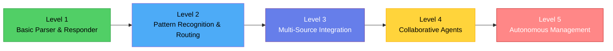
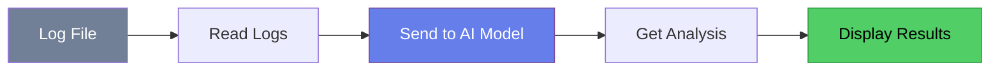
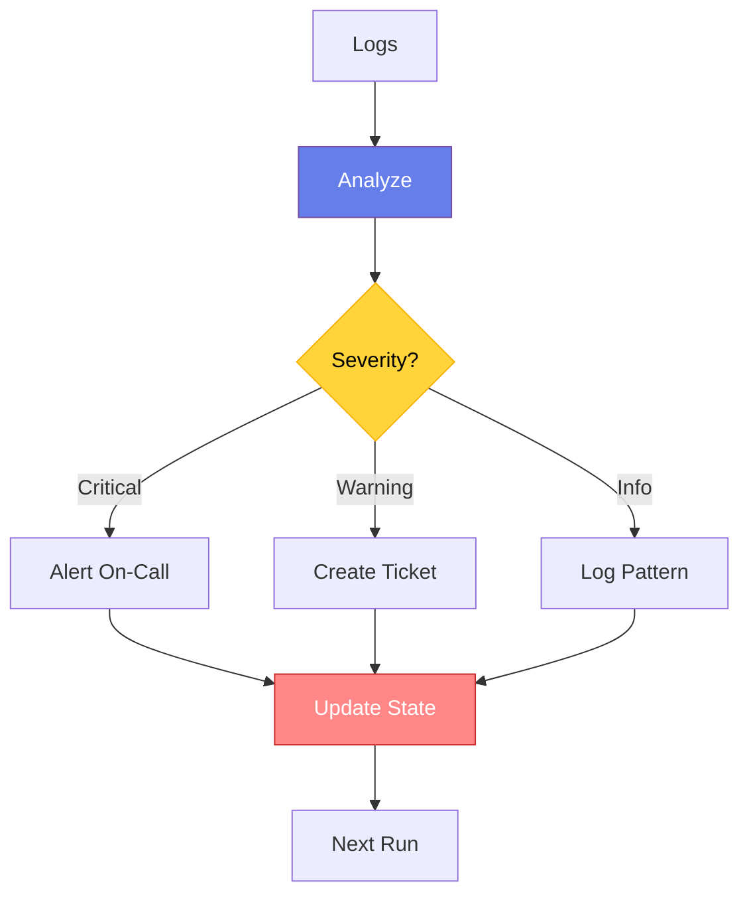
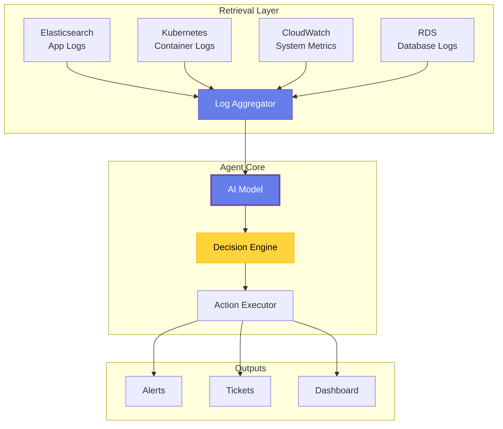
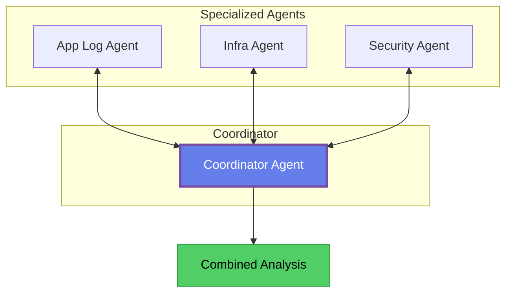
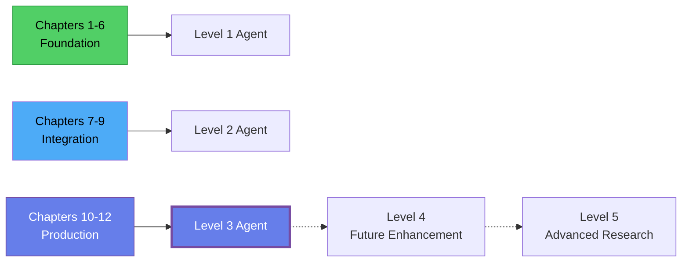

# Chapter 5: Levels of AI Logging Systems

> ⭐ **Starring** this repository to support this work

## Understanding the Journey Ahead

You've got your development environment set up. You understand the building blocks. Now you're probably wondering: "What exactly am I building? How advanced does this need to be?"

Here's the thing about AI agents: you can build them at different levels of capability. A Level 1 agent that parses logs and answers basic questions is useful. A Level 5 agent that autonomously manages your entire logging infrastructure and fixes issues without human intervention is powerful—but also complex and potentially risky.

The key is knowing where you're headed and why. This chapter breaks down five levels of AI logging systems, from simple to advanced. By the end, you'll understand what each level can do, what it requires, and where you should focus your efforts.

Think of this like a roadmap. You wouldn't try to drive from New York to Los Angeles without understanding the route. Similarly, you shouldn't build an AI agent without understanding the progression from basic to advanced capabilities.

**Figure 5.1:** The Five Levels - Each level builds on the previous one, adding capability and complexity.

## Level 1: Basic Log Parser and Responder

This is where everyone should start. A Level 1 agent does one thing: it reads logs and tells you what it sees.

### What It Does

At this level, your agent takes a log file or log stream as input and produces analysis as output. That's it. No fancy integrations, no autonomous actions, no multi-agent coordination. Just log in, analysis out.

Here's what a Level 1 agent can do:

**Read and understand log formats.** It knows that `[ERROR]` means something went wrong. It recognizes timestamps, severity levels, and message patterns. When you show it a stack trace, it can explain what the error means in plain language.

**Answer questions about logs.** You can ask it "What errors happened in the last hour?" or "Why did the application crash?" and it gives you answers based on what it sees in the logs. It's like having a junior engineer who can read logs but doesn't yet know how to take action.

**Summarize log patterns.** Instead of scrolling through thousands of log lines, you get a summary: "Database connection failed 45 times between 2 AM and 3 AM, retried successfully after timeout increased."

### What It Doesn't Do

A Level 1 agent is deliberately limited. It doesn't connect to multiple log sources. It doesn't make routing decisions. It doesn't take actions. It doesn't remember what happened yesterday. It's a stateless analyzer that processes whatever you give it.

This might sound too simple to be useful, but here's the reality: a well-built Level 1 agent solves real problems. When you're debugging at 3 AM and drowning in logs, having something that can instantly summarize what's happening is incredibly valuable.

### Building Level 1

In code terms, Level 1 means:

You have a function that reads logs from a file or string. You send those logs to an AI model with a prompt like "You are a DevOps engineer analyzing application logs. Identify errors, patterns, and potential issues." The model responds with analysis. You display the results.

That's your entire system. Maybe 100-150 lines of Python code. No database, no API integrations, no complex orchestration.

**Figure 5.2:** Level 1 Architecture - A simple pipeline from logs to analysis.

### Why Start Here

You might be tempted to jump straight to Level 3 or 4 because they sound more impressive. Don't. Here's why Level 1 matters:

**You learn the fundamentals.** How do you structure prompts for log analysis? What makes a good response versus a vague one? How do you handle different log formats? These questions are easier to answer when you're not also dealing with multiple data sources and complex workflows.

**You build working software fast.** You can have a functioning Level 1 agent in an afternoon. That early win builds momentum and confidence. Plus, you'll actually use it while building the more advanced versions.

**You discover what you really need.** Once you have Level 1 running, you'll quickly see where it falls short for your specific use case. Maybe you need it to handle multiple log sources. Maybe you need memory of past issues. Maybe you need it to take actions. These insights guide your next steps.

By the end of this book series, we'll build up to Level 3. But we'll start at Level 1, and you'll appreciate why.

## Level 2: Pattern Recognition and Routing Decisions

Once your Level 1 agent is working, the natural next question is: "Can it do more than just analyze? Can it make decisions?"

Level 2 is where your agent starts to act, not just observe.

### What It Does

A Level 2 agent recognizes patterns in logs and makes routing decisions based on what it finds. This means it can:

**Categorize issues by type and severity.** Instead of just saying "there are errors," it distinguishes between "database timeout that self-recovered" versus "authentication service completely down." It assigns severity levels—P1 for critical incidents, P2 for degraded service, P3 for warnings.

**Route alerts to the right people.** When it detects a database issue, it alerts the database team. When it sees authentication failures, it alerts the security team. When it finds memory leaks, it alerts the application developers. The routing is intelligent, not just keyword-based.

**Trigger automated responses.** For known patterns, it can take action. If it sees disk space warnings, it can trigger cleanup scripts. If it detects a service crash, it can attempt a restart. If it finds security anomalies, it can send alerts to your security monitoring system.

**Track patterns over time.** Level 2 introduces basic memory. The agent remembers what errors it's seen recently. If the same error happens 10 times in an hour, it escalates instead of sending 10 separate alerts. This requires maintaining state between runs.

### The Key Difference

The jump from Level 1 to Level 2 is about decision-making. Level 1 is passive—it tells you what's happening. Level 2 is active—it decides what to do about it.

This is where the ReAct pattern (Reason and Act) becomes important. The agent reasons about what it sees in the logs, then acts based on that reasoning. It's not just pattern matching with if-statements. It's using AI to understand context and make judgment calls.

**Figure 5.3:** Level 2 Decision Flow - The agent analyzes, decides severity, takes action, and maintains state.

### Building Level 2

To build Level 2, you add three things to your Level 1 foundation:

**Decision logic.** Your prompts now include instructions like "If you see critical errors, set severity to P1. If you see repeated warnings, set severity to P2." The model outputs structured data—not just text analysis, but JSON with severity levels, affected systems, and recommended actions.

**Integration points.** You need code that takes the model's decisions and executes them. If it says "alert database team," you need an integration with PagerDuty, Slack, or email. If it says "restart service," you need code that can actually restart that service.

**State management.** You need to remember what you've seen. This can be as simple as a JSON file that tracks recent errors and alert timestamps. When a new log batch comes in, you check: "Have we already alerted about this? Is this a repeat of something we saw 10 minutes ago?"

The complexity goes up, but it's manageable. You're still talking about a few hundred lines of Python code, maybe some database or file-based storage, and a few API integrations.

### When You Need Level 2

You need Level 2 when passively viewing log analysis isn't enough. If you find yourself reading your Level 1 agent's output and then manually deciding who to alert or what action to take, that's your signal to move to Level 2.

However, there's a catch: Level 2 introduces risk. When your agent starts taking actions automatically, it can make mistakes. A bug in your routing logic might page the wrong team at 3 AM. An overly aggressive restart policy might cause more problems than it solves.

This is why you test thoroughly. Start with read-only actions like creating tickets and sending informational alerts. Once you trust the agent's judgment, expand to actions like service restarts or config changes. And always have human oversight in the loop for critical decisions.

## Level 3: Multi-Source Integration

Level 3 is where your AI agent becomes truly useful for real-world DevOps scenarios. This is also where we'll stop in this book series—it's the sweet spot of capability and complexity.

### What It Does

A Level 3 agent doesn't just analyze one log file or one log stream. It integrates multiple data sources and correlates information across them:

**Connects to your actual logging infrastructure.** Instead of reading from files, it queries Elasticsearch for application logs, pulls container logs from Kubernetes, fetches system metrics from CloudWatch, and grabs database logs from RDS. All of this happens in real-time or near-real-time.

**Correlates events across systems.** This is the killer feature of Level 3. When your application throws an error, a Level 3 agent doesn't just report the error. It checks if there's a corresponding database timeout in RDS logs, if there's a network issue in CloudWatch metrics, if there's a pod restart in Kubernetes. It pieces together the full story.

**Provides intelligent context.** Instead of saying "service crashed," it says "service crashed after database connection pool exhausted, which happened because the RDS instance hit max connections, which spiked due to a deployment that changed the connection timeout from 30s to 5s." That's actionable intelligence.

**Handles complexity at scale.** A Level 3 agent deals with the reality of modern infrastructure: multiple AWS accounts, different log formats, various services and microservices, ephemeral containers, distributed traces. It knows how to query each system efficiently and combine the results meaningfully.

### The Architecture Changes

Building Level 3 requires more sophisticated architecture:

**Figure 5.4:** Level 3 Architecture - Multiple sources feed into a retrieval layer, which aggregates logs for the AI model.

You need API clients for each log source. You need an aggregation layer that normalizes different log formats into something consistent. You need query optimization because you can't pull every log from every system every time—that would be too slow and expensive.

You also need error handling for when APIs are down, rate limiting when you hit API quotas, and caching to avoid redundant queries. The infrastructure around the AI model becomes just as important as the model itself.

### Building Level 3

This is where the book series culminates. By Chapter 12, you'll have built:

**Connectors to multiple systems.** We'll build Python clients that talk to Elasticsearch, Kubernetes, and AWS services. You'll learn how to authenticate, query efficiently, and handle errors gracefully.

**A log aggregation pipeline.** We'll create code that pulls logs from multiple sources, normalizes their formats, and combines them into a unified view that the AI model can analyze.

**Cross-system correlation.** We'll teach the AI agent how to link events across systems. You'll write prompts that instruct the model to look for related events in different logs and build a coherent narrative.

**Production-ready infrastructure.** We'll add monitoring for the agent itself, error logging, configuration management, and deployment scripts. You'll have something you can actually run in production.

The code base grows to a few thousand lines—not massive, but substantial. You'll use proper project structure with modules, tests, and documentation. This isn't a toy project anymore. It's a real tool you can use and maintain.

### Why Stop at Level 3?

You might wonder why we don't go further in this series. The answer is that Level 3 solves most practical problems for most teams. It gives you automated log analysis, intelligent alerting, and multi-system correlation. That's enough to provide real value.

Levels 4 and 5 add complexity that many teams don't need. But let's look at what they entail, so you understand the full landscape.

## Level 4: Collaborative Agent Systems

Level 4 is where you move from a single agent to multiple agents working together. This is advanced stuff that you probably don't need unless you're at significant scale.

### What It Does

Instead of one agent that does everything, you have specialized agents that collaborate:

**Source-specific agents.** One agent focuses on application logs, another on infrastructure logs, another on security logs. Each becomes an expert in its domain.

**Role-based agents.** You might have an agent that detects issues, another that investigates root causes, and another that proposes remediation steps. They work in sequence, each building on the previous one's findings.

**Parallel processing.** Multiple agents can analyze different log sources simultaneously, then come together to share findings. This is faster than having one agent process everything sequentially.

The key pattern here is that agents communicate with each other. When the application log agent finds an error, it asks the infrastructure agent if there were any system issues around the same time. When the security agent sees suspicious activity, it asks the application agent if it correlates with failed authentication attempts.

**Figure 5.5:** Level 4 Multi-Agent System - Specialized agents collaborate through a coordinator.

### The Complexity Cost

Level 4 introduces significant complexity. You need to manage multiple AI model instances (which can be expensive). You need coordination logic to determine which agents should run when and how they should share information. You need to handle cases where agents disagree or provide conflicting information.

There's also a debugging challenge. When something goes wrong in a multi-agent system, figuring out which agent made which decision and why becomes much harder than debugging a single agent.

Most teams should stick with Level 3 and only consider Level 4 if they have specific scaling requirements or very specialized domains that benefit from expertise separation.

## Level 5: Autonomous Management and Remediation

Level 5 is the "self-driving car" of logging systems. The agent doesn't just analyze and alert—it takes full autonomous action to maintain your infrastructure.

### What It Does (Theoretically)

A Level 5 agent would:

**Automatically remediate common issues.** Service crashed? The agent restarts it. Disk filling up? The agent cleans old logs. Database connections maxed out? The agent increases the connection pool limit.

**Self-improve through learning.** It tracks which remediations worked and which didn't. Over time, it gets better at predicting what actions will solve problems. It adapts to your specific infrastructure patterns.

**Handle novel situations.** When it encounters an error it hasn't seen before, it reasons through potential causes, tests hypotheses, and tries solutions. It's not just running playbooks—it's problem-solving.

**Manage its own configuration.** It determines what logs to monitor, what thresholds to set for alerts, and how to optimize its own performance. It's fully autonomous.

### Why This Is Risky

Level 5 sounds amazing, but it's also dangerous. An autonomous agent that can restart services, modify configurations, and take infrastructure actions can cause serious damage if it makes mistakes.

Imagine an agent that misinterprets load spikes as a problem and starts terminating instances to "save resources." Or an agent that detects errors and keeps restarting a service in a crash loop, making the problem worse. Or an agent that sees database timeouts and decides to increase connection limits to levels that overwhelm your database.

These aren't theoretical risks. They're real failure modes that happen when you give AI systems too much autonomy without sufficient guardrails.

Most companies aren't at Level 5 yet, and many may never be. The risk-reward tradeoff doesn't make sense for most use cases. You're better off with a Level 3 agent that provides intelligence and recommendations, with humans making the final decisions on critical actions.

### The Human-in-the-Loop Principle

Even if you build toward Level 5 capabilities, you should maintain human oversight for high-impact decisions. An agent can recommend restarting a critical service, but a human should approve it. An agent can suggest configuration changes, but they should go through review before deployment.

This "human-in-the-loop" approach gives you the benefits of AI speed and intelligence while keeping the safety net of human judgment for consequential actions.

## Mapping Your Journey

Now that you understand all five levels, let's map out the practical path for this book series.

### Chapters 1-6: Foundation (Level 1 Capability)

In the first part of this series, you're building the foundation. By the end of Chapter 6, you'll have a working Level 1 agent that can read logs and provide intelligent analysis. You'll understand the concepts, have the tools installed, and know how to structure prompts effectively.

### Chapters 7-9: Integration (Level 2 Capability)

In the middle section, we'll add decision-making and basic actions. You'll learn how to structure outputs as JSON so you can route decisions to code. You'll integrate with alerting systems. You'll add memory so your agent tracks patterns over time.

By the end of Chapter 9, you'll have a Level 2 agent that doesn't just analyze—it acts.

### Chapters 10-12: Production Scale (Level 3 Capability)

The final section brings everything together. You'll build connectors to real log sources like Elasticsearch and CloudWatch. You'll create an aggregation pipeline. You'll add cross-system correlation. You'll make the whole system production-ready with proper error handling, monitoring, and deployment.

By the end of Chapter 12, you'll have a Level 3 agent that you can actually deploy and use in your DevOps workflows.

### Beyond the Book

If you want to go further, you'll have the foundation to explore Level 4 and even Level 5. But honestly, Level 3 is where most of the practical value lives. Get there first, use it for a while, and then decide if you need more.

**Figure 5.6:** Your Learning Path - We'll progress from Level 1 to Level 3 through this book series.

## What You've Learned

Let's recap what you now understand about AI logging system levels:

**Level 1 (Basic Parser)** reads logs and provides analysis. It's simple, fast to build, and genuinely useful. This is where you start and where you'll spend the first half of the book.

**Level 2 (Pattern Recognition)** adds decision-making and actions. The agent can route alerts, trigger responses, and track patterns over time. This is where you move from passive observation to active response.

**Level 3 (Multi-Source Integration)** brings in multiple log sources and correlates events across systems. This is the target for this book series—a production-ready agent that provides real value in DevOps workflows.

**Level 4 (Collaborative Agents)** uses multiple specialized agents working together. It's complex and mainly useful at scale. Most teams don't need this.

**Level 5 (Autonomous Management)** handles full autonomous remediation with self-improvement. It's powerful but risky. The technology exists, but most organizations shouldn't use it yet.

## What's Next

Now that you understand the levels and where you're headed, the next chapter introduces LangChain—a framework that makes building these agents much easier.

You'll learn why LangChain exists, what problems it solves, and how it simplifies the code you'll write for your AI logging agent. We'll look at core concepts like chains, memory, and tools, and you'll see how they map to the building blocks you learned in Chapter 3.

By the end of Chapter 6, you'll have both the conceptual understanding (this chapter) and the practical framework (next chapter) to start building your Level 1 agent in Chapter 7.

Let's keep moving forward.

---

## 💝 Support This Work

> **Support this project:** Consider [sponsoring this work](https://github.com/sponsors/hoalongnatsu) to help create more AI-powered DevOps resources.

---
