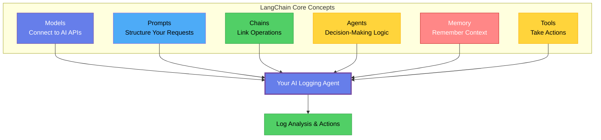
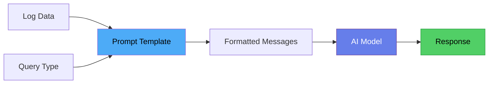
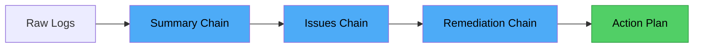
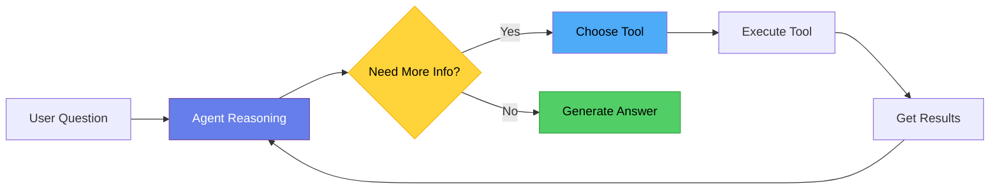
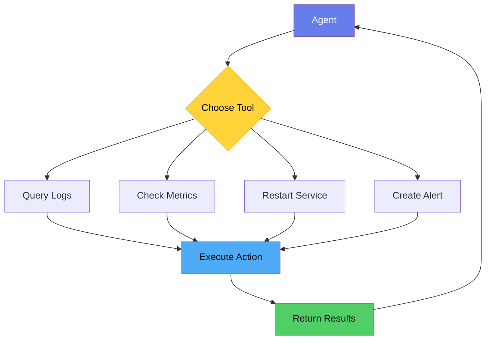

# Chapter 6: Introduction to LangChain for AI Logging Agents

> ⭐ **Starring** this repository to support this work

In the chapter 4, you've got Python installed. You have the Gemini API working. You can send a prompt to an AI model and get a response back. At this point, you might be wondering: "Why do I need LangChain? Can't I just write the code myself?"

The short answer is yes, you can write everything from scratch. The longer answer is that you'll end up rebuilding what LangChain already provides, but with more bugs and less flexibility.

Here's what happened when I built my first AI logging agent without a framework. I wrote a function that sent logs to the Gemini API. It worked fine. Then I needed to add memory so the agent could remember previous errors. I wrote some code to save conversation history in a JSON file. That worked too. Then I needed to give the agent tools—the ability to query Elasticsearch or restart services. I added more code to handle tool calling. Then I needed to chain operations together, where the output of one step became the input of another. More code. Pretty soon I had 800 lines of tangled logic that was hard to test and harder to extend.

When I rewrote it using LangChain, the entire thing shrank to about 150 lines. More importantly, it became easier to understand and modify. That's the value of a framework—it handles the boring, repetitive parts so you can focus on what makes your agent unique.

## What LangChain Actually Is

LangChain is a Python library for building applications with language models. It provides abstractions for common patterns you'll encounter when working with AI.

Think of it like Flask or Django for web applications. You could build a web server from scratch using Python's socket library, but why would you? Flask handles HTTP requests, routing, and sessions for you. Similarly, you could handle AI model calls, conversation history, and tool integration yourself, but LangChain already solved these problems.

The framework is built around a few core concepts: Models, Prompts, Chains, Agents, Memory, and Tools. Each one abstracts away complexity while giving you the flexibility to customize when needed.



**Figure 6.1:** LangChain Architecture - Six core concepts that work together to build your agent.

## Installing LangChain

Before we dive into concepts, let's get LangChain installed. Assuming you're in your project directory with your virtual environment activated:

```bash
pip install langchain langchain-google-genai
```

The first package is the core LangChain library. The second one provides Gemini integration. LangChain supports many different AI providers through these integration packages—OpenAI, Anthropic, local models, and more. The nice thing is that once you learn LangChain with one provider, switching to another is usually just changing a few import statements.

**Important:** When using LangChain with Gemini, you only need `langchain-google-genai`. Don't install the standalone `google-generativeai` package as they have conflicting dependencies.

Update your `requirements.txt` to include these:

```
python-dotenv>=1.2.1
requests>=2.32.5
langchain>=1.0.5
langchain-google-genai>=3.0.3
```

## Models

> Connecting to AI

In LangChain, a Model is an abstraction over an AI API. Instead of writing code that makes HTTP requests to Gemini's API and parses JSON responses, you instantiate a Model object and call methods on it.

Here's what calling the Gemini API looks like without LangChain:

```python
import os
import google.generativeai as genai

genai.configure(api_key=os.environ['GEMINI_API_KEY'])
model = genai.GenerativeModel('gemini-2.5-flash-lite')
response = model.generate_content('What is the capital of France?')
print(response.text)
```

And here's the equivalent with LangChain:

```python
import os
from langchain_google_genai import ChatGoogleGenerativeAI

llm = ChatGoogleGenerativeAI(
    model='gemini-2.5-flash-lite',
    google_api_key=os.environ['GEMINI_API_KEY']
)
response = llm.invoke('What is the capital of France?')
print(response.content)
```

At first glance, these look about the same. The benefit becomes clear when you start building more complex applications. The LangChain Model object has a consistent interface that works across different providers. If you decide to switch from Gemini to OpenAI, you change the import and model initialization, but the rest of your code stays the same. The invoke method, the way you handle responses, the error handling—all of it remains consistent.

For a logging agent, this means you can experiment with different models to find the one that works best for your use case without rewriting your entire application.

## Prompts

> Structuring Your Requests

When you talk to an AI model, you're usually sending two types of messages: system messages that define the agent's role and behavior, and user messages that contain the actual task or data.

A Prompt Template in LangChain is a way to structure these messages with placeholders. Instead of hardcoding strings and using f-strings everywhere, you define templates that LangChain fills in at runtime.

Here's a simple example for log analysis:

```python
from langchain_core.prompts import ChatPromptTemplate

prompt = ChatPromptTemplate.from_messages([
    ("system", "You are a DevOps expert analyzing application logs. Identify errors, patterns, and potential root causes."),
    ("user", "Analyze these logs:\n\n{logs}")
])
```

Now when you want to analyze logs, you format the prompt with actual log data:

```python
formatted = prompt.format_messages(logs=log_content)
```

This might seem like overkill for a simple use case, but it becomes valuable as your prompts get more complex. Imagine you're building an agent that handles multiple types of queries—error analysis, performance investigation, security audits. Each query type needs a different system message and structure. With Prompt Templates, you define each one cleanly and switch between them based on the request.



**Figure 6.2:** Prompt Template Flow - Data and query type combine with template to create messages for the model.

## Chains

> Linking Operations Together

A Chain is a sequence of operations where the output of one step becomes the input of the next. This is one of the most useful patterns in LangChain.

Let's say you're building a log analyzer that does three things in sequence:

1. Takes raw log lines and summarizes them
2. Takes the summary and identifies the most critical issues
3. Takes the critical issues and suggests remediation steps

Without a Chain, you'd write code like this:

```python
# Step 1: Summarize
summary_prompt = f"Summarize these logs: {logs}"
summary = llm.invoke(summary_prompt)

# Step 2: Identify critical issues
issues_prompt = f"From this summary, identify critical issues: {summary.content}"
issues = llm.invoke(issues_prompt)

# Step 3: Suggest remediation
remediation_prompt = f"For these issues, suggest fixes: {issues.content}"
remediation = llm.invoke(remediation_prompt)

print(remediation.content)
```

With a Chain, you define the sequence once and then run it using modern LangChain syntax with the pipe operator:

```python
from langchain_core.prompts import PromptTemplate

# Define prompts for each step
summary_prompt = PromptTemplate(
    input_variables=["logs"],
    template="Summarize these logs:\n\n{logs}"
)

issues_prompt = PromptTemplate(
    input_variables=["summary"],
    template="From this summary, identify critical issues:\n\n{summary}"
)

remediation_prompt = PromptTemplate(
    input_variables=["issues"],
    template="For these issues, suggest fixes:\n\n{issues}"
)

# Create chains using the pipe operator
summary_chain = summary_prompt | llm
issues_chain = issues_prompt | llm
remediation_chain = remediation_prompt | llm

# Run them in sequence
summary = summary_chain.invoke({"logs": log_content})
issues = issues_chain.invoke({"summary": summary.content})
remediation = remediation_chain.invoke({"issues": issues.content})

print(remediation.content)
```

This is more maintainable. Each chain is self-contained and testable. You can swap out steps, add new ones, or change the order without rewriting everything. The pipe operator (`|`) is the modern way to connect prompts and models in LangChain.



**Figure 6.3:** Chain Sequence - Each step processes output from the previous step.

## Agents

> Adding Decision-Making Logic

This is where things get interesting. An Agent in LangChain is a system that can decide what to do based on user input. Instead of following a fixed sequence, it reasons about the task and chooses which tools to use.

Remember when we talked about ReAct (Reason and Act) in Chapter 3? LangChain Agents implement that pattern. You give the agent a goal and a set of tools, and it figures out how to achieve the goal by using those tools.

For a logging agent, this means you can ask it "Why did the application crash?" and it will:

1. Reason about what information it needs
2. Use a tool to query Elasticsearch for error logs
3. Analyze what it finds
4. If it needs more information, use another tool to check metrics
5. Generate a final answer based on everything it learned

You don't have to write if-statements for every possible scenario. The AI model itself decides what to do next based on the situation.

Here's a basic example of an agent that can search logs:

```python
from langchain.agents import initialize_agent, Tool
from langchain.agents import AgentType

# Define a tool the agent can use
def search_logs(query):
    # This would actually query Elasticsearch or read files
    # For now, let's just return a mock result
    return f"Found 3 errors matching '{query}' in the last hour"

tools = [
    Tool(
        name="SearchLogs",
        func=search_logs,
        description="Search application logs. Input should be a search query."
    )
]

# Create an agent that can use these tools
agent = initialize_agent(
    tools=tools,
    llm=llm,
    agent=AgentType.ZERO_SHOT_REACT_DESCRIPTION,
    verbose=True
)

# Now you can ask questions
response = agent.run("What errors happened in the last hour?")
print(response)
```

When you run this, you'll see the agent's thought process. It reads your question, decides it needs to search logs, calls the SearchLogs tool with an appropriate query, gets the results, and formulates an answer. That's the ReAct pattern in action.



**Figure 6.4:** Agent Decision Loop - The agent reasons, uses tools, and iterates until it has an answer.

## Memory

> Keeping Context Between Runs

AI models are stateless. Every time you call the API, it starts fresh with no memory of previous conversations. If you want your agent to remember what happened earlier, you need to manage that yourself.

LangChain provides Memory components that handle this automatically. In modern LangChain, use `InMemoryChatMessageHistory` for storing conversation history:

```python
from langchain_core.chat_history import InMemoryChatMessageHistory

# Create chat memory
chat_history = InMemoryChatMessageHistory()

# First interaction
chat_history.add_user_message("What errors are in the logs?")
chat_history.add_ai_message("Found 3 database connection errors")

# Second interaction - memory includes previous context
chat_history.add_user_message("When did they start?")
chat_history.add_ai_message("They started at 2:00 AM")

# The memory now contains all exchanges
print(chat_history.messages)
```

For a logging agent, memory is crucial. When a user asks "Show me more details about that error," your agent needs to remember which error the user is referring to. When it sees the same error pattern multiple times, it should recognize that it's a recurring issue, not a new one.

You can also use `RunnableWithMessageHistory` to automatically manage memory in your chains, which we'll see in the complete example below.

## Tools

> Giving Your Agent Capabilities

Tools are functions that your agent can call to take actions or gather information. We saw a simple example with the SearchLogs tool earlier. In a real logging agent, you'd have tools for:

- Querying Elasticsearch for logs
- Checking CloudWatch metrics
- Restarting services via Kubernetes API
- Creating alerts in PagerDuty
- Running database queries to check application state

In modern LangChain, you define tools using the `@tool` decorator. It's simpler and cleaner than the old approach:

```python
from langchain_core.tools import tool

@tool
def query_elasticsearch(query_string: str) -> dict:
    """Query Elasticsearch for log entries. Input should be an Elasticsearch query string."""
    # Real implementation would connect to ES and run a query
    # For now, mock it
    return {"hits": 5, "sample": "Error: Connection timeout"}

@tool
def restart_service(service_name: str) -> str:
    """Restart a Kubernetes service. Input should be the service name."""
    # Real implementation would use kubectl or an API
    return f"Service {service_name} restarted successfully"

# Just add the functions to a list
tools = [query_elasticsearch, restart_service]
```

The `@tool` decorator does several things for you:
1. Extracts the function name as the tool name
2. Uses the docstring as the tool description (the AI reads this!)
3. Uses type hints to validate inputs
4. Automatically handles errors and return values

The beauty of this approach is that you can add tools without changing your agent code. Want to give your agent the ability to check AWS costs? Write a function that calls the AWS API, add the `@tool` decorator, and add it to the list. The agent will automatically know it can use that capability.



**Figure 6.5:** Tool Selection - The agent chooses and executes tools based on what it needs to accomplish.

## A Complete Example: Log Analyzer with LangChain

Let's put everything together into a working example. This agent will analyze logs, remember previous conversations, and use tools to gather information. I'll walk you through each part so you understand exactly what's happening.

### Setting Up the Project Structure

First, create the necessary directories:

```bash
# Create project directory
mkdir -p ai-logging-agent/src
mkdir -p ai-logging-agent/logs
cd ai-logging-agent
```

Create a `.env` file with your API key:

```bash
echo "GEMINI_API_KEY=your_api_key_here" > .env
```

### Understanding the Complete Code

Create `src/langchain_log_analyzer.py` with this code. I'll explain each section in detail:

```python
import os
from dotenv import load_dotenv
from langchain_google_genai import ChatGoogleGenerativeAI
from langchain_core.tools import tool
from langchain_core.prompts import ChatPromptTemplate, MessagesPlaceholder
from langchain_core.chat_history import InMemoryChatMessageHistory
from langchain_core.runnables.history import RunnableWithMessageHistory

# Load environment variables
load_dotenv()
```

We import LangChain's core components. Notice we're using `langchain_core` for tools, prompts, and memory - these are the modern, stable APIs. The `@tool` decorator is simpler than the old `Tool` class.

```python
# Define tools using the @tool decorator
@tool
def read_log_file(filename: str) -> str:
    """Read contents of a log file. Input should be the filename."""
    try:
        with open(f"logs/{filename}", 'r') as f:
            return f.read()
    except FileNotFoundError:
        return f"Log file {filename} not found"

@tool
def count_errors(log_content: str) -> str:
    """Count how many error lines are in log content. Input should be the log content as a string."""
    lines = log_content.split('\n')
    errors = [line for line in lines if 'ERROR' in line or 'error' in line]
    return f"Found {len(errors)} error lines"

# Create tools list
tools = [read_log_file, count_errors]
```

The `@tool` decorator automatically converts your Python functions into tools that the AI can use. The docstring is crucial - the AI reads it to understand when to use each tool. Type hints (`filename: str`) help LangChain validate inputs.

```python
# Initialize the model
llm = ChatGoogleGenerativeAI(
    model='gemini-2.5-flash',
    google_api_key=os.environ['GEMINI_API_KEY'],
    temperature=0.1
)

# Bind tools to the model
llm_with_tools = llm.bind_tools(tools)
```

We create a model instance and bind our tools to it. The `bind_tools()` method tells Gemini "these are the functions you can call." The low temperature (0.1) makes responses more consistent and less creative - good for log analysis.

```python
# Create chat memory
chat_history = InMemoryChatMessageHistory()

# Create a prompt that includes message history
prompt = ChatPromptTemplate.from_messages([
    ("system", "You are a DevOps expert analyzing application logs. Use the available tools to read log files and analyze them."),
    MessagesPlaceholder(variable_name="chat_history"),
    ("user", "{input}"),
])

# Create a chain with the prompt and model
chain = prompt | llm_with_tools

# Wrap the chain with message history
chain_with_history = RunnableWithMessageHistory(
    chain,
    lambda session_id: chat_history,
    input_messages_key="input",
    history_messages_key="chat_history",
)
```

This is where LangChain's power shows. We create:
1. **Memory** - `InMemoryChatMessageHistory` stores the conversation
2. **Prompt** - Defines the system role and includes a placeholder for chat history
3. **Chain** - Uses the pipe operator (`|`) to connect prompt → model (modern LangChain syntax)
4. **History wrapper** - Automatically injects conversation history into each request

The `MessagesPlaceholder` is like a slot where LangChain inserts previous messages. You don't manage this manually.

```python
# Helper function to extract text from response
def extract_response_text(response) -> str:
    """Extract text content from various response formats."""
    if hasattr(response, 'content'):
        if isinstance(response.content, str):
            return response.content
        elif isinstance(response.content, list):
            # Handle structured content (list of content blocks)
            text_parts = []
            for block in response.content:
                if isinstance(block, dict) and 'text' in block:
                    text_parts.append(block['text'])
                elif isinstance(block, str):
                    text_parts.append(block)
            return ''.join(text_parts)
        else:
            return str(response.content)
    return str(response)
```

AI models can return responses in different formats - sometimes as plain strings, sometimes as structured objects with metadata. This helper function handles all formats and extracts just the text we want to display. It's reusable and keeps our main code clean.

```python
# Main interaction loop
def main():
    print("AI Log Analyzer ready. Type 'quit' to exit.")
    print("Try asking: 'Read the app.log file' or 'What errors are in the logs?'\n")
    
    session_id = "default_session"
    
    while True:
        user_input = input("You: ")
        if user_input.lower() in ['quit', 'exit']:
            break
        
        try:
            # Get response from chain with history
            response = chain_with_history.invoke(
                {"input": user_input},
                config={"configurable": {"session_id": session_id}}
            )
```

We invoke the chain with history. The `session_id` lets you maintain separate conversations if needed. LangChain automatically:
- Loads previous messages from `chat_history`
- Adds them to the prompt
- Sends everything to the model
- Returns the response

```python
            # Check if model wants to use tools
            if hasattr(response, 'tool_calls') and response.tool_calls:
                # Execute tool calls
                for tool_call in response.tool_calls:
                    tool_name = tool_call['name']
                    tool_args = tool_call['args']
                    
                    # Find and execute the tool
                    for tool in tools:
                        if tool.name == tool_name:
                            result = tool.invoke(tool_args)
                            print(f"\n[Tool: {tool_name}]\n{result}\n")
```

When the model decides it needs information, it returns `tool_calls` - a list of tools to execute with their arguments. We loop through each call, find the matching tool, and execute it. The `[Tool: name]` prefix shows users what's happening behind the scenes.

```python
                            # Get final response based on tool results
                            final_response = llm.invoke([
                                ("system", "You are a DevOps expert analyzing logs. The user asked a question and you used a tool to get information. Now provide a clear, concise answer to the user's question based on the tool results."),
                                ("user", f"User asked: {user_input}\n\nTool result:\n{result}\n\nPlease analyze these actual logs and answer the user's question."),
                            ])
                            
                            # Extract and display response
                            response_text = extract_response_text(final_response)
                            print(f"Agent: {response_text}\n")
                            
                            # Add to chat history
                            chat_history.add_user_message(user_input)
                            chat_history.add_ai_message(response_text)
                            break
```

After executing the tool, we need the model to analyze the results. We create a new prompt that includes:
- The original question
- The tool results
- Clear instructions to analyze

Then we extract the text, display it, and save both the question and answer to memory. This is crucial - without saving to history, the agent won't remember this exchange.

```python
            else:
                # Direct response without tools
                response_text = extract_response_text(response)
                print(f"\nAgent: {response_text}\n")
                
                # Add to chat history
                chat_history.add_user_message(user_input)
                chat_history.add_ai_message(response_text)
                
        except Exception as e:
            print(f"Error: {e}\n")
            import traceback
            traceback.print_exc()

if __name__ == "__main__":
    main()
```

If the model doesn't need tools (like when asking "What is a log?"), it responds directly. We extract the text, display it, and save to history. Error handling with traceback helps you debug issues during development.

*The complete code in 03-ai-agent-for-devops/code/06.*

### Creating Test Data

Create a sample log file to test with:

```bash
cat > logs/app.log << 'EOF'
[2025-01-15 10:23:45] INFO Application started
[2025-01-15 10:23:46] INFO Connected to database
[2025-01-15 10:24:12] ERROR Database connection timeout
[2025-01-15 10:24:13] ERROR Failed to execute query
[2025-01-15 10:24:14] INFO Retrying connection
[2025-01-15 10:24:15] INFO Connection successful
EOF
```

### Running the Agent

```bash
python src/langchain_log_analyzer.py
```

### Example Conversation

Here's what a real interaction looks like:

```
AI Log Analyzer ready. Type 'quit' to exit.
Try asking: 'Read the app.log file' or 'What errors are in the logs?'

You: What errors are in the logs?
Agent: I need to know which log file to check. Could you please provide the filename?

You: app.log

[Tool: read_log_file]
[2025-01-15 10:23:45] INFO Application started
[2025-01-15 10:23:46] INFO Connected to database
[2025-01-15 10:24:12] ERROR Database connection timeout
[2025-01-15 10:24:13] ERROR Failed to execute query
[2025-01-15 10:24:14] INFO Retrying connection
[2025-01-15 10:24:15] INFO Connection successful

Agent: The app.log file contains 2 errors:
1. At 10:24:12 - Database connection timeout
2. At 10:24:13 - Failed to execute query

The application attempted to retry and successfully reconnected at 10:24:15.
```

**Notice:** On the second question, the agent remembered the log contents from the first interaction. It didn't need to read the file again because the conversation history included that information. This is memory in action.

The code is about 140 lines but handles complex interactions. Without LangChain, you'd need 400+ lines to manage conversation history, tool calling, and error handling yourself.

## Raw API vs. LangChain

Let's be honest about what LangChain adds and what it doesn't.

If you're building a simple script that sends logs to an AI model once and prints the result, LangChain is probably overkill. Writing the raw API call is faster and easier to understand.

But if you're building something that:
- Needs to chain multiple operations together
- Should remember context between runs
- Must use different tools based on the situation
- Will grow in complexity over time
- Needs to work with multiple AI providers

Then LangChain saves you time and headaches. The framework handles conversation management, tool calling, memory persistence, and error handling. You focus on defining what your agent should do, not how to manage state and API calls.

Think of it like building a house. For a small shed, you can probably wing it with some wood and nails. For an actual house, you want a blueprint, proper tools, and building materials that work well together. LangChain is that structure for AI applications.

## What's Next

You now understand the building blocks: Models for AI interactions, Prompts for structuring requests, Chains for linking operations, Agents for decision-making, Memory for context, and Tools for capabilities.

In the next chapter, we'll use everything you've learned to build a real Level 1 logging agent. You'll write code that reads log files, analyzes them with AI, and provides useful insights. No more examples—we're building something you can actually use.

After that, we'll progressively add features: decision-making and routing in Level 2, memory and state management, and finally multi-source integration in Level 3. By the end, you'll have a production-capable AI logging agent that handles real DevOps work.

But first, we need to get Level 1 working. Let's build something.
