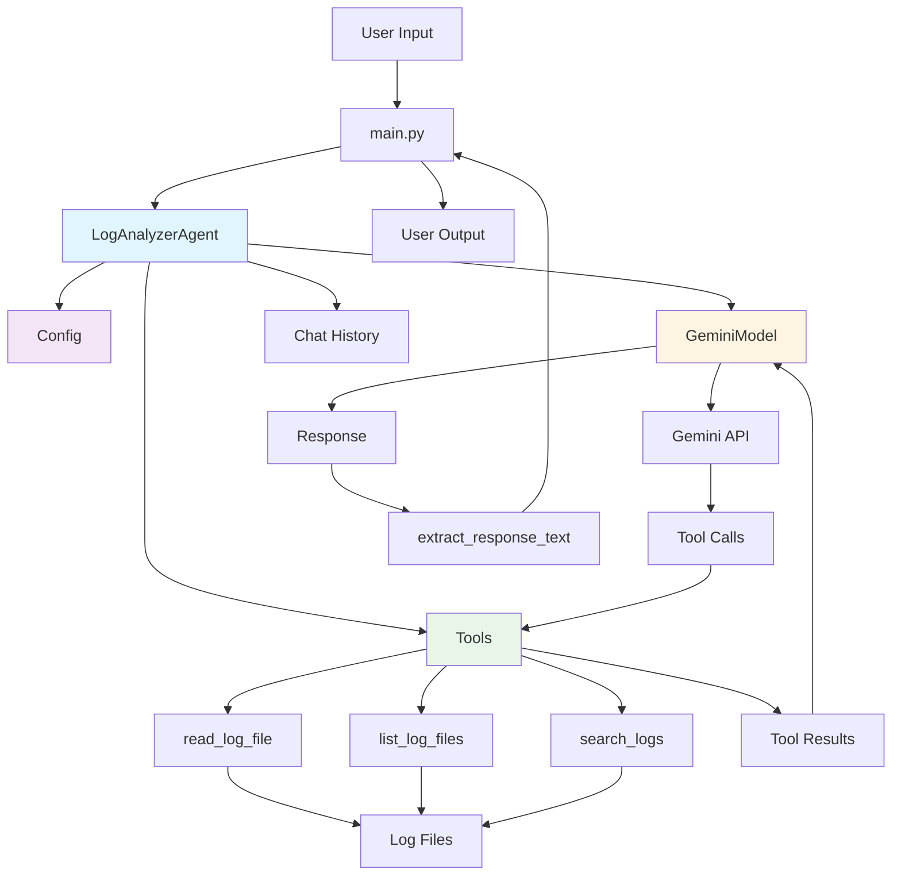

# Chapter 7: Building Your First Components

In the previous chapter, we explored LangChain and understood how it simplifies building AI applications. Now it's time to put that knowledge into practice. We're going to build our first AI logging agent, piece by piece, and understand why each component matters.

This is where theory meets reality. You'll see how all those concepts we discussed actually fit together in working code.

## What We're Building

Before we dive into the code, let's be clear about what this agent can and cannot do.

Our agent will:
- Read log files from a directory
- Analyze logs using Google Gemini AI
- Answer questions about errors, patterns, and issues
- Remember the conversation context

What it won't do yet:
- Make routing decisions (we'll add that in Chapter 8)
- Take automated actions like restarting services
- Pull logs from multiple sources (that's Chapter 10)
- Store persistent memory across restarts (Chapter 9 covers this)

This is intentionally simple. We're building a foundation, not a skyscraper. Every complex system starts with simple, working components.

## The Architecture

When I first started building AI agents, I made everything in one file. It worked, but the moment I wanted to add a feature or fix a bug, I had to dig through hundreds of lines of code. I learned the hard way that good architecture saves you time.

Here's how we're organizing our agent:

```
07/
├── src/
│   ├── __init__.py          # Package marker
│   ├── __main__.py          # Package entry point (python -m src)
│   ├── config.py            # Configuration and validation
│   ├── main.py              # Main application logic
│   ├── models/              # AI model wrappers
│   │   └── gemini.py
│   ├── tools/               # LangChain tools
│   │   └── log_reader.py
│   ├── agents/              # Agent orchestration
│   │   └── log_analyzer.py
│   └── utils/               # Helper functions
│       └── response.py
├── logs/                     # Sample log files
└── tests/                    # Basic tests
```

Here's how the components interact:



**Figure 7.1:** The Architecture

Each layer has a purpose. Let me explain why we need each one.

## Layer 1: Configuration (config.py)

Configuration might seem boring, but it's critical. I've seen production systems fail because someone hardcoded an API key or forgot to validate environment variables. Good configuration prevents those problems.

Here's our configuration layer:

```python
"""
Configuration management for the AI Logging Agent
"""
import os
from dotenv import load_dotenv

# Load environment variables
load_dotenv()


class Config:
    """Application configuration"""
    
    # API Configuration
    GEMINI_API_KEY = os.getenv('GEMINI_API_KEY')
    GEMINI_MODEL = os.getenv('GEMINI_MODEL', 'gemini-2.5-flash')
    TEMPERATURE = float(os.getenv('TEMPERATURE', '0.1'))
    
    # Paths
    LOG_DIRECTORY = os.getenv('LOG_DIRECTORY', 'logs')
    
    # Agent Configuration
    MAX_ITERATIONS = 5
    VERBOSE = True
    
    @classmethod
    def validate(cls):
        """Validate required configuration"""
        if not cls.GEMINI_API_KEY:
            raise ValueError(
                "GEMINI_API_KEY not found. "
                "Please set it in .env file or environment variables."
            )
        
        if not os.path.exists(cls.LOG_DIRECTORY):
            os.makedirs(cls.LOG_DIRECTORY)
            print(f"Created log directory: {cls.LOG_DIRECTORY}")
    
    @classmethod
    def get_system_prompt(cls) -> str:
        """Get the system prompt for the agent"""
        return """You are a DevOps expert specializing in log analysis.

Your responsibilities:
- Analyze application logs to identify errors, warnings, and patterns
- Explain technical issues in clear, concise language
- Identify root causes and relationships between events
- Provide actionable insights

Your limitations:
- You can only read and analyze logs, not modify them
- You cannot take actions like restarting services or modifying configurations
- You work with the log files available in the logs directory

Be direct and helpful. Focus on what's actually in the logs, not speculation."""
```

### Why We Need This Layer

**Environment Variables**: We use `python-dotenv` to load settings from a `.env` file. This means developers can configure their API keys locally without hardcoding them in the source code. In production, you'd use proper secret management, but for development, this works perfectly.

**Validation on Startup**: The `validate()` method runs when the module loads. If the API key is missing, the program fails immediately with a clear error message. This is much better than failing halfway through execution when you're trying to call the API.

**Sensible Defaults**: Notice `GEMINI_MODEL` has a default value (`'gemini-2.5-flash'`). Users can override it, but most won't need to. Defaults reduce configuration burden.

**System Prompt as Configuration**: The system prompt defines the agent's personality and capabilities. By putting it in configuration, we can easily modify the agent's behavior without touching the core logic. Want the agent to be more technical? Just change the prompt.

**Temperature Setting**: We default to `0.1` for temperature. Remember from Chapter 3, lower temperature means more deterministic responses. For log analysis, we want consistent, reliable answers, not creative variations.

## Layer 2: Model Wrapper (models/gemini.py)

The model wrapper is a thin abstraction over the LangChain ChatGoogleGenerativeAI class. You might wonder: why wrap something that's already wrapped?

```python
"""
Google Gemini LLM wrapper
"""
from langchain_google_genai import ChatGoogleGenerativeAI
from ..config import Config


class GeminiModel:
    """Wrapper for Google Gemini LLM"""
    
    def __init__(self):
        """Initialize the Gemini model"""
        self.llm = ChatGoogleGenerativeAI(
            model=Config.GEMINI_MODEL,
            google_api_key=Config.GEMINI_API_KEY,
            temperature=Config.TEMPERATURE
        )
    
    def get_llm(self):
        """Get the LLM instance"""
        return self.llm
    
    def get_llm_with_tools(self, tools: list):
        """Get LLM with tools bound"""
        return self.llm.bind_tools(tools)
```

### Why We Need This Layer

**Flexibility**: Tomorrow, you might want to switch from Gemini to OpenAI's GPT-4 or Claude. With this wrapper, you change one file. Without it, you'd need to find and update every place you instantiated the model.

**Consistent Configuration**: Every time you need the LLM, you get it configured exactly the same way with the same temperature, API key, and model name. No risk of typos or inconsistent settings.

**Tool Binding Helper**: The `get_llm_with_tools()` method binds tools to the model. This is a LangChain pattern we learned in Chapter 6. Having it here as a method makes the agent code cleaner.

**Testing Isolation**: When you write tests, you can mock this class and return a fake LLM. That lets you test the rest of your code without making actual API calls.

Think of this as dependency injection. The agent doesn't know or care what LLM it's using. It just calls methods on this wrapper.

## Layer 3: Tools (tools/log_reader.py)

Tools are how the agent interacts with the real world. In Chapter 6, we built simple tools. Now we're adding three production-ready tools for log analysis.

### Tool 1: Read Log File

```python
@tool
def read_log_file(filename: str) -> str:
    """
    Read contents of a log file from the logs directory.
    
    Args:
        filename: Name of the log file (e.g., 'app.log', 'error.log')
    
    Returns:
        String containing the log file contents, or error message if file not found
    """
    log_path = Path(Config.LOG_DIRECTORY) / filename
    
    try:
        with open(log_path, 'r', encoding='utf-8') as f:
            content = f.read()
        
        # Add metadata
        file_size = os.path.getsize(log_path)
        line_count = content.count('\n') + 1
        
        return f"File: {filename}\nSize: {file_size} bytes\nLines: {line_count}\n\n{content}"
    
    except FileNotFoundError:
        return f"Error: Log file '{filename}' not found in {Config.LOG_DIRECTORY}/ directory"
    except PermissionError:
        return f"Error: Permission denied reading '{filename}'"
    except Exception as e:
        return f"Error reading '{filename}': {str(e)}"
```

**What's happening here?**

The `@tool` decorator tells LangChain this function can be used by the agent. The docstring isn't just documentation—LangChain passes it to the AI model so it knows when to use this tool.

We're using `Path` from `pathlib` for safe file path handling. This prevents directory traversal attacks where someone might try to read `/etc/passwd` by passing `../../etc/passwd` as the filename.

Notice the comprehensive error handling. We catch `FileNotFoundError`, `PermissionError`, and any other exception. Each one returns a clear error message. The AI model needs to understand what went wrong so it can respond appropriately to the user.

The metadata (file size and line count) helps the AI understand the scale of what it's analyzing. A 10-line log file with 2 errors is different from a 10,000-line log file with 2 errors.

### Tool 2: List Log Files

```python
@tool
def list_log_files() -> str:
    """
    List all available log files in the logs directory.
    
    Returns:
        String containing list of available log files with their sizes
    """
    log_dir = Path(Config.LOG_DIRECTORY)
    
    if not log_dir.exists():
        return f"Error: Log directory '{Config.LOG_DIRECTORY}' does not exist"
    
    try:
        log_files = [f for f in log_dir.iterdir() if f.is_file() and f.suffix == '.log']
        
        if not log_files:
            return f"No .log files found in {Config.LOG_DIRECTORY}/ directory"
        
        result = f"Available log files in {Config.LOG_DIRECTORY}/:\n\n"
        for log_file in sorted(log_files):
            size = log_file.stat().st_size
            size_kb = size / 1024
            result += f"  - {log_file.name} ({size_kb:.2f} KB)\n"
        
        return result
    
    except Exception as e:
        return f"Error listing log files: {str(e)}"
```

This tool lets the agent discover what logs are available. When a user asks "What log files do you have?", the agent can call this tool instead of requiring the user to know the exact filenames.

We filter for `.log` files only. This prevents the agent from accidentally reading configuration files or other sensitive data in the directory.

The file sizes give context. If a user asks about errors and sees that `error.log` is 500 KB while `app.log` is only 5 KB, they know where to focus.

### Tool 3: Search Logs

```python
@tool
def search_logs(filename: str, search_term: str) -> str:
    """
    Search for a specific term in a log file and return matching lines.
    
    Args:
        filename: Name of the log file to search
        search_term: Term to search for (case-insensitive)
    
    Returns:
        String containing matching lines with line numbers
    """
    log_path = Path(Config.LOG_DIRECTORY) / filename
    
    try:
        with open(log_path, 'r', encoding='utf-8') as f:
            lines = f.readlines()
        
        # Search for term (case-insensitive)
        matches = []
        for line_num, line in enumerate(lines, start=1):
            if search_term.lower() in line.lower():
                matches.append(f"Line {line_num}: {line.rstrip()}")
        
        if not matches:
            return f"No matches found for '{search_term}' in {filename}"
        
        result = f"Found {len(matches)} matches for '{search_term}' in {filename}:\n\n"
        result += "\n".join(matches)
        
        return result
    
    except FileNotFoundError:
        return f"Error: Log file '{filename}' not found"
    except Exception as e:
        return f"Error searching '{filename}': {str(e)}"
```

Searching is more efficient than reading the entire file. If a log has 10,000 lines but the user just wants to find "database connection failed", this tool returns only the relevant lines with their line numbers.

Line numbers matter because they help correlate events. If you see "database connection failed" on line 1523 and "retry attempt" on line 1524, you know they're related.

### Why We Need This Layer

Tools are the agent's hands. Without them, the AI can only talk. With them, it can actually do things—read files, search data, interact with systems.

By keeping tools in a separate module, we can test them independently. We can also reuse them in other agents. Maybe we build a monitoring agent later that needs the same log reading capability.

The `@tool` decorator handles all the complexity of describing these functions to the AI model. LangChain generates schemas that the model uses to decide when and how to call each tool.

## Layer 4: Agent Orchestration (agents/log_analyzer.py)

This is where everything comes together. The agent is the conductor, coordinating the model, tools, memory, and prompts.

```python
from langchain_core.prompts import ChatPromptTemplate, MessagesPlaceholder
from langchain_core.chat_history import InMemoryChatMessageHistory
from langchain_core.runnables.history import RunnableWithMessageHistory

from ..models import GeminiModel
from ..tools import get_log_tools
from ..utils.response import extract_response_text
from ..config import Config


class LogAnalyzerAgent:
    """
    AI Logging Agent
    
    Capabilities:
    - Read and analyze log files
    - Answer questions about logs
    - Maintain conversation history
    
    Limitations:
    - No routing decisions
    - No automated actions
    - No multi-source integration
    """
    
    def __init__(self):
        """Initialize the agent"""
        # Initialize model
        self.model = GeminiModel()
        self.llm = self.model.get_llm()
        
        # Get tools
        self.tools = get_log_tools()
        
        # Bind tools to model
        self.llm_with_tools = self.model.get_llm_with_tools(self.tools)
        
        # Create chat memory
        self.chat_history = InMemoryChatMessageHistory()
        
        # Create prompt
        self.prompt = ChatPromptTemplate.from_messages([
            ("system", Config.get_system_prompt()),
            MessagesPlaceholder(variable_name="chat_history"),
            ("user", "{input}"),
        ])
        
        # Create chain
        chain = self.prompt | self.llm_with_tools
        
        # Wrap with message history
        self.chain_with_history = RunnableWithMessageHistory(
            chain,
            lambda session_id: self.chat_history,
            input_messages_key="input",
            history_messages_key="chat_history",
        )
        
        self.session_id = "default_session"
```

**What's happening here?**

We're using LangChain's modern API from Chapter 6. Let me break down each piece:

**Model Initialization**: We create a `GeminiModel` instance and get both the base LLM and the version with tools bound. The tools-bound version knows it can call our log reading functions.

**Tools**: We get all log tools (read, list, search) in one call. This makes it easy to add more tools later without changing the agent initialization.

**Chat Memory**: `InMemoryChatMessageHistory` stores the conversation. When a user asks "What about the previous error?", the agent can look back at the history to understand "previous" means the error we just discussed.

**Prompt Template**: This is a three-part structure:
1. System message defining the agent's role (from Config)
2. Chat history placeholder for conversation context
3. User input placeholder for the current question

**The Chain**: The pipe operator (`|`) creates a chain: prompt → LLM with tools. This is LangChain's way of composing components.

**Message History Wrapper**: `RunnableWithMessageHistory` automatically manages conversation history. It adds messages to the history before and after each interaction.

### Processing Queries

```python
def process_query(self, user_input: str) -> str:
    """
    Process a user query and return the response.
    
    Args:
        user_input: User's question or command
    
    Returns:
        String containing the agent's response
    """
    try:
        # Get response from chain with history
        response = self.chain_with_history.invoke(
            {"input": user_input},
            config={"configurable": {"session_id": self.session_id}}
        )
        
        # Check if model wants to use tools
        if hasattr(response, 'tool_calls') and response.tool_calls:
            return self._handle_tool_calls(response, user_input)
        else:
            # Direct response without tools
            response_text = extract_response_text(response)
            
            # Add to chat history
            self.chat_history.add_user_message(user_input)
            self.chat_history.add_ai_message(response_text)
            
            return response_text
    
    except Exception as e:
        error_msg = f"Error processing query: {str(e)}"
        print(f"\n{error_msg}")
        import traceback
        traceback.print_exc()
        return error_msg
```

This method handles the main agent loop:

1. Invoke the chain with the user's input
2. Check if the model wants to call tools
3. If yes, handle tool execution
4. If no, extract the text response and update history
5. If anything fails, return a clear error message

The `session_id` is used by `RunnableWithMessageHistory` to identify which conversation this belongs to. For now, we use a single session, but in a web application, each user would have their own session.

### Tool Execution

```python
def _handle_tool_calls(self, response, user_input: str) -> str:
    """Handle tool calls from the model"""
    tool_results = []
    
    # Execute each tool call
    for tool_call in response.tool_calls:
        tool_name = tool_call['name']
        tool_args = tool_call['args']
        
        # Find the tool
        tool_func = None
        for tool in self.tools:
            if tool.name == tool_name:
                tool_func = tool
                break
        
        if tool_func:
            try:
                result = tool_func.invoke(tool_args)
                tool_results.append({
                    'tool': tool_name,
                    'result': result
                })
            except Exception as e:
                tool_results.append({
                    'tool': tool_name,
                    'result': f"Error: {str(e)}"
                })
    
    # Ask model to analyze results
    analysis_prompt = f"User asked: {user_input}\n\n"
    analysis_prompt += "Tool results:\n"
    for tr in tool_results:
        analysis_prompt += f"\n{tr['tool']}:\n{tr['result']}\n"
    analysis_prompt += "\nPlease analyze these results and answer the user's question."
    
    final_response = self.llm.invoke(analysis_prompt)
    response_text = extract_response_text(final_response)
    
    # Update chat history
    self.chat_history.add_user_message(user_input)
    self.chat_history.add_ai_message(response_text)
    
    return response_text
```

This is where the ReAct pattern (Reasoning and Acting) happens:

1. **Action**: Execute the tools the model requested
2. **Observation**: Collect the results
3. **Reasoning**: Ask the model to analyze the results
4. **Response**: Return the analysis to the user

We manually execute tools instead of using LangChain's built-in agent executor because we want explicit control. This makes debugging easier and lets us add custom logic like rate limiting or result caching later.

### Why We Need This Layer

The agent is the glue. It connects configuration, models, tools, and conversation history into a cohesive system. Each component is simple, but together they create intelligent behavior.

By isolating the agent logic, we can swap out components without breaking the whole system. Want to add a new tool? Add it to the tools module. Want to change the AI model? Update the model wrapper. The agent orchestration code stays the same.

## Layer 5: Response Utilities (utils/response.py)

This is a small but important utility for handling different response formats from the AI model.

```python
def extract_response_text(response) -> str:
    """
    Extract text content from various response formats.
    
    LLM responses can come in different formats:
    - Plain strings
    - Objects with .content attribute
    - Structured content with multiple blocks
    
    Args:
        response: Response from LLM
    
    Returns:
        Extracted text as string
    """
    if hasattr(response, 'content'):
        if isinstance(response.content, str):
            return response.content
        elif isinstance(response.content, list):
            # Handle structured content (list of content blocks)
            text_parts = []
            for block in response.content:
                if isinstance(block, dict) and 'text' in block:
                    text_parts.append(block['text'])
                elif isinstance(block, str):
                    text_parts.append(block)
            return '\n'.join(text_parts)
    
    # Fallback: convert to string
    return str(response)
```

**Why we need this?**

Different AI providers return responses in different formats. Sometimes you get a string, sometimes an object with a `content` attribute, sometimes structured content with multiple blocks.

This utility handles all those cases. Without it, we'd have the same response-extraction logic duplicated in multiple places. That's a recipe for bugs when formats change.

## Layer 6: Main Entry Point (main.py)

The main entry point ties everything together into an interactive CLI.

```python
#!/usr/bin/env python3
"""
AI Logging Agent
Main entry point for the interactive agent
"""
import sys

from .agents import LogAnalyzerAgent
from .config import Config


def print_banner():
    """Print welcome banner"""
    print("=" * 60)
    print("AI Log Analyzer")
    print("=" * 60)
    print("\nCapabilities:")
    print("  - Read and analyze log files")
    print("  - Answer questions about errors and patterns")
    print("  - Maintain conversation context")
    print("\nCommands:")
    print("  'quit' or 'exit' - Exit the program")
    print("  'clear' - Clear conversation history")
    print("  'help' - Show available commands")
    print("=" * 60)
    print()


def main():
    """Main interactive loop"""
    try:
        # Validate configuration
        Config.validate()
        
        # Print banner
        print_banner()
        
        # Initialize agent
        agent = LogAnalyzerAgent()
        
        # Interactive loop
        while True:
            try:
                user_input = input("\nYou: ").strip()
                
                if not user_input:
                    continue
                
                # Handle commands
                if user_input.lower() in ['quit', 'exit']:
                    print("\nGoodbye!")
                    break
                
                if user_input.lower() == 'clear':
                    agent = LogAnalyzerAgent()
                    print("\nConversation history cleared.")
                    continue
                
                if user_input.lower() == 'help':
                    print_help()
                    continue
                
                # Process query
                print("\nAgent:", end=" ")
                response = agent.process_query(user_input)
                print(response)
            
            except KeyboardInterrupt:
                print("\n\nInterrupted. Type 'quit' to exit.")
                continue
            except EOFError:
                print("\n\nGoodbye!")
                break
    
    except Exception as e:
        print(f"\nFatal error: {e}")
        sys.exit(1)


if __name__ == "__main__":
    main()
```

**What's happening here?**

**Relative Imports**: Notice we use `from .agents import LogAnalyzerAgent` instead of `from agents import LogAnalyzerAgent`. The dot (`.`) means "from the current package". This is proper Python package structure and allows the code to be imported or run as a module.

**Banner**: We print a welcome message showing what the agent can do and what commands are available. This helps users understand the system immediately.

**Configuration Validation**: Before doing anything else, we validate the configuration. If the API key is missing, the program exits with a clear error message instead of failing mysteriously later.

**Agent Initialization**: We create one agent instance that persists for the entire session. This maintains conversation history across multiple queries.

**Interactive Loop**: The `while True` loop keeps the program running until the user types 'quit' or presses Ctrl+D.

**Command Handling**: We handle special commands (quit, clear, help) before passing input to the agent. This prevents the AI from trying to interpret commands as questions.

**Error Recovery**: If something goes wrong during a query, we catch the exception and continue the loop. The user can keep interacting instead of the whole program crashing.

**Graceful Shutdown**: `KeyboardInterrupt` (Ctrl+C) and `EOFError` (Ctrl+D) are handled gracefully with friendly messages.

### The Package Entry Point (__main__.py)

To make our package runnable with `python -m src`, we need one more file:

```python
"""
Entry point for running the package as a module.
Allows: python -m src
"""
from .main import main

if __name__ == "__main__":
    main()
```

This tiny file is what makes `python -m src` work. When you run a package as a module, Python looks for `__main__.py` and executes it. We simply import and call the `main()` function from our main.py file.

### Why We Need This Layer

The main script is the user interface. It makes the agent accessible. Without it, all our components are just library code with no way to interact.

By keeping the CLI logic separate from the agent logic, we could later add a web interface, an API server, or a Slack bot without changing the agent code. The agent doesn't know or care how it's being invoked.

The package structure with `__main__.py` is important because it allows the code to be imported as a library or run as an application. Professional Python projects follow this pattern.

## Putting It All Together

Let's see how all these layers work together in a real interaction:

```
You: What log files are available?
```

Here's what happens:

1. **main.py** receives the input and calls `agent.process_query()`
2. **log_analyzer.py** invokes the chain with the user's question
3. The **prompt template** combines the system message, chat history, and user input
4. The **LLM** (via gemini.py wrapper) receives the formatted prompt
5. The **model decides** it should call the `list_log_files` tool
6. **log_analyzer.py** executes the tool from **log_reader.py**
7. The **tool** returns the list of available files
8. **log_analyzer.py** sends the tool results back to the **LLM**
9. The **LLM** formats a natural language response
10. **response.py** extracts the text from the response object
11. **log_analyzer.py** updates the chat history
12. **main.py** prints the response to the user

Eleven steps happen in milliseconds. Each layer has a single, clear responsibility. That's the power of good architecture.

## Testing Your Agent

You've got the code. Now let's make sure it works.

First, set up your environment:

```bash
cd code/07
python3 -m venv venv
source venv/bin/activate
pip install -r requirements.txt
```

Create a `.env` file with your API key:

```
GEMINI_API_KEY=your_api_key_here
GEMINI_MODEL=gemini-2.5-flash
TEMPERATURE=0.1
LOG_DIRECTORY=logs
```

Run the agent:

```bash
python -m src
```

Try these queries to test each tool:

**Test 1: List files**
```
You: What log files are available?
```

The agent should call `list_log_files()` and show you the sample logs.

**Test 2: Read a file**
```
You: Read the app.log file
```

The agent should call `read_log_file('app.log')` and display the contents.

**Test 3: Search**
```
You: Search for ERROR in app.log
```

The agent should call `search_logs('app.log', 'ERROR')` and show matching lines.

**Test 4: Analysis**
```
You: What errors occurred and when?
```

The agent should read the logs, identify errors, and explain them with timestamps.

**Test 5: Memory**
```
You: Read app.log
You: What was in the previous file?
```

The agent should remember it just read app.log and answer without asking you to specify again.

If any test fails, check the error messages. The layers we built include detailed error handling specifically to help you debug.

## What You've Learned

You've just built a production-quality AI agent with six well-defined layers:

1. **Configuration** for environment management and validation
2. **Model wrapper** for AI abstraction and flexibility
3. **Tools** for real-world interactions
4. **Agent orchestration** for coordinating everything
5. **Utilities** for common operations
6. **Entry point** for user interaction

Each layer exists for a reason. Together, they create a system that's maintainable, testable, and extensible.

More importantly, you've learned why architecture matters. The clean separation between layers means we can swap out the interface without touching the business logic. We can change the AI model without rewriting the tools. We can add new capabilities without breaking existing code.

This is a terminal-based agent. It works great for developers, but not everyone on your team is comfortable with the command line. Your manager wants to check logs. Your product team needs insights. Your support engineers need quick answers.

The foundation is solid. Now we make it accessible.

In the next chapter, we'll wrap this agent in a web-based chat interface using Streamlit. Same agent, same capabilities, but with a user-friendly interface that anyone can use from their browser. No terminal knowledge required. That's when the tool becomes useful to your entire team, not just the developers.
