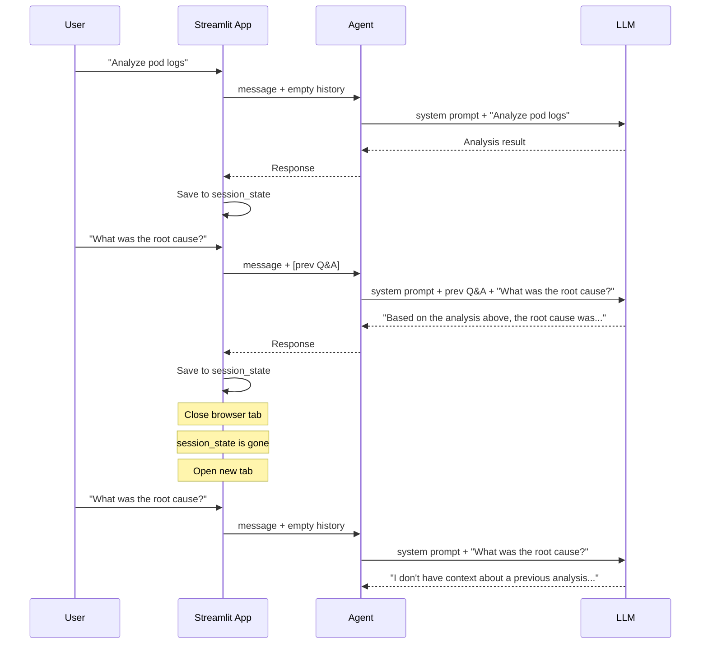
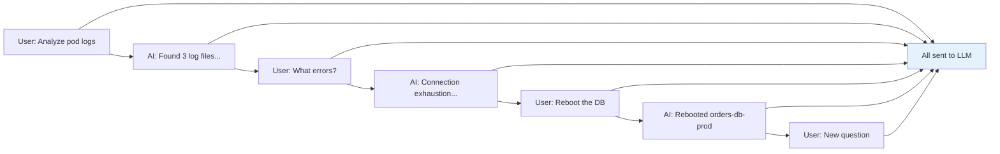
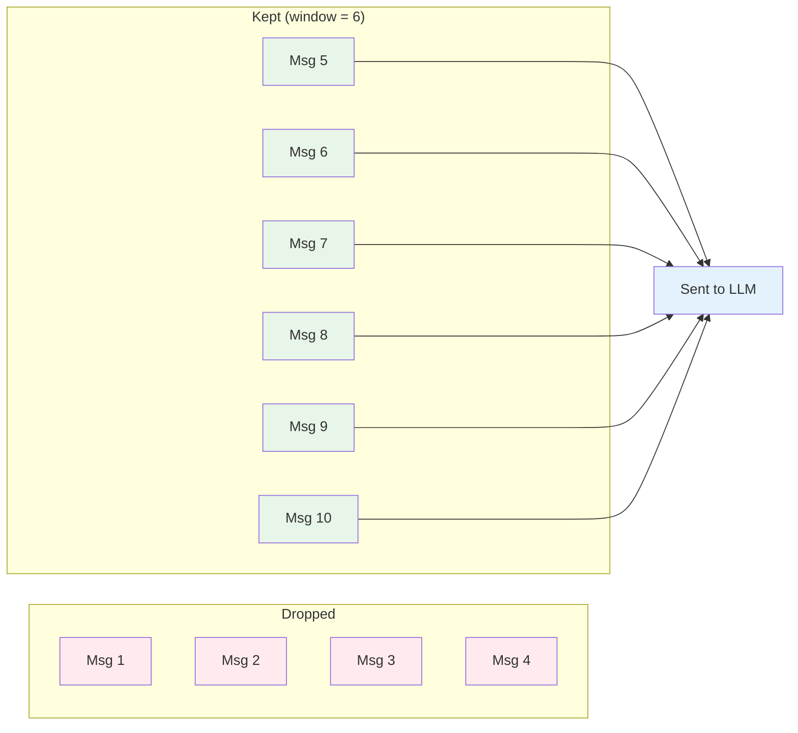
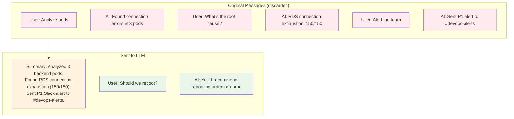
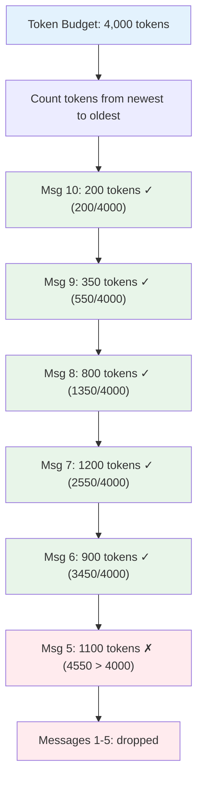
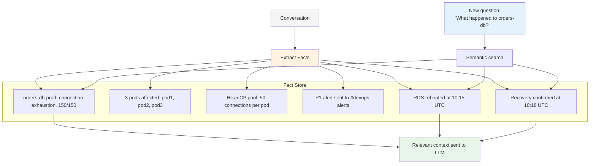
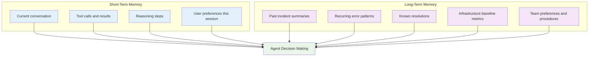
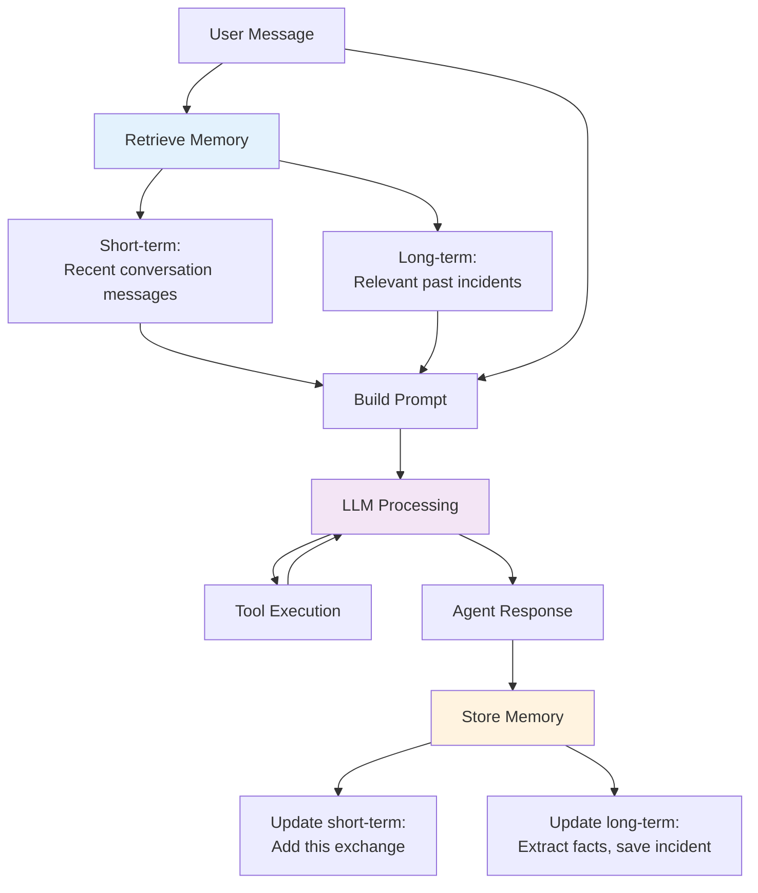
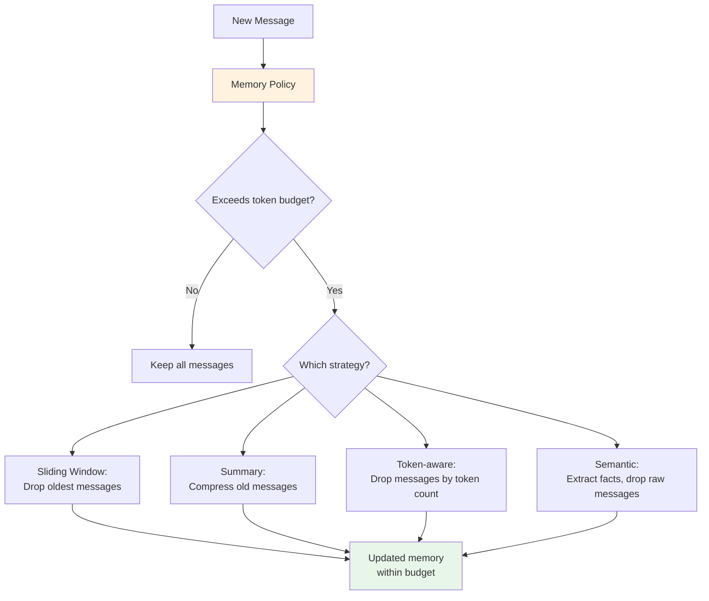
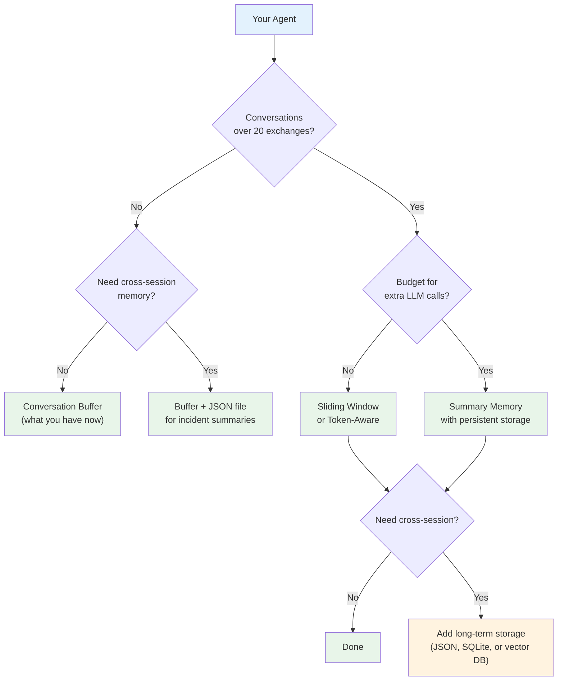

# Chapter 11: Understanding AI Memory

The agent we've built so far can analyze logs, send Slack alerts, and reboot databases. It handles a complete incident in a single conversation. But close the browser tab and open it again—the agent remembers nothing. Ask it about yesterday's database connection issue and it has no idea what you're talking about.

This is the memory problem. And before we solve it with code, we need to understand what memory actually means for AI agents, why it's harder than it sounds, and what trade-offs you're making with each approach.

## The Stateless Reality

Every time you call an LLM, it starts completely fresh. It has no memory of previous calls. It doesn't know what you asked five minutes ago, what tools it used, or what it recommended.

This surprises people who've used ChatGPT, because ChatGPT appears to remember your conversation. But the model itself doesn't remember anything. What happens behind the scenes is simple: the application sends the entire conversation history with every request. The model reads it all, generates a response, and immediately forgets everything.

Our agent does the same thing. Streamlit keeps the conversation in `st.session_state.messages`. Before each request, `app.py` converts that history into LangChain message objects and passes them to the agent. The LLM sees the whole conversation and responds in context.

Here's what that looks like:

The first two messages work because Streamlit passes the history along. The third message, after restarting, fails because the history is gone. The LLM isn't forgetting—it never knew in the first place. Memory is an illusion created by the application layer.

This is the fundamental insight: **AI memory is not inside the model. It's in the system you build around it.**

## The Context Window

If memory means sending previous messages with every request, there's an obvious question: how much can you send?

Every LLM has a context window—the maximum number of tokens it can process in a single request. Tokens are roughly words or word fragments. "connection pool exhaustion" is about 3-4 tokens. A typical log file is thousands of tokens.

Here's what context windows look like across popular models:

| Model | Context Window | Approximate Pages of Text |
|-------|---------------|--------------------------|
| GPT-3.5 | 16K tokens | ~25 pages |
| GPT-4 | 128K tokens | ~200 pages |
| GPT-4.1 | 1M tokens | ~1,500 pages |
| Claude 3.5 Sonnet | 200K tokens | ~300 pages |
| Gemini 2.5 Flash | 1M tokens | ~1,500 pages |

Those numbers look generous, but they fill up fast when you're working with log files. One of our log files is about 40 lines. Three pods means three files. Add the system prompt, the examples guidelines, the conversation history, and the tool call results from each iteration. After a few back-and-forth exchanges with tool calls, you've consumed tens of thousands of tokens.

Here's the problem: when you exceed the context window, the request fails. The LLM can't process it. You get an error, not a degraded response.

And even before you hit the hard limit, there are practical concerns:

**Cost**: Most providers charge per token. Sending 50K tokens of history with every request gets expensive, especially when most of that history is old log files the agent has already analyzed.

**Latency**: More tokens means longer processing time. When you're in the middle of an incident, waiting 30 seconds for a response because the model is reading through yesterday's conversation isn't acceptable.

**Attention degradation**: LLMs don't treat all tokens equally. Research shows that information in the middle of very long contexts gets less attention than information at the beginning or end. If the critical detail from a previous analysis is buried in the middle of a 100K-token conversation, the model might miss it.

So the naive approach—send everything every time—works for short conversations but breaks down as conversations grow or span multiple sessions.

This is where memory strategies come in. Each one answers the same question differently: **what do we keep, what do we discard, and how do we decide?**

## Types of AI Agent Memory

Think of memory types as different strategies for managing a budget. The budget is your context window. The strategies differ in what they keep, what they throw away, and how they summarize.

### Conversation Buffer Memory

The simplest approach. Store every message. Send all of them with every request.

This is what our agent does now through Streamlit's session state. Every previous message gets included in every request.

**When it works**: Short conversations. Quick investigations with a few exchanges. When you're analyzing one incident and the conversation stays under a few thousand tokens.

**When it breaks**: Long investigations. Multi-step debugging sessions where the agent reads dozens of log files and makes many tool calls. Each tool call adds tokens—the tool request, the result, and the LLM's response. After 15-20 exchanges, you've accumulated a lot of content.

**The trade-off**: Perfect recall at the cost of growing token usage. Every detail is preserved, but the cost and latency grow linearly with conversation length.

### Sliding Window Memory

Keep only the last N messages. Older messages get dropped.

Message 1 through 4 are gone. The agent can't reference them. If the user asks about something from message 2, the agent has no idea.

**When it works**: When recent context matters more than old context. Ongoing monitoring sessions where the current state matters more than what happened 30 messages ago.

**When it breaks**: When the user references something from early in the conversation. "Go back to that first error you found"—the agent can't, because that message was dropped.

**The trade-off**: Bounded token cost at the expense of losing old context. You control the maximum cost, but you lose the ability to reference anything outside the window.

### Summary Memory

Instead of keeping raw messages, periodically summarize older parts of the conversation. Send the summary plus recent messages.

The first six messages become a three-line summary. The agent knows the key facts—connection exhaustion, 150/150, P1 alert sent—without carrying the full log analysis, tool calls, and detailed responses.

**When it works**: Long conversations where you need the gist of what happened but not the exact words. Incident investigations that span many steps.

**When it breaks**: When exact details matter. If the summary says "found connection errors" but drops the specific pod names and timestamps, the agent can't reference those details later. The quality depends entirely on how good the summary is.

**The trade-off**: Compressed history at the expense of detail loss. You get more history in fewer tokens, but summaries are lossy. Important details can get summarized away.

There's another consideration: **who creates the summary?** If you use the LLM to summarize, that's an extra API call every time you condense messages. That adds latency and cost to the summarization step itself. If you use rule-based summarization (extract key entities and actions), it's faster but less intelligent.

### Token-Aware Memory

Instead of counting messages, count tokens. Keep as many recent messages as fit within a token budget.

This is smarter than a fixed window because message sizes vary wildly. A message containing a full log file might be 2,000 tokens. A "yes" confirmation is 1 token. A fixed window of 6 messages might include one massive log dump and five short exchanges, or six short exchanges—the token cost is unpredictable. Token-aware memory guarantees you stay within budget.

**When it works**: When you need predictable token costs. When messages vary significantly in size (which they do in log analysis—some messages are full log files, others are short questions).

**When it breaks**: Same as sliding window—old context gets dropped. But at least the dropping is token-aware, so you're making better use of your budget.

**The trade-off**: Predictable cost with variable message retention. You always know how many tokens you'll use, but you don't know how many messages that translates to.

### Semantic Memory

Store facts and entities extracted from conversations, not the conversations themselves. When the agent needs context, retrieve relevant facts based on the current question.

Instead of keeping the full conversation, you extract structured facts: "orders-db-prod had connection exhaustion at 150/150", "P1 alert sent", "RDS rebooted at 10:15". When the user asks a new question, you search for relevant facts and include only those.

This is the most sophisticated approach. It's also the most complex to implement.

**When it works**: Long-running agents that accumulate knowledge over days or weeks. When you want the agent to remember specific facts from hundreds of past conversations without sending all of them.

**When it breaks**: When the extraction misses important context. If the fact extractor doesn't capture the relationship between two facts ("the reboot was triggered because of connection exhaustion"), the agent loses that causal link. The quality depends on the extraction process.

**The trade-off**: Highly efficient retrieval at the expense of implementation complexity and potential information loss during extraction.

## Short-Term vs. Long-Term Memory

All the memory types above handle one conversation. But agents in production need to remember across conversations—across browser sessions, across days, across incidents.

This maps to a clear distinction:

**Short-term memory** is the current session. It's what we've been discussing—conversation buffer, sliding window, summary. It lives in memory (RAM) and dies when the session ends. It's fast, simple, and sufficient for single-incident investigations.

**Long-term memory** persists across sessions. It needs storage—a database, a file, a vector store. It survives restarts. It lets the agent say "This connection exhaustion pattern happened three times this month" or "Last time this happened, we increased the connection pool to 75 and it resolved the issue."

For our logging agent, the practical difference is:

| | Short-Term | Long-Term |
|--|-----------|-----------|
| **Scope** | One incident investigation | All past incidents |
| **Storage** | Session state (RAM) | Database / file |
| **Lifetime** | Until browser tab closes | Permanent |
| **Retrieval** | Sequential (full history) | Search-based (relevant items) |
| **Cost** | Grows with conversation | Grows with history, but filtered |
| **Example** | "You found 3 errors in pod1" | "This is the 4th connection exhaustion this month" |

Most production agents use both. Short-term memory handles the current conversation. Long-term memory provides institutional knowledge.

## Where Memory Sits in the Agent Loop

Understanding where memory integrates into the agent architecture helps you design it correctly.

Memory is read at the start and written at the end. Before the LLM sees the user's message, the system retrieves relevant context from both short-term and long-term memory. After the LLM responds, the system saves the new exchange.

In our current agent, the "retrieve" step is `to_langchain(st.session_state.messages[:-1])` in `app.py`. The "store" step is `st.session_state.messages.append(...)`. Both are short-term only.

Adding long-term memory means adding a second retrieval source and a second storage destination. The agent logic doesn't change—it still receives context and produces responses. The memory system surrounding it changes.

This is an important architectural principle: **memory is infrastructure, not intelligence**. The LLM doesn't "remember." Your code remembers for it.

## The Forgetting Problem

Memory isn't just about remembering. It's about forgetting the right things.

An agent that remembers everything will eventually hit the context window limit. An agent that forgets too aggressively loses important context. The art is in finding the balance.

Consider a real scenario. Your agent has been running for a month. It's handled 200 incidents. Each incident involved an average of 10 tool calls and 5 exchanges. That's 200 × 15 = 3,000 messages in long-term storage.

You can't send all 3,000 messages to the LLM. You need to decide:

- **What's worth keeping?** The incident summary, not every log line. The resolution, not every intermediate tool call.
- **What's worth retrieving?** If the current issue is connection exhaustion, past connection exhaustion incidents are relevant. Past disk space issues probably aren't.
- **When do we compact?** After an incident is resolved, compress the full conversation into a structured summary.

This is where memory strategies become memory policies. A policy defines the rules:

There's no universal best policy. It depends on your use case. But here's a practical framework for deciding.

## Memory in the DevOps Context

For log analysis agents specifically, certain types of context are more valuable than others. Understanding this helps you design the right memory strategy.

### High-Value Memory (Always Keep)

**Incident summaries**: "On Feb 6, orders-db-prod hit 150/150 connections. Root cause: 3 pods × 50 max pool. Resolved by RDS reboot. Downtime: 3 minutes."

This is the kind of thing that lets the agent say: "This is the same pattern as the February 6 incident. Last time, an RDS reboot resolved it in 3 minutes."

**Known resolutions**: "Connection exhaustion → reboot RDS. OOM on pod → restart pod and investigate heap settings. Certificate expiry → renew cert, restart affected services."

A knowledge base of problem-solution pairs makes the agent faster and more accurate over time.

**Infrastructure facts**: "orders-db-prod is db.t3.medium with 150 max connections. Backend runs 3 pods with HikariCP pool of 50 each. ALB health check interval is 30 seconds."

These rarely change but are referenced frequently. Keeping them in long-term memory saves the agent from rediscovering them every session.

### Medium-Value Memory (Keep Summarized)

**Conversation history**: The back-and-forth of an investigation. Useful during the session but only the summary matters afterward.

**Tool results**: The full output of `read_log_file`. Important during analysis, but after the incident is diagnosed, only the extracted findings matter.

### Low-Value Memory (Safe to Discard)

**Intermediate reasoning**: The agent's step-by-step thinking. Useful for debugging but not for future reference.

**Duplicate information**: If the agent read the same log file three times during an investigation, keeping all three results is wasteful.

**Failed attempts**: If the agent tried a tool and it errored out, the error message is useful in the moment but rarely relevant later.

### Mapping Values to Strategies

| Memory Content | Strategy | Retention |
|---------------|----------|-----------|
| Current conversation | Buffer / sliding window | Session lifetime |
| Incident summaries | Long-term, structured | Permanent |
| Known resolutions | Long-term, searchable | Permanent |
| Infrastructure facts | Long-term, key-value | Until infrastructure changes |
| Raw tool results | Short-term only | Current session |
| Full log contents | Discard after analysis | Never persisted |

This mapping tells you exactly what to store and how. You don't need a sophisticated vector database for everything. Incident summaries can be a JSON file. Infrastructure facts can be a config file. Known resolutions can be a simple lookup table. Only semantic search over hundreds of incidents needs a vector store—and that's an optimization, not a requirement for getting started.

## Choosing the Right Strategy

Here's a decision framework based on three questions:

**1. How long are your conversations?**

If most conversations are under 10 exchanges, conversation buffer is sufficient. Don't optimize for a problem you don't have. Our agent typically resolves an incident in 5-8 exchanges. Buffer memory handles that comfortably.

If conversations regularly exceed 20-30 exchanges (complex multi-system investigations), you need sliding window or summary memory to stay within token budgets.

**2. Do you need cross-session memory?**

If the agent is used for one-off investigations—open a session, analyze an incident, close the session—short-term memory is enough.

If the agent runs continuously or is used by a team that wants it to learn from past incidents, you need long-term memory with persistent storage.

**3. What's your cost tolerance?**

Summary memory requires extra LLM calls to generate summaries. Semantic memory requires embedding generation and vector storage. These add cost and complexity. If you're on a budget, start with buffer memory and a JSON file for incident summaries. You can add sophistication later.

For our logging agent, the practical recommendation is: **start with conversation buffer for short-term, and a simple file-based store for long-term incident summaries**. You can add summary compression and semantic search later if you need them. Most teams don't need them on day one.

## What Memory Is Not

Before we move to implementation, let me clear up some common misconceptions.

**Memory is not fine-tuning.** Fine-tuning changes the model's weights based on training data. Memory changes the input the model receives. Fine-tuning is permanent and expensive. Memory is dynamic and cheap. For most DevOps use cases, memory is what you want.

**Memory is not RAG.** Retrieval-Augmented Generation (RAG) retrieves documents from an external knowledge base and injects them into the prompt. Memory retrieves past conversations and facts. The mechanism is similar—both inject context into the prompt—but the data source is different. RAG pulls from documentation. Memory pulls from interaction history.

**Memory doesn't make the model smarter.** The same model with good memory and poor memory produces different results—not because the model changed, but because it's working with different information. A model with relevant incident history in its context will give you better recommendations than the same model without that context. The intelligence is the same. The context is different.

**Memory has diminishing returns.** More memory isn't always better. Including irrelevant past incidents dilutes the model's attention. Including too much detail increases cost without improving quality. The goal isn't maximum memory—it's the right memory at the right time.

## Looking at the Landscape

If you've used tools like Redis, you know that Redis offers different data structures for different use cases—strings for simple values, lists for queues, sets for unique collections, sorted sets for ranked data. You pick the right structure based on your access pattern.

AI memory works the same way. Different memory types serve different access patterns:

| Access Pattern | Memory Type | Analogy |
|---------------|-------------|---------|
| "What did we just discuss?" | Conversation buffer | Redis string (simple, full value) |
| "What happened recently?" | Sliding window | Redis list with LTRIM (bounded) |
| "What's the gist of our conversation?" | Summary | Redis sorted set (compressed ranking) |
| "What do you know about orders-db?" | Semantic / fact-based | Redis hash (field → value lookup) |
| "Find similar past incidents" | Vector semantic search | Redis search with vector similarity |

The point isn't that you need all of them. The point is that each serves a different need, and you should pick based on your actual usage pattern—not based on which sounds most impressive.

## What's Next

You now understand what AI memory is: context management around a stateless model. You know the five main strategies—buffer, sliding window, summary, token-aware, and semantic—and the trade-offs of each. You understand the difference between short-term and long-term memory, where memory sits in the agent architecture, and what types of information are worth keeping for DevOps agents.

In **Chapter 12**, you'll implement memory for our logging agent. You'll add session persistence so the conversation survives page refreshes. You'll add incident summaries that persist across sessions. And you'll build the retrieval logic that injects relevant past incidents into the agent's context.

The theory is clear. Next, you build it.
