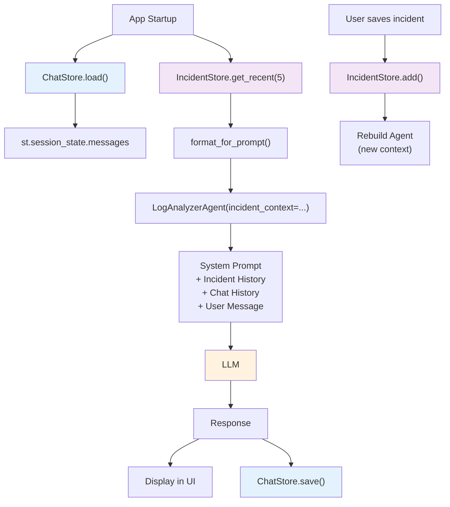
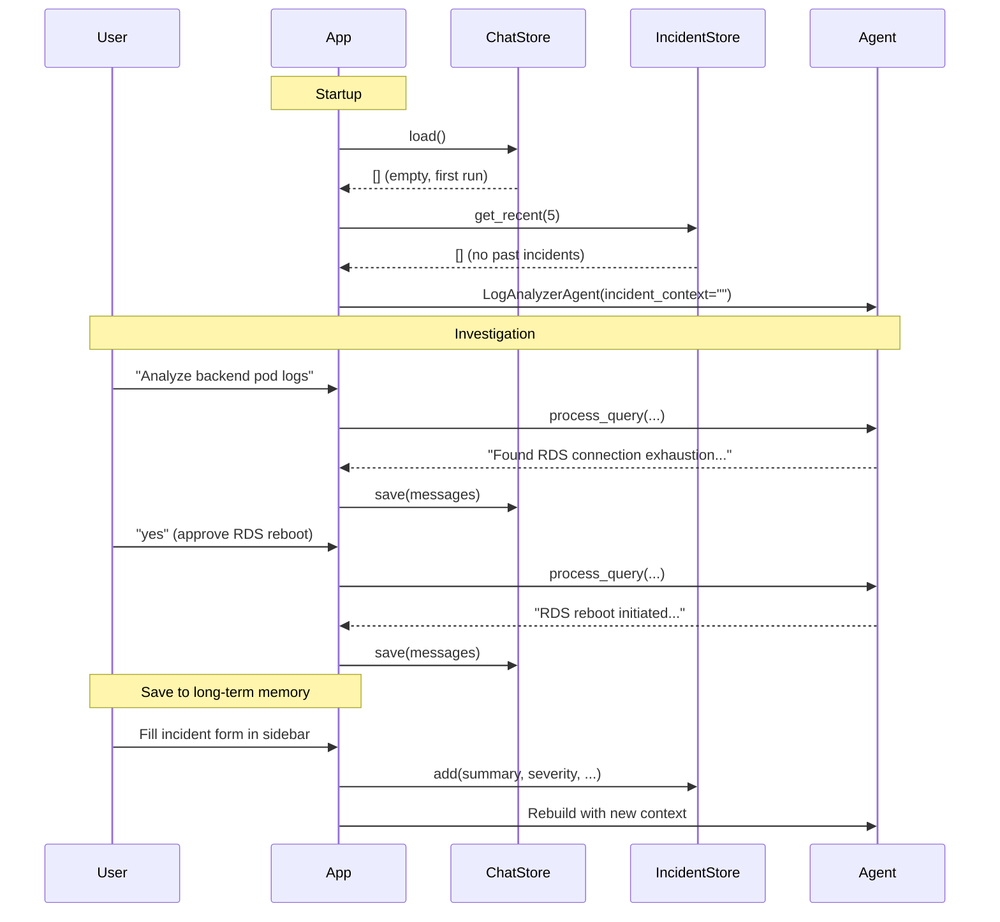
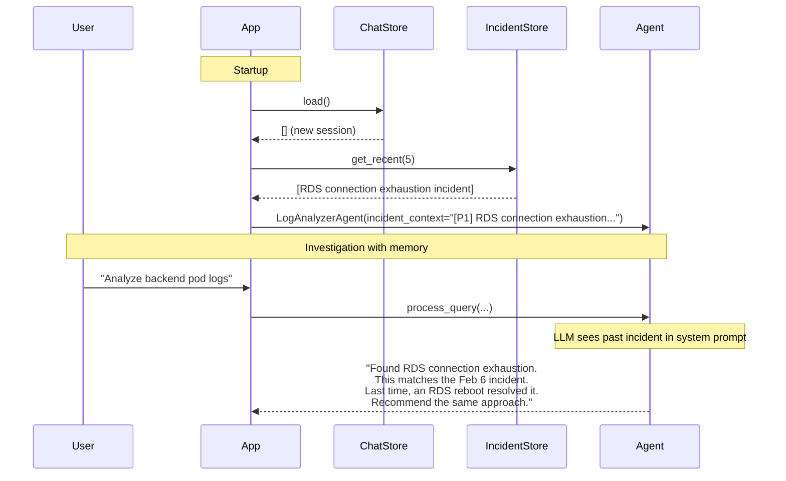

# Chapter 12: Implementing Memory and State Management

The previous chapter explained what AI memory is: context management around a stateless model. You learned the five memory strategies, the difference between short-term and long-term memory, and how to choose the right approach for your use case.

Now we build it.

We're adding two kinds of memory to our agent. First, **session persistence**: the conversation survives page refreshes and application restarts. No more losing your analysis when you accidentally close the tab. Second, **incident memory**: the agent remembers past incidents and uses that history to inform future investigations.

The implementation is deliberately simple. JSON files, no database, no vector store. This is the "conversation buffer + JSON file for incident summaries" approach from the decision framework in the last chapter. It covers what most teams need on day one. You can add sophistication later.

## What Changes

Here's what's different from the previous chapter's code:

| Component | Before | After |
|-----------|--------|-------|
| Conversation storage | `st.session_state` (RAM only) | `ChatStore` (JSON file on disk) |
| Past incidents | None | `IncidentStore` (structured JSON) |
| Agent context | System prompt only | System prompt + past incident summaries |
| Page refresh | Conversation lost | Conversation restored |
| Cross-session knowledge | None | "This looks like the Feb 6 incident" |

The agent logic—tool calling, approval flow, progress callbacks—stays identical. We're wrapping the existing system with a persistence layer.

## Project Structure

The new `memory/` package sits alongside the existing modules:

```
12/
├── app.py
├── system_prompt.txt
├── examples.txt
├── .memory/                     # Created at runtime (gitignored)
│   ├── session_default.json     # Persisted conversation
│   └── incidents.json           # Long-term incident memory
└── src/
    ├── config.py                # + MEMORY_DIR setting
    ├── memory/                  # NEW
    │   ├── __init__.py
    │   ├── chat_store.py        # Session persistence
    │   └── incident_store.py    # Incident long-term memory
    ├── agents/
    │   └── log_analyzer.py      # + incident_context parameter
    ├── models/
    ├── tools/
    └── utils/
```

The `.memory/` directory is created automatically on first run and excluded from version control. You don't want to commit conversation history or incident data to your repository.

Here's how data flows through the system:



Two separate flows: short-term memory (blue) handles the conversation. Long-term memory (purple) handles incident history. They converge at the agent, where both get injected into the prompt.

## The Chat Store

The `ChatStore` class persists the conversation to a JSON file. It's straightforward file I/O with one design choice worth explaining.

```python
# src/memory/chat_store.py

import json
from pathlib import Path
from datetime import datetime


class ChatStore:
    """
    File-backed conversation store.

    Each session is saved as a JSON file containing the message list.
    Messages are the same dicts used by Streamlit session_state:
        {"role": "user"|"assistant", "content": str, "steps": [...]}
    """

    def __init__(self, storage_dir: str, session_id: str = "default"):
        self.storage_dir = Path(storage_dir)
        self.storage_dir.mkdir(parents=True, exist_ok=True)
        self.session_id = session_id
        self._path = self.storage_dir / f"session_{session_id}.json"
```

The constructor creates the storage directory if it doesn't exist and builds a file path from the session ID. The default session is `"default"`, which means single-user local use works out of the box. If you later want to support multiple users or named sessions, you just pass a different ID.

The `load` and `save` methods handle the actual persistence:

```python
    def load(self) -> list:
        """Load messages from disk. Returns empty list if no file exists."""
        if not self._path.exists():
            return []
        try:
            data = json.loads(self._path.read_text(encoding="utf-8"))
            return data.get("messages", [])
        except (json.JSONDecodeError, KeyError):
            return []

    def save(self, messages: list) -> None:
        """Write the full message list to disk."""
        data = {
            "session_id": self.session_id,
            "updated_at": datetime.now().isoformat(),
            "messages": messages,
        }
        self._path.write_text(
            json.dumps(data, indent=2, default=str),
            encoding="utf-8",
        )
```

The design choice: we save the *entire* message list every time, not incremental appends. This is simpler and avoids corruption issues. If the app crashes mid-write, you lose the last message but not the whole file. For a conversation that's typically 10-30 messages, writing the full list takes microseconds. If you were storing thousands of messages, you'd want a database instead.

The `clear` method deletes the session file, and `list_sessions` scans the storage directory for all existing sessions:

```python
    def clear(self) -> None:
        """Delete the session file."""
        if self._path.exists():
            self._path.unlink()

    def list_sessions(self) -> list[str]:
        """Return session IDs for all stored sessions."""
        sessions = []
        for f in sorted(self.storage_dir.glob("session_*.json")):
            sid = f.stem.removeprefix("session_")
            sessions.append(sid)
        return sessions
```

The `list_sessions` method exists for future use. When you add multi-session support—switching between different investigations—you'll need to enumerate available sessions.

Here's what the stored JSON looks like:

```json
{
  "session_id": "default",
  "updated_at": "2024-02-06T10:30:00",
  "messages": [
    {
      "role": "user",
      "content": "Analyze backend pod logs and detect issues"
    },
    {
      "role": "assistant",
      "content": "I found RDS connection exhaustion across all 3 backend pods...",
      "steps": [
        {"label": "Listing log files", "detail": "[OK] found 3 log files"},
        {"label": "Reading log file", "detail": "[OK] file read"}
      ]
    }
  ]
}
```

Messages use the same format as Streamlit's session state. No conversion needed. The `steps` field—tool execution progress from `StreamlitProgress`—gets persisted too, so when you reload the page, the collapsible thinking steps are still there.

## The Incident Store

The `IncidentStore` handles long-term memory. While `ChatStore` manages a single conversation, `IncidentStore` accumulates knowledge across all conversations.

Each incident is a structured record:

```python
# src/memory/incident_store.py

import json
from pathlib import Path
from datetime import datetime


class IncidentStore:
    """
    File-backed incident memory.

    Each incident is a dict with:
        id, timestamp, severity, summary, root_cause,
        affected_systems, resolution, session_id
    """

    def __init__(self, storage_dir: str):
        self.storage_dir = Path(storage_dir)
        self.storage_dir.mkdir(parents=True, exist_ok=True)
        self._path = self.storage_dir / "incidents.json"
        self._incidents: list[dict] = self._load()
```

The store loads all incidents into memory on startup. For the scale we're operating at—dozens to hundreds of incidents—this is fine. If you accumulate thousands, you'd switch to SQLite.

Adding an incident writes to disk immediately:

```python
    def add(
        self,
        summary: str,
        severity: str = "P1",
        root_cause: str = "",
        affected_systems: str = "",
        resolution: str = "",
        session_id: str = "",
    ) -> dict:
        """Save a new incident summary and return it."""
        incident = {
            "id": len(self._incidents) + 1,
            "timestamp": datetime.now().isoformat(),
            "severity": severity,
            "summary": summary,
            "root_cause": root_cause,
            "affected_systems": affected_systems,
            "resolution": resolution,
            "session_id": session_id,
        }
        self._incidents.append(incident)
        self._save()
        return incident
```

Notice the fields. They're not arbitrary—they map to how experienced DevOps engineers think about incidents:

- **severity**: P1/P2/P3/info. Matches the classification the agent already uses.
- **summary**: One-line description. "RDS connection exhaustion on orders-db-prod."
- **root_cause**: What caused it. "3 pods × 50 connections = 150, matching db.t3.medium limit."
- **affected_systems**: What broke. "orders-db-prod, backend-orders pods 1-3."
- **resolution**: What fixed it. "RDS reboot. Long-term: reduce pool to 30 per pod."
- **session_id**: Links the incident back to the conversation where it was diagnosed.

These fields give the agent structured data to work with. When it sees "RDS connection exhaustion" in today's logs and finds a past incident with the same summary and a known resolution, it can immediately suggest the same fix.

### Retrieval

The store provides three retrieval methods, sorted newest-first:

```python
    def get_all(self) -> list[dict]:
        """Return all stored incidents (newest first)."""
        return list(reversed(self._incidents))

    def get_recent(self, n: int = 5) -> list[dict]:
        """Return the N most recent incidents."""
        return list(reversed(self._incidents[-n:]))

    def search(self, query: str) -> list[dict]:
        """
        Simple keyword search across incident fields.
        Returns incidents whose summary, root_cause, or affected_systems
        contain the query string (case-insensitive).
        """
        q = query.lower()
        results = []
        for inc in self._incidents:
            searchable = " ".join([
                inc.get("summary", ""),
                inc.get("root_cause", ""),
                inc.get("affected_systems", ""),
                inc.get("resolution", ""),
            ]).lower()
            if q in searchable:
                results.append(inc)
        return list(reversed(results))
```

`get_recent(5)` is the primary method—we load the 5 most recent incidents into the agent's context at startup. `search()` is for future use: when you want the agent to search for specific past incidents based on the current error pattern.

The search is simple keyword matching, not semantic similarity. If you search for "connection", you get every incident that mentions "connection" in any field. For our scale, this works well. If you later need "find incidents similar to this one even if they use different words," that's when you'd add a vector database with embeddings.

### Formatting for the Prompt

The key method is `format_for_prompt()`. It converts structured incidents into text the LLM can understand:

```python
    def format_for_prompt(self, incidents: list[dict]) -> str:
        if not incidents:
            return ""

        lines = ["PAST INCIDENTS (from long-term memory):\n"]
        for inc in incidents:
            lines.append(
                f"- [{inc['severity']}] {inc['summary']} "
                f"({inc['timestamp'][:10]})"
            )
            if inc.get("root_cause"):
                lines.append(f"  Root cause: {inc['root_cause']}")
            if inc.get("resolution"):
                lines.append(f"  Resolution: {inc['resolution']}")
            lines.append("")

        lines.append(
            "Use this history to identify recurring patterns. "
            "If the current issue matches a past incident, reference it."
        )
        return "\n".join(lines)
```

This produces output like:

```
PAST INCIDENTS (from long-term memory):

- [P1] RDS connection exhaustion on orders-db-prod (2024-02-06)
  Root cause: 3 pods × 50 connections = 150, matching db.t3.medium limit
  Resolution: RDS reboot. Long-term: reduce pool to 30 per pod

- [P2] Slow query on orders API causing timeout cascade (2024-01-22)
  Root cause: Missing index on orders.customer_id
  Resolution: Added composite index, query time dropped from 12s to 40ms

Use this history to identify recurring patterns. If the current issue matches a past incident, reference it.
```

The last line is an instruction to the LLM. Without it, the model might see the incidents but not actively use them. With it, the model compares the current situation to past incidents and says things like: "This looks like the February 6 incident. Last time, an RDS reboot resolved it in 3 minutes."

That's the whole point of long-term memory for a DevOps agent: institutional knowledge that improves investigation quality over time.

## Connecting Memory to the Agent

The agent needs two changes: accept incident context, and include it in the system prompt.

```python
# src/agents/log_analyzer.py

class LogAnalyzerAgent:
    def __init__(self, incident_context: str = ""):
        self.model = create_model()
        self.tools = get_all_tools()
        self.llm = self.model.get_llm_with_tools(self.tools)

        system_prompt = Config.get_system_prompt()
        if incident_context:
            system_prompt += "\n\n" + incident_context

        self.prompt = ChatPromptTemplate.from_messages([
            ("system", system_prompt),
            MessagesPlaceholder(variable_name="chat_history"),
            ("user", "{input}"),
        ])
```

That's it. Three lines of change. The `incident_context` parameter defaults to empty string, so the agent works exactly as before when no incidents are stored. When incidents exist, they get appended to the system prompt.

The system prompt now looks like this at runtime:

```
[system_prompt.txt contents]

[examples.txt contents]

PAST INCIDENTS (from long-term memory):

- [P1] RDS connection exhaustion on orders-db-prod (2024-02-06)
  Root cause: 3 pods × 50 connections = 150
  Resolution: RDS reboot. Reduce pool to 30 per pod

Use this history to identify recurring patterns.
If the current issue matches a past incident, reference it.
```

The LLM sees its role, its guidelines, and its institutional knowledge—all in one prompt. The tool loop, approval flow, and everything else stays unchanged.

Why append to the system prompt instead of injecting incidents as a separate message? Because system prompt content gets the highest attention from the LLM. Information in the system message is treated as foundational context, not conversation ephemera.

## Updating the Configuration

One new setting in `Config`:

```python
# src/config.py

# Paths
LOG_DIRECTORY = os.getenv('LOG_DIRECTORY', 'logs')
MEMORY_DIR = os.getenv('MEMORY_DIR', '.memory')
```

The `.memory` directory sits in the project root. The dot prefix makes it a hidden directory on Unix systems—consistent with `.env`, `.gitignore`, and other configuration files. The `.gitignore` excludes it:

```
# Memory storage
.memory/
```

The `.env.example` documents the setting:

```dotenv
# Optional: Memory storage directory (sessions + incidents)
MEMORY_DIR=.memory
```

## Updating the Web Interface

The UI changes are in `app.py`. There are three additions: initializing memory stores, displaying memory state in the sidebar, and saving conversations after each exchange.

### Initialization

```python
def init_session():
    Config.validate()

    # Initialise memory stores once
    if "chat_store" not in st.session_state:
        st.session_state.chat_store = ChatStore(Config.MEMORY_DIR)
    if "incident_store" not in st.session_state:
        st.session_state.incident_store = IncidentStore(Config.MEMORY_DIR)

    # Load persisted conversation (survives page refreshes)
    if "messages" not in st.session_state:
        st.session_state.messages = st.session_state.chat_store.load()

    # Build the agent with past-incident context
    if "agent" not in st.session_state:
        incident_store = st.session_state.incident_store
        recent = incident_store.get_recent(5)
        context = incident_store.format_for_prompt(recent)
        st.session_state.agent = LogAnalyzerAgent(incident_context=context)
```

Compare this to the previous version:

```python
# Before (no memory)
def init_session():
    if "messages" not in st.session_state:
        st.session_state.messages = []
    if "agent" not in st.session_state:
        Config.validate()
        st.session_state.agent = LogAnalyzerAgent()
```

The old version started with an empty message list every time. The new version loads whatever was saved from the previous session. If this is the first run, `chat_store.load()` returns an empty list—same behavior as before.

The agent creation now includes incident context. The flow is: load incidents from disk → format the 5 most recent → pass as `incident_context` to the agent. If there are no incidents, the context is empty and the agent behaves exactly as it did before.

This is important: **memory is additive, not breaking**. Every change is backward-compatible. An agent with no stored incidents works identically to the original.

### Memory Sidebar

The sidebar now shows memory status and provides a form for saving incidents:

```python
# ── Memory section ──────────────────────────────────
st.markdown("---")
st.subheader("Memory")
incident_store: IncidentStore = st.session_state.incident_store
n_incidents = incident_store.count()
n_messages = len(st.session_state.messages)
st.markdown(f"- Chat messages: **{n_messages}**")
st.markdown(f"- Past incidents: **{n_incidents}**")

if n_incidents > 0:
    with st.expander("Recent incidents", expanded=False):
        for inc in incident_store.get_recent(3):
            st.write(
                f"**[{inc['severity']}]** {inc['summary']}  \n"
                f"_{inc['timestamp'][:10]}_"
            )
```

Users can see at a glance how many messages are in the current session and how many incidents the agent has in its long-term memory. The expandable section shows the 3 most recent incidents.

The incident form lets users save incidents directly from the sidebar:

```python
# ── Save incident ───────────────────────────────────
st.subheader("Save Incident")
with st.form("save_incident", clear_on_submit=True):
    summary = st.text_input("Summary",
        placeholder="RDS connection exhaustion on orders-db-prod")
    severity = st.selectbox("Severity", ["P1", "P2", "P3", "info"])
    root_cause = st.text_input("Root cause",
        placeholder="3 pods × 50 conn = 150 max")
    resolution = st.text_input("Resolution",
        placeholder="RDS reboot, pool resize to 30")
    affected = st.text_input("Affected systems",
        placeholder="orders-db-prod, backend pods")
    submitted = st.form_submit_button("Save to memory")
    if submitted and summary:
        incident_store.add(
            summary=summary,
            severity=severity,
            root_cause=root_cause,
            resolution=resolution,
            affected_systems=affected,
            session_id=st.session_state.chat_store.session_id,
        )
        # Rebuild agent so it picks up the new incident
        recent = incident_store.get_recent(5)
        context = incident_store.format_for_prompt(recent)
        st.session_state.agent = LogAnalyzerAgent(incident_context=context)
        st.rerun()
```

When a user saves an incident, the agent gets rebuilt with the updated context. The `st.rerun()` refreshes the page so the sidebar reflects the new incident count.

Why a manual form instead of auto-extracting incidents from conversations? Two reasons. First, the agent doesn't always resolve a complete incident in one conversation—sometimes users just ask questions. Automatically saving everything would pollute the incident store with noise. Second, manual saving gives the user control over what the agent remembers. The user decides which incidents are worth remembering and ensures the summary, root cause, and resolution are accurate.

A future improvement could offer a "Save this incident" button after the agent completes a remediation workflow, pre-filling the fields from the conversation. But starting with manual control is the right trade-off for now.

### Persisting After Each Exchange

The main loop gets one new line at the end:

```python
        st.session_state.messages.append({
            "role": "assistant",
            "content": response,
            "steps": progress.steps,
        })

        # Persist conversation to disk
        st.session_state.chat_store.save(st.session_state.messages)
```

Every exchange—user message plus assistant response—triggers a save. This means the conversation is always up to date on disk. If the page refreshes between exchanges, you lose nothing.

### Clear and Reset

The sidebar provides two separate clear buttons:

```python
col1, col2 = st.columns(2)
with col1:
    if st.button("Clear Chat", use_container_width=True):
        st.session_state.messages = []
        st.session_state.chat_store.clear()
        st.rerun()
with col2:
    if st.button("Clear Memory", use_container_width=True):
        st.session_state.incident_store.clear()
        recent = st.session_state.incident_store.get_recent(5)
        context = st.session_state.incident_store.format_for_prompt(recent)
        st.session_state.agent = LogAnalyzerAgent(incident_context=context)
        st.rerun()
```

"Clear Chat" wipes the current conversation—both from Streamlit's session state and from the JSON file on disk. "Clear Memory" wipes the incident store and rebuilds the agent without incident context. These are separate because you often want to start a new conversation without losing your incident history.

## How It All Works Together

Let's walk through a complete scenario to see the memory system in action.

### First Session: The Initial Incident

You start the agent fresh. No incidents in memory. You type: "Analyze backend pod logs."



The conversation plays out as before: agent reads logs, sends Slack alert, recommends RDS reboot, user approves, reboot executes. Everything is saved to the chat store after each exchange.

After the incident is resolved, the user fills in the incident form in the sidebar: "RDS connection exhaustion on orders-db-prod", severity P1, root cause "3 pods × 50 connections = 150 max", resolution "RDS reboot, reduce pool to 30 per pod."

The incident is saved to `.memory/incidents.json`. The agent is rebuilt with this incident in its context.

### Second Session: The Recurring Incident

A week later, the same issue happens. The user opens the agent and types: "Analyze backend pod logs."



The difference is in the agent's response. Without incident memory, it would analyze from scratch and reach the same conclusion. With incident memory, it recognizes the pattern, references the past incident, and suggests the known fix immediately. The agent is faster and more confident because it has history to draw on.

This is the value of long-term memory for DevOps: **turning individual investigations into institutional knowledge**.

### Page Refresh: Continuity

During either session, if you refresh the page or close and reopen the tab:

1. Streamlit's `session_state` is reset
2. `init_session()` runs again
3. `ChatStore.load()` reads the saved conversation from disk
4. `IncidentStore.get_recent(5)` loads past incidents
5. The agent is rebuilt with both

The conversation appears exactly as you left it. The thinking steps in their collapsible expanders, the tool results, the complete history. No data loss.

## What Gets Stored on Disk

After running the agent, the `.memory/` directory contains:

```
.memory/
├── session_default.json    # Current conversation (short-term)
└── incidents.json          # All saved incidents (long-term)
```

The session file is a single JSON file per session ID. It contains the full message list, including thinking steps. When the user clears the chat, this file is deleted.

The incidents file is a JSON array of all incidents ever saved. It grows over time. A typical incident is about 200 bytes. Even 1,000 incidents would be about 200 KB—negligible.

```json
[
  {
    "id": 1,
    "timestamp": "2024-02-06T10:30:00",
    "severity": "P1",
    "summary": "RDS connection exhaustion on orders-db-prod",
    "root_cause": "3 pods × 50 connections = 150, matching db.t3.medium limit",
    "affected_systems": "orders-db-prod, backend-orders pods 1-3",
    "resolution": "RDS reboot. Long-term: reduce pool to 30 per pod",
    "session_id": "default"
  }
]
```

## Running the Updated Agent

Start the agent the same way:

```bash
cd 03-ai-agent-for-devops/code/12
make install
make run
```

The first time you run it, the `.memory/` directory is created automatically. The sidebar shows "Chat messages: 0" and "Past incidents: 0."

Try this workflow:

1. Type "Analyze backend pod logs and detect issues"
2. The agent analyzes, sends a Slack alert, recommends RDS reboot
3. Refresh the page — your conversation is still there
4. After the investigation, fill in the incident form in the sidebar
5. Clear the chat and start a new conversation
6. Ask the same question — the agent references the past incident in its response

## Design Decisions

### Why JSON Files Instead of a Database?

JSON files are the simplest possible persistence. No dependencies, no setup, no connection strings. You can read them in any text editor, copy them between machines, and version control them if you want.

For a single-user local agent, this is the right choice. You trade concurrent write safety and query performance for simplicity. When you need multi-user support or faster search over thousands of incidents, migrate to SQLite or PostgreSQL. The `ChatStore` and `IncidentStore` interfaces stay the same—you just swap the implementation behind `_load` and `_save`.

### Why Manual Incident Saving?

Automated extraction from conversations is appealing but unreliable. The agent might investigate but not reach a conclusion. The user might ask hypothetical questions. A conversation might cover multiple topics. Automatically classifying "this conversation is a resolved incident" requires its own AI inference, and getting it wrong pollutes the memory.

Manual saving through the sidebar form gives the user full control. They save incidents when they're confident in the summary and resolution. This keeps the incident store high-quality and the agent's memory accurate.

### Why Rebuild the Agent on New Incidents?

When a user saves an incident, we create a new `LogAnalyzerAgent` instance with updated context:

```python
recent = incident_store.get_recent(5)
context = incident_store.format_for_prompt(recent)
st.session_state.agent = LogAnalyzerAgent(incident_context=context)
```

This is simpler than trying to modify the existing agent's system prompt at runtime. LangChain's `ChatPromptTemplate` is immutable after creation. Creating a fresh agent is cheap—it just initializes a model wrapper and binds tools. The conversation history is maintained separately in `st.session_state.messages`, so nothing is lost.

### Why 5 Recent Incidents?

`get_recent(5)` is a practical default. Five incidents provide useful context without consuming too many tokens. Each incident is roughly 50-100 tokens. Five incidents add 250-500 tokens to the system prompt—about 0.5% of even a 100K context window.

If your team resolves 20 incidents a week and you want a month of history, increase it to 80. If you only care about the last few days, reduce it to 3. The number is a parameter, not a hard limit.

## Looking Forward

The memory system you've built handles two real needs: conversation persistence and incident history. It's production-viable for a single-user agent and simple enough to understand, debug, and extend.

What it doesn't do yet:

**Automatic summarization**: After a long conversation, the full message list gets expensive to send. Summary memory—compressing old messages into a brief recap—would keep the token cost bounded as conversations grow.

**Semantic search**: Keyword search works for exact matches. When you want "find incidents that are similar to this one" without matching exact words, you'd add vector embeddings and similarity search.

**Multi-user support**: The current store uses a single default session. Adding user authentication and per-user sessions would make this team-ready.

**Automatic incident extraction**: After the agent completes a remediation workflow (tool calls that include a Slack alert and an infrastructure action), the system could auto-suggest an incident summary for the user to confirm and save.

These are real improvements, but they're optimizations. The foundation you've built—separate stores for conversations and incidents, structured incident records, prompt injection for long-term context—supports all of them without architectural changes.

## What You've Learned

You started this chapter with an agent that forgot everything between sessions. Now you have:

- **Session persistence**: Conversations survive page refreshes and restarts through `ChatStore`, a JSON-backed file store.
- **Incident memory**: Structured long-term storage through `IncidentStore`, with severity, root cause, affected systems, and resolution fields.
- **Prompt injection**: Past incidents are formatted and appended to the system prompt so the LLM sees institutional knowledge alongside its role and guidelines.
- **Memory-aware UI**: The sidebar shows memory status, displays recent incidents, and provides a form for saving new ones.
- **Backward compatibility**: Every change is additive. An agent with no stored data behaves identically to the previous version.

The key insight is practical: **you don't need a vector database, embedding models, or a complex retrieval pipeline to give your agent useful memory**. A JSON file, structured data, and prompt injection get you most of the way there. Start simple, iterate when you hit real limits.

## What's Next

Your agent can now analyze, act, and remember. It handles complete incident workflows within a conversation and carries institutional knowledge across conversations.

But it still reads logs from local files. In production, logs come from Elasticsearch, CloudWatch, Kubernetes APIs, and dozens of other sources. Each has its own authentication, query format, and rate limits.

The next chapter connects your agent to real infrastructure. You'll build API clients for multiple log sources, normalize different log formats into a unified structure, and deal with the practical challenges of querying live systems.

The agent has memory. Next, it gets real eyes.
