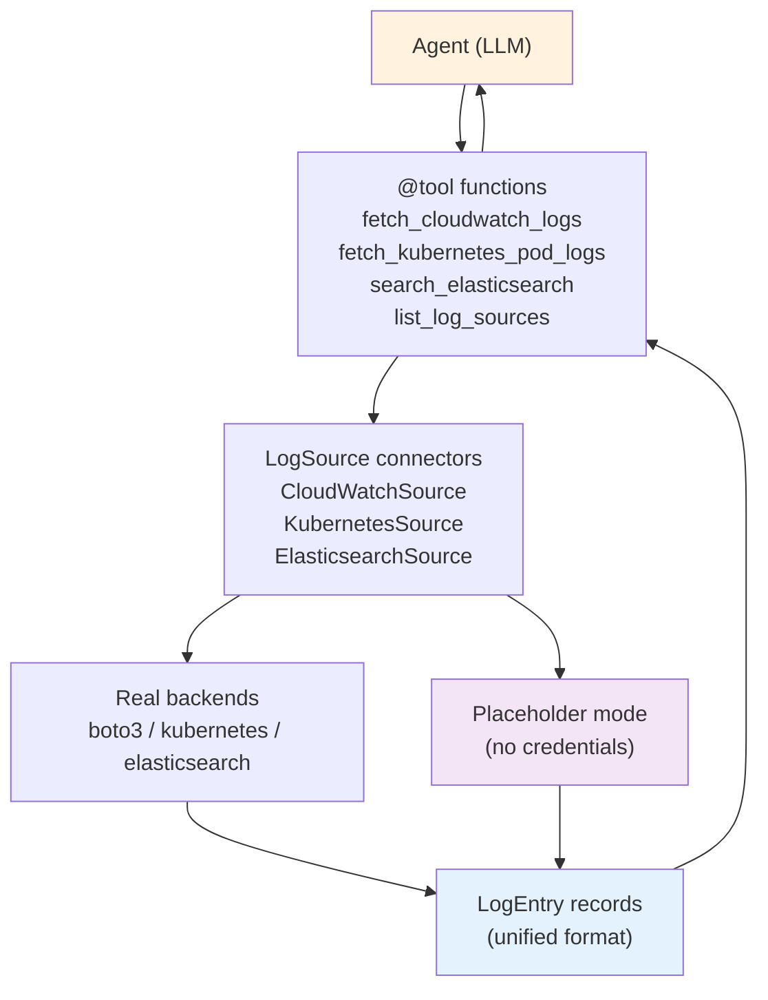

# Chapter 13: Multi-Source Log Integration

Up to this point, our agent reads log files from a local directory. That works for learning. It does not work in production.

In production, logs live in many places:

- **CloudWatch Logs** — your EKS pods, Lambda functions, and RDS error logs ship here automatically.
- **Kubernetes** — pod stdout/stderr accessible only through the K8s API.
- **Elasticsearch** (or OpenSearch) — your centralised, indexed log store where the SRE team runs queries.
- **Application logs**, **CloudFront access logs**, **VPC flow logs**, **ALB logs**, **load balancer logs**, ... the list goes on.

Each source has its own client library, its own query syntax, its own authentication, and its own way of representing a log entry. CloudWatch returns Insights query results. Kubernetes returns raw text with timestamps prefixed. Elasticsearch returns JSON documents with whatever fields the indexer chose.

For a useful DevOps agent, this fragmentation is the problem. The agent shouldn't care whether a log line came from CloudWatch or Elasticsearch. It should see a uniform stream of events with timestamps, services, levels, and messages — and reason about them.

This chapter builds that abstraction.

## What Changes

| Component | Before | After |
|-----------|--------|-------|
| Log sources | Local files in `logs/` | Local files + CloudWatch + Kubernetes + Elasticsearch |
| Log format | Raw file contents | Normalised `LogEntry` records |
| Tools available | `read_log_file`, `list_log_files`, `search_logs` | + `fetch_cloudwatch_logs`, `fetch_kubernetes_pod_logs`, `search_elasticsearch`, `list_log_sources` |
| Missing credentials | Tool fails | Source falls back to deterministic placeholder data |
| Source discovery | Hard-coded | Agent calls `list_log_sources` to see what's connected |

Nothing about the agent loop, memory, or approval flow changes. We are adding new tools and a new internal package — the rest of the system is untouched.

## The Architecture

Three layers separate the LLM from the messy details of each backend:



The agent calls a tool. The tool delegates to a connector. The connector either talks to a real backend or returns placeholder data. Both paths produce the same `LogEntry` records, which the tool formats and returns to the agent.

The benefit: the LLM only ever sees one shape. The same prompt, the same parsing, the same reasoning — regardless of which infrastructure the logs came from.

## Project Structure

The new files sit alongside the existing modules:

```
13/
├── app.py                          # + new tool labels & sidebar entries
├── system_prompt.txt               # + multi-source guidance
└── src/
    ├── config.py                   # + CloudWatch/K8s/ES settings
    ├── sources/                    # NEW — log source abstraction
    │   ├── __init__.py
    │   ├── base.py                 # LogEntry, LogSource, format_entries
    │   ├── cloudwatch.py
    │   ├── kubernetes.py
    │   └── elasticsearch.py
    └── tools/
        ├── log_reader.py           # unchanged — local files
        └── cloud_logs.py           # NEW — exposes sources as @tool
```

`sources/` is the abstraction. `tools/cloud_logs.py` is the bridge from that abstraction to LangChain's tool interface.

## The Unified Log Entry

Everything starts with one type. Every connector returns a list of these, and every tool formats lists of these the same way:

```python
# src/sources/base.py

@dataclass
class LogEntry:
    """A single normalised log line."""
    timestamp: datetime
    source: str                       # "cloudwatch" | "kubernetes" | "elasticsearch"
    service: str                      # log group / pod / index
    level: str                        # INFO | WARN | ERROR | UNKNOWN
    message: str                      # human-readable line
    raw: str = ""                     # original line/document (truncated)
    metadata: dict = field(default_factory=dict)

    def short(self) -> str:
        """One-line representation for prompt injection."""
        ts = self.timestamp.strftime("%Y-%m-%d %H:%M:%S")
        return f"[{ts}] [{self.source}/{self.service}] {self.level}: {self.message}"
```

Six fields cover everything the agent needs:

- **timestamp**: When the event happened. Lets the agent correlate events across sources.
- **source**: Which backend ("cloudwatch", "kubernetes", ...). The agent uses this to attribute claims.
- **service**: Log group, pod name, or index. Names the system that produced the log.
- **level**: INFO/WARN/ERROR/UNKNOWN. Lets the agent prioritise.
- **message**: The cleaned-up log text the agent reasons about.
- **raw** and **metadata**: Available if needed, ignored most of the time.

The `short()` method is the only output the LLM normally sees:

```
[2026-05-20 14:32:11] [cloudwatch/orders-prod] ERROR: HikariPool-1 - Connection is not available, request timed out after 30000ms
```

One line. Same shape across CloudWatch, Kubernetes, Elasticsearch. No JSON to parse, no nested fields to chase.

### The LogSource Base Class

Every connector implements the same minimal interface:

```python
# src/sources/base.py

class LogSource(ABC):
    """Abstract base for any log source connector."""
    name: str = "base"

    @abstractmethod
    def is_configured(self) -> bool:
        """Return True if real credentials are available."""

    @abstractmethod
    def fetch(
        self,
        target: str,
        query: Optional[str] = None,
        minutes: int = 15,
        limit: int = 100,
    ) -> list[LogEntry]:
        """Fetch logs from this source."""
```

Two methods. `is_configured()` so callers can show status, and `fetch()` to actually pull logs. Every connector takes the same arguments — a target (log group/pod/index), an optional query, a time window, and a limit. This uniformity is what lets the agent treat all sources interchangeably.

### Rendering Entries

`format_entries()` turns a list into the text block the agent reads:

```python
def format_entries(entries: list[LogEntry], header: str = "") -> str:
    if not entries:
        return f"{header}\n(no matching log entries)" if header else "(no matching log entries)"

    lines: list[str] = []
    if header:
        lines.append(header)
        lines.append("")

    # Count by level so the agent gets a quick summary
    counts: dict[str, int] = {}
    for e in entries:
        counts[e.level] = counts.get(e.level, 0) + 1
    summary = " ".join(f"{lvl}={n}" for lvl, n in sorted(counts.items()))
    lines.append(f"{len(entries)} entries ({summary})")
    lines.append("")

    for e in entries:
        lines.append(e.short())

    return "\n".join(lines)
```

The output starts with a header (so the agent remembers which source it queried), then a one-line summary by level (so it can spot "47 ERROR vs 3 INFO" at a glance), then the entries. The header + summary + lines pattern keeps the response useful even when there are 100 lines.

## The CloudWatch Connector

CloudWatch is the most common AWS log destination. Our connector uses CloudWatch Logs Insights — the structured query language that handles aggregation and filtering on the server side:

```python
# src/sources/cloudwatch.py

class CloudWatchSource(LogSource):
    """CloudWatch Logs source. `target` is the log group name."""
    name = "cloudwatch"

    def __init__(self, region: Optional[str] = None):
        self.region = region or os.getenv("AWS_REGION", "us-east-1")

    def is_configured(self) -> bool:
        return bool(
            os.getenv("AWS_ACCESS_KEY_ID")
            or os.getenv("AWS_PROFILE")
            or os.getenv("AWS_ROLE_ARN")
        )

    def fetch(self, target, query=None, minutes=15, limit=100):
        if not self.is_configured():
            return self._placeholder(target, query, minutes, limit)
        try:
            return self._fetch_real(target, query, minutes, limit)
        except Exception as e:
            return self._placeholder(
                target, query, minutes, limit,
                note=f"(live call failed: {e}; showing placeholder data)",
            )
```

Three paths. If AWS is not configured, return placeholders. If it is, try the real call. If the real call fails — network issue, missing permission, log group typo — fall back to placeholders with a note explaining what went wrong. The agent always gets something useful to work with.

The real fetch builds a Logs Insights query, polls until results are ready, and normalises each row:

```python
def _fetch_real(self, log_group, query, minutes, limit):
    import boto3

    client = boto3.client("logs", region_name=self.region)
    end = datetime.now(timezone.utc)
    start = end - timedelta(minutes=minutes)

    filter_clause = ""
    if query:
        safe = query.replace('"', '\\"')
        filter_clause = f'| filter @message like "{safe}" '
    insights = (
        f"fields @timestamp, @message "
        f"{filter_clause}"
        f"| sort @timestamp desc | limit {limit}"
    )

    start_resp = client.start_query(
        logGroupName=log_group,
        startTime=int(start.timestamp()),
        endTime=int(end.timestamp()),
        queryString=insights,
    )
    query_id = start_resp["queryId"]

    import time
    results = None
    for _ in range(20):
        r = client.get_query_results(queryId=query_id)
        if r["status"] in ("Complete", "Failed", "Cancelled"):
            results = r
            break
        time.sleep(0.5)
    if results is None or results["status"] != "Complete":
        raise RuntimeError(f"CloudWatch query did not complete")

    entries: list[LogEntry] = []
    for row in results["results"]:
        ts_str = next((f["value"] for f in row if f["field"] == "@timestamp"), "")
        msg = next((f["value"] for f in row if f["field"] == "@message"), "")
        try:
            ts = datetime.fromisoformat(ts_str.replace(" ", "T"))
        except ValueError:
            ts = datetime.now(timezone.utc)
        entries.append(LogEntry(
            timestamp=ts, source=self.name, service=log_group,
            level=_guess_level(msg),
            message=msg.strip()[:300],
            raw=msg[:1000],
        ))
    entries.reverse()  # newest last
    return entries
```

Three details worth noting:

**`_guess_level()`** is a small regex that pulls `ERROR`, `WARN`, `INFO`, etc. out of free-form log text. Cloud logs rarely come with structured level fields, so we extract it from the message:

```python
_LEVEL_RE = re.compile(r"\b(ERROR|WARN(?:ING)?|INFO|DEBUG|FATAL)\b", re.IGNORECASE)

def _guess_level(message: str) -> str:
    m = _LEVEL_RE.search(message)
    if not m:
        return "UNKNOWN"
    lvl = m.group(1).upper()
    return "WARN" if lvl == "WARNING" else lvl
```

Imperfect but cheap. The agent can still reason about the message text itself; level is just a hint.

**Polling with a bounded loop** instead of a blocking wait. Twenty attempts at 500ms each is 10 seconds max. If the query takes longer, we fall through to the placeholder path. This keeps the tool responsive — the agent doesn't sit waiting for a slow CloudWatch query.

**`entries.reverse()`** because Insights returns newest first. The agent reads top-to-bottom, so we want the oldest entry first (chronological order). This is the same convention every connector uses.

### The Placeholder Path

When AWS isn't configured, you still want a working demo. The placeholder returns a curated set of entries that look like a real production log group:

```python
def _placeholder(self, log_group, query, minutes, limit, note=""):
    now = datetime.now(timezone.utc)
    samples = [
        ("INFO",  "Health check OK"),
        ("INFO",  "Processed 142 orders in last minute"),
        ("WARN",  "Slow query on orders table: 1840ms"),
        ("ERROR", "HikariPool-1 - Connection is not available, request timed out after 30000ms"),
        ("ERROR", "Too many connections: cannot open new connection to orders-db-prod"),
        ("WARN",  "Retrying database connection (attempt 2/3)"),
    ]
    if query:
        samples = [s for s in samples if query.lower() in s[1].lower()] or samples

    entries: list[LogEntry] = []
    for i, (lvl, msg) in enumerate(samples[:limit]):
        entries.append(LogEntry(
            timestamp=now - timedelta(minutes=minutes - i),
            source=self.name, service=log_group, level=lvl,
            message=msg, raw=msg,
            metadata={"placeholder": True, "note": note} if note else {"placeholder": True},
        ))
    return entries
```

These aren't random strings. They're the kind of log lines a real Spring Boot application talking to RDS would emit during a connection pool exhaustion incident — the same scenario our agent has been investigating throughout the book. The placeholder is realistic enough that the agent can demonstrate the full diagnose → recommend → remediate flow without a live AWS account.

## The Kubernetes Connector

Kubernetes pod logs work differently from CloudWatch. There's no query language — the API just returns raw text with optional timestamps prefixed:

```python
# src/sources/kubernetes.py

class KubernetesSource(LogSource):
    """Kubernetes pod logs. `target` is the pod name."""
    name = "kubernetes"

    def __init__(self, namespace=None, kubeconfig=None, context=None):
        self.namespace = namespace or os.getenv("K8S_DEFAULT_NAMESPACE", "production")
        self.kubeconfig = kubeconfig or os.getenv("K8S_KUBECONFIG", "")
        self.context = context or os.getenv("K8S_CONTEXT", "")

    def is_configured(self) -> bool:
        if self.kubeconfig and os.path.exists(self.kubeconfig):
            return True
        default = os.path.expanduser("~/.kube/config")
        return os.path.exists(default)
```

`is_configured()` checks two places: the explicit `K8S_KUBECONFIG` env var, then the default `~/.kube/config`. If either exists, we assume we can talk to a cluster. This is forgiving — if the file is stale or the cluster is unreachable, the live call will fail and fall through to placeholder mode.

The real fetch uses the official `kubernetes` client:

```python
def _fetch_real(self, pod_name, query, minutes, limit):
    from kubernetes import client, config as kube_config

    if self.kubeconfig:
        kube_config.load_kube_config(config_file=self.kubeconfig, context=self.context or None)
    else:
        kube_config.load_kube_config(context=self.context or None)

    v1 = client.CoreV1Api()
    raw = v1.read_namespaced_pod_log(
        name=pod_name,
        namespace=self.namespace,
        since_seconds=minutes * 60,
        tail_lines=limit * 4,   # over-fetch then filter
        timestamps=True,
    )

    entries: list[LogEntry] = []
    for line in raw.splitlines():
        if query and query.lower() not in line.lower():
            continue
        m = _TS_RE.match(line)
        if m:
            ts_str = m.group(1).rstrip("Z")
            try:
                ts = datetime.fromisoformat(ts_str).replace(tzinfo=timezone.utc)
            except ValueError:
                ts = datetime.now(timezone.utc)
            message = line[m.end():].strip()
        else:
            ts = datetime.now(timezone.utc)
            message = line.strip()

        entries.append(LogEntry(
            timestamp=ts, source=self.name, service=pod_name,
            level=_guess_level(message),
            message=message[:300], raw=line[:1000],
            metadata={"namespace": self.namespace},
        ))
    return entries[-limit:]
```

Two practical details:

**Over-fetch then filter.** We ask for `limit * 4` lines and then apply the query filter in Python. Kubernetes doesn't filter on the server side, so if you want 50 matching lines you usually need to scan more raw lines than that. Multiplying by 4 is a heuristic that works for most cases.

**Timestamp parsing.** Kubernetes prefixes each line with an RFC 3339 timestamp when `timestamps=True`. We extract it with a regex, fall back to "now" if the format is unexpected, and put the rest of the line into `message`. This is the kind of small parsing chore each connector has to handle on its own — and exactly the reason we want a unified format above it.

## The Elasticsearch Connector

Elasticsearch is the easiest of the three to integrate because it speaks JSON natively:

```python
# src/sources/elasticsearch.py

class ElasticsearchSource(LogSource):
    """Elasticsearch source. `target` is the index name (or pattern)."""
    name = "elasticsearch"

    def __init__(self, url=None, api_key=None, username=None, password=None):
        self.url = url or os.getenv("ELASTICSEARCH_URL", "")
        self.api_key = api_key or os.getenv("ELASTICSEARCH_API_KEY", "")
        self.username = username or os.getenv("ELASTICSEARCH_USER", "")
        self.password = password or os.getenv("ELASTICSEARCH_PASSWORD", "")

    def is_configured(self) -> bool:
        return bool(self.url)
```

Two authentication modes are supported — API key (preferred) or basic auth (username/password). Whichever you set first wins:

```python
def _fetch_real(self, index, query, minutes, limit):
    from elasticsearch import Elasticsearch

    kwargs: dict = {"hosts": [self.url]}
    if self.api_key:
        kwargs["api_key"] = self.api_key
    elif self.username and self.password:
        kwargs["basic_auth"] = (self.username, self.password)

    es = Elasticsearch(**kwargs)

    must: list[dict] = [{
        "range": {
            "@timestamp": {"gte": f"now-{minutes}m", "lte": "now"},
        },
    }]
    if query:
        must.append({
            "query_string": {"query": query, "default_field": "message"},
        })

    body = {
        "size": limit,
        "sort": [{"@timestamp": "desc"}],
        "query": {"bool": {"must": must}},
    }

    resp = es.search(index=index, body=body)
    hits = resp.get("hits", {}).get("hits", [])

    entries: list[LogEntry] = []
    for hit in hits:
        src = hit.get("_source", {})
        ts_str = src.get("@timestamp", "")
        try:
            ts = datetime.fromisoformat(ts_str.replace("Z", "+00:00"))
        except ValueError:
            ts = datetime.now(timezone.utc)
        message = src.get("message") or src.get("msg") or src.get("log", "")
        level = (src.get("level") or src.get("severity") or "UNKNOWN").upper()
        entries.append(LogEntry(
            timestamp=ts, source=self.name,
            service=src.get("service", index), level=level,
            message=str(message)[:300], raw=str(message)[:1000],
            metadata={"index": index, "doc_id": hit.get("_id")},
        ))
    entries.reverse()
    return entries
```

Two things to notice:

**The query is `query_string`**, which lets the agent (or user) pass natural Elasticsearch syntax like `level:ERROR AND service:orders`. This is more powerful than substring matching and matches how a human SRE actually queries ES.

**Field fallbacks.** Different shippers populate different fields. Filebeat uses `message`, some loggers use `msg`, others use `log`. The connector tries each one. Same for `level` vs `severity`. This is the kind of small normalisation work that turns "every team has their own log schema" into "the agent sees one consistent shape".

## Exposing Sources as Tools

The connectors are pure Python classes. To make them usable by the agent, we wrap each one in a `@tool` function:

```python
# src/tools/cloud_logs.py

_cloudwatch = CloudWatchSource()
_kubernetes = KubernetesSource()
_elasticsearch = ElasticsearchSource()


@tool
def fetch_cloudwatch_logs(
    log_group: str,
    query: str = "",
    minutes: int = 15,
    limit: int = 50,
) -> str:
    """
    Fetch recent CloudWatch Logs from an AWS log group.

    Use this for application logs that are shipped to CloudWatch — typically
    EKS pods configured with the CloudWatch agent, Lambda functions, or RDS
    error logs.
    """
    entries = _cloudwatch.fetch(log_group, query or None, minutes, limit)
    header = (
        f"CloudWatch log group: {log_group} "
        f"(last {minutes}m, query={query or 'none'})"
    )
    return format_entries(entries, header)
```

The pattern is identical for all three tools:

1. Take the user-friendly arguments.
2. Delegate to the connector.
3. Format the result with a header that names the source and query.

The connector singletons (`_cloudwatch`, `_kubernetes`, `_elasticsearch`) are created once at module load and reused. They're cheap — they just hold environment-derived configuration. No connections are opened until `fetch()` is called.

### The Discovery Tool

There's one tool that doesn't fetch logs at all — it tells the agent what's available:

```python
@tool
def list_log_sources() -> str:
    """
    List which log sources are currently configured.

    Shows whether CloudWatch, Kubernetes, and Elasticsearch are connected
    to real backends or running in placeholder mode. Call this first when
    you're unsure which sources are available.
    """
    rows = []
    for src in (_cloudwatch, _kubernetes, _elasticsearch):
        status = "configured" if src.is_configured() else "placeholder mode"
        rows.append(f"- {src.name}: {status}")
    return "Available log sources:\n" + "\n".join(rows)
```

This is small but important. Without it, the agent doesn't know whether its CloudWatch call is hitting AWS or returning fake data. With it, the agent can adapt — "I see Elasticsearch is not configured, so I'll use CloudWatch instead" or "Both sources are in placeholder mode, treat results as illustrative."

## Tool Registration

The new tools join the existing registry:

```python
# src/tools/__init__.py

SAFE_TOOLS = {
    'read_log_file',
    'list_log_files',
    'search_logs',
    'list_log_sources',
    'fetch_cloudwatch_logs',
    'fetch_kubernetes_pod_logs',
    'search_elasticsearch',
    'send_slack_notification',
}
APPROVAL_REQUIRED_TOOLS = {'reboot_rds_instance', 'restart_kubernetes_pod'}


def get_all_tools():
    """Get all available tools for the agent"""
    tools = get_log_tools()
    tools.extend(get_cloud_log_tools())
    tools.append(restart_kubernetes_pod)
    tools.append(reboot_rds_instance)
    tools.append(send_slack_notification)
    return tools
```

All four new tools are **safe** — they only read data. They join the existing safe tools and bypass the approval flow. The infrastructure-change tools (`reboot_rds_instance`, `restart_kubernetes_pod`) still require explicit confirmation. The pattern from earlier chapters keeps working without modification.

## Teaching the Agent About the New Sources

The system prompt gets a few new lines so the agent knows what it has and how to use it:

```
You have access to logs from multiple sources:
- Local files (read_log_file, list_log_files, search_logs) -- for replaying captured incidents
- AWS CloudWatch Logs (fetch_cloudwatch_logs) -- for live EKS, Lambda, and RDS application logs
- Kubernetes pod logs (fetch_kubernetes_pod_logs) -- for direct stdout/stderr from a specific pod
- Elasticsearch (search_elasticsearch) -- for centralised, indexed application logs across services

Call list_log_sources first if you are unsure which sources are connected to live infrastructure.
Sources that are not configured run in placeholder mode and return representative sample data
so you can still demonstrate the analysis flow.

Every source returns logs in the same normalised format:
  [timestamp] [source/service] LEVEL: message
This lets you correlate events across systems by timestamp and service even when the
underlying backends are completely different.
```

Two things this prompt is doing:

1. **Lists each source and its purpose.** Otherwise the model has to guess from tool names alone.
2. **Tells the model about the unified format and what it enables.** This is what unlocks cross-source reasoning in the next chapter.

## How It Looks in Practice

Here's a typical exchange. The agent investigates a 503 spike, queries CloudWatch and Kubernetes, and reasons across both:

```
User: We're seeing 503s on /api/orders. Investigate.

Agent (thinking): Let me check what sources are available.
→ list_log_sources()
  CloudWatch: configured
  Kubernetes: configured
  Elasticsearch: placeholder mode

Agent (thinking): Both AWS and K8s are live. Start with CloudWatch
                  to see application-level errors.
→ fetch_cloudwatch_logs(
    log_group="/aws/eks/orders-prod/application",
    query="503",
    minutes=15,
  )

CloudWatch log group: /aws/eks/orders-prod/application (last 15m, query=503)
12 entries (ERROR=8 WARN=4)

[2026-05-20 14:31:02] [cloudwatch/orders-prod] ERROR: HikariPool-1 - Connection
  is not available, request timed out after 30000ms
[2026-05-20 14:31:08] [cloudwatch/orders-prod] ERROR: Returning HTTP 503 for /api/orders
...

Agent (thinking): Connection pool exhaustion. Let me see the pod-level view
                  to confirm it's not isolated to one pod.
→ fetch_kubernetes_pod_logs(
    pod_name="backend-orders-7d4f8b9c5-x2k9p",
    query="HikariPool",
    minutes=15,
  )

Kubernetes pod: backend-orders-7d4f8b9c5-x2k9p (ns=production, last 15m, query=HikariPool)
4 entries (ERROR=3 WARN=1)

[2026-05-20 14:30:55] [kubernetes/backend-orders-7d4f8b9c5-x2k9p] WARN:
  Connection acquisition took 2.3s
[2026-05-20 14:31:01] [kubernetes/backend-orders-7d4f8b9c5-x2k9p] ERROR:
  java.sql.SQLException: HikariPool-1 - Connection is not available
...

Agent: Confirmed. Connection pool exhaustion on the orders backend, visible
       both at the application level (CloudWatch) and the pod level (K8s).
       Eight ERROR entries in 15 minutes. This matches the Feb 6 incident.
       Recommend rebooting orders-db-prod. Type 'yes' to proceed.
```

Notice what's happening here. The agent calls CloudWatch and Kubernetes back-to-back, gets the same `[timestamp] [source/service] LEVEL: message` format from both, and references the past incident from long-term memory (from the previous chapter). The infrastructure under the hood is two completely different APIs — but the agent's reasoning is unified.

## Design Decisions

### Why a Unified `LogEntry` Instead of Passing Raw Backend Responses?

The alternative is letting each tool return whatever the backend returns: a `dict` from `boto3`, a string from `kubernetes`, a JSON document from `elasticsearch`. That works for one source. It falls apart when you want to correlate.

If the agent has to learn three different formats, it spends tokens reasoning about field names instead of incidents. Every prompt becomes longer, every response more error-prone. The unified format moves that complexity into Python (where it's cheap to debug) and gives the LLM a consistent shape (where consistency matters).

### Why Placeholder Mode Instead of Failing Loudly?

A loud failure is the right choice in production. For a learning project — and for any agent that needs to demo without real infrastructure — placeholders are the right choice.

The trade-off is honesty. If the agent says "rebooting RDS" based on placeholder data, that would be dangerous. Two things keep it safe:

1. The placeholder is **realistic but stable** — always the same kinds of log lines, so the agent never thinks it's seeing a novel pattern.
2. **Infrastructure-change tools still require approval.** The agent can plan all it wants on placeholder data; nothing actually executes until a human confirms.

In production, you'd remove the placeholder paths entirely and let `fetch()` raise on misconfiguration. The connector interface doesn't change.

### Why Singleton Connectors?

```python
_cloudwatch = CloudWatchSource()
_kubernetes = KubernetesSource()
_elasticsearch = ElasticsearchSource()
```

These are created at module import. The alternative is constructing a new connector inside every tool call. We chose singletons because:

- **Construction is cheap.** A connector just reads environment variables; no connections are opened.
- **Configuration is read once.** If you change `AWS_REGION` in `.env`, you restart the app — same as everything else.
- **State stays simple.** No connector accumulates state across calls. Re-using one instance versus creating a new one makes no behavioural difference.

When you switch to a real client that pools connections (e.g. a persistent `Elasticsearch` instance), the singleton becomes a small performance win for free.

### Why Did Each Connector Have Its Own `_guess_level()` and Timestamp Parsing?

You might be tempted to put all the parsing in `base.py` so the connectors stay minimal. Don't.

CloudWatch lines, Kubernetes lines, and Elasticsearch documents are genuinely different. The Kubernetes timestamp parser needs to handle the RFC 3339 prefix that `timestamps=True` adds. The CloudWatch parser handles the Insights "@timestamp" field. Elasticsearch parsers walk JSON.

Pushing those details into shared utilities creates an abstraction that has to handle every case at once — and breaks every time a backend changes its format. Keeping the parsing in each connector means changes stay local. The shared abstraction is the *output* (`LogEntry`), not the *input* parsing.

### Why a Time Window Instead of a Cursor?

Every tool takes `minutes=15` rather than a cursor or pagination token. Cursors are more efficient when an agent makes many sequential calls. Time windows are more natural for the LLM to reason about ("show me the last 30 minutes" vs. "give me the next page after token X").

The agent rarely needs more than one query per source per investigation. When it does, the human-readable window is easier to express. For the scale we operate at — a few queries per incident, 100-200 entries each — there's no measurable cost.

## Running the Updated Agent

The new env variables go in `.env`:

```dotenv
# Optional: CloudWatch Logs (placeholder mode when AWS is not configured)
CLOUDWATCH_DEFAULT_LOG_GROUP=/aws/eks/orders-prod/application

# Optional: Kubernetes (placeholder mode when kubeconfig is missing)
K8S_KUBECONFIG=
K8S_CONTEXT=
K8S_DEFAULT_NAMESPACE=production

# Optional: Elasticsearch (placeholder mode when URL is not set)
ELASTICSEARCH_URL=
ELASTICSEARCH_API_KEY=
ELASTICSEARCH_USER=
ELASTICSEARCH_PASSWORD=
ELASTICSEARCH_DEFAULT_INDEX=app-logs-*
```

Leave everything blank to start. The agent runs end-to-end on placeholder data so you can verify the flow before connecting to real infrastructure. Install the new dependencies:

```bash
cd 03-ai-agent-for-devops/code/13
make install
make run
```

Try this:

```
User: list_log_sources

Agent: Available log sources:
  - cloudwatch: placeholder mode
  - kubernetes: placeholder mode
  - elasticsearch: placeholder mode

User: Investigate 503 errors on the orders service.

Agent: [calls fetch_cloudwatch_logs, fetch_kubernetes_pod_logs, ...
        reasons across both sources, references past incidents from
        long-term memory, recommends action]
```

When you're ready, populate real credentials one source at a time and watch the agent transition smoothly from synthetic to real data. No code changes required.

## What You've Learned

The agent now reads from real infrastructure:

- **A unified `LogEntry`** that every connector returns. The agent sees `[timestamp] [source/service] LEVEL: message` regardless of which backend produced the log.
- **Three production connectors**: CloudWatch Logs Insights, Kubernetes pod logs, Elasticsearch. Each handles authentication, query translation, and parsing locally.
- **Graceful degradation** via placeholder mode. The agent works without credentials, with broken networks, with missing log groups — always returning something the LLM can reason about.
- **Discovery via `list_log_sources`** so the agent can adapt to whatever infrastructure is connected.
- **Tool-level safety preserved**: the new tools are read-only and bypass approval; the existing infrastructure-change tools still require human confirmation.

The architecture sketched in this chapter — connectors behind tools, tools behind a uniform interface — is the same pattern production agents at every scale end up using. Whether you connect to two sources or twenty, the abstraction holds.

## What's Next

Right now, the agent queries one source at a time. It might pull CloudWatch logs, see an error, then pull Kubernetes logs to confirm — but each call stands alone.

The real power of multiple sources is **correlation**: stitching events from different systems into a single narrative. A 503 in CloudFront access logs. A connection error in CloudWatch application logs. A failed health check in Kubernetes. A high-latency query in Elasticsearch. Individually, each is noise. Together, they tell a story.

The next chapter teaches the agent to find that story. We'll build an aggregation pipeline that pulls from multiple sources in one operation, write prompts that instruct the LLM to look for cross-system patterns, and add time-based correlation so the agent can say "the deployment at 14:28 changed the timeout setting, the connection errors started at 14:31, the 503s followed at 14:32."

Same agent, same tools — but a much sharper analytical lens.
