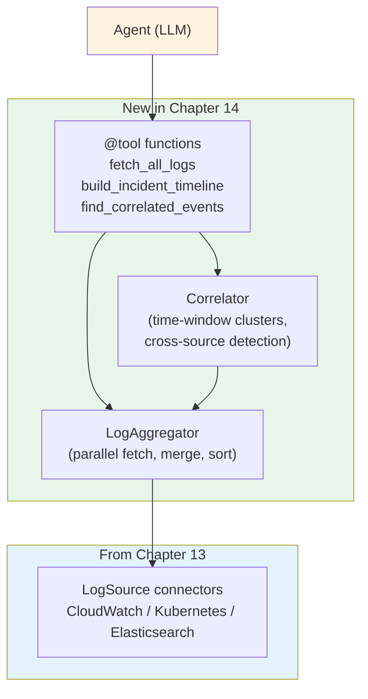

# Chapter 14: Cross-System Correlation and Analysis

In Chapter 13 we taught the agent to read from CloudWatch, Kubernetes, and Elasticsearch — three completely different backends behind a single `LogEntry` shape. That solved the *access* problem. It did not solve the *interpretation* problem.

The agent still investigates one source at a time. It pulls CloudWatch, finds an error, then pulls Kubernetes to confirm. Each call stands alone. The reasoning that connects them lives entirely in the LLM, which has to remember what it saw two tool calls ago and stitch the timeline back together from memory.

That works for two-step investigations. It collapses under real incidents — where five systems are talking at once and the interesting signal is the moment they all started complaining together.

This chapter teaches the agent to find that moment. We'll build an aggregation pipeline that pulls every source in one call, a correlator that groups events by time and flags cross-source clusters, and a set of tools that expose all of it as a single timeline the LLM can reason about. Same agent, same memory, same approval flow — but a much sharper analytical lens.

## What Changes

| Component | Before (Ch13) | After (Ch14) |
|-----------|---------------|--------------|
| Source access | One source per tool call | All sources in one parallel fetch |
| Output shape | List of `LogEntry` per source | Merged chronological timeline with cluster markers |
| Correlation | LLM stitches across tool calls | Python clusters by time window; LLM reads the result |
| Cross-source signal | Implicit | Explicit `cross-source` cluster labels |
| Anchor lookups | Manual ("what happened at 14:31?") | `find_correlated_events("HikariPool")` |
| New tools | — | `fetch_all_logs`, `build_incident_timeline`, `find_correlated_events` |

Nothing about the existing tools, memory, or approval flow changes. Chapter 13's per-source tools (`fetch_cloudwatch_logs`, `fetch_kubernetes_pod_logs`, `search_elasticsearch`) still work and are still useful for targeted queries. The new tools sit *above* them — they call the same connectors but merge the results.

## The Architecture

Two new layers slot between the existing tools and the LLM:



The aggregator owns *fetching* — it talks to every connector in parallel and returns one merged list. The correlator owns *interpretation* — it groups the merged list into time-window clusters and labels cross-source moments. The tools are thin wrappers that compose the two.

This separation matters. The aggregator can be reused without correlation (e.g., for an "show me everything in the last 5 minutes" tool). The correlator can be reused without re-fetching (e.g., to re-cluster the same entries with a different window). Each layer has one job.

## Project Structure

The new files live in a fresh `analysis/` package alongside the Ch13 `sources/` package:

```
14/
├── app.py                          # + 3 tool labels, sidebar entries
├── system_prompt.txt               # + correlation guidance
└── src/
    ├── config.py                   # unchanged
    ├── sources/                    # unchanged from Ch13
    │   ├── base.py                 # LogEntry, LogSource, format_entries
    │   ├── cloudwatch.py
    │   ├── kubernetes.py
    │   └── elasticsearch.py
    ├── analysis/                   # NEW — aggregation + correlation
    │   ├── __init__.py
    │   ├── aggregator.py           # LogAggregator, fetch_all
    │   └── correlator.py           # Cluster, Correlator, build_timeline
    └── tools/
        ├── log_reader.py           # unchanged
        ├── cloud_logs.py           # unchanged from Ch13
        ├── correlation.py          # NEW — 3 @tool functions
        └── __init__.py             # + register correlation tools as SAFE
```

The connectors from Chapter 13 do not change. The analysis package consumes them as a library; the tools expose the analysis as capabilities.

## Step 1: The Aggregator

The aggregator pulls every configured source in parallel and merges the results into one chronologically-sorted list. Nothing else.

`src/analysis/aggregator.py`:

```python
"""
Log aggregator.

Fetches logs from every configured source in parallel and returns one
chronologically-sorted list of LogEntry records.
"""
from __future__ import annotations

import logging
from concurrent.futures import ThreadPoolExecutor, as_completed
from typing import Optional

from ..config import Config
from ..sources import (
    CloudWatchSource,
    ElasticsearchSource,
    KubernetesSource,
    LogEntry,
    LogSource,
)

logger = logging.getLogger(__name__)


class LogAggregator:
    """Pulls logs from multiple sources in parallel and merges them."""

    def __init__(self, sources: Optional[list[tuple[LogSource, str]]] = None):
        if sources is None:
            self.sources = [
                (CloudWatchSource(),    Config.CLOUDWATCH_DEFAULT_LOG_GROUP),
                (ElasticsearchSource(), Config.ELASTICSEARCH_DEFAULT_INDEX),
                # Kubernetes is intentionally excluded by default -- it
                # needs a specific pod name, not a sensible cluster-wide
                # default. Callers add it explicitly when relevant.
            ]
        else:
            self.sources = sources

    def fetch(
        self,
        query: str = "",
        minutes: int = 30,
        limit_per_source: int = 50,
        targets: Optional[dict[str, str]] = None,
    ) -> list[LogEntry]:
        targets = targets or {}
        jobs: list[tuple[LogSource, str]] = []
        for src, default_target in self.sources:
            target = targets.get(src.name, default_target)
            if not target:
                continue
            jobs.append((src, target))

        entries: list[LogEntry] = []
        if not jobs:
            return entries

        with ThreadPoolExecutor(max_workers=len(jobs)) as pool:
            futures = {
                pool.submit(_safe_fetch, src, target, query or None, minutes, limit_per_source):
                    (src.name, target)
                for src, target in jobs
            }
            for fut in as_completed(futures):
                name, target = futures[fut]
                try:
                    entries.extend(fut.result())
                except Exception as e:
                    logger.warning("Aggregator: %s/%s failed: %s", name, target, e)

        entries.sort(key=lambda e: e.timestamp)
        return entries
```

Three things this code is doing:

1. **Default targets per source.** CloudWatch needs a log group, Elasticsearch needs an index. The aggregator carries a sensible default for each so callers don't have to specify them every time. Kubernetes is excluded by default because there is no cluster-wide default pod — a caller who wants pod logs passes one in via `targets={"kubernetes": "backend-orders-7d4f8b9c5-x2k9p"}`.

2. **Parallel fetch.** All sources are queried concurrently via `ThreadPoolExecutor`. CloudWatch can take seconds when an Insights query runs cold; Elasticsearch can take longer if the cluster is busy. Doing them in series multiplies the latency. In parallel, the slowest source sets the total time.

3. **Per-source error isolation.** `_safe_fetch` (below) catches any exception a source might raise and returns an empty list. The aggregator also has a try/except around `fut.result()` — belt and braces. The point is the same: one broken source must not break the timeline.

The safe wrapper:

```python
def _safe_fetch(source, target, query, minutes, limit):
    try:
        return source.fetch(target, query, minutes, limit)
    except Exception as e:
        logger.warning("Source %s failed: %s", source.name, e)
        return []
```

And a module-level convenience for callers who don't need an aggregator instance:

```python
def fetch_all(query="", minutes=30, limit_per_source=50, targets=None):
    return LogAggregator().fetch(query, minutes, limit_per_source, targets)
```

That's the entire aggregator. ~125 lines. No interpretation, no scoring, no inference — just "give me everything, sorted by time, from every source that's configured."

## Step 2: The Correlator

The correlator takes the aggregator's output and groups entries into time-window clusters. A cluster is just "events that happened close together in time." A *cross-source* cluster — one where entries come from two or more sources — is the signal we care about: the moment when multiple systems started complaining at the same time.

We start with the data shape:

```python
from dataclasses import dataclass, field
from datetime import datetime
from ..sources import LogEntry


@dataclass
class Cluster:
    """A group of entries that happened within a time window."""
    start: datetime
    end: datetime
    entries: list[LogEntry] = field(default_factory=list)

    @property
    def sources(self) -> set[str]:
        return {e.source for e in self.entries}

    @property
    def services(self) -> set[str]:
        return {e.service for e in self.entries}

    @property
    def is_cross_source(self) -> bool:
        return len(self.sources) >= 2

    @property
    def has_errors(self) -> bool:
        return any(e.level in ("ERROR", "FATAL") for e in self.entries)

    def level_counts(self) -> dict[str, int]:
        counts: dict[str, int] = {}
        for e in self.entries:
            counts[e.level] = counts.get(e.level, 0) + 1
        return counts
```

`Cluster` is a dataclass with three pieces of state — start, end, entries — and a handful of derived properties. `is_cross_source` is the one that earns its keep: it is what `build_timeline` uses to decide which clusters get expanded and which get compressed.

The clustering algorithm itself is greedy:

```python
from datetime import timedelta


class Correlator:
    """Bucket entries into time-window clusters."""

    def __init__(self, window_seconds: int = 60):
        self.window = timedelta(seconds=window_seconds)

    def cluster(self, entries: list[LogEntry]) -> list[Cluster]:
        if not entries:
            return []

        ordered = sorted(entries, key=lambda e: e.timestamp)
        clusters: list[Cluster] = []
        current = Cluster(start=ordered[0].timestamp, end=ordered[0].timestamp)
        current.entries.append(ordered[0])

        for entry in ordered[1:]:
            if entry.timestamp - current.end <= self.window:
                current.entries.append(entry)
                current.end = entry.timestamp
            else:
                clusters.append(current)
                current = Cluster(start=entry.timestamp, end=entry.timestamp)
                current.entries.append(entry)

        clusters.append(current)
        return clusters
```

Walk the entries in chronological order. Keep extending the current cluster as long as the next entry is within `window_seconds` of the previous one. The moment the gap exceeds the window, close the cluster and start a new one.

Two helper methods build on the clustering primitive:

```python
    def cross_source(self, entries: list[LogEntry]) -> list[Cluster]:
        return [c for c in self.cluster(entries) if c.is_cross_source]

    def around(
        self,
        entries: list[LogEntry],
        anchor: LogEntry,
        window_seconds: Optional[int] = None,
    ) -> list[LogEntry]:
        delta = timedelta(seconds=window_seconds) if window_seconds else self.window
        lo, hi = anchor.timestamp - delta, anchor.timestamp + delta
        return [
            e for e in entries
            if lo <= e.timestamp <= hi and e is not anchor
        ]
```

`cross_source` answers "where did systems fail together?" `around` answers "what else was happening when *this specific entry* was logged?" The first is for surveying the timeline; the second is for drilling in.

### Rendering the Timeline

The clustering output is structured data. The agent reads text. `build_timeline` is the bridge:

```python
def build_timeline(
    entries: list[LogEntry],
    window_seconds: int = 60,
    highlight_cross_source: bool = True,
) -> str:
    if not entries:
        return "(no log entries to correlate)"

    correlator = Correlator(window_seconds=window_seconds)
    clusters = correlator.cluster(entries)

    sources = sorted({e.source for e in entries})
    header = (
        f"TIMELINE ({len(entries)} entries across "
        f"{len(sources)} source{'s' if len(sources) != 1 else ''}: {', '.join(sources)})"
    )

    lines: list[str] = [header, ""]
    for c in clusters:
        kind = "cross-source" if c.is_cross_source else "single-source"
        if highlight_cross_source and not c.is_cross_source:
            # Compress single-source clusters: show count + first/last entry
            lines.append(_cluster_header(c, kind))
            lines.append(f"  {c.entries[0].short()}")
            if len(c.entries) > 2:
                lines.append(f"  ... ({len(c.entries) - 2} more entries)")
            if len(c.entries) > 1:
                lines.append(f"  {c.entries[-1].short()}")
            lines.append("")
            continue

        lines.append(_cluster_header(c, kind))
        for e in c.entries:
            lines.append(f"  {e.short()}")
        lines.append("")

    return "\n".join(lines).rstrip()


def _cluster_header(c: Cluster, kind: str) -> str:
    start = c.start.strftime("%H:%M:%S")
    end = c.end.strftime("%H:%M:%S")
    span = start if start == end else f"{start} - {end}"
    counts = c.level_counts()
    levels = " ".join(f"{lvl}={n}" for lvl, n in sorted(counts.items()))
    sources = "+".join(sorted(c.sources))
    return (
        f"--- {span} ({kind}: {sources}, "
        f"{len(c.entries)} entr{'ies' if len(c.entries) != 1 else 'y'}, {levels}) ---"
    )
```

The output is asymmetric on purpose. **Cross-source clusters are expanded fully** — every entry is printed, because that's where the interesting story is. **Single-source clusters are compressed** — first entry, count of skipped entries, last entry. The LLM doesn't need every line of a 40-entry CloudWatch burst to know "CloudWatch was noisy here"; one summary is enough. Token budget goes where the analysis happens.

A rendered timeline looks like this:

```
TIMELINE (47 entries across 3 sources: cloudwatch, elasticsearch, kubernetes)

--- 14:30:55 - 14:31:08 (cross-source: cloudwatch+kubernetes, 6 entries, ERROR=4 WARN=2) ---
  [14:30:55] [kubernetes/backend-orders-7d4f8b9c5] WARN: Connection acquisition took 2.3s
  [14:31:01] [kubernetes/backend-orders-7d4f8b9c5] ERROR: java.sql.SQLException: HikariPool-1
  [14:31:02] [cloudwatch/orders-prod] ERROR: Connection is not available, request timed out
  [14:31:05] [kubernetes/backend-orders-7d4f8b9c5] ERROR: Returning HTTP 503
  [14:31:07] [cloudwatch/orders-prod] ERROR: Returning HTTP 503 for /api/orders
  [14:31:08] [kubernetes/backend-orders-7d4f8b9c5] WARN: Circuit breaker opened

--- 14:32:14 - 14:32:51 (single-source: elasticsearch, 12 entries, INFO=12) ---
  [14:32:14] [elasticsearch/orders-service] INFO: Health check passed
  ... (10 more entries)
  [14:32:51] [elasticsearch/orders-service] INFO: Health check passed

--- 14:33:10 (single-source: kubernetes, 1 entry, INFO=1) ---
  [14:33:10] [kubernetes/backend-orders-7d4f8b9c5] INFO: Health check OK
```

The first cluster is the incident: two sources, six entries, four errors, 13 seconds wide. The second is noise: 12 health checks from one source. The third is a single recovery line. The agent can see the shape of the incident at a glance.

## Step 3: Exposing the Tools

The analysis package is just Python — the LLM cannot call it directly. We wrap it in three `@tool` functions in `src/tools/correlation.py`:

```python
"""
Cross-source correlation tools.
"""
from langchain_core.tools import tool

from ..analysis import LogAggregator, Correlator, build_timeline
from ..sources import format_entries


# Shared instances. Aggregator is stateless aside from configuration;
# correlator is created per-call so window_seconds can vary.
_aggregator = LogAggregator()


@tool
def fetch_all_logs(
    query: str = "",
    minutes: int = 30,
    limit_per_source: int = 50,
) -> str:
    """
    Pull logs from every configured source in parallel and return a single
    chronological list.
    """
    entries = _aggregator.fetch(query, minutes, limit_per_source)
    header = (
        f"Merged log timeline (last {minutes}m, query={query or 'none'}, "
        f"limit_per_source={limit_per_source})"
    )
    return format_entries(entries, header)


@tool
def build_incident_timeline(
    query: str = "",
    minutes: int = 30,
    window_seconds: int = 60,
    limit_per_source: int = 50,
) -> str:
    """
    Build a correlated timeline that highlights events happening across
    multiple sources within the same time window.
    """
    entries = _aggregator.fetch(query, minutes, limit_per_source)
    return build_timeline(entries, window_seconds=window_seconds)


@tool
def find_correlated_events(
    anchor_text: str,
    window_seconds: int = 120,
    minutes: int = 30,
    limit_per_source: int = 50,
) -> str:
    """
    Find events from any source that happened close in time to a specific
    log line.
    """
    entries = _aggregator.fetch("", minutes, limit_per_source)
    if not entries:
        return "No log entries available to correlate."

    needle = anchor_text.lower()
    anchor = next((e for e in entries if needle in e.message.lower()), None)
    if anchor is None:
        return f"No anchor entry matching '{anchor_text}' in the last {minutes}m."

    correlator = Correlator(window_seconds=window_seconds)
    nearby = correlator.around(entries, anchor)

    lines = [
        f"Anchor: {anchor.short()}",
        f"Window: +/- {window_seconds}s",
        f"Surrounding events: {len(nearby)}",
        "",
    ]
    for e in sorted(nearby, key=lambda x: x.timestamp):
        lines.append(f"  {e.short()}")
    return "\n".join(lines)


def get_correlation_tools() -> list:
    return [fetch_all_logs, build_incident_timeline, find_correlated_events]
```

Each tool is a thin wrapper that composes the layers below. `fetch_all_logs` returns the raw merged list. `build_incident_timeline` adds clustering. `find_correlated_events` adds anchor lookup. Three tools, three levels of analytical depth — the agent picks the right one for the question.

The module-level `_aggregator` is a singleton, same pattern as the Ch13 connectors. Cheap to construct, no connection state, no reason to rebuild on every call. The correlator is *not* a singleton because `window_seconds` is a per-call argument — clustering with a 60-second window vs a 5-minute window changes the output completely, so each call gets its own.

### Registering the Tools

`src/tools/__init__.py` registers the three new tools as safe (no infrastructure changes, read-only):

```python
from .correlation import (
    fetch_all_logs,
    build_incident_timeline,
    find_correlated_events,
    get_correlation_tools,
)

SAFE_TOOLS = {
    # ... existing safe tools ...
    "fetch_all_logs",
    "build_incident_timeline",
    "find_correlated_events",
}


def get_all_tools() -> list:
    tools = []
    tools.extend(get_log_reader_tools())
    tools.extend(get_cloud_log_tools())
    tools.extend(get_correlation_tools())
    tools.extend(get_action_tools())  # approval-required
    return tools
```

The order matters less than the safety classification. Because all three are in `SAFE_TOOLS`, the agent can call them without the human-confirmation prompt that gates `reboot_rds_instance` or `restart_kubernetes_pod`. Read-only analysis tools should never block on approval; they exist precisely so the agent can investigate freely *before* proposing a change.

## Step 4: Teaching the Agent to Use Them

A new tool is invisible to the model until the system prompt mentions it. We add a paragraph to `system_prompt.txt` that does two things: lists the new capabilities, and tells the agent when each one is appropriate.

```text
For multi-system investigations, prefer the correlation tools over calling
each source individually:
- fetch_all_logs(query, minutes) -- one merged chronological view across
  every configured source.
- build_incident_timeline(query, minutes, window_seconds) -- the same data,
  but grouped into time-window clusters with cross-source clusters
  highlighted. Cross-source clusters are the strongest signal that systems
  are failing together.
- find_correlated_events(anchor_text, window_seconds) -- once you have a
  suspicious entry, see what else happened in any other system within the
  same window.

When you build a diagnosis, anchor every claim in evidence: cite the
timestamp, the source, and the service. Explain causality only when the
timeline supports it ("A happened at 14:31, B followed at 14:32, both
from different systems") and never confuse correlation with causation.
```

Three things this prompt is doing:

1. **Prefers correlation over per-source calls** when the investigation spans systems. The Ch13 tools (`fetch_cloudwatch_logs`, etc.) still exist for targeted questions like "show me only the orders-prod log group" — but for "investigate this incident," the new tools are now the default path.
2. **Maps each tool to a question shape.** `fetch_all_logs` for "give me everything." `build_incident_timeline` for "where do systems overlap?" `find_correlated_events` for "what happened around *this*?" Without these hints, the LLM tends to pick the first tool with a matching keyword.
3. **Demands evidence-anchored reasoning and warns against causality confusion.** Correlation tools make it trivially easy to spot two events at the same timestamp. They do not prove one caused the other. The prompt makes the distinction explicit so the agent describes what the data shows rather than what it imagines.

## The Full Analysis Loop

Putting it all together, here is what a real investigation looks like with the new tools:

```
User: We're seeing 503s on /api/orders starting around 14:30. Investigate.

Agent (thinking): This spans the application and the cluster. Build a
                  correlated timeline first to find where systems failed
                  together.
-> build_incident_timeline(query="503", minutes=30, window_seconds=60)

TIMELINE (47 entries across 3 sources: cloudwatch, elasticsearch, kubernetes)

--- 14:30:55 - 14:31:08 (cross-source: cloudwatch+kubernetes, 6 entries, ERROR=4 WARN=2) ---
  [14:30:55] [kubernetes/backend-orders-7d4f8b9c5] WARN: Connection acquisition took 2.3s
  [14:31:01] [kubernetes/backend-orders-7d4f8b9c5] ERROR: java.sql.SQLException: HikariPool-1
  [14:31:02] [cloudwatch/orders-prod] ERROR: Connection is not available, request timed out
  [14:31:05] [kubernetes/backend-orders-7d4f8b9c5] ERROR: Returning HTTP 503
  [14:31:07] [cloudwatch/orders-prod] ERROR: Returning HTTP 503 for /api/orders
  [14:31:08] [kubernetes/backend-orders-7d4f8b9c5] WARN: Circuit breaker opened

--- 14:32:14 - 14:32:51 (single-source: elasticsearch, 12 entries, INFO=12) ---
  [14:32:14] [elasticsearch/orders-service] INFO: Health check passed
  ... (10 more entries)
  [14:32:51] [elasticsearch/orders-service] INFO: Health check passed

Agent (thinking): One cross-source cluster at 14:30:55-14:31:08. Connection
                  pool warning at 14:30:55, HikariPool exception at 14:31:01,
                  CloudWatch reports the timeout at 14:31:02. Let me see if
                  there's a deployment or config change that triggered this.
-> find_correlated_events(anchor_text="HikariPool", window_seconds=300)

Anchor: [14:31:01] [kubernetes/backend-orders-7d4f8b9c5] ERROR: java.sql.SQLException: HikariPool-1
Window: +/- 300s
Surrounding events: 8

  [14:28:42] [cloudwatch/orders-prod] INFO: Configuration reloaded: db.timeout=2000ms
  [14:30:55] [kubernetes/backend-orders-7d4f8b9c5] WARN: Connection acquisition took 2.3s
  [14:31:02] [cloudwatch/orders-prod] ERROR: Connection is not available, request timed out after 2000ms
  ...

Agent: Root cause identified.

  - 14:28:42 (cloudwatch/orders-prod): config reload set db.timeout to 2000ms.
  - 14:30:55 (kubernetes/backend-orders): connection acquisition took 2300ms --
    above the new timeout.
  - 14:31:01-08 (both sources): connection pool exhausted, HikariPool exceptions,
    503s returned, circuit breaker opened.

  The deployment at 14:28 lowered the connection timeout below what the pool
  actually takes under load. This matches the Feb 6 incident pattern from
  long-term memory.

  Recommend reverting the timeout to 5000ms and restarting the orders pods.
  Type 'yes' to restart backend-orders-7d4f8b9c5-x2k9p.
```

Notice the shape of the reasoning. The agent called *two* correlation tools, not five per-source tools. The first call surveyed the timeline. The second drilled into the most interesting moment. The narrative the agent built — config reload → timeout below threshold → pool exhaustion → 503s — is anchored in specific timestamps from specific sources. That is exactly the "service crashed because database hit connection limits after deployment changed timeout settings" pattern the chapter's TOC promises.

The agent did *not* invent the causality. The timeline showed three events in three different systems in chronological order. The agent named the sequence; the data backed it up.

## Design Decisions

### Why Greedy Clustering Instead of Fixed Time Buckets?

The naive alternative is fixed buckets: divide the time window into 60-second slices, drop every entry into the slice it lands in. Simple, deterministic, easy to reason about.

It produces bad clusters. An incident that starts at 14:30:55 and ends at 14:31:08 spans exactly one second past the bucket boundary, so half the events land in the 14:30 bucket and half in the 14:31 bucket. Two clusters, neither of them complete, both labelled wrong.

Greedy clustering ("keep extending while the gap stays under `window`") naturally adapts to event density. A burst of 10 entries in 5 seconds becomes one cluster. A 90-second gap of silence ends it. The clusters match the *shape* of the incident, not the position of arbitrary boundaries.

### Why Compress Single-Source Clusters in `build_timeline`?

The output is a string handed to an LLM. Every character costs tokens, and tokens are not free.

A 12-entry burst of identical "health check passed" lines from Elasticsearch contains roughly one bit of information: "Elasticsearch was quiet here." Printing all 12 lines wastes ~1500 characters to convey what `... (10 more entries)` conveys in 22.

Cross-source clusters get the full expansion because *that's where the analysis happens*. The agent needs to see every line to reason about ordering, sources, and levels. Compressing those would defeat the purpose of the tool.

The asymmetry is deliberate: spend tokens where they pay back, save them where they don't.

### Why Exclude Kubernetes From the Default Aggregator?

CloudWatch has a sensible cluster-wide default — the application log group. Elasticsearch has one too — the application index. Kubernetes does not. The K8s API needs a specific pod name; there is no "all pods" call that returns useful logs at the same scale as a log group query.

We could fake it by listing pods and fan-out fetching them all, but that's a lot of API calls for very little signal during an initial survey. The agent gets *more useful* results from CloudWatch (which already aggregates K8s pod stdout in production setups via Fluent Bit or similar) than from N parallel pod queries.

The aggregator still supports K8s — callers pass `targets={"kubernetes": "specific-pod"}` when they have a pod in mind. The omission is a default, not a restriction.

### Why a Singleton Aggregator But Per-Call Correlators?

```python
_aggregator = LogAggregator()  # module-level, reused
# ...
correlator = Correlator(window_seconds=window_seconds)  # per-call
```

The aggregator has no per-call state. Its configuration (which sources, which defaults) is fixed at construction and never changes. Building one per tool call would just re-read environment variables for no reason.

The correlator's only parameter is `window_seconds`, and that *does* change per call. `build_incident_timeline(window_seconds=60)` and `find_correlated_events(window_seconds=300)` need different correlators. Constructing one per call is the cleanest way to handle that without mutable state.

### Why Three Tools Instead of One Configurable One?

A single `analyze_logs(mode="merged"|"timeline"|"anchor", ...)` would work. It would also be miserable for the LLM.

Tool selection is one of the things LLMs do well. Tool *configuration* — picking the right value for a mode parameter — is one of the things they do less well. Three distinct tools with descriptive names (`fetch_all_logs`, `build_incident_timeline`, `find_correlated_events`) lets the model match the question to the tool name almost mechanically. The right tool is half-chosen the moment the model parses the user's request.

The cost is three function definitions instead of one. The benefit is correct tool selection without prompt engineering. Easy trade.

### Why Not Build Causality Inference Into the Correlator?

It would be tempting to add "this cluster *caused* that cluster" detection — e.g., "config reload at T, errors started at T+2 minutes, therefore config reload caused errors."

We didn't, on purpose. Causality inference is fundamentally a reasoning task, not a clustering task. The data we have (timestamps, sources, levels, messages) tells us what happened and when. It does not tell us *why*. Two events at adjacent timestamps could be cause-and-effect, common-cause-different-effect, or pure coincidence.

The LLM is the right tool for "given these events in this order, what's the most plausible explanation?" The correlator's job is to present the evidence cleanly enough that the LLM can do that reasoning well. Moving the inference into Python would either be too aggressive (claiming causality the data doesn't support) or too cautious (claiming nothing useful at all).

The prompt instruction — "never confuse correlation with causation" — is a guardrail for the same reason. The system makes correlation easy and forces the agent to be honest about what that correlation does and doesn't prove.

## Running the Updated Agent

The new tools require no new environment variables. They reuse the Ch13 source configuration entirely:

```bash
cd 03-ai-agent-for-devops/code/14
make install
make run
```

The sidebar shows three new entries under **Cross-source correlation (safe)**: `fetch_all_logs`, `build_incident_timeline`, `find_correlated_events`. Try them in this order:

```
User: fetch_all_logs

Agent: [Merged log timeline (last 30m, ...) — all entries from every
        configured source in chronological order]

User: build_incident_timeline for the last 30 minutes

Agent: [TIMELINE with cross-source clusters expanded, single-source
        clusters compressed]

User: find_correlated_events for "HikariPool"

Agent: [Anchor + +/- 120s surrounding events from every source]
```

If your sources are in placeholder mode (no credentials configured), the data is synthetic but the shape is real — you can verify the correlation logic, the cluster labelling, and the agent's reasoning end-to-end before connecting to live infrastructure.

## What You've Learned

The agent now analyses logs across systems:

- **An aggregator** that fetches every configured source in parallel and returns one chronologically-sorted list. Per-source error isolation means one slow or broken backend doesn't break the timeline.
- **A correlator** that groups entries by time window via greedy clustering and flags clusters that span multiple sources. Cross-source clusters are the strongest signal that systems are failing together.
- **A timeline renderer** that expands cross-source clusters fully and compresses single-source clusters. Token budget goes where the analysis happens.
- **Three correlation tools** — `fetch_all_logs`, `build_incident_timeline`, `find_correlated_events` — that compose the aggregator and correlator into capabilities the agent can invoke. All registered as safe (read-only).
- **Prompt guidance** that prefers correlation tools over per-source calls for multi-system investigations, and demands evidence-anchored reasoning over hand-waved causality.

The combined effect is an agent that doesn't just *read* multiple sources — it *thinks across* them. The same investigation that took five tool calls and a lot of LLM stitching in Chapter 13 now takes two well-chosen tool calls and a much clearer narrative.

## What's Next

The agent works. It reads from real infrastructure, remembers past incidents, correlates events across systems, and proposes safe actions with human approval. What it does not yet do is *run* — properly, in production, without you watching it.

The next chapter takes everything we've built and turns it into a service. We'll add proper error handling for the failure modes that only show up under load, configuration management that separates dev/staging/prod cleanly, monitoring so the agent's own health is observable, and deployment patterns that survive restarts, network glitches, and the occasional bad LLM response.

Same agent. Same memory. Same tools. But hardened for the environment where it actually matters.
