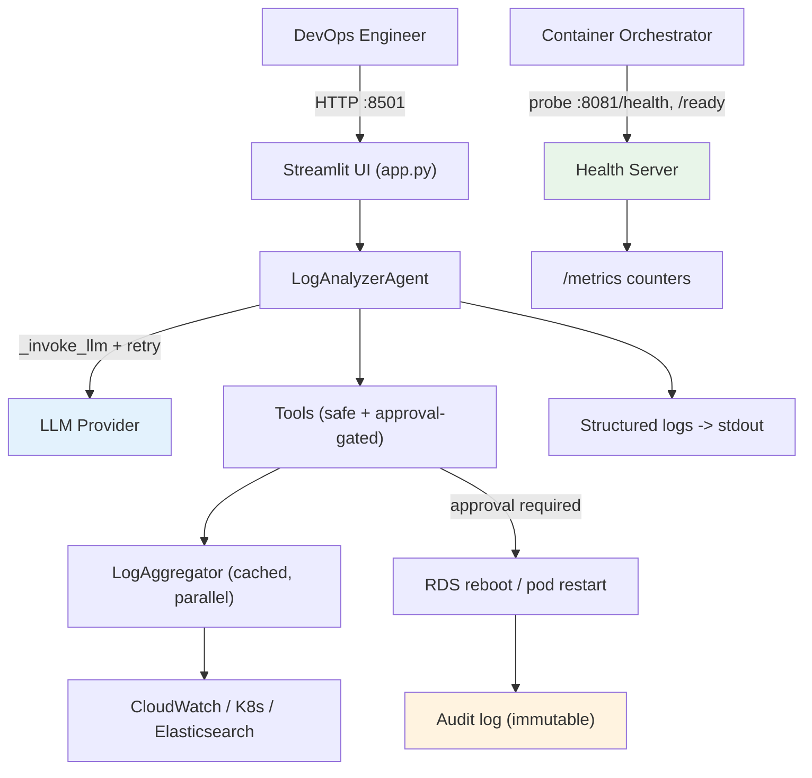

# Chapter 15: Production Deployment

The agent works on your laptop. You run `make run`, the Streamlit UI comes up, you ask it to investigate an incident, and it reads CloudWatch, correlates across Kubernetes and Elasticsearch, remembers the last time this happened, and proposes a fix you approve with one word. That is a real achievement. It is also a demo.

A demo and a production service are different animals. The demo runs while you watch it. Production runs at 3 a.m. when nobody is watching, on the night the LLM API has a bad ten minutes, when CloudWatch rate-limits you, when the config you copied from staging still points at the staging database. The demo handles the happy path. Production has to survive everything else.

This chapter takes the exact agent we built over the last fourteen chapters and hardens it for that environment. We're not adding features. We're adding the things that decide whether the features keep working when you're not in the room: real error handling, environment-aware configuration, health monitoring, a deployment that restarts itself, and a security posture you'd be comfortable defending in a review.

## Step 1: Error Handling That Survives the Night

Right now, every error funnels into one place — the `try/except` in `app.py`:

```python
try:
    response = st.session_state.agent.process_query(...)
    progress.complete()
except Exception as e:
    progress.error(str(e))
    response = f"Error: {e}"
```

That's fine for a human staring at the screen. They read "Error: 429 Too Many Requests," shrug, and click again. Production has no human to click again. A transient blip becomes a dead investigation.

The first job is to tell the difference between errors that are worth retrying and errors that aren't. A rate limit is transient — wait and try again. A missing API key is permanent — retrying a thousand times won't conjure one. Treating both the same way is how you either give up too early or hammer a dead endpoint forever.

We add a small error module, `src/utils/errors.py`, that classifies failures:

```python
"""
Error classification and retry policy for the agent.

Transient errors are worth retrying with backoff. Permanent errors are not --
retrying them just wastes time and money.
"""
from __future__ import annotations

import logging
import time
from functools import wraps

logger = logging.getLogger(__name__)


class AgentError(Exception):
    """Base class for agent errors."""


class TransientError(AgentError):
    """Temporary failure -- safe to retry (rate limits, timeouts, 5xx)."""


class PermanentError(AgentError):
    """Will not succeed on retry (bad credentials, malformed request, 4xx)."""


# Substrings that signal a transient condition, regardless of provider.
_TRANSIENT_MARKERS = (
    "429", "rate limit", "timeout", "timed out", "503", "502", "504",
    "temporarily unavailable", "connection reset", "connection aborted",
)


def classify(exc: Exception) -> AgentError:
    """Map an arbitrary exception to Transient or Permanent."""
    text = str(exc).lower()
    if any(marker in text for marker in _TRANSIENT_MARKERS):
        return TransientError(str(exc))
    return PermanentError(str(exc))
```

Why string matching instead of catching specific exception types? Because the agent talks to three different LLM providers (Gemini, GitHub Models, MiniMax) and three log backends, each with its own exception hierarchy. A `google.api_core.exceptions.ResourceExhausted` and an OpenAI `RateLimitError` mean the same thing to us, but they share no base class. Matching on the message is uglier than matching on a type — and far more robust across providers we don't control.

> **Note:** If you only ever use one provider, prefer catching that provider's typed exceptions. The string approach earns its keep specifically because this agent is provider-agnostic.

Now the retry decorator:

```python
def with_retry(max_attempts: int = 3, base_delay: float = 1.0):
    """
    Retry a function on transient errors with exponential backoff.
    Permanent errors are re-raised immediately -- no point retrying them.
    """
    def decorator(func):
        @wraps(func)
        def wrapper(*args, **kwargs):
            attempt = 0
            while True:
                attempt += 1
                try:
                    return func(*args, **kwargs)
                except Exception as exc:
                    err = classify(exc)
                    if isinstance(err, PermanentError) or attempt >= max_attempts:
                        logger.error(
                            "%s failed (attempt %d/%d): %s",
                            func.__name__, attempt, max_attempts, exc,
                        )
                        raise err
                    delay = base_delay * (2 ** (attempt - 1))   # 1s, 2s, 4s
                    logger.warning(
                        "%s transient failure (attempt %d/%d), retrying in %.1fs: %s",
                        func.__name__, attempt, max_attempts, delay, exc,
                    )
                    time.sleep(delay)
        return wrapper
    return decorator
```

The backoff is exponential — 1s, 2s, 4s — so we don't pile retries onto an endpoint that's already struggling. Permanent errors skip the loop entirely and raise on the first attempt. That's the whole point: a wrong API key fails in one second, not after three pointless retries.

We wrap the one call that actually talks to the outside world — the LLM invocation in the agent's tool loop:

```python
# src/agents/log_analyzer.py
from ..utils.errors import with_retry, PermanentError

class LogAnalyzerAgent:
    # ...
    @with_retry(max_attempts=3, base_delay=1.0)
    def _invoke_llm(self, messages):
        """Single LLM call, wrapped with transient-error retry."""
        return self.llm.invoke(messages)
```

Then every `self.llm.invoke(messages)` in `process_query` and `_tool_loop` becomes `self._invoke_llm(messages)`. One change, one place, and every LLM round-trip in the loop now retries transient failures and fails fast on permanent ones.

> **Warning:** Don't wrap the *tool* calls in the same retry. Rebooting an RDS instance is not idempotent — retrying it three times could reboot a database three times. Retries belong on read operations and the LLM call, not on infrastructure actions.

### A Failure Story: The Retry That Made Things Worse

The first version of this retry wrapped *everything* — including the tool execution loop. During a real CloudWatch outage, the agent tried to fetch logs, got a 503, and the retry kicked in. Good so far. But the retry was on the whole `process_query`, not the individual call. So every retry re-ran the entire investigation from scratch: re-read the local logs, re-queried Kubernetes (which was fine), re-queried Elasticsearch (also fine), and re-hit CloudWatch (still down). Three full investigations, three times the API cost, to fail anyway.

The fix was to push retries *down* to the smallest unit that can fail independently — a single LLM call, a single source fetch — instead of wrapping the whole workflow. Retry the thing that failed, not everything around it. The aggregator from Chapter 14 already does this for sources: `_safe_fetch` isolates each source so one failure doesn't sink the others. We just extended the same principle to the LLM call.

## Step 2: Configuration for Real Environments

The Chapter 14 `Config` class reads one `.env` file and validates on import. That works when there's one environment. Production has at least three: development (your laptop), staging (a safe place to test against real infrastructure), and production (the real thing). They differ in obvious ways — different databases, different log groups, different Slack channels — and in dangerous ways. You do *not* want a staging test to reboot the production RDS instance because someone copied the wrong config.

The cleanest fix is an explicit environment selector plus per-environment defaults. We extend `Config`:

```python
# src/config.py (additions)
import os

class Config:
    # Which environment are we running in?
    ENV = os.getenv('APP_ENV', 'development').lower()   # development | staging | production

    @classmethod
    def is_production(cls) -> bool:
        return cls.ENV == 'production'
```

The important change is what validation does in production. On a laptop, a missing Slack webhook is fine — placeholder mode is useful for development. In production, a missing Slack webhook means alerts silently go nowhere, which is worse than crashing. So validation gets stricter as the environment gets more serious:

```python
    @classmethod
    def validate(cls):
        """Validate configuration. Stricter rules in production."""
        # LLM provider key is always required (existing logic)
        if cls.LLM_PROVIDER == 'gemini' and not cls.GEMINI_API_KEY:
            raise ValueError("LLM_PROVIDER=gemini but GEMINI_API_KEY is not set.")
        # ... github / minimax checks unchanged ...

        if not os.path.exists(cls.LOG_DIRECTORY):
            os.makedirs(cls.LOG_DIRECTORY)

        # Production demands the integrations actually be wired up.
        if cls.is_production():
            missing = []
            if not cls.is_slack_configured():
                missing.append("SLACK_WEBHOOK_URL")
            if not cls.is_aws_configured():
                missing.append("AWS credentials (AWS_PROFILE / AWS_ROLE_ARN)")
            if not cls.is_elasticsearch_configured():
                missing.append("ELASTICSEARCH_URL")
            if missing:
                raise ValueError(
                    "Production environment is missing required configuration: "
                    + ", ".join(missing)
                )
```

This is *fail-fast* validation. The agent refuses to start in production with a half-configured setup. Better a loud crash at deploy time than a silent failure at incident time. The number one way monitoring tools fail is by looking healthy while doing nothing — fail-fast is the cure.

The config files themselves stay out of the image. We keep one `.env.example` in the repo (committed, no secrets) and inject the real values at runtime — through the container orchestrator, a secrets manager, or CI/CD variables. The repo never contains a real key.

```bash
# .env.example  — committed to the repo, all placeholders
APP_ENV=development
LLM_PROVIDER=gemini
GEMINI_API_KEY=your-key-here
AWS_REGION=us-east-1
AWS_RDS_INSTANCE_ID=orders-db-prod
CLOUDWATCH_DEFAULT_LOG_GROUP=/aws/eks/orders-prod/application
ELASTICSEARCH_URL=
SLACK_WEBHOOK_URL=
```

> **Tip:** Keep the `.env.example` exhaustive — every variable the app reads, with a placeholder value. It doubles as documentation. A new engineer should be able to `cp .env.example .env`, fill in the blanks, and run.

## Step 3: Structured Logging

The agent uses `print` and a `VERBOSE` flag for output. That's readable in a terminal and useless in production, where logs get shipped to CloudWatch or Elasticsearch and queried by machines. A machine can't grep "thinking..." into anything useful. It needs structure: a timestamp, a level, a logger name, and ideally a request ID to tie a single investigation's lines together.

We configure Python's standard `logging` once, at startup, in a new `src/utils/logging_config.py`:

```python
"""
Structured logging setup.

Development: human-readable lines.
Production:  JSON, one object per line, ready for log aggregation.
"""
import json
import logging
import sys
from datetime import datetime, timezone


class JsonFormatter(logging.Formatter):
    """Render each log record as a single JSON object."""

    def format(self, record: logging.LogRecord) -> str:
        payload = {
            "timestamp": datetime.now(timezone.utc).isoformat(),
            "level": record.levelname,
            "logger": record.name,
            "message": record.getMessage(),
        }
        # Attach a request id if one was bound to the record.
        if hasattr(record, "request_id"):
            payload["request_id"] = record.request_id
        if record.exc_info:
            payload["exception"] = self.formatException(record.exc_info)
        return json.dumps(payload)


def setup_logging(env: str, level: str = "INFO") -> None:
    """Configure the root logger once, based on environment."""
    root = logging.getLogger()
    root.setLevel(level)
    root.handlers.clear()                      # avoid duplicate handlers on reload

    handler = logging.StreamHandler(sys.stdout)
    if env == "production":
        handler.setFormatter(JsonFormatter())
    else:
        handler.setFormatter(logging.Formatter(
            "%(asctime)s [%(levelname)s] %(name)s: %(message)s"
        ))
    root.addHandler(handler)
```

Logs go to stdout, not to a file. This is deliberate. In a container, stdout is where the orchestrator collects logs — Docker, Kubernetes, ECS all capture stdout automatically and forward it wherever you've configured. Writing to a file inside a container means the logs vanish when the container restarts. Write to stdout and let the platform handle shipping.

We call `setup_logging` once, at the very top of `app.py`, before anything else runs:

```python
# app.py
from src.config import Config
from src.utils.logging_config import setup_logging

setup_logging(Config.ENV, level="DEBUG" if not Config.is_production() else "INFO")
```

Now the `logger.warning(...)` and `logger.error(...)` calls already scattered through the aggregator, the retry wrapper, and the tools produce structured output for free. We didn't have to change them — they were already using the standard `logging` module. We just gave that module a production-grade formatter.

## Step 4: Monitoring the Monitor

Here's an uncomfortable question: if the agent silently stopped working tonight, how would you know? The whole point of the agent is to watch your systems. Nobody is watching the agent. A monitoring tool that dies quietly is worse than no tool at all, because the team assumes it's covering them when it isn't.

The agent needs to expose its own health. Two things, minimum: a health endpoint that says "I'm alive and my dependencies are reachable," and a few metrics that say "here's how much work I've done and how often it failed."

Streamlit doesn't give us a clean HTTP endpoint for this, so we run a tiny health server on a separate port. `src/utils/health.py`:

```python
"""
Lightweight health + metrics server.

Runs in a background thread on its own port so orchestrators can probe it
independently of the Streamlit UI.
"""
import json
import logging
import threading
from datetime import datetime, timezone
from http.server import BaseHTTPRequestHandler, HTTPServer

logger = logging.getLogger(__name__)


class _Metrics:
    """Process-wide counters. Cheap, in-memory, reset on restart."""
    def __init__(self):
        self.queries_total = 0
        self.queries_failed = 0
        self.tool_calls_total = 0
        self.started_at = datetime.now(timezone.utc)

    def snapshot(self) -> dict:
        uptime = (datetime.now(timezone.utc) - self.started_at).total_seconds()
        return {
            "uptime_seconds": round(uptime, 1),
            "queries_total": self.queries_total,
            "queries_failed": self.queries_failed,
            "tool_calls_total": self.tool_calls_total,
        }


METRICS = _Metrics()   # module-level singleton


def _make_handler(readiness_check):
    class Handler(BaseHTTPRequestHandler):
        def do_GET(self):
            if self.path == "/health":
                self._json(200, {"status": "alive"})
            elif self.path == "/ready":
                ok, detail = readiness_check()
                self._json(200 if ok else 503,
                           {"status": "ready" if ok else "not_ready", "detail": detail})
            elif self.path == "/metrics":
                self._json(200, METRICS.snapshot())
            else:
                self._json(404, {"error": "not found"})

        def _json(self, code, body):
            data = json.dumps(body).encode()
            self.send_response(code)
            self.send_header("Content-Type", "application/json")
            self.send_header("Content-Length", str(len(data)))
            self.end_headers()
            self.wfile.write(data)

        def log_message(self, *args):
            pass   # silence the default per-request stderr spam

    return Handler


def start_health_server(port: int, readiness_check) -> None:
    """Start the health server in a daemon thread."""
    server = HTTPServer(("0.0.0.0", port), _make_handler(readiness_check))
    thread = threading.Thread(target=server.serve_forever, daemon=True)
    thread.start()
    logger.info("Health server listening on :%d", port)
```

Notice there are *three* endpoints, and the distinction matters:

- `/health` (liveness) — "is the process alive?" If this fails, the orchestrator restarts the container. It must be cheap and never touch external dependencies. A liveness check that calls CloudWatch will report the process as dead during a CloudWatch outage, and the orchestrator will pointlessly restart a perfectly healthy agent.
- `/ready` (readiness) — "can the process actually do its job right now?" This one *does* check dependencies. If the LLM provider key is missing or a critical source is unreachable, the agent is alive but not ready, and traffic should hold off.
- `/metrics` — counters for whatever scrapes them.

The readiness check is a function we pass in, so it can inspect live config:

```python
# app.py
from src.utils.health import start_health_server, METRICS
from src.config import Config

def readiness() -> tuple[bool, str]:
    # Minimal, fast checks -- no slow network calls.
    if Config.LLM_PROVIDER == "gemini" and not Config.GEMINI_API_KEY:
        return False, "LLM provider key missing"
    return True, "ok"

# Start once, guarded so Streamlit's re-runs don't start it twice.
if "health_started" not in st.session_state:
    start_health_server(port=8081, readiness_check=readiness)
    st.session_state.health_started = True
```

And we bump the counters where the work happens, in `app.py`'s `main()`:

```python
METRICS.queries_total += 1
try:
    response = st.session_state.agent.process_query(...)
    progress.complete()
except Exception as e:
    METRICS.queries_failed += 1
    progress.error(str(e))
    response = f"Error: {e}"
```

Now a `curl http://agent:8081/metrics` returns something a dashboard can graph:

```json
{
  "uptime_seconds": 18423.5,
  "queries_total": 142,
  "queries_failed": 3,
  "tool_calls_total": 489
}
```

Three failures out of 142 queries is a 2% error rate — fine. If that climbs to 40%, you want a page, not a surprise next week. The metrics are crude (in-memory, reset on restart) but they answer the question that matters: is the agent working, and how hard?

## Step 5: Running as a Service

`make run` is a foreground process tied to your terminal. Close the terminal, kill the agent. Production needs a process that starts on boot, restarts on crash, and is reproducible across machines. That's a container.

The `Dockerfile`:

```dockerfile
FROM python:3.13-slim

# Run as a non-root user. If the container is ever compromised, the blast
# radius is a low-privilege account, not root.
RUN useradd --create-home --uid 1000 agent
WORKDIR /app

# Install dependencies first so this layer caches when only code changes.
COPY requirements.txt .
RUN pip install --no-cache-dir -r requirements.txt

# Copy the app and hand ownership to the non-root user.
COPY --chown=agent:agent . .
USER agent

EXPOSE 8501 8081

# Liveness probe baked into the image.
HEALTHCHECK --interval=30s --timeout=3s --start-period=10s --retries=3 \
  CMD python -c "import urllib.request; urllib.request.urlopen('http://localhost:8081/health')"

CMD ["streamlit", "run", "app.py", \
     "--server.port=8501", "--server.address=0.0.0.0", \
     "--server.headless=true"]
```

Three production habits are baked in here. The container runs as a non-root user, so a compromise doesn't hand an attacker root. Dependencies install in their own layer, so rebuilds are fast when only code changes. And the `HEALTHCHECK` hits the `/health` endpoint we just built, so Docker knows when the agent is actually wedged versus merely busy.

For local composition and to make the restart policy explicit, a `docker-compose.yml`:

```yaml
services:
  agent:
    build: .
    ports:
      - "8501:8501"      # Streamlit UI
      - "8081:8081"      # health + metrics
    env_file:
      - .env             # injected at runtime, never baked into the image
    environment:
      - APP_ENV=production
    restart: unless-stopped     # survive crashes and host reboots
    deploy:
      resources:
        limits:
          cpus: "1.0"
          memory: 1G              # cap memory so a leak can't take the host down
    healthcheck:
      test: ["CMD", "python", "-c",
             "import urllib.request; urllib.request.urlopen('http://localhost:8081/ready')"]
      interval: 30s
      timeout: 5s
      retries: 3
```

`restart: unless-stopped` is the line that turns a script into a service. If the agent crashes — a memory spike, an unhandled edge case, a host reboot — Docker brings it back. Combined with the fail-fast config validation from Step 2, you get a useful property: if the agent is misconfigured, it crashes immediately and keeps crash-looping visibly, instead of running broken. A crash loop is annoying. A silent half-working monitor is dangerous.

The resource limits matter more than they look. An LLM agent that accidentally loops — say, a tool that keeps returning data the model keeps trying to re-analyze — can chew through memory and CPU. The `MAX_ITERATIONS = 10` cap in the agent loop is the first line of defense; the container memory limit is the second. Defense in depth: even if the application-level guard fails, the platform-level guard contains the damage.

## Step 6: Security Hardening

The agent holds the keys to your infrastructure. It can read every log, reboot a database, and restart pods. That makes it a high-value target and a high-consequence bug. Three things deserve attention: secrets, permissions, and an audit trail.

### Secrets Never Touch Code or Logs

We already moved secrets out of the image and inject them at runtime. The remaining risk is *leaking* them through logs. An LLM agent logs a lot — prompts, tool arguments, errors. It's easy to accidentally log an API key that showed up in an error message or a connection string.

We add a redaction filter to the logging setup:

```python
# src/utils/logging_config.py (addition)
import re

_SECRET_PATTERNS = [
    re.compile(r'(api[_-]?key["\s:=]+)([^\s"]+)', re.IGNORECASE),
    re.compile(r'(token["\s:=]+)([^\s"]+)', re.IGNORECASE),
    re.compile(r'(password["\s:=]+)([^\s"]+)', re.IGNORECASE),
    re.compile(r'(AKIA[0-9A-Z]{16})'),                 # AWS access key id
]


class RedactionFilter(logging.Filter):
    """Scrub anything that looks like a secret before it's written."""
    def filter(self, record: logging.LogRecord) -> bool:
        msg = record.getMessage()
        for pattern in _SECRET_PATTERNS:
            msg = pattern.sub(lambda m: m.group(1) + "***REDACTED***"
                              if m.lastindex and m.lastindex >= 2 else "***REDACTED***", msg)
        record.msg = msg
        record.args = ()
        return True
```

Attach it to the handler in `setup_logging`:

```python
    handler.addFilter(RedactionFilter())
```

This is a safety net, not a primary defense. The primary defense is not logging secrets in the first place. But people make mistakes, and a redaction filter catches the mistake before it lands in your log aggregator where it would live forever.

> **Warning:** Redaction by regex is best-effort. It will miss secrets in unexpected formats. Treat it as the last layer, never the only one. The real rule is: don't pass secrets to `logger` calls.

### Least-Privilege IAM

The agent's AWS permissions should be exactly what its tools need and nothing more. Look at what the tools actually do: `reboot_rds_instance` reboots one RDS instance, `fetch_cloudwatch_logs` reads logs. That's the entire AWS surface. So the IAM policy is small and specific:

```json
{
  "Version": "2012-10-17",
  "Statement": [
    {
      "Sid": "ReadCloudWatchLogs",
      "Effect": "Allow",
      "Action": ["logs:FilterLogEvents", "logs:GetLogEvents", "logs:DescribeLogGroups"],
      "Resource": "arn:aws:logs:us-east-1:*:log-group:/aws/eks/orders-prod/*"
    },
    {
      "Sid": "RebootOnlyTheOrdersDatabase",
      "Effect": "Allow",
      "Action": ["rds:RebootDBInstance", "rds:DescribeDBInstances"],
      "Resource": "arn:aws:rds:us-east-1:*:db:orders-db-prod"
    }
  ]
}
```

Read the resource ARNs carefully. The reboot permission is scoped to `orders-db-prod` specifically — not `*`. If the LLM ever hallucinates a different instance id and tries to reboot it, IAM denies the call. The model's judgment is one safety layer; the human approval in the agent loop is another; this IAM scope is the third. Three independent layers all have to fail for the wrong database to reboot.

> **Note:** Prefer IAM roles (via `AWS_ROLE_ARN` or an instance/pod identity) over static access keys. A role gives short-lived, rotating credentials. A static key sits in your secrets store until someone remembers to rotate it, which is to say forever.

### Audit Logging for Actions

When the agent reboots a database, you need a permanent record: what it did, when, who approved it, and why. The `logger` output is good, but actions deserve a dedicated, append-only audit trail that doesn't get lost in the noise of debug logs. We log every approval-required action at a distinct logger:

```python
# src/agents/log_analyzer.py — inside _execute_tool_call, after a gated tool runs
audit = logging.getLogger("audit")
# ... when an approval-required tool actually executes:
audit.info(
    "ACTION EXECUTED",
    extra={
        "request_id": getattr(self, "request_id", "unknown"),
        "tool": name,
        "args": args,
        "approved": True,
    },
)
```

Route the `audit` logger to its own sink — a separate file, a separate log stream, a separate index — and treat it as immutable. When someone asks "why did the orders database reboot at 3:14 a.m.?", the answer is one query away: the agent did it, in response to this incident, after this user typed "yes."

## Step 7: Performance and Cost

LLM calls cost money and time. Log queries cost time and load on your systems. At demo scale none of this matters. At production scale — dozens of investigations a day, each making several LLM calls and several source queries — it adds up in both the bill and the latency.

Three optimizations, in order of payoff.

**Parallel source fetching — already done.** Chapter 14's aggregator queries every source concurrently with a `ThreadPoolExecutor`. The slowest source sets the total latency, not the sum. This is the single biggest latency win and we got it for free by building it in earlier. Worth restating: the architecture decisions you made for clarity often pay off again for performance.

**Cache repeated source queries.** During a single investigation, the agent often re-fetches the same window of logs — `build_incident_timeline` and `find_correlated_events` both pull from the aggregator, and the agent may call them in sequence over the same time range. Caching the merged result for a short TTL avoids hammering CloudWatch with identical queries seconds apart:

```python
# src/analysis/aggregator.py (addition)
import time

class LogAggregator:
    def __init__(self, sources=None, cache_ttl: float = 30.0):
        # ... existing init ...
        self._cache: dict[tuple, tuple[float, list]] = {}
        self._cache_ttl = cache_ttl

    def fetch(self, query="", minutes=30, limit_per_source=50, targets=None):
        key = (query, minutes, limit_per_source, tuple(sorted((targets or {}).items())))
        now = time.time()
        cached = self._cache.get(key)
        if cached and now - cached[0] < self._cache_ttl:
            logger.debug("Aggregator cache hit for %s", key)
            return cached[1]

        entries = self._fetch_uncached(query, minutes, limit_per_source, targets)
        self._cache[key] = (now, entries)
        return entries
```

The 30-second TTL is the tradeoff. Long enough to absorb the rapid-fire repeat queries within one investigation, short enough that a follow-up a minute later sees fresh data. Logs from 30 seconds ago are not stale for incident analysis; logs from 30 minutes ago might be. Tune the TTL to how fast your situation changes.

> **Warning:** Cache reads, never writes. A cached `reboot_rds_instance` would be a catastrophe. The cache lives in the aggregator, which only ever reads. Keep it there.

**Batch and bound the queries.** The aggregator already caps results per source with `limit_per_source`. Honor it. A query that pulls 10,000 log lines doesn't make the analysis better — it blows the LLM's context window (Chapter 11) and costs more tokens for a worse answer. The correlator's compression of single-source clusters (Chapter 14) is the same instinct applied to output: spend tokens where the analysis happens, save them everywhere else. Performance and quality point the same direction here. Smaller, focused queries are both cheaper and more accurate.

## Step 8: Assembling the Production System

Here is how the pieces fit together, from a request arriving to an action being audited:



The request path is the same agent you've been building. What's new wraps around it: the health server the orchestrator probes, the retry on the LLM call, the cache in the aggregator, the structured logs flowing to stdout, the audit trail capturing every action, the IAM scope bounding what's even possible.

The full startup sequence in `app.py` now reads top to bottom as a production boot:

```python
# 1. Configure logging before anything can log.
setup_logging(Config.ENV, level="INFO" if Config.is_production() else "DEBUG")

# 2. Fail fast if the environment is misconfigured.
Config.validate()      # raises in production if integrations are missing

# 3. Start the health server so orchestrator probes succeed immediately.
if "health_started" not in st.session_state:
    start_health_server(port=8081, readiness_check=readiness)
    st.session_state.health_started = True

# 4. Run the app (existing main()).
main()
```

Logging first, so every later step is observable. Validation second, so a broken deploy dies loudly. Health server third, so the orchestrator gets a truthful answer the instant the process is up. Then the app. The order is the design.

Deploying is now one command:

```bash
cd 03-ai-agent-for-devops/code/15
cp .env.example .env          # fill in real values, or inject them at runtime
docker compose up --build -d
curl http://localhost:8081/ready    # {"status":"ready","detail":"ok"}
```

The agent is running as a service. It restarts on crash, refuses to start misconfigured, reports its own health, retries transient failures, redacts secrets from logs, audits every action, and runs with exactly the permissions it needs and no more.

## What You've Achieved

Step back and look at what you've built across these fifteen chapters. The TOC framed this as a journey through levels of AI logging systems. You've reached Level 3 — and made it production-grade.

- **Level 1 (Chapters 1–8):** A basic log parser and responder. An agent that reads a log file, sends it to an LLM, and explains what it found — first in a terminal, then in a web UI.
- **Level 2 (Chapters 9–12):** Pattern recognition and routing. Structured outputs, severity classification, real actions (RDS reboot, Slack alerts) gated behind human approval, and memory that remembers past incidents across sessions.
- **Level 3 (Chapters 13–15):** Multi-source integration and correlation. The agent reads from CloudWatch, Kubernetes, and Elasticsearch, correlates events across all three on a single timeline, and now runs as a hardened production service.

That last clause is what separates a project from a tool. Plenty of agents work in a demo. This one has error handling that survives a bad night, configuration that won't let you deploy it broken, monitoring so you'd know if it died, a restart policy so it usually won't, and a security posture that scopes the damage if something goes wrong.

The agent is not magic. It's an LLM in a loop, a handful of well-chosen tools, some memory, and a lot of careful engineering around the edges. That's the honest shape of every production AI system worth running. The intelligence comes from the model; the reliability comes from everything you built around it.

## Chapter Summary

- **Errors get classified, not just caught.** Transient failures retry with exponential backoff; permanent failures fail fast. Retries live on the smallest unit that can fail — a single LLM call or source fetch — never the whole workflow, and never on non-idempotent actions.
- **Configuration is environment-aware and fail-fast.** Production refuses to start with missing integrations. Secrets are injected at runtime and never committed.
- **The agent monitors itself.** Structured logs to stdout, separate liveness and readiness endpoints, and basic metrics answer the question "is the monitor still working?"
- **It runs as a real service.** A non-root container with a restart policy, resource limits, and a baked-in health check turns `make run` into something that survives crashes and reboots.
- **Security is layered.** Secret redaction in logs, least-privilege IAM scoped to specific resources, and an immutable audit trail for every action. Three independent layers guard every dangerous operation.
- **Performance comes from architecture.** Parallel fetching (free from Chapter 14), short-TTL read caching, and bounded queries keep cost and latency down without sacrificing accuracy.
- **You reached Level 3, production-grade.** Multi-source correlation running as a hardened service is the real milestone.

## What's Next

There's one more chapter, and it's a different kind. We've spent fifteen chapters building something concrete and runnable. The last chapter looks up from the keyboard and asks: where does this go? Level 4 is collaborative — multiple specialized agents dividing the work. Level 5 is autonomous — an agent that remediates without waiting for your "yes." Both are reachable extensions of what you've already built, and both raise questions worth thinking through before you build them. That's where we'll end.
