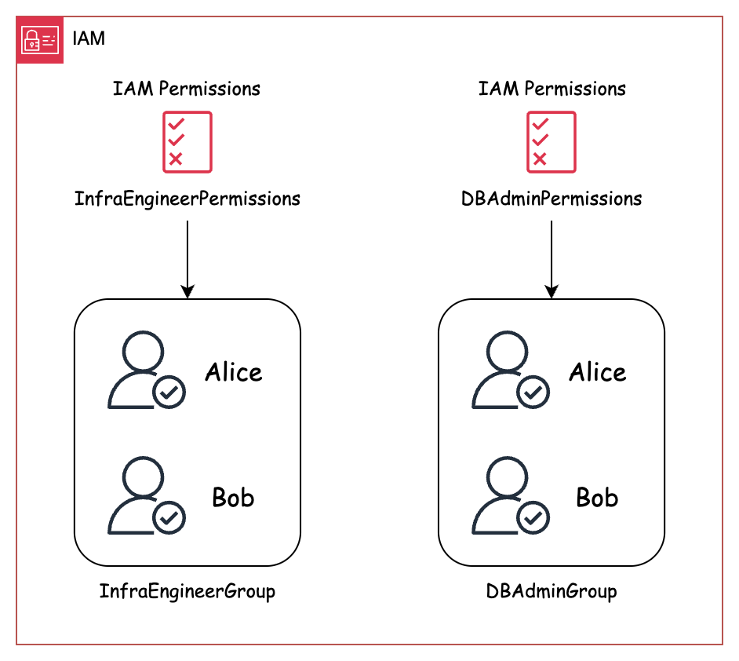
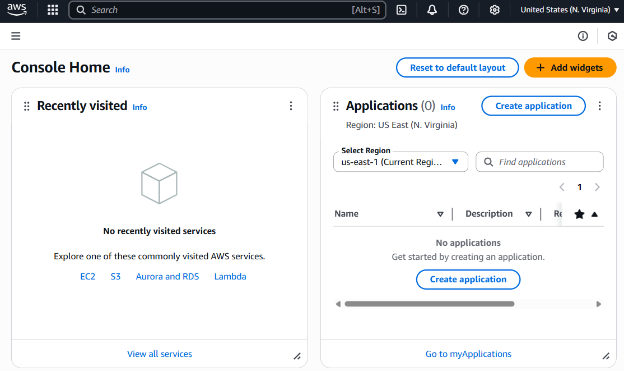

# Chapter 2: Your AWS Account - The Foundation for Business

> ⭐ **Starring** this repository to support this work

In Chapter 1, we learned about cloud computing, Amazon Web Services (AWS), and our example project, the "Cloud Coffee Shop." Now, before we start building our coffee shop's online platform, we need to talk about something vitally important: security. Just like you'd want strong locks on the doors of a physical coffee shop, you need robust security for your AWS account. This chapter will guide you through the first and most critical steps to secure your AWS environment using a service called AWS Identity and Access Management (IAM).

## 2.1 Your AWS Account: The Foundational Container for 'Cloud Coffee Shop'

Think of your AWS account as the main container that holds everything you create in AWS – your virtual servers, storage, databases, and all the components of the "Cloud Coffee Shop." It's your private, secure space in the AWS cloud.

When you first sign up for AWS, you create an account that is initially accessed with your email address and a password. This first identity is called the root user. The root user has complete control over everything in your AWS account. Because it's so powerful, we need to be extra careful with it.

*(Appendix Note: For detailed, step-by-step instructions on creating a new AWS account, please refer to Appendix 1: Creating Your AWS Account at the end.)*

## 2.2 Securing Your AWS Account

### 2.2.1 Root User

The root user possesses the highest level of access to your entire AWS environment, including all resources for the "Cloud Coffee Shop." If unauthorized individuals gain access to your root user credentials, they can perform any action, including deleting all your resources or incurring significant charges. Therefore, protecting these credentials is a top priority.

Here's how to secure your root user:

**Use a Strong, Unique Password**: This is a fundamental security measure. Avoid reusing passwords from other websites. Your password should be long, complex, and difficult to guess.

**Enable Multi-Factor Authentication (MFA)**: This is a critical step for enhancing account security. MFA adds a layer of verification. Even if someone obtains your password, they cannot log in without a second piece of information – typically a temporary code generated by an authenticator app on your smartphone (like Google Authenticator or Authy) or a physical MFA device. 

*For "Cloud Coffee Shop": Think of MFA as requiring both a key (your password) and a unique, time-sensitive code (from your MFA app) to unlock the main administrative access to the AWS infrastructure hosting your coffee shop's IT system.*

**Don't Use the Root User for Everyday Tasks**: This is an essential security best practice. After enabling MFA for the root user and creating your first IAM administrative user (which we'll discuss next), you should securely store your root user credentials and only use them for a limited set of account management tasks that specifically require root-level privileges (such as modifying your account settings or closing your AWS account).

Securing your root user is comparable to placing the master legal documents for your business, accessed only when necessary.

### 2.2.2 What is AWS Identity and Access Management (IAM)?

Now that we've secured the root user, the next critical step is establishing a robust framework for managing access to AWS resources for both human operators and automated processes involved in the "Cloud Coffee Shop" deployment. This is where AWS Identity and Access Management (IAM) comes into play.

IAM is an AWS service that enables you to securely control access to your AWS resources. With IAM, you can manage:

- **Who** can access your resources (authentication – verifying identity)?
- **What** resources can they access, and what actions can they perform on those resources (authorization–granting permissions)?

A key benefit is that IAM is a feature of your AWS account provided at no additional charge.

IAM allows you to create and manage AWS users and groups, and use permissions to allow or deny their access to AWS resources. This aligns with a core security principle known as the **principle of least privilege**. This principle dictates that you should only grant the minimum permissions necessary for an individual or service to perform their specific tasks, and no more.

### 2.2.3 IAM Users and Groups: Giving Access to Your Coffee Shop Infrastructure

Instead of multiple individuals sharing the root user credentials (a significant security risk), you create individual IAM users within your AWS account. Each IAM user possesses a unique name and their own set of credentials (a password for console access and, optionally, access keys for programmatic access via tools like the AWS Command Line Interface or SDKs).

For "Cloud Coffee Shop", if we have two infrastructure engineers, Alice and Bob, responsible for managing the servers and network configurations, we would create a distinct IAM user for Alice and another for Bob.

To simplify permission management, especially with multiple users in similar roles, you can organize IAM users into **IAM groups**. An IAM group is a collection of IAM users. You then assign permissions to the group, and all users within that group automatically inherit those permissions.

For "Cloud Coffee Shop":

- We could establish an **Infrastructure Engineers** group and add Alice and Bob to it. Any permissions granted to the InfrastructureEngineers group (such as permissions to manage EC2 instances, configure VPC settings, or update S3 bucket policies) would apply to both individuals.
- We could create a **Database Administrators** group for Sarah. Permissions for this group might include the ability to create and modify RDS instances, manage database schemas, and monitor database performance.
- If we later hire another infrastructure engineer, Charlie, we simply add him to the InfrastructureEngineers group, and he instantly receives the same set of permissions as Alice and Bob.


*Image 2.1: IAM Users and Groups for Cloud Coffee Shop*

**Best Practice**: For your day-to-day administrative tasks in AWS, create an IAM user with the necessary administrative privileges (but not the all-encompassing power of the root user). Log in as this dedicated IAM user instead of the root user.

### 2.2.4 IAM Roles

Sometimes, it's not just users who require permissions; AWS services on their own often need to interact with other AWS services. For instance, a virtual server (an EC2 instance) running your "Cloud Coffee Shop" application might need to read files from an S3 storage bucket or write logs to Amazon CloudWatch.

How do you grant these permissions securely without embedding long-term credentials (like access keys) directly into your application code on the server? The solution is **IAM Roles**.

An IAM Role is an IAM identity that you can create in your account that has specific permissions. Unlike an IAM user, a role is not associated with a particular person. Instead, it is designed to be "assumed" (temporarily adopted) by an entity that requires it, such as:

- An AWS service (e.g., EC2, Lambda).
- An application running on an EC2 instance.
- Users from another AWS account.
- Users authenticated through an external identity provider (federated users).

When an AWS service or an application assumes a role, it receives temporary security credentials that are valid only for a limited duration. This method is significantly more secure than storing permanent access keys.

For "Cloud Coffee Shop", our EC2 instances hosting the coffee shop website might need to access product images stored in an Amazon S3 bucket. We can create an IAM Role granting read-only access to that specific S3 bucket. Then, we associate this role with our EC2 instances. The application on the EC2 instance can then automatically obtain temporary credentials to read the images, without us ever having to hardcode any secret keys into the application.

### 2.2.5 IAM Policies

We have users, groups, and roles. But how do we precisely define what they are permitted to do? This is accomplished using **IAM Policies**.

An IAM Policy is a document (typically in JSON format – JavaScript Object Notation) that explicitly lists permissions. Policies define:

- **Effect**: Allow or Deny (specifies whether the permissions grant or block access).
- **Action**: Which specific operations are allowed or denied (e.g., `s3:GetObject`, `ec2:StartInstances`, `rds:DescribeDBInstances`).
- **Resource**: Which AWS resources the action applies to (e.g., a particular S3 bucket, specific EC2 instances, or all resources, denoted by `*`).
- **Condition** (Optional): Under what specific circumstances the policy is in effect (e.g., access is only permitted if the request originates from a certain IP address range, or only during a designated time window).

You can attach policies to IAM users, groups, or roles.

AWS provides many **AWS managed policies** – pre-defined policies created and managed by AWS for common use cases (e.g., "ReadOnlyAccess" or "AdministratorAccess"). You can also create your **customer-managed policies** for more fine-grained control tailored to your specific requirements.

For "Cloud Coffee Shop":

- For our **InfrastructureEngineers** group, we might attach a policy allowing actions such as `ec2:DescribeInstances`, `ec2:RunInstances`, `vpc:CreateSubnet`, and `s3:ListAllMyBuckets`.
- For the **Database Administrators** group, a policy might permit `rds:CreateDBInstance`, `rds:ModifyDBInstance`, and `cloudwatch:GetMetricData` for database-related metrics.
- The IAM Role for our EC2 instances accessing S3 images would have a policy similar to this:

```json
{
  "Version": "2012-10-17",
  "Statement": [
    {
      "Effect": "Allow",
      "Action": "s3:GetObject",
      "Resource": "arn:aws:s3:::cloudcoffeeshop-menu-images/*"
    }
  ]
}
```

This policy states: "Allow the action of retrieving an object (`s3:GetObject`) from the S3 bucket named `cloudcoffeeshop-menu-images` and any object (`/*`) within that bucket." The `arn` (Amazon Resource Name) is a unique identifier for AWS resources.

**Always apply the principle of least privilege when crafting policies. Grant only the permissions essential for performing a required task.**

## 2.3 A Quick Tour of the AWS Management Console

The AWS Management Console is a web-based interface that allows you to interact with AWS services. After you sign in (initially as the root user, or subsequently as an IAM user), you will land on the console home page.

From this central interface, you can:

- Search for and navigate to specific AWS services (such as EC2, S3, IAM, RDS).
- Manage your resources (e.g., launch virtual servers, create storage buckets, configure databases).
- Monitor your resource usage and access billing information.
- Access official documentation and support channels.

The console is designed to be visually organized and generally user-friendly.


*AWS Console*

Each AWS service has its dedicated dashboard and set of options. For example, the IAM dashboard is where you will configure users, groups, roles, and policies for the "Cloud Coffee Shop" staff and associated services.

While the console is an excellent tool for learning and performing many management tasks, AWS also provides alternative methods for interacting with its services, such as the AWS Command Line Interface (CLI) and Software Development Kits (SDKs). These tools are particularly useful for automation and scripting. For simplicity, this book will primarily refer to actions performed via the AWS Management Console.

## 2.4 Understanding AWS Bills and Keeping Costs in Check

One of the significant advantages of AWS is its pay-as-you-go pricing model. However, it's crucial to understand how billing functions and to monitor your costs diligently, especially when starting.

**AWS Free Tier**: AWS offers a Free Tier for many of its services. This allows you to experiment, learn, and build applications without incurring charges, up to specified usage limits. The Free Tier typically applies for 12 months after signing up for a new account for some services, while other services offer an always-free tier up to a certain monthly limit. This is highly beneficial for developing the "Cloud Coffee Shop" in its initial stages. Always verify the specific Free Tier limits for the services you intend to use.

**Billing Dashboard**: The AWS Management Console includes a Billing & Cost Management dashboard. This is your central hub for:

- Viewing your current month-to-date spending.
- Accessing detailed breakdowns of costs by service, AWS Region, and linked accounts.
- Reviewing past invoices.
- Managing your payment methods.

**AWS Budgets**: You can configure AWS Budgets to track your costs against a defined spending amount. Alerts can be set up to notify you (e.g., via email) when your actual or forecasted spending approaches or exceeds your budget thresholds. 

*For "Cloud Coffee Shop": We could establish an initial monthly budget of, for example, $10. This would alert us if our Free Tier usage is inadvertently exceeded or if we provision a resource that incurs unexpected costs.*

**AWS Cost Explorer**: This tool provides capabilities to visualize and analyze your AWS costs and usage patterns over time. You can filter and group data to identify key cost drivers and trends.

**Cost Allocation Tags**: You can apply tags (key-value pairs) to your AWS resources (such as EC2 instances or S3 buckets). These tags serve to organize your resources and can be used to track costs by project, department, or any other custom criteria. 

*For "Cloud Coffee Shop": We could tag all resources related to the "development" environment versus the "production" environment to differentiate and track the costs associated with each.*

Regularly reviewing your billing dashboard and utilizing tools like AWS Budgets are essential practices for managing your AWS expenses effectively.

---

By diligently securing your root user and leveraging IAM to manage users, groups, roles, and policies according to the principle of least privilege, you are establishing a robust security foundation for your "Cloud Coffee Shop." In the next chapter, we will begin designing the network infrastructure for our coffee shop using Amazon Virtual Private Cloud (VPC).

If you're enjoying this series and find it helpful, I'd love for you to like and share it! Thank you so much!

---

## 💝 Support This Work

[](https://github.com/sponsors/hoalongnatsu)
