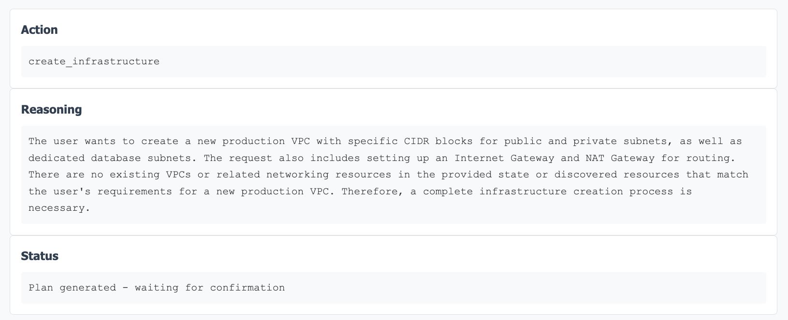
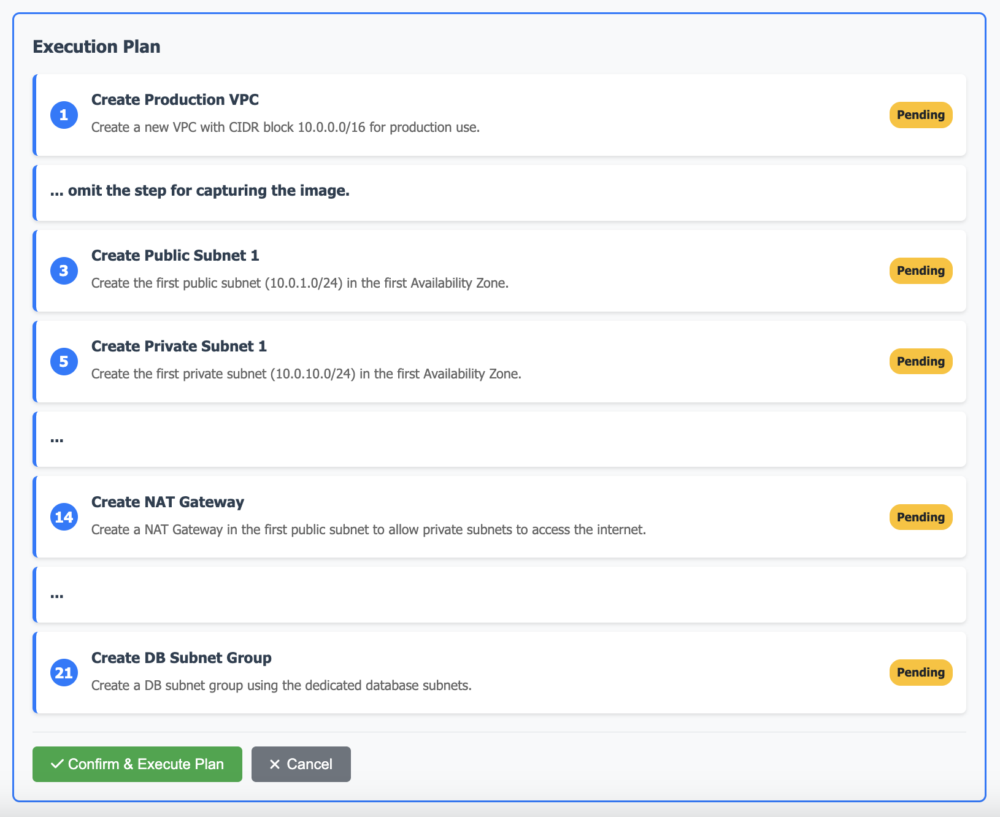

# Chapter 3: Architecting Your Private Network with Amazon VPC

> ⭐ **Starring** this repository to support this work

In Chapter 2, we secured our AWS account foundation and learned how to manage access through IAM. Now we're ready to begin building the network infrastructure for our "Cloud Coffee Shop." Just like how a physical coffee shop needs proper floor planning – with customer areas, preparation zones, storage, and office space – our online coffee shop needs a well-designed network architecture. This is where Amazon Virtual Private Cloud (VPC) comes into play.

In this chapter, we'll explore what a VPC is, understand its key components, and then use an innovative AI Infrastructure Agent to create our network infrastructure using natural language commands. This approach will make the complex world of networking more accessible while teaching you the underlying concepts.

## 3.1 What is a Virtual Private Cloud (VPC)?

Think of a Virtual Private Cloud (VPC) as your own private section of the AWS cloud. Just as a physical coffee shop has clear boundaries – walls, doors, and designated areas – a VPC creates a logically isolated network environment within AWS where you can launch your resources.

### The Physical Coffee Shop Analogy

Imagine you're designing the layout of your physical "Cloud Coffee Shop":

- **Main Store**: The customer-facing area with tables, counter, and menu displays
- **Kitchen**: The preparation area where baristas make coffee and pastries
- **Storage Room**: Where you keep coffee beans, supplies, and inventory
- **Office**: Private administrative space for management tasks

Each area serves a specific purpose and has controlled access. Customers can access the main store, staff can access the kitchen, but only managers should access the office and storage areas.

### VPC: Your Digital Coffee Shop Layout

A VPC works similarly in the digital world:

- **Public Areas**: Web servers that customers can reach from the internet (like your main store)
- **Private Areas**: Application servers and databases that should only be accessible internally (like your kitchen and storage)
- **Controlled Access**: Network rules that determine who can access what (like doors and security systems)

### Key Benefits of Using a VPC for Cloud Coffee Shop

**Isolation**: Your VPC is completely separate from other AWS customers. Your coffee shop's network traffic doesn't mix with anyone else's.

**Control**: You have complete control over your network environment. You decide the IP address ranges, create subnets, configure route tables, and set up network gateways.

**Security**: VPCs provide multiple layers of security, including security groups and network access control lists (NACLs), to control inbound and outbound traffic.

**Flexibility**: You can create multiple subnets within your VPC to organize resources by function, security requirements, or availability zones.

**Scalability**: As your coffee shop grows, you can easily add more resources to your existing VPC or create additional VPCs for different environments (development, staging, production).

## 3.2 Key VPC Components

Let's explore the essential components that make up a VPC, continuing with our coffee shop analogy:

### 3.2.1 CIDR Blocks: Defining Your Address Space

When you create a VPC, you must specify a CIDR (Classless Inter-Domain Routing) block. This defines the range of IP addresses available within your VPC.

```
Cloud Coffee Shop VPC Address Space
┌─────────────────────────────────────────────────┐
│              VPC: 10.0.0.0/16                   │
│           (65,536 IP addresses)                 │
│                                                 │
│  ┌─────────────────────────────────────────┐    │
│  │    Available IP Range:                  │    │
│  │    10.0.0.0 → 10.0.255.255              │    │
│  │                                         │    │
│  │    Example Allocation:                  │    │
│  │    ├── 10.0.1.0/24   (Public Subnet)    │    │
│  │    ├── 10.0.10.0/24  (Private Subnet)   │    │
│  │    ├── 10.0.20.0/24  (Database Subnet)  │    │
│  │    └── 10.0.30.0/24  (Future Use)       │    │
│  └─────────────────────────────────────────┘    │
└─────────────────────────────────────────────────┘
```

**For Cloud Coffee Shop**: We might choose `10.0.0.0/16`, which provides us with 65,536 IP addresses (10.0.0.0 through 10.0.255.255). This is like determining how many "addresses" we can assign within our coffee shop network – plenty of room for growth!

### 3.2.2 Subnets: Creating Functional Areas

Subnets divide your VPC into smaller networks, each associated with a specific Availability Zone. Think of subnets as different functional areas within your coffee shop.

```
Cloud Coffee Shop Floor Plan = VPC Subnets
┌────────────────────────────────────────────────────────────────┐
│                    VPC (10.0.0.0/16)                           │
│                                                                │
│  ┌─────────────────────┐    ┌─────────────────────┐            │
│  │   AVAILABILITY      │    │   AVAILABILITY      │            │
│  │      ZONE A         │    │      ZONE B         │            │
│  │                     │    │                     │            │
│  │  ┌───────────────┐  │    │  ┌───────────────┐  │            │
│  │  │ Public Subnet │  │    │  │ Public Subnet │  │            │
│  │  │ 10.0.1.0/24   │  │    │  │ 10.0.2.0/24   │  │            │
│  │  │               │  │    │  │               │  │            │
│  │  │ [Web Servers] │  │    │  │ [Web Servers] │  │            │
│  │  │[Load Balancer]|  │    │  │ [Bastion Host]│  │            │
│  │  └───────────────┘  │    │  └───────────────┘  │            │
│  │                     │    │                     │            │
│  │  ┌───────────────┐  │    │  ┌───────────────┐  │            │
│  │  │Private Subnet │  │    │  │Private Subnet │  │            │
│  │  │10.0.10.0/24   │  │    │  │10.0.20.0/24   │  │            │
│  │  │               │  │    │  │               │  │            │
│  │  │[App Servers]  │  │    │  │[App Servers]  │  │            │
│  │  │[NAT Gateway]  │  │    │  │               │  │            │
│  │  └───────────────┘  │    │  └───────────────┘  │            │
│  │                     │    │                     │            │
│  │  ┌───────────────┐  │    │  ┌───────────────┐  │            │
│  │  │ Database      │  │    │  │ Database      │  │            │
│  │  │ Subnet        │  │    │  │ Subnet        │  │            │
│  │  │10.0.30.0/24   │  │    │  │10.0.31.0/24   │  │            │
│  │  │               │  │    │  │               │  │            │
│  │  │[RDS Primary]  │  │    │  │[RDS Standby]  │  │            │
│  │  └───────────────┘  │    │  └───────────────┘  │            │
│  └─────────────────────┘    └─────────────────────┘            │
└────────────────────────────────────────────────────────────────┘
```

**Public Subnets**: These are like the customer-facing areas of your coffee shop. Resources in public subnets can have direct access to the internet through an Internet Gateway. This is where we'd place:
- Web servers hosting the coffee shop's website
- Load balancers distributing customer traffic

**Private Subnets**: These are like the back-of-house areas. Resources here cannot be directly accessed from the internet but can access the internet through a NAT Gateway. This is where we'd place:
- Application servers processing orders
- Database servers storing customer and order information

### 3.2.3 Internet Gateway: The Front Door

An Internet Gateway is like the main entrance to your coffee shop. It allows communication between your VPC and the internet. Without it, your public subnets wouldn't be truly "public."

```
Internet Gateway - The Front Door
                                 
    🌐 INTERNET 🌐
           │
           │ (Bidirectional Traffic)
           ▼
    ┌─────────────────┐
    │ Internet Gateway│
    │     (IGW)       │
    │                 │
    │  ┌───────────┐  │
    │  │  Routing  │  │
    │  │   Table   │  │
    │  │0.0.0.0/0  │  │
    │  │   → IGW   │  │
    │  └───────────┘  │
    └─────────────────┘
           │
           ▼
    ┌─────────────────┐
    │  PUBLIC SUBNET  │
    │   10.0.1.0/24   │
    │                 │
    │ ┌─────────────┐ │
    │ │Web Server 1 │ │ ← Direct internet access
    │ │             │ │
    │ └─────────────┘ │
    │                 │
    │ ┌─────────────┐ │
    │ │Load Balancer│ │ ← Receives traffic from customers
    │ └─────────────┘ │
    └─────────────────┘

Traffic Flow:
Customer Request → Internet → IGW → Public Subnet → Web Server
Web Server Response → Public Subnet → IGW → Internet → Customer
```

### 3.2.4 NAT Gateway: Secure Internet Access for Private Resources

A NAT (Network Address Translation) Gateway allows resources in private subnets to access the internet (for software updates, API calls, etc.) while preventing inbound traffic from the internet. It's like a service entrance – staff can go out to get supplies, but strangers can't come in through this door.

```
NAT Gateway - The Secure Service Entrance

🌐 INTERNET 🌐
     │
     │ (Outbound Only)
     ▼
┌─────────────────┐
│ Internet Gateway│
│     (IGW)       │
└─────────────────┘
     │
     ▼
┌─────────────────┐
│  PUBLIC SUBNET  │
│   10.0.1.0/24   │
│                 │
│ ┌─────────────┐ │
│ │ NAT Gateway │ │ ← Translates private IPs to public
│ │             │ │
│ └─────────────┘ │
└─────────────────┘
     │
     │ (Routes through)
     ▼
┌─────────────────┐
│ PRIVATE SUBNET  │
│  10.0.10.0/24   │
│                 │
│ ┌─────────────┐ │
│ │App Server 1 │ │ ← Can reach internet for updates
│ │             │ │   but cannot receive inbound traffic
│ └─────────────┘ │
│                 │
│ ┌─────────────┐ │
│ │Database     │ │ ← Can download patches/updates
│ │Server       │ │   but remains completely private
│ └─────────────┘ │
└─────────────────┘

Traffic Flow:
✅ Private Server → NAT Gateway → IGW → Internet (ALLOWED)
❌ Internet → IGW → NAT Gateway → Private Server (BLOCKED)
```

### 3.2.5 Route Tables: The Navigation System

Route tables act like GPS systems for your network traffic. They contain rules (called routes) that determine where network traffic is directed. Each subnet must be associated with a route table.

```
Route Tables - Network GPS System

┌─────────────────────────────────────────────────────────────┐
│                    VPC Route Tables                        │
│                                                             │
│  ┌─────────────────────────┐  ┌─────────────────────────┐   │
│  │   PUBLIC ROUTE TABLE    │  │  PRIVATE ROUTE TABLE    │   │
│  │                         │  │                         │   │
│  │ Destination │ Target    │  │ Destination │ Target    │   │
│  │─────────────┼──────────│  │─────────────┼──────────│   │
│  │ 10.0.0.0/16 │ Local    │  │ 10.0.0.0/16 │ Local    │   │
│  │ 0.0.0.0/0   │ igw-xxx  │  │ 0.0.0.0/0   │ nat-xxx  │   │
│  │             │          │  │             │          │   │
│  └─────────────────────────┘  └─────────────────────────┘   │
│            │                            │                  │
│            ▼                            ▼                  │
│  ┌─────────────────────────┐  ┌─────────────────────────┐   │
│  │    PUBLIC SUBNETS       │  │   PRIVATE SUBNETS       │   │
│  │                         │  │                         │   │
│  │ • 10.0.1.0/24 (AZ-a)    │  │ • 10.0.10.0/24 (AZ-a)   │   │
│  │ • 10.0.2.0/24 (AZ-b)    │  │ • 10.0.20.0/24 (AZ-b)   │   │
│  │                         │  │                         │   │
│  │ Internet Traffic:       │  │ Internet Traffic:       │   │
│  │ 0.0.0.0/0 → IGW        │  │ 0.0.0.0/0 → NAT        │   │
│  │ Internal: 10.0.0.0/16  │  │ Internal: 10.0.0.0/16  │   │
│  │ → Local                │  │ → Local                │   │
│  └─────────────────────────┘  └─────────────────────────┘   │
└─────────────────────────────────────────────────────────────┘

Traffic Decision Process:
1. Packet arrives at subnet
2. Route table checks destination IP
3. Finds matching route (most specific wins)
4. Forwards packet to specified target

Example: App server (10.0.10.5) wants to reach google.com:
10.0.10.5 → Route Table → 0.0.0.0/0 matches → NAT Gateway
```

### 3.2.6 Security Groups and NACLs: Your Security System

**Security Groups**: Act like security guards for individual resources (EC2 instances). They control inbound and outbound traffic at the instance level and are stateful (if you allow inbound traffic, the response is automatically allowed out).

**Network ACLs (NACLs)**: Act like building security for entire subnets. They control traffic at the subnet level and are stateless (you must explicitly allow both inbound and outbound traffic).

```
Multi-Layer Security Architecture

🌐 INTERNET 🌐
     │
     ▼
┌─────────────────────────────────────────────────────────────┐
│                        VPC                                  │
│                                                             │
│  ┌─────────────────────────────────────────────────────┐    │
│  │                  PUBLIC SUBNET                      │    │
│  │                                                     │    │
│  │  ┌─────────────────┐ ◄── Network ACL (Subnet Level)│    │
│  │  │ │ INBOUND RULES │                               │    │
│  │  │ ├─────────────────┤                             │    │
│  │  │ │HTTP  │80  │ALLOW│                             │    │
│  │  │ │HTTPS │443 │ALLOW│                             │    │
│  │  │ │SSH   │22  │ALLOW│                             │    │
│  │  │ │ALL   │ALL │DENY │                             │    │
│  │  │ └─────────────────┘                             │    │
│  │                                                     │    │
│  │    ┌─────────────────────────────────────────┐      │    │
│  │    │           WEB SERVER                    │      │    │
│  │    │                                         │      │    │
│  │    │ ┌─────────────────┐ ◄── Security Group │      │    │
│  │    │ │ │ INBOUND RULES │     (Instance Level)│      │    │
│  │    │ │ ├─────────────────┤                   │      │    │
│  │    │ │ │HTTP  │80  │ALLOW│                   │      │    │
│  │    │ │ │HTTPS │443 │ALLOW│                   │      │    │
│  │    │ │ │SSH   │22  │MyIP │                   │      │    │
│  │    │ │ └─────────────────┘                   │      │    │
│  │    │                                         │      │    │
│  │    │      [Coffee Shop Website]              │      │    │
│  │    └─────────────────────────────────────────┘      │    │
│  └─────────────────────────────────────────────────────┘    │
│                                                             │
│  ┌─────────────────────────────────────────────────────┐    │
│  │                 PRIVATE SUBNET                      │    │
│  │                                                     │    │
│  │  ┌─────────────────┐ ◄── Network ACL               │    │
│  │  │ │ INBOUND RULES │                               │    │
│  │  │ ├─────────────────┤                             │    │
│  │  │ │VPC   │ALL │ALLOW│ (Internal traffic only)     │    │
│  │  │ │ALL   │ALL │DENY │                             │    │
│  │  │ └─────────────────┘                             │    │
│  │                                                     │    │
│  │    ┌─────────────────────────────────────────┐      │    │
│  │    │        APPLICATION SERVER               │      │    │
│  │    │                                         │      │    │
│  │    │ ┌─────────────────┐ ◄── Security Group │      │    │
│  │    │ │ │ INBOUND RULES │                     │      │    │
│  │    │ │ ├─────────────────┤                   │      │    │
│  │    │ │ │HTTP  │8080│WebSG│ (From Web Servers)│      │    │
│  │    │ │ │SSH   │22  │MgtSG│ (From Bastion)   │      │    │
│  │    │ │ └─────────────────┘                   │      │    │
│  │    │                                         │      │    │
│  │    │     [Order Processing System]           │      │    │
│  │    └─────────────────────────────────────────┘      │    │
│  └─────────────────────────────────────────────────────┘    │
└─────────────────────────────────────────────────────────────┘

Security Layer Comparison:
┌─────────────────┬─────────────────┬─────────────────┐
│     Feature     │  Security Group │  Network ACL    │
├─────────────────┼─────────────────┼─────────────────┤
│     Level       │    Instance     │     Subnet      │
│     State       │    Stateful     │   Stateless     │
│   Allow/Deny    │   Allow only    │  Allow & Deny   │
│ Return Traffic  │   Automatic     │    Manual       │
│   Evaluation    │   All rules     │  Rules in order │
└─────────────────┴─────────────────┴─────────────────┘
```

## 3.3 IP Addressing within the VPC

Understanding IP addressing is crucial for designing your network properly. Let's break this down for our "Cloud Coffee Shop":

### 3.3.1 Private IP Address Ranges

AWS VPCs use private IP address ranges as defined by RFC 1918:
- `10.0.0.0/8` (10.0.0.0 to 10.255.255.255)
- `172.16.0.0/12` (172.16.0.0 to 172.31.255.255)
- `192.168.0.0/16` (192.168.0.0 to 192.168.255.255)

### 3.3.2 CIDR Notation Explained

CIDR notation tells us how many IP addresses are available:
- `/16` = 65,536 addresses (perfect for large deployments)
- `/20` = 4,096 addresses (good for medium deployments)
- `/24` = 256 addresses (suitable for small deployments)

### 3.3.3 AWS Reserved IP Addresses

In each subnet, AWS reserves 5 IP addresses:
- Network address (first IP)
- AWS reserved for VPC router (second IP)
- AWS reserved for DNS (third IP)
- AWS reserved for future use (fourth IP)
- Network broadcast address (last IP)

So in a `/24` subnet (256 addresses), you actually have 251 usable IP addresses.

## 3.4 Designing "Cloud Coffee Shop" Network Architecture

Now let's design our complete network architecture step by step:

### 3.4.1 Overall Architecture Design

```
Cloud Coffee Shop VPC (10.0.0.0/16)
├── Public Subnet 1 (10.0.1.0/24) - AZ-a
│   ├── Internet Gateway
│   ├── Web Server 1
│   └── Load Balancer
├── Public Subnet 2 (10.0.2.0/24) - AZ-b
│   └── Web Server 2
├── Private Subnet 1 (10.0.10.0/24) - AZ-a
│   ├── Application Server 1
│   └── NAT Gateway
├── Private Subnet 2 (10.0.20.0/24) - AZ-b
│   ├── Application Server 2
│   └── Database Server
└── Database Subnet 1 (10.0.30.0/24) - AZ-a
    └── Database Server (Primary)
```

### 3.4.2 Step-by-Step Architecture Breakdown

**Step 1: Create the VPC**
- CIDR: `10.0.0.0/16`
- Region: US East (N. Virginia) or your preferred region
- This gives us 65,536 IP addresses to work with

**Step 2: Create Public Subnets**
- Public Subnet 1: `10.0.1.0/24` in Availability Zone A
- Public Subnet 2: `10.0.2.0/24` in Availability Zone B
- These will host our web servers and load balancer

**Step 3: Attach Internet Gateway**
- Create and attach an Internet Gateway to the VPC
- This enables internet access for public subnets

**Step 4: Create Private Subnets**
- Private Subnet 1: `10.0.10.0/24` in Availability Zone A
- Private Subnet 2: `10.0.20.0/24` in Availability Zone B
- These will host our application servers

**Step 5: Create Database Subnets**
- Database Subnet 1: `10.0.30.0/24` in Availability Zone A
- Database Subnet 2: `10.0.31.0/24` in Availability Zone B
- These provide isolated database access

**Step 6: Set Up NAT Gateway**
- Create NAT Gateway in Public Subnet 1
- This allows private resources to access the internet securely

**Step 7: Configure Route Tables**
- Public Route Table: Routes traffic to Internet Gateway
- Private Route Table: Routes traffic to NAT Gateway for internet access
- Associate appropriate subnets with their route tables

This architecture provides:
- **High Availability**: Resources spread across multiple AZs
- **Security**: Multi-tier approach with proper isolation
- **Scalability**: Room for growth and additional resources
- **Best Practices**: Follows AWS Well-Architected Framework principles

## 3.5 Introduction to AI Infrastructure Agent

Now that we understand the components and design of our VPC, let's explore an innovative way to create this infrastructure: using an AI Infrastructure Agent. Instead of manually clicking through the AWS Console or writing complex infrastructure code, we can describe what we want in plain English and let AI handle the technical implementation.

### 3.5.1 What is the AI Infrastructure Agent?

The AI Infrastructure Agent is a revolutionary tool that bridges the gap between human intent and cloud infrastructure creation. It uses advanced artificial intelligence to:

**Understand Natural Language**: You describe what you want in plain English, just like explaining your requirements to a knowledgeable cloud architect.

**Generate Infrastructure Plans**: The AI analyzes your requirements and creates a detailed execution plan showing exactly what resources will be created.

**Execute Safely**: With built-in safety features like dry-run mode and approval gates, you maintain full control over what gets created.

**Track and Manage**: The agent keeps track of your infrastructure state and can help with modifications and maintenance.

### 3.5.2 Why Use AI for Infrastructure?

Traditional approaches to infrastructure creation have challenges:

**Manual Console Work**: 
- Time-consuming
- Error-prone
- Difficult to reproduce
- Hard to document

**Infrastructure as Code (Terraform, CloudFormation)**:
- Requires programming skills
- Steep learning curve
- Complex syntax
- Maintenance overhead

**AI Infrastructure Agent Benefits**:
- Natural language interface
- Automatic best practices application
- Built-in security considerations
- Easy to modify and iterate
- Self-documenting

### 3.5.3 How It Works

The AI Infrastructure Agent follows a simple but powerful workflow:

1. **Input**: You describe your infrastructure needs in natural language
2. **Analysis**: AI analyzes your requirements and identifies needed AWS resources
3. **Planning**: Creates a detailed execution plan with dependencies
4. **Review**: You review and approve the plan before execution
5. **Execution**: Agent creates resources in the correct order
6. **Tracking**: Maintains state and provides ongoing management capabilities

## 3.6 Using AI Infrastructure Agent to Create AWS VPC

Let's put theory into practice by using the AI Infrastructure Agent to create our "Cloud Coffee Shop" VPC infrastructure.

### 3.6.1 Prerequisites and Setup

Before we begin, ensure you have:

**AWS Account Setup**:
- AWS account with appropriate IAM permissions
- AWS CLI configured or credentials available
- Chosen your preferred AWS region

**AI Infrastructure Agent Setup**:
- Go 1.24.2+ installed
- AI provider API key (OpenAI, Gemini, or Anthropic)
- Agent downloaded and configured

**Quick Setup Commands**:
```bash
# Clone the repository
git clone https://github.com/VersusControl/ai-infrastructure-agent.git
cd ai-infrastructure-agent

# Run installation
./scripts/install.sh

# Set up your API key (example with OpenAI)
export OPENAI_API_KEY="your-openai-api-key-here"

# Configure AWS credentials
aws configure

# Launch the web dashboard
./scripts/run-web-ui.sh
```

### 3.6.2 Creating Your First VPC with Natural Language

Open your browser to `http://localhost:8080` and access the AI Infrastructure Agent dashboard. Now we'll create our "Cloud Coffee Shop" VPC using natural language.

<h1 align="center" style="border-bottom: none">
  
</h1>

**Step 1: Basic VPC Creation**

Enter this request in the natural language input field:

> **"Create a production VPC with a CIDR block of 10.0.0.0/16 across two availability zones. Set up public subnets (10.0.1.0/24 and 10.0.2.0/24) for internet-facing load balancers. Create private subnets for application servers (10.0.10.0/24 and 10.0.20.0/24). Set up dedicated database subnets (10.0.30.0/24and 10.0.31.0/24): Configure Internet Gateway and NAT Gateway for proper routing."**

The AI agent will analyze this request and create an execution plan that includes.

<h1 align="center" style="border-bottom: none">
  
</h1>

**Step 2: Review and Execute**

The AI agent will present you with a detailed execution plan:

<h1 align="center" style="border-bottom: none">
  
</h1>

Review the plan carefully, and when you're satisfied, click **"Approve & Execute"**.

**Step 3: Monitor Creation Progress**

Watch as the agent creates your infrastructure:

```
Creating Cloud Coffee Shop VPC Infrastructure...

✅ Step 1/12: VPC created (vpc-0abc123def456789)
✅ Step 2/12: ...
✅ Step 3/12: Public Subnet 1 created (subnet-0def456abc789123)
✅ Step 4/12: Public Subnet 2 created (subnet-0ghi789def012345)
⏳ Step 5/12: Creating Private Subnet 1...
```

### 3.6.3 Verifying Your VPC Creation

Once creation is complete, the agent provides a summary:

```
🎉 Cloud Coffee Shop VPC Successfully Created!

Infrastructure Summary:
┌─────────────────────────────────────────────────┐
│ VPC: vpc-0abc123def456789                       │
│ CIDR: 10.0.0.0/16                              │
│ Region: us-east-1                               │
│                                                 │
│ Subnets Created: 6                              │
│ ├── Public Subnets: 2                          │
│ ├── Private Subnets: 2                         │
│ └── Database Subnets: 2                        │
│                                                 │
│ Gateways:                                       │
│ ├── Internet Gateway: igw-0123456789abcdef     │
│ └── NAT Gateway: nat-0abcdef123456789          │
│                                                 │
│ Security Groups: 3                              │
│ Route Tables: 3                                 │
└─────────────────────────────────────────────────┘
```

### 3.6.4 Understanding What Was Created

Let's break down what the AI Infrastructure Agent created for us:

**Network Foundation**:
- **VPC**: Isolated network environment for our coffee shop
- **Subnets**: Organized into public, private, and database tiers
- **Internet Gateway**: Enables public internet access
- **NAT Gateway**: Provides secure outbound internet for private resources

**Security Configuration**:
- **Security Groups**: Properly configured for each tier (web, app, database)
- **Route Tables**: Direct traffic appropriately between subnets and gateways
- **Network ACLs**: Default deny-all with specific allow rules

**Best Practices Applied**:
- **Multi-AZ Design**: Resources spread across availability zones
- **Defense in Depth**: Multiple security layers
- **Least Privilege**: Minimal required access only
- **Scalability**: Architecture ready for growth

## 3.7 Advanced VPC Concepts

Now that we have our basic VPC infrastructure in place, let's explore some advanced concepts that might be useful as your "Cloud Coffee Shop" grows:

### 3.7.1 VPC Peering

VPC Peering allows you to connect two VPCs so they can communicate as if they're on the same network. This is useful for:
- Connecting development and production environments
- Sharing resources between different business units
- Creating hybrid architectures

**For Cloud Coffee Shop**: You might peer your main VPC with a separate analytics VPC for business intelligence processing.

### 3.7.2 VPC Endpoints

VPC Endpoints allow your resources to communicate with AWS services without going through the internet. Types include:
- **Gateway Endpoints**: For S3 and DynamoDB
- **Interface Endpoints**: For other AWS services

**Benefit**: Improved security and potentially reduced costs by avoiding NAT Gateway usage for AWS service communication.

### 3.7.3 Flow Logs

VPC Flow Logs capture information about IP traffic flowing through your network interfaces. They help with:
- Network monitoring and troubleshooting
- Security analysis and compliance
- Usage patterns and optimization

### 3.7.4 DNS Resolution

AWS provides DNS services within your VPC:
- **DNS Resolution**: Enabled by default
- **DNS Hostnames**: Can be enabled for public IP addresses
- **Route 53 Resolver**: For advanced DNS scenarios

## 3.8 Cost Optimization and Best Practices

**NAT Gateway Costs**: The most expensive component in our architecture
- **Cost**: ~$32/month plus data processing charges
- **Alternative**: NAT Instance (cheaper but requires management)
- **Optimization**: Consider single NAT Gateway for cost savings (reduces availability)

**Data Transfer Costs**:
- Data between AZs incurs charges
- Internet data transfer (outbound) has costs
- Design with data flow patterns in mind

## 3.9 Next Steps: Building on Your VPC Foundation

With our VPC infrastructure now in place, we have a solid foundation for the "Cloud Coffee Shop." In the upcoming chapters, we'll build upon this network infrastructure:

**Chapter 4**: We'll add security layers including security groups, NACLs, and secure access methods like VPN and bastion hosts.

**Chapter 5**: We'll launch EC2 instances in our subnets to host the coffee shop's web applications and services.

**Chapter 6**: We'll set up RDS databases in our database subnets to store customer orders and menu information.

**Chapter 7**: We'll implement storage solutions using S3 for static assets like product images and marketing materials.

**Chapter 8**: We'll add load balancers and auto-scaling to handle varying customer demand throughout the day.

The VPC we've created provides the secure, scalable, and well-architected foundation that all these services will build upon.

---

## Summary

In this chapter, we've accomplished several important goals:

✅ **Understood VPC Fundamentals**: We learned what a VPC is, its key components, and why it's essential for cloud infrastructure.

✅ **Designed Network Architecture**: We created a comprehensive network design for our "Cloud Coffee Shop" with proper separation of concerns.

✅ **Introduced AI Infrastructure Agent**: We explored how AI can simplify infrastructure creation through natural language commands.

✅ **Created Real Infrastructure**: We used the AI Infrastructure Agent to build our complete VPC infrastructure, including subnets, gateways, and security groups.

✅ **Learned Best Practices**: We covered security, cost optimization, and troubleshooting for VPC management.

The combination of understanding networking fundamentals with the power of AI-assisted infrastructure creation gives you both the knowledge and tools to build robust, scalable cloud architectures. As we continue building our "Cloud Coffee Shop," we'll see how this solid network foundation supports all the other AWS services we'll add.

If you're enjoying this series and find it helpful, I'd love for you to like and share it! Thank you so much!

---

## 💝 Support This Work

[](https://github.com/sponsors/hoalongnatsu)
