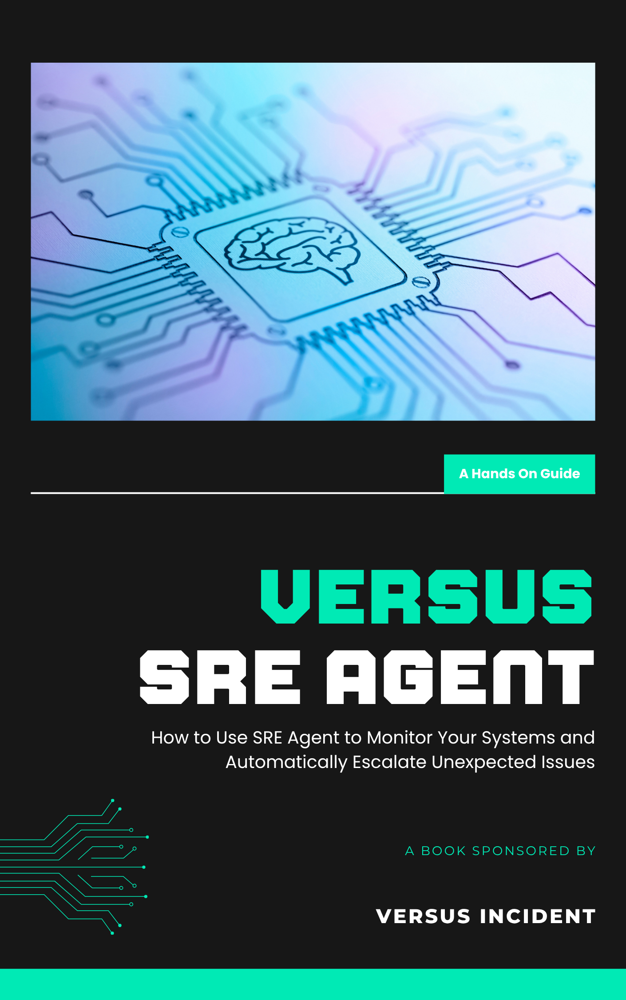

<!-- Cover -->

If you like the book version, check here to download: [SRE Agent Book](https://drive.google.com/file/d/11oY0HHgSZJ29jZHqVv86-sAQ-0Qx5K8P/view?usp=sharing)

**GUIDE**

# The Versus SRE Agent

### How to Monitor Your Systems and Automatically Escalate Unexpected Issues

*Learn what "normal" looks like. Flag what's new. Escalate only what matters.*

---

<!-- Table of Contents -->

## Contents

**0. [Introduction](#introduction)** — The one idea behind the whole book.

**1. [The Problem With Old Monitoring](#1-the-problem-with-old-monitoring)**
Why threshold alerts are always a little late, and why "add another rule" never
closes the gap.

**2. [The Unknown Unknowns](#2-the-unknown-unknowns)**
The failures you didn't predict — and can't write a rule for. Why logs are the
best place to catch them.

**3. [Learn Normal, Flag New](#3-learn-normal-flag-new)**
The theory that fixes it: pattern mining, EWMA baselines, and how an agent
learns your system without any rules.

**4. [The Three Modes: Training, Shadow, Detect](#4-the-three-modes-training-shadow-detect)**
How the agent earns your trust before it ever pages anyone.

**5. [Setting Up the Agent](#5-setting-up-the-agent)**
Turn it on inside Versus Incident instead of building it from scratch. Full
config, real output.

**6. [The Logs Page: Watching It Learn](#6-the-logs-page-watching-it-learn)**
A guided tour of the admin UI — the Agent Overview, the Logs catalog, and the
pattern peek and detail views.

**7. [How the Agent Escalates New Errors](#7-how-the-agent-escalates-new-errors)**
Detect mode end to end through the Decisions page: from an unknown log line to an
AI-triaged incident in Slack.

**8. [Operating It, Honestly](#8-operating-it-honestly)**
What it replaces, what it doesn't, and how to keep it healthy over time.

**[Additional Resources](#additional-resources)**

--
