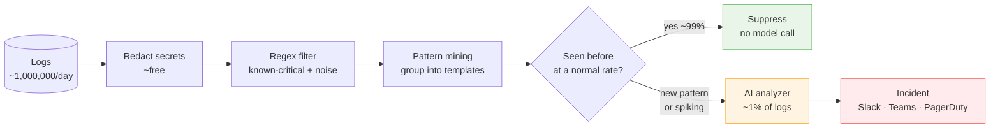

<!-- markdownlint-disable MD041 -->

## 3. Learn Normal, Flag New

The last chapter ended with a promise: you can learn what your logs normally look
like, flag anything new, and do it without bankrupting yourself or drowning in
noise. This chapter is how. It's the theory at the heart of the book, and it rests
on one principle:

> Do the expensive thinking with cheap, deterministic code. Only spend real money
> on the handful of events that genuinely need intelligence.

Think of a hospital triage. The specialist doesn't examine everyone who walks in.
A nurse checks vitals first. Normal? Go home. Slightly off? Monitor. Dangerously
abnormal? *Now* you get the specialist. The specialist — the expensive resource —
sees maybe 5% of patients, and every one of them is worth their time.

Your LLM is the specialist. Everything before it is triage, and triage should be
nearly free. Here's the whole funnel:



Each stage is cheaper and faster than the next. Redaction and regex cost
microseconds. Pattern mining costs milliseconds. Only the last box costs real
money — and by the time a line reaches it, you already know it's worth analyzing.

Let's walk the stages that make the magic happen.

### Redaction first, always

Before anything else looks at a log line, sensitive values are stripped out —
JWTs, API keys, bearer tokens, AWS credentials, emails, passwords — and replaced
with safe placeholders. This runs *first* so that no downstream component, and
especially no external AI model, ever sees a raw secret.

This is not an afterthought you bolt on later. If you're building anything that
might send log data outside your process, redaction has to be the first step in
the pipeline. We'll return to it, but internalize the ordering now: **scrub, then
process.** Never the other way around.

### Pattern mining: turning a million lines into a few dozen shapes

Raw logs look unique even when they're not.

```
Failed to connect to db 10.0.1.7 after 3 retries
Failed to connect to db 10.0.2.9 after 5 retries
```

Those are the same event with different variables. If you treat every line as a
unique string, you drown — you can never say "how often does *this* happen"
because every line is technically new.

Pattern mining fixes this. A Drain-style algorithm looks at the structure of each
line, strips out the parts that vary — IPs, IDs, numbers, timestamps — and clusters
lines by their skeleton. The two lines above collapse into one *template*:

```
Failed to connect to db <*> after <*> retries
```

Those `<*>` placeholders are where the miner noticed values that change between
lines. A million raw lines collapse into a few dozen stable templates. Now "how
often does this thing happen" becomes a countable question, because "this thing"
is a template with an ID, not an ever-changing string.

```
2,300,000 raw lines/day  --->  pattern mining  --->  ~40 templates
```

Forty things you can reason about, instead of two million you can't. This is the
foundation everything else stands on. You can't decide what's normal until you
can group like with like — and you can't cache, count, or baseline until you've
grouped.

### The catalog: the agent's long-term memory

Every template the miner discovers goes into the **catalog** — a running list of
every log shape the agent has learned, along with when it was first seen, when it
was last seen, how many times it's appeared, its normal rate, and any labels
you've added.

The catalog is the agent's long-term memory, and it's deliberately boring: a
single file on disk (`patterns.json`), flushed every 30 seconds, surviving
restarts. Not a database, not a cloud service. During learning, the catalog
grows. Once it's stable, it *is* the definition of "normal": anything in the
catalog is known; anything not in it is new.

A pattern becomes **known** in one of two ways. Either it's been seen enough times
to clearly be baseline — the shipped default is 100 sightings — or you label it
`known` by hand. Either way, once a pattern is known, the agent stops treating it
as new.

### Three verdicts

After redaction, filtering, and mining, every log event gets exactly one of three
verdicts:

- **known** — a template you've seen before, firing at its normal rate. Suppress
  it. No model call.
- **unknown** — a template you've never seen before. Send it to the AI.
- **spike** — a *known* template firing far above its normal rate. Also send it to
  the AI.

That first bucket is where the 99% goes. The vast majority of production logs are
the same boring templates repeating, and cheap deterministic code already knows
they're normal. This is the single highest-leverage decision in the whole design:
**known-and-normal is answered without an LLM.** The AI is reserved for the two
things cheap code genuinely can't judge — "new" and "abnormally frequent."

The `unknown` bucket catches new errors. The `spike` bucket catches the drift
from Chapter 2 — the queue creeping from 200 to 6,000, the familiar line whose
rhythm changed. And catching that spike is where a little bit of math earns its
place.

### EWMA: learning a rhythm, not a threshold

How does the agent know a known pattern is "firing far above normal" without you
setting a threshold? It learns each pattern's normal rhythm, and it uses an
**Exponentially Weighted Moving Average** — EWMA — to do it.

An EWMA is a running average that weights recent observations more heavily than
old ones. Every time the agent polls (a "tick"), it updates two numbers for each
pattern:

- **A normal rate** — how many matches per second this pattern usually produces.
  Because it's exponentially weighted, last hour matters more than last week, so
  the baseline adapts as your system evolves. And because it scores a *rate*
  (matches ÷ poll seconds) rather than a raw per-tick count, the baseline reads
  intuitively (`~38/s`) and doesn't shift when you change how often the agent
  polls.
- **A normal spread** — how much that rate naturally wobbles, i.e. its standard
  deviation.

With those two numbers, the agent asks a single question about each new tick: how
many standard deviations above normal is this? That's the **z-score**:

$$z = \frac{\text{this tick's rate} - \text{normal rate}}{\text{normal spread}}$$

A pattern is flagged as a spike when its z-score crosses a configurable bar
(`spike_z`, default `3.0`) — meaning the rate is at least three standard
deviations above its own learned normal. The beauty of measuring in standard
deviations is that the bar means the same thing for a quiet pattern and a chatty
one. A pattern that always wobbles a lot needs a bigger jump to alarm; a rock-
steady pattern alarms on a smaller one. The threshold self-scales to each
pattern's personality.

A worked example. Say `db-conn-refused` normally runs about `1.5/s`, wobbling by
about `± 0.3/s`, and the agent has seen it plenty of times. A tick that jumps to
`6.0/s` scores:

$$z = \frac{6.0 - 1.5}{0.3} = 15\sigma$$

Fifteen standard deviations above normal — far past the bar of 3. It's flagged as
a spike even though the pattern itself is perfectly known. The agent even records
the math in its audit log: `"6.0/s = 15.0σ above 1.5/s ± 0.3"`.

A few refinements keep this honest, and they're worth knowing because they're the
difference between a demo and a production system:

- **A frequency floor.** A near-silent pattern can't page on a coincidental
  handful of lines — a tick has to clear a minimum count first, regardless of its
  z-score.
- **A warmup gate.** The agent won't trust the z-score until it has seen a pattern
  enough times to know its normal. Like a new hire learning what a busy day looks
  like before judging one.
- **Outlier-resistant learning.** Once the baseline is confident, a spike tick is
  held *out* of the average — so one spike can't drag "normal" upward and blind the
  detector to the next one.
- **Time-of-day awareness.** The agent keeps a separate normal for each hour of
  the day. A 2 a.m. batch job can be normal-for-2-a.m. while the same burst at 2
  p.m. still pages.

You don't set thresholds. You don't predict the failure. The agent watches each
pattern, learns its rhythm, and notices when the rhythm breaks — on signals you
never configured a metric for. That's threshold-free anomaly detection, and it's
the second half of "flag new" (the first half being brand-new templates).

### Why this fixes cost, noise, and privacy at once

The three ways naive "AI on logs" dies — cost, noise, privacy — are all solved by
this architecture, not by hoping the model is smart enough.

- **Cost is controlled** because the AI only ever sees the `unknown` and `spike`
  survivors — well under 1% of your logs. Your bill tracks *incidents*, not
  *ingest*.
- **Noise is controlled** because the agent learns what's normal before it ever
  alerts, and suppresses the 99% deterministically.
- **Privacy is controlled** because redaction runs first, before mining, before
  the model, before anything leaves the process.

The AI isn't the expensive part of an AI pipeline. *Calling it too often* is. Get
the funnel right and the model becomes what it should be: the specialist at the
end, called only when every cheaper option has been exhausted.

There's one piece left before you can trust this in production. Learning a
baseline is one thing; knowing *when* the baseline is good enough to start
alerting is another. That's what the three modes are for — the subject of the next
chapter.

**In short:**

- Filter cheap, escalate smart: deterministic code handles 99% of logs; the AI
  handles the ~1% it can't judge.
- Pattern mining collapses millions of raw lines into a few dozen templates you
  can count, cache, and baseline.
- The catalog is the agent's memory of "normal"; a pattern becomes *known* after
  enough sightings or a manual label.
- Three verdicts — known (suppress), unknown (new template → AI), spike (known
  template, abnormal frequency → AI).
- An EWMA baseline plus a z-score catches spikes without thresholds, self-scaling
  to each pattern's normal wobble.
