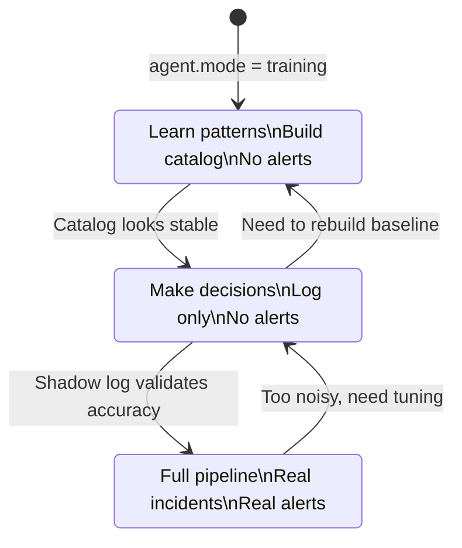

<!-- markdownlint-disable MD041 -->

## 4. The Three Modes: Training, Shadow, Detect

Here's what stops most teams from ever deploying AI in their production pipeline:
fear. And it's justified. What if it creates false incidents at 3 a.m.? What if it
floods Slack? What if it misses real problems while catching fake ones?

The answer is borrowed from a practice proven across machine learning, database
migrations, and feature-flag rollouts: **never go from "off" to "live" in a
single step.** Always have a middle stage where you can validate the system's
judgment before you trust it.

That's why the agent has three modes. You walk through them in order, and you
don't skip steps.

### Training: teach the agent what boring looks like

In training mode, the agent reads your logs and takes no action. Zero. It just
observes, mines templates, and builds the catalog — "these 40-odd shapes appear
thousands of times a day, they're probably normal." After a few days you have a
fingerprint of your system's baseline behavior.

This is the most important phase, and the one most people are tempted to skip.
Don't. The quality of your training period determines the quality of everything
that follows. Train across a *real* cycle — weekday peaks, weekend lulls, nightly
batch jobs, at least one deploy — so the baseline reflects how your system
actually behaves, not how it behaved during one quiet afternoon.

You know training is working when the rate of *new* patterns drops to a trickle.
The first hour you'll see dozens of new templates a minute as the agent learns
your access logs and health checks. After a day or two on a small service, it
slows to almost nothing. At that point, a new pattern genuinely means something
new happened.

### Shadow: watch it decide, without letting it page anyone

Shadow mode adds exactly one step to training: after the agent classifies a log
line, it asks "would I have alerted on this?" and writes the answer to a file. It
still doesn't alert. Think of it as a flight simulator — the agent makes real
decisions, but the wheels never leave the ground.

Every line that survives redaction and filtering lands in one of the three
verdicts from Chapter 3:

- **known** — the catalog has seen this pattern enough. Silenced.
- **unknown** — a brand-new template. Written to the shadow log.
- **spike** — a known pattern firing far above its EWMA baseline. Also written to
  the shadow log.

Shadow mode is where you build trust, and it's where you discover the edge cases
you didn't anticipate: the log format you forgot about, the scheduled job that
looks like an error, the deploy noise that happens every Thursday. You review what
the agent *would* have done, and for each false positive you click one button to
mark the pattern `known`. Every pattern you label is one less false alert in
detect mode.

A first shadow review on a real service almost always turns up the same mix:

- A scheduled `pg_dump` that printed a NOTICE the agent had never seen — mark it
  known.
- A health check hitting the wrong path and logging a `404` — a real, small bug;
  fix it.
- A deprecation warning that's been there for six months and nobody noticed — file
  a ticket.

Two out of three aren't urgent. But one is usually a real bug that had been hiding
in the noise. That's the value of shadow mode in a sentence: **it surfaces the
things you stopped seeing.**

Spend a release cycle here. Tune ruthlessly. The rule of thumb: if shadow is
showing dozens of new unknown patterns a day, you're not ready for detect — either
train longer or tighten your filters. Go back, don't go forward.

### Detect: let the AI triage the survivors

Detect mode is where the AI shows up. The pipeline through redaction → filter →
mining → classification is *identical* to shadow. The only difference is the last
step: when something hits the `unknown` or `spike` bucket, the agent sends it to
the model, which triages it — severity, likely cause, suggested next steps — and
turns the finding into a real incident through the notification pipeline you
already use.

We'll walk detect mode end to end in Chapter 7, including the guardrails that keep
it cheap and safe. For now, the important thing is what detect mode *is*: not a
new system, just shadow mode with the last step wired up to page a human.

### The arrows go both ways

Notice that the diagram's arrows point in both directions. This is intentional and
it's the difference between a system you *operate* and a switch you *flip*.

- If detect mode turns out too noisy, you drop back to shadow and tune.
- If you do a big refactor and your catalog goes stale, you drop back to training
  to rebuild the baseline.

The system is designed to be tuned continuously, not configured once and
forgotten. A major deploy that changes your log formats wholesale will make a lot
of lines suddenly look "unknown" — that's your cue to retrain, not to push through.

### Why the slow path is the fast path

Four steps before the agent goes fully live — training, review, shadow, detect —
can feel slow. But consider the alternative: deploy a naive AI alerter on day one,
drown your team in false positives for two weeks, and watch the whole project get
killed because "AI alerting doesn't work."

The three-mode approach is slower to start and dramatically more likely to
survive. By the time the agent goes live, it has already been wrong in private and
been corrected. That's exactly the property you want from anything that can page
you at 3 a.m.

**In short:**

- Never go from off to live in one step. The three modes are training → shadow →
  detect.
- Training builds the baseline; the quality of this phase determines everything
  after it.
- Shadow makes real decisions but only logs them — this is where you build trust
  and surface bugs you'd stopped seeing.
- Detect is shadow plus a live last step: the AI triages survivors into real
  incidents.
- The arrows go both ways — drop back to shadow to tune, or to training to rebuild
  a stale baseline.
