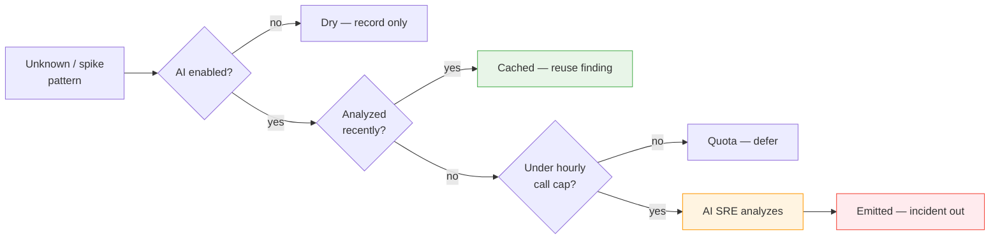
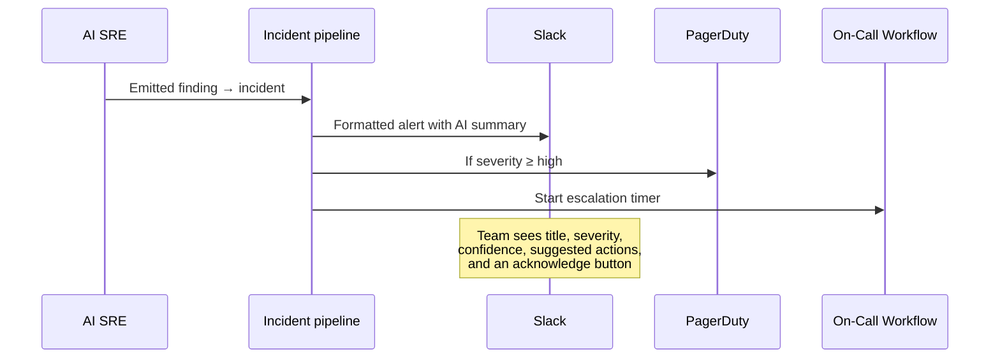

<!-- markdownlint-disable MD041 -->

## 7. How the Agent Escalates New Errors

Everything so far has been building toward one moment: a log line the agent has
never seen before appears in production, and instead of sitting unnoticed for four
hours, it becomes an incident in your team's Slack within seconds — triaged,
explained, and routed to the right people. This chapter is that moment, end to
end, through the pages that show it happening.

### Arming detect mode

Detect mode is opt-in *twice* — deliberately. The agent has to be in **Detect**
mode *and* the AI SRE has to be enabled. Miss the second and the worker still
classifies patterns but records every decision as a *dry* run — a useful no-spend
rehearsal.

If you're running the open-source build, both are set in config (`agent.mode:
detect` and `agent.ai.enable: true`, with your model and key under `agent.ai`).
On the Enterprise build there's a live control in the UI: **Settings → Agent**,
where an admin can flip **Training → Shadow → Detect** without a restart. The
control spells out what each mode does, in the agent's own words:

- **Training** — *Observes only — learns baselines, never alerts.*
- **Shadow** — *Classifies and logs would-have-alerted events, but stays silent.*
- **Detect** — *Calls the AI SRE and opens real incidents / on-call pages.*

Because arming Detect is the step that can page a human, switching to it pops a
confirmation dialog — and if the AI SRE isn't enabled yet, the dialog blocks and
points you at the AI settings first. Whichever way you set it, the **Overview**
page's runtime banner is the source of truth: it should read *enabled*, mode
*Detect*, AI SRE showing your model name.

### The one page you watch: Decisions

Under the **AI** zone, the **Decisions** page is the agent's audit trail — *what it
decided, what it would have decided, and what surged.* Three tabs organize it, each
with a live count:

- **Detect** — real AI calls and their outcomes (live in detect mode).
- **Shadow** — the "would have alerted" log (from shadow mode).
- **Spike** — a read-only view of the known-patterns that surged past their
  baseline.

A **System prompt** button in the corner opens the editor for the instructions the
AI SRE runs under — you can tune its voice there without touching the container.

#### The Detect tab

This is where escalations appear. A filter strip across the top doubles as a live
tally of every outcome — **All · Emitted · Cached · Dry · Quota · AI error · Send
error** — so you can see at a glance how the agent is spending (and *not* spending)
its model budget. Each row is one decision:

| Column | What it shows |
|---|---|
| **Service** | The service the triggering line belongs to. |
| **When** | How long ago it fired. |
| **Outcome** | An icon-coded pill: *Emitted* (an incident went out), *Cached* (reused a prior finding, no model call), *Dry*, *Rate limited / Quota*, *AI error*, *Send error*. |
| **Verdict** | `unknown` or `spike` — why it reached the AI at all. |
| **Severity** | The AI's severity badge. |
| **Pattern** | A link to the learned template on the Logs page. |
| **Title / Sample** | The AI's one-line title, or the raw sample if there's no finding. |
| **Freq** | How many times the pattern fired in the triggering tick. |
| **ms** | How long the model call took. |

The outcome pills are the fastest health check you have. A wall of green *Emitted*
and grey *Cached* is the system working; a cluster of *AI error* or *Send error*
means a bad key or a misconfigured channel — visible at a glance, no log-diving.
Click the **eye** for a quick peek, or open the row for the full story.

> **Note:** If the Detect tab is empty with *"No detect events yet — Switch the
> agent to detect mode and let it call the AI SRE,"* the agent is still in training
> or shadow. The empty state links straight to the agent settings.

#### The Detect detail page: the whole decision, on the record

Open a Detect row and you get the complete anatomy of one escalation — everything
the agent saw, sent, and got back:

- A **Summary** card: *When, Outcome, Verdict, Severity, Source, Service,
  Frequency, Baseline, Why* (the spike explanation, e.g. `47.3/s = 8.9σ above 38.4/s
  ± 1.0`), *Model, Duration, Pattern* (linked), and the AI's *Confidence*.
- The **Pattern template** and the exact **Samples** that tripped it.
- The **AI Finding** — *Title, Summary, a Category pill, the sample IDs it cited,*
  and a numbered list of **Suggestions**.
- The full **Prompt** — the *System* prompt and the per-call *User* prompt,
  verbatim, exactly as the model received them.
- The **Raw response** — the model's untouched output before parsing.

Nothing about the AI's judgment is hidden. If you ever wonder *why* it called
something a P2, the prompt and the raw response are right there. This transparency
is the thing that makes an AI decision trustworthy: you can always audit it.

### Behind the row: the five guarded steps

Every one of those Detect rows is the record of a five-step pipeline — and three of
the steps exist purely to keep you safe:



Each terminal box maps exactly to an **Outcome** pill on the Decisions page:

1. **Dry guard** → *Dry*. If the AI isn't enabled, stop and just record.
2. **Cache lookup** → *Cached*. Same pattern within the cache window reuses the
   prior finding — no model call. The cache key is the *pattern ID*, so a hundred
   structurally-identical errors all collapse to one entry. It's most effective
   exactly when you need it: during an incident, when the same broken thing is
   screaming thousands of times a minute.
3. **Rate guard** → *Quota*. A hard hourly cap bounds spend even if a bad deploy
   makes everything look unknown at once. This is the circuit breaker.
4. **Analyze.** The AI SRE reviews the redacted sample, template, frequency, and
   baseline, and writes the finding.
5. **Emit** → *Emitted*. The finding becomes a real incident.

So the outcome column isn't decoration — it's the pipeline's decision, made
legible. A healthy hour is mostly *Cached* and a few *Emitted*; a run of *Quota*
means something upstream is misclassifying and burning budget.

### What the AI produces — and when it's good

The model does what a human does when triaging: classifies severity, names a
likely root cause, categorizes the affected system, assigns a confidence score,
and suggests next steps. It writes a far better finding when it sees the *shape* of
a real incident rather than one line repeated. A database outage in the wild isn't
`connection refused` sixty times — it's connection refused *plus* slow queries
*plus* deadlocks *plus* replication lag, arriving together.

To rehearse before trusting it on real traffic, the repo's log generator can inject
exactly these correlated clusters into your test log file:

```bash
./scripts/run_noisy_logs.sh --list-scenarios
# db-outage    db-conn-refused, db-query-slow, db-deadlock, replication-lag
# oom-cascade  kernel-oom, oom-killer, pod-restart, …
# tls-expired  certificate-expired, tls-handshake-fail, oncall-fail

./scripts/run_noisy_logs.sh \
  --output ./logs/my-app.log \
  --scenario db-outage --scenario-burst 60
```

Within a poll interval, a fresh row shows up on the **Decisions → Detect** tab —
`unknown` or `spike`, an *Emitted* outcome, a severity badge, and the AI's title.
Open it and you'll see the whole cluster in the Samples, and a finding that reads
like a triage note rather than a log dump.

### From finding to page: the pipeline you already trust

Here's the payoff of building on an existing incident tool. An *Emitted* finding
becomes an incident through the *exact same* path that handles webhooks from
Alertmanager, CloudWatch, Sentry, and everything else Versus already supports — so
every integration works unchanged:

- **Slack, Teams, Telegram, Email, Lark** — same templates, same channels.
- **PagerDuty and AWS Incident Manager** — same on-call schedules, same escalation
  policies.
- **Acknowledgment flows** — same ack URLs, same timeout-and-escalate state
  machine.



The incident lands on the **Respond → Incidents** page alongside every other
alert, with a small AI badge marking the ones the agent created. There's no
migration, no new tool to learn, no new pane of glass. This is the single most
transferable lesson in the book: **when you add AI to a system, reuse the
infrastructure that already exists downstream.** Don't rebuild notification,
escalation, and delivery — inherit years of battle-tested reliability for free.

### The escalation, from a human's seat

Put it together from the on-call engineer's point of view. At 6:00 a.m. a worker
throws an error it has never thrown before. The agent mines it into a new template,
classifies it `unknown`, misses the cache, clears the rate limit, and sends the
redacted sample to the model. The finding comes back: *high severity, likely a
downstream timeout, category = database, confidence 0.82, suggested action = check
connection pool saturation.*

A row appears on **Decisions → Detect** with an *Emitted* pill. Slack gets a
formatted alert with the AI's summary and an acknowledge button. Because severity
is high, PagerDuty pages the on-call and the escalation timer starts; if nobody
acks in the window, it escalates to the next person. The engineer wakes up, reads a
one-paragraph explanation of a brand-new failure — and if they want the receipts,
the Detect detail page has the exact prompt and raw response behind it.

The four-hour silent outage from Chapter 1 becomes a five-minute page. That's the
whole point of the book, delivered.

### A word on cost

With a trained catalog and a sensible cache window, even a noisy production hour
rarely calls the model more than a handful of times — the *Cached* count on the
Detect tab usually dwarfs *Emitted*. At small-model rates that's pennies. If your
catalog is poorly trained and too many unknowns leak through, the hourly cap is the
safety net — the *Quota* pill tells you when it's holding the line. And if you want
the per-call cost to be exactly zero, point the agent at a self-hosted
OpenAI-compatible endpoint; your log data never leaves your network at all.

**In short:**

- Detect is opt-in twice (mode *Detect* + AI SRE enabled); on Enterprise you flip
  it in **Settings → Agent**, and the Overview banner confirms it.
- **AI → Decisions** is the audit trail — **Detect**, **Shadow**, and **Spike**
  tabs. The Detect tab's outcome pills (*Emitted / Cached / Quota / AI error*) are
  the pipeline's five guarded steps made legible.
- The **Detect detail page** shows the whole decision on the record: summary,
  samples, the AI finding, and the verbatim prompt and raw response.
- *Emitted* findings flow through the same incident pipeline as every other alert
  and land on **Respond → Incidents** with an AI badge — Slack, PagerDuty, and
  on-call escalation all unchanged.
- The result: a silent multi-hour outage becomes a triaged five-minute page.
