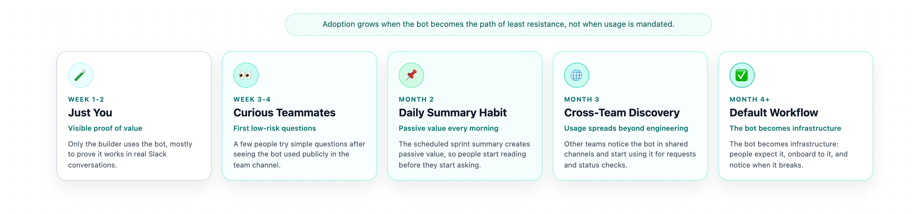

# Chapter 4: Getting People to Use It

The bot had been in Slack for two weeks. It could read the sprint board, answer questions about ticket status, and give a decent summary of where things stood. I used it every day. Nobody else did.

I'd watch my teammates type `@AI PM what's the sprint status?` exactly zero times. They'd walk over to the JIRA board, or ping me directly, or just ask in standup. The bot sat in the channel like a new piece of gym equipment — technically available, practically ignored.

This is the gap that kills most internal tools. Building it is the easy part. Getting people to change their habits is the hard part. And if nobody uses your AI PM, it doesn't matter how good it is.

This chapter is about closing that gap. Not with mandates or memos, but with practical strategies that make the AI PM the path of least resistance.

<div align="center" style="border-bottom: none">
  
</div>

## Why People Don't Use New Tools

Before we talk about what works, it helps to understand why people resist. It's rarely about the tool itself.

**Habit is powerful.** Your teammates already have a way to check sprint status — they open JIRA, or they ask you, or they wait for standup. These habits are automatic. Switching to a new tool requires conscious effort, and conscious effort loses to autopilot every time.

**Trust takes time.** Nobody trusts a bot they've never used. The first time someone asks the AI PM a question and gets a wrong answer — or even a slightly weird answer — they'll go back to their old method and never try again. You get one or two chances to make a first impression.

**Extra steps kill adoption.** If using the AI PM requires more effort than the current method, people won't switch. It doesn't matter if the AI PM is "better" in theory. If checking JIRA takes 10 seconds and asking the bot takes 15 seconds plus reading a longer response, JIRA wins.

**Nobody wants to be the guinea pig.** In most teams, there's a social cost to being the person who talks to the bot. It feels weird. People worry about looking silly. This is especially true in channels where the whole team can see the interaction.

Understanding these barriers is the first step to designing around them.

## Start With Yourself

The most effective adoption strategy is also the simplest: use the bot yourself, visibly, in public channels.

When someone asks you "hey, what's the status on PROJ-456?" — don't answer from memory. Don't open JIRA. Type this in the channel:

```
@AI PM What's the status of PROJ-456?
```

Wait for the response. Then add your own context if needed: "Yeah, looks like it's blocked on the API changes. I'll follow up with the backend team."

This does three things at once:

1. **It shows the bot works.** People see a real question get a real answer in real time.
2. **It normalizes the interaction.** If the tech lead talks to the bot, it's not weird for anyone else to do it.
3. **It demonstrates the value.** The answer comes back in seconds, with ticket details, without anyone opening JIRA.

Do this consistently for a week or two. Every time someone asks you a project question that the bot can answer, route it through the bot. You're not forcing anyone to use it. You're just making it visible.

## Make It the Default for Status Questions

The single biggest adoption lever is making the AI PM the easiest way to get information. Here's how.

### Pin a Daily Sprint Summary

Set up a scheduled message — using OpenClaw's cron system — that posts a sprint summary to your team channel every morning:

```bash
openclaw cron create \
  --name "daily-sprint-summary" \
  --schedule "0 9 * * 1-5" \
  --agent main \
  --message "Summarize the current sprint status. Group tickets by status (To Do, In Progress, In Review, Done). Flag any tickets that haven't moved in 2+ days. Keep it concise." \
  --deliver
```

This posts a summary at 9 AM every weekday. The team doesn't have to do anything — the information just appears. After a few days, people start reading it. After a few weeks, they expect it. And when they have a follow-up question about something in the summary, the natural thing to do is ask the bot.

> **Tip:** Pin the first summary message in the channel so new team members can find it. Update the cron schedule based on when your team actually reads Slack — if nobody's online at 9 AM, move it to 10.

### Redirect Questions to the Bot

When someone DMs you asking "are we on track for the sprint?" — don't answer directly. Reply with:

> "Good question — let me check. @AI PM what's our sprint progress?"

Or even simpler:

> "The bot posts a daily summary in #team-channel at 9 AM — check there. Or just ask it directly: @AI PM sprint status"

You're not being lazy. You're training the team to use a faster, more reliable source of information than your memory. Every time you redirect a question to the bot, you're one step closer to people going there first.

## Create Entry Points for Other Teams

Your team isn't the only audience. Other teams — product, design, QA, leadership — regularly need information from your sprint. They ask "when will feature X be ready?" or "can you fit this into the current sprint?" These cross-team interactions are a huge adoption opportunity.

### The Inbound Request Channel

Create a dedicated Slack channel for inbound requests — something like `#team-requests` or `#eng-intake`. Invite the AI PM bot. Then tell other teams:

> "If you need something from our team, drop it in #eng-intake. The bot will help you check current sprint status and see what's in the backlog. For new requests, just describe what you need and we'll triage it."

This works because it solves a real problem for the requesting team. Instead of hunting down the right engineer or waiting for your next planning meeting, they get an immediate response. The bot can:

- Answer "is feature X in the current sprint?" by checking the board.
- Show the current sprint load so requesters can see if there's capacity.
- Collect request details in a structured way for your team to triage later.

### Route Task Assignment Through the Bot

This is the move that changed everything for my team. Instead of people assigning JIRA tickets to my team members directly (often without context, often to the wrong person), I asked them to go through the bot:

```
@AI PM Create a ticket for the payment API timeout issue. 
It's affecting checkout on mobile. Priority should be high.
```

The bot creates the ticket with proper fields, and your team triages it in the next planning session. The requester gets a ticket key back immediately. Your team gets a clean, well-described ticket instead of a vague Slack message that gets lost in the scroll.

> **Warning:** This only works if the bot actually creates good tickets. Test this thoroughly before opening it up to other teams. A bot that creates garbage tickets will kill trust faster than no bot at all.

### The "Ask the Bot" Response

When someone from another team pings you directly with a status question, develop the habit of responding:

> "You can check anytime in #eng-intake — just ask @AI PM. It has real-time access to our board."

This isn't dismissive. It's empowering. You're giving them a faster path to the information they need, available 24/7, without waiting for you to respond.

## Handle Skepticism Head-On

Not everyone will be excited about the bot. Some common objections and how to handle them:

### "I don't trust it"

Fair. The answer isn't to argue — it's to demonstrate. When a skeptic is in the channel, use the bot to answer a question, then verify the answer together. "Let's check — @AI PM what's the status of PROJ-789? ... See, that matches what's on the board." Do this a few times and trust builds naturally.

If the bot gets something wrong in front of a skeptic, own it immediately: "Yeah, it got that wrong. I'll fix the prompt. It's still learning." Honesty about limitations builds more trust than pretending the bot is perfect.

### "It's slower than just checking JIRA"

Sometimes true. If someone is already in JIRA with the board open, the bot is slower. The bot's advantage isn't speed for individual lookups — it's accessibility. You can ask it from Slack without context-switching. You can ask it in a meeting without opening a browser. You can ask it at 11 PM from your phone.

Frame it as "another way to get the info" rather than "a replacement for JIRA."

### "I don't want a bot reading my tickets"

This is a permissions concern, and it's valid. Be transparent about what the bot can access: "It reads the same board data you see in JIRA. It can't access private messages, personal data, or anything outside the project board." If your organization has specific data policies, make sure the bot complies and communicate that clearly.

### "This is just more overhead"

The best counter to this is data. After a few weeks of the daily summary running, track how many status questions you're getting in DMs versus before. If the number dropped, that's time saved — for you and for the people who used to wait for your response.

## The Adoption Curve

Adoption doesn't happen all at once. Here's the pattern I saw:

### Week 1–2: Just You

You're the only user. You use the bot visibly in channels. People notice but don't engage. This is normal.

### Week 3–4: The Curious Ones

One or two teammates try it. Usually the ones who sit near you or who saw you use it in a meeting. They ask simple questions: "what's assigned to me?" or "what's in the sprint?" If the bot answers well, they come back.

### Month 2: The Daily Summary Effect

The daily sprint summary becomes part of the team's routine. People read it even if they don't interact with the bot directly. When they have a follow-up question, some of them ask the bot instead of you. This is the tipping point.

### Month 3: Cross-Team Discovery

Someone from another team sees the bot respond in a shared channel. They ask "what is that?" Your teammate explains. Now you have organic word-of-mouth. The requesting team starts using the intake channel.

### Month 4+: It's Just How Things Work

The bot is part of the workflow. New team members are told "ask the bot for sprint status" during onboarding. People would notice if it stopped working. You've crossed the line from "optional tool" to "infrastructure."

Not every team follows this exact timeline. But the pattern — personal use, visible use, passive value (summaries), active adoption, cross-team spread — is consistent.

## Practical Tactics That Worked

Here are specific things I did that moved the needle:

### Put the Bot in Every Relevant Channel

Don't limit the bot to one channel. Add it to your team channel, your standup channel, your cross-team channels, and any channel where project questions come up. The more places people see it, the more natural it feels to use it.

### Create Shortcuts

Write a pinned message in your team channel with common commands:

```
Quick commands for @AI PM:
• "sprint status" — current sprint overview
• "my tickets" — what's assigned to you
• "blockers" — any stuck tickets
• "PROJ-123" — details on a specific ticket
```

This removes the "I don't know what to ask" barrier. People are more likely to try something when they can see exactly what to type.

### Celebrate Wins Publicly

When the bot catches a blocker before anyone noticed, mention it: "Good catch by the bot — PROJ-456 has been stuck for 3 days. Let me unblock that." When the daily summary saves a meeting, say so: "We can skip the status round today — the bot already posted the summary."

These small moments build the narrative that the bot is useful, not just novel.

### Don't Force It

The fastest way to kill adoption is to mandate it. "Everyone must use the bot for status updates" will generate resentment, not engagement. Let people come to it naturally. The daily summary, the visible usage, the redirected questions — these create pull, not push.

### Fix Problems Fast

When the bot gets something wrong — and it will — fix it quickly and visibly. "The bot was showing stale data for PROJ-789 because the JIRA sync was delayed. I've fixed the caching. Should be accurate now." This shows the system is maintained and improving, not abandoned.

## Measuring Adoption

You don't need a fancy dashboard. Track these three things:

1. **Bot interactions per week.** How many times did someone (other than you) message the bot? A simple upward trend is what you're looking for.

2. **Status questions in DMs.** How many times did someone DM you asking for sprint status or ticket info? This should decrease as bot usage increases.

3. **Daily summary engagement.** Are people reacting to or threading on the daily summary? Emoji reactions and follow-up questions are signals that people are reading it.

If interactions are flat after a month, something isn't working. Go back to the basics: is the bot answering accurately? Is it in the right channels? Are you using it visibly yourself?

## When Adoption Stalls

Sometimes it just doesn't take off. Common reasons:

**The bot isn't accurate enough.** If it gives wrong answers more than occasionally, people won't trust it. Go back to Chapter 5 (debugging failures) and fix the accuracy issues before pushing adoption.

**The team is too small.** A team of three people sitting next to each other doesn't need a bot for status updates. They just talk. The AI PM adds more value as team size and communication overhead increase.

**The workflow doesn't fit.** If your team doesn't use JIRA consistently — tickets are stale, statuses aren't updated, the board doesn't reflect reality — the bot will reflect that mess. Fix the underlying workflow first.

**Leadership isn't on board.** If your manager actively discourages using the bot, adoption will stall regardless of how good it is. Have a conversation about the time savings and show the data.

## Looking Ahead

Your AI PM is deployed and people are using it. The daily summary runs, cross-team requests flow through the intake channel, and your teammates ask the bot instead of opening JIRA.

But the bot isn't perfect. It gets things wrong — sometimes subtly, sometimes spectacularly. The next chapter digs into how AI agents fail in PM contexts: hallucinated tickets, incorrect status assessments, and the debugging techniques that turn mysterious failures into fixable problems.

Understanding failure modes is what separates a toy from a tool your team can depend on.

## Summary

- Building the AI PM is the easy part. Getting people to use it is the hard part — and it requires deliberate strategy, not just a Slack announcement.
- Start by using the bot yourself, visibly, in public channels. This normalizes the interaction and demonstrates value without forcing anyone.
- The daily sprint summary is the single most effective adoption tool. It delivers value passively — people read it without having to change their behavior.
- Create entry points for other teams: an intake channel for requests, task assignment through the bot, and "ask the bot" redirects for status questions.
- Handle skepticism with demonstration, not argument. Own mistakes openly. Fix problems fast. Never mandate usage.
- Adoption follows a predictable curve: personal use → visible use → passive value → active adoption → cross-team spread. Give it 2–3 months before judging.
