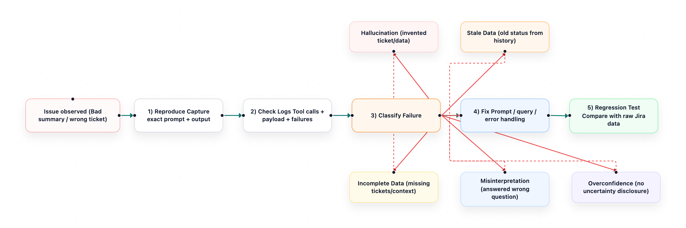

# Chapter 5: When AI PM Got It Wrong

The message appeared in our team channel at 9:03 AM on a Thursday:

> *Sprint Summary: 12 of 15 tickets complete. Sprint is on track. No blockers detected.*

I glanced at it and moved on. Twenty minutes later, our QA lead pinged me: "Hey, the summary says we're on track, but PROJ-312 and PROJ-318 have been stuck in review for four days. And PROJ-320 doesn't exist — I have no idea where the bot got that one."

She was right. The bot had hallucinated a ticket, missed two obvious blockers, and declared the sprint healthy when it wasn't. If I hadn't caught it, the stakeholder meeting that afternoon would have gone very differently.

This was the moment I realized that understanding how the AI PM fails is just as important as understanding how it works. Failures in AI agents aren't random. They follow patterns. And once you learn those patterns, you can design around them.

But first, you need to know where to look when something goes wrong — and where to make changes when you want to fix it.

<div align="center" style="border-bottom: none">
  
</div>

## Your Agent's Home

Think of the OpenClaw workspace as your agent's apartment. It's where the agent lives, where it keeps its notes, and where it looks every morning to remember who it is and what it's supposed to do.

The workspace lives at `~/.openclaw/workspace/`. Inside, you'll find a handful of markdown files. Each one shapes a different part of the agent's behavior. When the agent does something wrong, the fix is almost always in one of these files. Knowing which file to open is half the debugging process.

### SOUL.md — The Agent's Personality

This is the most important file. It defines who the agent is: its tone, its opinions, its boundaries, and its rules. The agent reads `SOUL.md` at the start of every single session. If the agent is too verbose, too formal, too cautious, or too confident — this is where you fix it.

In Chapter 3, we wrote a `SOUL.md` that told the agent to be concise, reference ticket keys, and never hallucinate data. Every behavioral rule you add here directly shapes how the agent responds. Think of it as the agent's job description and personality combined.

**Edit this file when:** the agent's tone is off, it's not following your formatting rules, it's too chatty, it's not flagging risks, or it's being too cautious about running commands.

### AGENTS.md — The Operating Manual

If `SOUL.md` is who the agent is, `AGENTS.md` is how it works. This file contains the operating instructions: how the agent handles memory, how it behaves in group chats versus DMs, what it should do at the start of each session, and what it should never do.

The default `AGENTS.md` that OpenClaw creates during setup is already solid. It tells the agent to read its personality file, check recent memory, and behave differently in group chats (don't respond to everything — participate, don't dominate).

**Edit this file when:** you want to change how the agent handles conversations, how it uses memory, or how it behaves in shared channels versus private messages.

### TOOLS.md — The Cheat Sheet

This file is the agent's notebook for tool-specific details. It doesn't control which tools are available — that's handled by skills. Instead, it's guidance: your default JIRA project key, your board ID, naming conventions, or notes like "our team uses 'In Review' not 'Code Review' as a status."

This is one of the most underused files, and one of the most valuable for preventing errors. When the agent uses the wrong project key or queries the wrong board, the fix is usually adding a line to `TOOLS.md`.

**Edit this file when:** the agent uses wrong defaults (project key, board ID), doesn't know your team's JIRA conventions, or keeps making the same tool-related mistake.

### USER.md — Who You Are

A short file that tells the agent about you — your name, your role, how you like to be addressed. The agent reads this every session. It's usually set once during onboarding and rarely changed.

**Edit this file when:** your role changes, you want the agent to address you differently, or you're handing the agent off to a different primary user.

### The Skills Directory — What the Agent Can Do

Inside the workspace, there's a `skills/` folder. This is where tool integrations live. The JIRA skill we installed from ClawHub in Chapter 3 sits at `skills/jira/`. Inside that folder, the key file is `SKILL.md` — it tells the agent how to use the `jira` CLI, what commands are available, safety rules for write operations, and how to handle different backends.

You usually don't need to edit skill files. But when the agent handles a JIRA command in a way you don't like — maybe it asks for confirmation too often, or it uses the wrong command for a particular query — the fix is in `skills/jira/SKILL.md`.

**Edit skill files when:** the agent uses the wrong CLI commands, doesn't follow your preferred workflow for creating or transitioning tickets, or you want to customize how it handles a specific tool.

### Memory Files — What the Agent Remembers

The agent wakes up fresh every session. It doesn't remember yesterday's conversations unless it wrote them down. That's what the memory files are for:

- `memory/YYYY-MM-DD.md` — Daily logs. The agent writes these automatically during conversations. One file per day. Think of them as the agent's journal.
- `MEMORY.md` — Curated long-term memory. The important stuff distilled from daily logs. The agent only loads this in private sessions (not in shared channels, for security).

When the agent forgets something it should know — a team convention, a recurring pattern, a decision from last week — check whether it's captured in `MEMORY.md`. If not, add it.

### HEARTBEAT.md — The Proactive Checklist

This optional file tells the agent what to check during periodic heartbeat runs. If you've set up a heartbeat schedule (the agent waking up every 30 minutes to check on things), this file is its to-do list. Keep it short — a few bullet points like "check for stuck tickets" or "see if anyone submitted a standup."

### The Config File — Not in the Workspace

One important distinction: `~/.openclaw/openclaw.json` is *not* in the workspace. It lives one level up, at `~/.openclaw/`. This file controls the infrastructure — which model to use, which channels are connected (Slack, Telegram), gateway settings, and authentication. You edit it with `openclaw configure` or by hand.

The workspace files shape *what the agent does*. The config file shapes *how the agent runs*. When the agent's behavior is wrong, look at the workspace. When the agent can't connect or uses the wrong model, look at the config.

### Quick Reference: Which File Fixes What?

When something goes wrong, here's where to look:

- Agent's tone or personality is off → `SOUL.md`
- Agent uses wrong JIRA defaults (project, board) → `TOOLS.md`
- Agent handles JIRA commands badly → `skills/jira/SKILL.md`
- Agent misbehaves in group chats → `AGENTS.md`
- Agent forgets things between sessions → `MEMORY.md`
- Agent can't connect or uses wrong model → `~/.openclaw/openclaw.json`

Keep this reference handy. You'll use it throughout the rest of this chapter — and the rest of the book.

## How AI Agents Think

To debug an AI PM, you need a basic mental model of what's happening under the hood. You don't need to understand transformer architectures or attention mechanisms. You need to understand three things: prompts, context windows, and tool calls.

### Prompts: The Instructions

Everything the agent does starts with a prompt — the instructions you wrote in `SOUL.md`, plus the user's message, plus any context from the conversation. The LLM reads all of this and generates a response.

The failure mode here is ambiguity. If your prompt says "summarize the sprint," the LLM has to decide what "summarize" means. How many tickets to include? What counts as "at risk"? Should it mention assignees? Every ambiguity is a place where the agent might make a different choice than you'd expect.

The fix is specificity. Instead of "summarize the sprint," say "list all tickets grouped by status. Flag any ticket that hasn't changed status in 2 or more days. Include the ticket key, summary, assignee, and days in current status." The more specific the instruction, the more predictable the output.

### Context Windows: The Memory Limit

An LLM can only process a limited amount of text at once — this is the *context window*. Everything the agent needs to know — the system prompt, the conversation history, the JIRA data it just fetched — has to fit inside this window.

When the data exceeds the window, things get silently dropped. The agent doesn't tell you "I couldn't read all 50 tickets." It just reads the first 30 and summarizes those, confidently, as if that's the complete picture.

This is one of the most dangerous failure modes because it looks correct. The summary is well-written, the format is right, the tone is professional. But it's based on incomplete data. You won't notice unless you count the tickets.

### Tool Calls: The Hands

When the agent needs data from JIRA or wants to post in Slack, it runs a command — executing the `jira` CLI, calling a Slack action, or using another tool. These commands can fail in several ways:

- **The command fails silently.** The `jira` CLI returns an error (authentication expired, network issue), but the agent doesn't surface it. Instead, it works with whatever data it has (or no data at all) and generates a response anyway.
- **The command returns unexpected output.** The CLI output format changed after an update, or the query returned different fields than expected. The agent tries to parse it and gets confused.
- **The agent runs the wrong command.** It uses `jira issue view` when it should have used `jira sprint list`, or it passes the wrong flags or project key.

Each of these produces a different kind of failure, and each requires a different debugging approach.

## The Five Failure Modes

After months of running the AI PM in production, I've categorized the failures into five patterns. Every bug I've encountered fits into one of these.

### 1. Hallucination: Inventing Data

This is the most dangerous failure because it looks like real data. The agent reports a ticket that doesn't exist, attributes a status that's wrong, or invents a blocker that nobody reported.

**Why it happens:** LLMs are trained to generate plausible text. When they don't have enough data to answer a question, they fill in the gaps with something that sounds right. If the agent's `jira` CLI command failed and returned no data, the LLM might "remember" ticket information from earlier in the conversation — or simply make something up.

**Real example:** The agent was asked "what tickets are assigned to Alex?" It ran `jira issue list -a"Alex"` and got three tickets back. But the agent reported four — it included a ticket from a previous conversation that was no longer assigned to Alex. The LLM treated its own conversation history as a data source.

**How to detect it:** Compare the agent's output against the raw CLI output in the logs. If the agent mentions a ticket key that doesn't appear in the `jira` command results, it hallucinated.

**How to prevent it:**
- Add explicit instructions to `SOUL.md`: "Never report ticket data that didn't come from a `jira` CLI command in this session. If a command fails, say so."
- Validate outputs by cross-referencing ticket keys against the `jira` CLI output.
- Keep conversation sessions short. Long sessions accumulate stale context that the LLM might reference.

### 2. Stale Data: Reporting Old Information

The agent reports information that was true at some point but isn't anymore. A ticket that was "In Progress" yesterday is now "Done," but the agent still reports it as in progress.

**Why it happens:** Two common causes. First, the agent might be using cached output from a previous `jira` command instead of running a fresh one. Second, the conversation history might contain old ticket data that the LLM references instead of running the command again.

**Real example:** Someone asked "what's the status of PROJ-456?" at 10 AM. The agent ran `jira issue view PROJ-456` and reported "In Progress." At 2 PM, someone asked the same question in the same thread. The agent reported "In Progress" again — but the ticket had been moved to "Done" at noon. The LLM used the earlier response instead of running a new `jira` command.

**How to detect it:** Check the agent's logs. Did it run a fresh `jira` command, or did it answer from conversation history?

**How to prevent it:**
- Add to `SOUL.md`: "Always run a fresh `jira` command for ticket status. Never rely on previous responses — statuses change frequently."
- Keep sessions scoped. Don't let a single conversation thread run for hours — the accumulated context becomes a liability.

### 3. Incomplete Data: Missing the Full Picture

The agent gives a correct but incomplete answer. It reports 10 tickets when there are 15. It lists blockers in one project but misses another. It summarizes the sprint without mentioning a critical dependency.

**Why it happens:** Usually a context window issue. The `jira` CLI output was too large, and the LLM only processed part of it. Or the agent queried one project but not another. Or the command flags filtered out tickets that should have been included.

**Real example:** The daily sprint summary reported 12 tickets. The actual sprint had 18. The agent ran `jira sprint list --state active` and then `jira issue list` with default limits. The CLI returned a truncated list, and the agent summarized what it got as if it were the complete sprint.

**How to detect it:** Count. Seriously — count the tickets in the agent's output and compare against the JIRA board. If the numbers don't match, you have an incomplete data problem.

**How to prevent it:**
- Make sure your `jira` CLI commands return all relevant data. Check if the `--paginate` flag or higher `--limit` values are needed. You can add default flags in `TOOLS.md`.
- Add a sanity check to `SOUL.md`: "After summarizing, state the total number of tickets in the sprint. If this doesn't match the number of tickets you listed, note the discrepancy."
- For large sprints, instruct the agent to break queries into smaller chunks (by status, by assignee) and combine the results.

### 4. Misinterpretation: Understanding the Question Wrong

The agent gives a well-formed answer to the wrong question. Someone asks "what's blocking the release?" and the agent lists tickets with the "Blocked" status label — but the actual release blocker is a dependency on another team that isn't tracked as a JIRA status.

**Why it happens:** Natural language is ambiguous. "Blocking the release" could mean tickets with a "Blocked" label, tickets with unresolved dependencies, tickets that are on the critical path, or something else entirely. The LLM picks the interpretation that's easiest to answer with the tools it has.

**Real example:** A product manager asked "what's left for the Q2 release?" The agent listed all open tickets in the current sprint. But the Q2 release included tickets across three sprints and two boards. The agent answered the question it could answer (current sprint) rather than the question that was asked (Q2 release scope).

**How to detect it:** Read the agent's response and ask: "Did it answer the question that was asked, or a different question?" This requires human judgment — automated detection is hard.

**How to prevent it:**
- Improve the prompt with common question patterns and how to handle them. "When someone asks about a 'release,' check if there's a JIRA version or fix version associated with it, not just the current sprint."
- Add clarification behavior: "If a question is ambiguous, ask for clarification before answering. For example: 'Do you mean the current sprint, or the full Q2 release scope?'"

### 5. Confidence Without Calibration

The agent presents uncertain information with the same confidence as certain information. It says "the sprint is on track" with the same tone whether 90% of tickets are done or 50% are done. It doesn't distinguish between "I checked and everything looks good" and "I couldn't get the data so I'm guessing."

**Why it happens:** LLMs don't have a built-in sense of uncertainty. They generate text that sounds confident regardless of how much evidence supports it. A summary based on complete data looks identical to a summary based on partial data.

**Real example:** The `jira` CLI was failing because the API token had expired. The agent's command returned an authentication error. Instead of saying "I couldn't reach JIRA," the agent generated a summary based on the last data it had seen — from two days ago — and presented it as current. No disclaimer, no caveat, no indication that anything was wrong.

**How to detect it:** Check command success/failure in the logs. If a `jira` command failed but the agent still produced a confident answer, you have a calibration problem.

**How to prevent it:**
- Add explicit error handling instructions to `SOUL.md`: "If a `jira` command fails or returns an error, say so clearly. Do not generate a summary from memory or previous data. Say: 'I couldn't reach JIRA right now. Here's what I had as of [last successful check].'"
- Design the prompt to require the agent to state its data source: "Based on JIRA data retrieved at [time]..." This makes it obvious when the data is stale.

## Debugging in Practice

When something goes wrong, here's the process I follow. It takes 5–10 minutes and catches most issues.

### Step 1: Reproduce the Problem

Get the exact message that triggered the bad response. Copy it. You'll need it to test your fix.

### Step 2: Check the Logs

OpenClaw logs every agent interaction, including tool calls and their results:

```bash
openclaw logs --follow
```

Look for:
- Did the agent run the expected `jira` CLI commands?
- Did the commands succeed or return errors?
- What data did the commands return?
- How did the agent interpret that data?

### Step 3: Compare Output to Raw Data

Take the raw `jira` CLI output from the logs and compare it to what the agent reported. This tells you whether the problem is in the data (command issue) or in the interpretation (prompt issue).

- **Data matches but output is wrong** → Prompt issue. The agent got the right data but drew the wrong conclusion. Edit `SOUL.md`.
- **Data is incomplete** → Command issue. The `jira` CLI query didn't return all the data, or the context window truncated it. Edit `TOOLS.md` to add better default flags.
- **Data is missing entirely** → Command failure. The CLI call failed (auth expired, network down) and the agent didn't handle it properly. Check `jira me` to verify credentials.
- **Output includes data not in the response** → Hallucination. The agent invented information. Add guardrails to `SOUL.md`.

### Step 4: Fix and Test

Based on what you found:

- **Prompt issue:** Update `SOUL.md` with more specific instructions for this scenario.
- **Command issue:** Check `TOOLS.md` for default flags, or update the JIRA skill at `skills/jira/SKILL.md` with better query patterns.
- **Hallucination:** Add stronger guardrails to `SOUL.md`: "Only report data from the current `jira` command output."
- **Error handling:** Add explicit instructions to `SOUL.md` for what to do when a command fails.
- **Auth/connectivity:** Run `jira me` to verify credentials. Re-run `jira init` if the token expired.

Test the fix by sending the same message that triggered the original problem. Verify the response is correct.

### Step 5: Add a Regression Check

Keep a list of "questions that broke the bot" and periodically re-test them. This is your regression suite. It doesn't need to be automated at this stage — just a document with the question, the expected answer, and the date you last verified it.

We'll formalize this into an automated evaluation pipeline in Chapters 8 and 9.

## Building a Failure-Resistant Agent

You can't eliminate failures. LLMs will always have edge cases. But you can make failures rare, detectable, and recoverable.

### Make Failures Visible

The worst failures are the ones nobody notices. Add these rules to your `SOUL.md`:

- "When reporting data, always include the timestamp of the last `jira` command."
- "If any `jira` command fails, explicitly state which command failed and what data might be missing."
- "End every sprint summary with a confidence note: 'Data source: jira CLI, queried at [time]. [N] tickets processed.'"

These small additions make it obvious when something is off. A summary that says "12 tickets processed" when the sprint has 18 is a visible signal that something went wrong.

### Design for Graceful Degradation

When the agent can't do its job perfectly, it should do the next best thing:

- Can't reach JIRA? Say so and offer to retry.
- Got partial data? Report what you have and flag what's missing.
- Unsure about an interpretation? Ask for clarification instead of guessing.

The goal isn't perfection. It's transparency. A team can work with "I got 12 of 18 tickets — here's what I have, and I'll retry for the rest." They can't work with a confidently wrong summary.

### Keep a Failure Log

Every time the agent gets something wrong, document it:

- What was the question?
- What did the agent say?
- What should it have said?
- What was the root cause?
- What did you change to fix it?

This log becomes invaluable over time. Patterns emerge. You'll notice that 60% of your failures are stale data issues, or that hallucinations spike when the sprint has more than 30 tickets. These patterns tell you where to invest your debugging time.

## The Mindset Shift

Here's the thing about AI agent failures that took me a while to internalize: they're not bugs in the traditional sense. You can't write a unit test that catches "the agent was too confident about incomplete data." You can't set a breakpoint on "the LLM decided to answer a different question than the one asked."

These are behavioral issues, and they require behavioral fixes — better prompts, clearer instructions, explicit error handling, and ongoing monitoring. The agent is more like a new team member than a piece of software. You train it, you give it feedback, you watch for mistakes, and you course-correct.

The teams that succeed with AI PM agents aren't the ones that build a perfect system on day one. They're the ones that build a good-enough system and then systematically improve it based on real failures. Every failure is a lesson. Every fix makes the system more reliable.

That's the mindset this chapter is trying to build. Not "how do I prevent all failures" but "how do I detect failures quickly, understand them clearly, and fix them permanently."

## Looking Ahead

You now have a mental model of how AI agents fail and a practical debugging process. The next chapter takes a step back from the technical details and looks at the bigger picture: which PM workflows should the AI handle, which should it assist with, and which should it stay away from entirely?

Not every PM task is a good fit for automation. Chapter 6 gives you a framework for making that judgment — based on real data from running the AI PM across multiple sprints.

## Summary

- The OpenClaw workspace (`~/.openclaw/workspace/`) is where you fix agent behavior. `SOUL.md` controls personality and rules, `TOOLS.md` holds default values and tool notes, `skills/jira/SKILL.md` controls JIRA-specific behavior, and `AGENTS.md` governs session and memory handling.
- AI agent failures follow five patterns: hallucination (inventing data), stale data (reporting old information), incomplete data (missing the full picture), misinterpretation (answering the wrong question), and uncalibrated confidence (being certain when it shouldn't be).
- Most failures trace back to three mechanics: ambiguous prompts, context window limits, and `jira` CLI command issues. Understanding these mechanics makes failures diagnosable.
- The debugging process is: reproduce → check logs (`openclaw logs`) → compare output to raw `jira` CLI data → fix the right file → regression test. It takes 5–10 minutes for most issues.
- Make failures visible by requiring timestamps, data source citations, and ticket counts in every response. Invisible failures are the dangerous ones.
