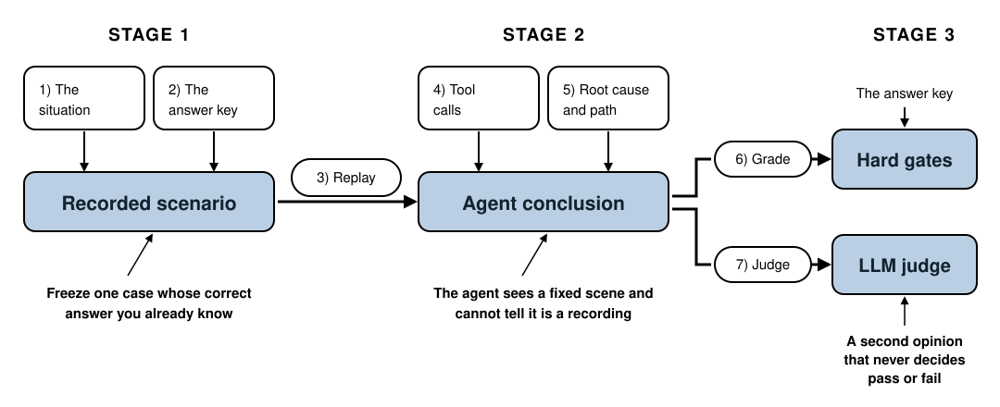

## 3. The Harness We're Going to Build

*One page, five parts, and a place for every chapter that follows. If you only
remember one diagram from this book, make it this one.*

### What this chapter covers

Chapter 2 ended with four checks we want to run and no code to run them. The
rest of the book builds that code, one part per chapter — and it's much easier
to follow if you can see the finished shape first. So here it is, then a walk through
each part and what it's for.

### The one sentence

Everything below is a longer version of one sentence from the introduction:

> Record a case whose correct answer you already know. Replay it to the agent. Score
> how close the agent got.

Three verbs — record, replay, score. Part 1 is *record*. Part 2 is *replay*. Parts
4 and 5 are *score*. Part 3 is the wall that stops the first from leaking into the
others.

### The five parts

**1. The scenario — a recorded case.** One file holding two parts: the *situation*
(the alert, and what each tool returns) and the *answer key* (the true cause, the
evidence that proves it, the planted distraction, the step budget). This is the unit
you collect. Ten scenarios is a benchmark; one is a test. *Chapter 4.*

**2. Replay — feeding the case to the agent.** Tools that behave exactly like the
agent's real ones but serve recorded data. The agent isn't modified; it investigates a
frozen scene without noticing. This is what makes a score mean something: freeze the
world, and a score that moves means the agent moved. *Chapter 5.*

**3. Isolation — the wall.** The answer key must never reach the agent. Sounds
obvious; it's the easiest thing in the whole design to break by accident, and when it
breaks your scores stay high while your agent gets worse. Chapter 6 makes the wall
part of the code, so it doesn't depend on you remembering. *Chapter 6.*

**4. Hard gates — the deterministic score.** The four checks from Chapter 2, in code:
right category, cited the required evidence, rejected the distraction, stayed inside
the step budget. Each one passes or fails with no room for argument. *Chapter 7.*

**5. The LLM judge — the judgment calls.** Some things the gates can't check. "The
category was right but the explanation was nonsense" needs a reader. A language model
grades against a plain-language rubric — and never gets to decide pass or fail on its
own, for reasons Chapter 8 goes into. *Chapter 8.*

### How one run flows

Put together, evaluating an agent once looks like this:

1. Load a scenario from disk.
2. Split it — the situation goes forward, the answer key is set aside.
3. Build replay tools from the situation.
4. Run the agent. It calls tools, reasons, and commits to a conclusion, recording the
   path it took.
5. Hand the conclusion *and* the answer key to the grader.
6. Get back a pass or fail per gate, plus the judge's remarks.

Notice where the answer key travels: from the file, around the agent, to the grader.
It never touches step 4. That detour is the shape of the whole design, and it's why
the scenario is stored in two parts rather than one blob.

### Then you operate it

Three more parts turn a single graded run into something that changes how you
work:

- **A benchmark** — run every scenario, roll the results into one number, and track it
  over releases. This is what finally answers the Tuesday question: last week 8 of 10,
  today 9. *Chapter 9.*
- **A feedback loop** — every time the agent misses in production, that becomes a new
  scenario. Your benchmark grows along real weaknesses rather than the ones you
  imagined. *Chapter 10.*
- **A CI gate** — run the benchmark on every pull request and block a change that
  drops the score. This is the point where evaluation stops being a thing you remember
  to do. *Chapter 11.*

### What this is not

Worth being explicit, because "evaluation" is a crowded word:

- **It's not training.** Nothing here changes model weights. We're measuring an agent,
  not teaching one.
- **It's not monitoring.** This runs before you ship, against recorded cases. Watching
  a live agent in production is a different tool with different tradeoffs.
- **It's not a framework you'll install.** It's a few hundred lines you'll understand
  completely. Commercial eval platforms do more; after you've built this by hand,
  you'll be able to read their docs and know exactly what they're doing.

### Where else this applies

The five parts work for any agent. Only the contents change:

| Part | Incident agent | Support agent | SQL agent |
|---|---|---|---|
| Scenario | alert + metrics, logs, deploys | ticket + account state | question + schema |
| Replay | recorded tool output | recorded CRM and KB lookups | recorded schema and rows |
| Isolation | hide the true cause | hide the correct resolution | hide the expected result |
| Gates | category, evidence, distraction, steps | resolution, policy cited, tone, replies | result, tables joined, cost |
| Judge | is the explanation coherent? | is the reply appropriate? | is the query sane? |

If your agent has tools and an answer, this harness fits it. The work is filling in
your own column, not inventing a new method.

### A word on order

The next three chapters build parts 1, 2, and 3 — and none of them produces a better
score than Chapter 2's rough grader. That's expected, and worth saying out loud so it
doesn't feel like drift: they're building the foundation the real scoring stands on.
The payoff lands in Chapter 7, when the four checks finally run and the lucky agent
from Chapter 2 fails the way it always should have.

### Summary

- The harness is five parts: a recorded **scenario**, **replay**, **isolation**,
  **hard gates**, and an **LLM judge**.
- One run: load the scenario, send the situation to the agent, route the answer key
  around it to the grader, compare.
- Operating it adds three more: a **benchmark** to track, a **loop** that turns misses
  into new cases, and a **CI gate** that makes it automatic.
- It isn't training, it isn't production monitoring, and it isn't a framework you
  install — it's a few hundred lines you'll fully understand.
- The parts don't change between agent types. The contents do.

Next: build the first part. We'll freeze the checkout incident into a scenario file with
its answer key, and check it before we ever trust it.
