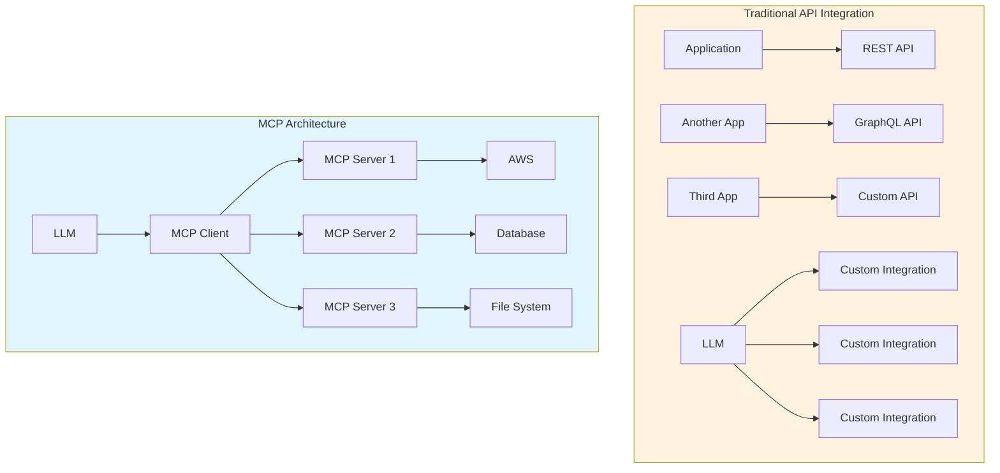
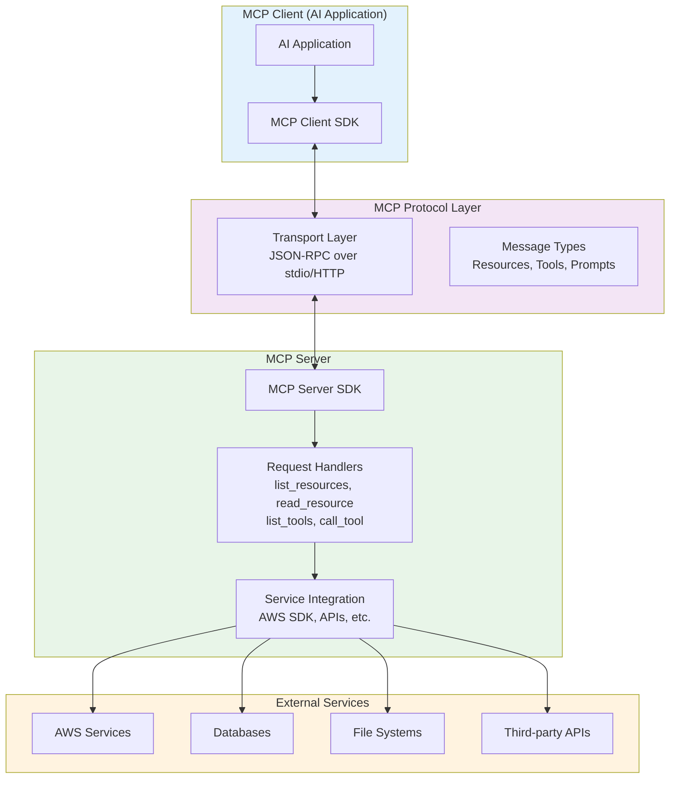
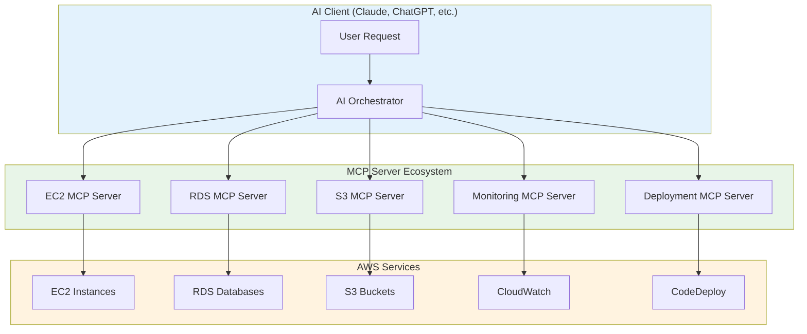

# 05-01 MCP (Model Context Protocol) Foundations

*Learn the fundamentals of Model Context Protocol and build practical MCP servers for DevOps automation*

## 📚 Table of Contents

- [What is Model Context Protocol (MCP)?](#what-is-model-context-protocol-mcp)
- [Why MCP Matters in DevOps](#why-mcp-matters-in-devops)
- [MCP Architecture Overview](#mcp-architecture-overview)
- [Hands-On: Building an AWS EC2 MCP Server](#hands-on-building-an-aws-ec2-mcp-server)
- [Step-by-Step Implementation](#step-by-step-implementation)
- [Testing and Integration](#testing-and-integration)
- [Best Practices for DevOps](#best-practices-for-devops)
- [Next Steps](#next-steps)

---

## What is Model Context Protocol (MCP)?

**Model Context Protocol (MCP)** is an open standard that enables AI applications to securely connect with external data sources and services. Think of it as a standardized bridge between Large Language Models (LLMs) and the real world.

### Key Concepts

**🔌 Protocol Bridge**: MCP acts as a standardized communication layer between AI models and external systems.

**🛡️ Security First**: Built with security principles, ensuring safe interactions between AI and external services.

**🔄 Bidirectional Communication**: Allows AI models to both read from and write to external systems.

**📦 Resource Management**: Provides structured access to files, databases, APIs, and other resources.

### MCP vs Traditional APIs



---

## Why MCP Matters in DevOps

### 🚀 Acceleration Benefits

**Standardized Automation**: Instead of writing custom integrations for each AI tool, MCP provides a standard interface.

**Rapid Prototyping**: DevOps teams can quickly connect AI models to infrastructure tools without reinventing the wheel.

**Ecosystem Compatibility**: MCP servers work across different AI applications and platforms.

### 🛠️ DevOps Use Cases

1. **Infrastructure Monitoring**: AI agents can query metrics, logs, and alerts
2. **Deployment Automation**: AI can trigger deployments, rollbacks, and scaling operations
3. **Incident Response**: AI assistants can gather diagnostic information and suggest fixes
4. **Resource Management**: AI can optimize cloud resource allocation and costs
5. **Security Compliance**: AI can check configurations against security policies

### 📈 Business Impact

- **Reduced Manual Work**: Automate routine DevOps tasks through natural language
- **Faster Incident Resolution**: AI can quickly gather context and suggest solutions
- **Improved Documentation**: AI can automatically update runbooks and procedures
- **Cost Optimization**: AI can analyze usage patterns and suggest optimizations

---

## MCP Architecture Overview

### Core Components



### Message Flow

1. **Discovery**: Client discovers available resources and tools
2. **Request**: Client requests specific operations
3. **Execution**: Server executes operations on external services
4. **Response**: Server returns structured results to client

---

## Hands-On: Building an AWS EC2 MCP Server

Let's build a practical MCP server that interacts with AWS EC2. This will demonstrate how DevOps teams can create AI-powered infrastructure management tools.

### Project Overview

Our MCP server will provide:

- **Resources**: List EC2 instances, security groups, VPCs
- **Tools**: Start/stop instances, create snapshots, check instance health

### Prerequisites

```bash
# Required tools
python >= 3.8
aws-cli configured
boto3 library
mcp library
```

---

## Step-by-Step Implementation

### Step 1: Project Setup

First, let's create our project structure and install dependencies.

```python
# requirements.txt
mcp>=1.0.0
boto3>=1.26.0
pydantic>=2.0.0
```

**What this does**:

- `mcp`: The official MCP SDK for Python
- `boto3`: AWS SDK for Python to interact with EC2 services
- `pydantic`: Data validation and serialization (used by MCP)

**Why we need this**: These libraries provide the foundation for building MCP servers and connecting to AWS services securely.

### Step 2: Basic MCP Server Structure

```python
# ec2_mcp_server.py
import asyncio
import logging
from typing import Any, Sequence

import boto3
from mcp.server.models import InitializationOptions
from mcp.server import NotificationOptions, Server
from mcp.types import Resource, Tool, TextContent, ImageContent, EmbeddedResource
from pydantic import AnyUrl

# Configure logging
logging.basicConfig(level=logging.INFO)
logger = logging.getLogger(__name__)

# Initialize the MCP server
server = Server("aws-ec2-mcp")

# Initialize AWS EC2 client
ec2_client = boto3.client('ec2')
```

**What this does**:

- Sets up the basic MCP server with the name "aws-ec2-mcp"
- Creates a boto3 EC2 client for AWS interactions
- Configures logging for debugging and monitoring

**Why this matters**: The server name identifies our MCP server to clients, and the EC2 client will handle all AWS API calls securely using your configured AWS credentials.

### Step 3: Implementing Resource Discovery

```python
@server.list_resources()
async def handle_list_resources() -> list[Resource]:
    """
    List available AWS EC2 resources that the AI can access.
    This is like a table of contents for what data is available.
    """
    try:
        # Get EC2 instances
        instances_response = ec2_client.describe_instances()
      
        resources = []
      
        # Create resource entries for each instance
        for reservation in instances_response['Reservations']:
            for instance in reservation['Instances']:
                instance_id = instance['InstanceId']
                instance_name = get_instance_name(instance)
              
                resources.append(Resource(
                    uri=AnyUrl(f"ec2://instance/{instance_id}"),
                    name=f"EC2 Instance: {instance_name} ({instance_id})",
                    description=f"EC2 instance {instance_id} - {instance.get('State', {}).get('Name', 'unknown')}",
                    mimeType="application/json"
                ))
      
        # Add VPC resources
        vpcs_response = ec2_client.describe_vpcs()
        for vpc in vpcs_response['Vpcs']:
            vpc_id = vpc['VpcId']
            resources.append(Resource(
                uri=AnyUrl(f"ec2://vpc/{vpc_id}"),
                name=f"VPC: {vpc_id}",
                description=f"Virtual Private Cloud {vpc_id}",
                mimeType="application/json"
            ))
      
        logger.info(f"Listed {len(resources)} EC2 resources")
        return resources
      
    except Exception as e:
        logger.error(f"Error listing resources: {e}")
        return []

def get_instance_name(instance):
    """Extract instance name from tags"""
    tags = instance.get('Tags', [])
    for tag in tags:
        if tag['Key'] == 'Name':
            return tag['Value']
    return 'Unnamed'
```

**What this does**:

- The `@server.list_resources()` decorator registers this function to handle resource listing requests
- It queries AWS for EC2 instances and VPCs
- Creates Resource objects with unique URIs that AI clients can reference
- Returns a structured list of available resources

**Why this is important**: This function acts like a directory listing. When an AI wants to know "what can I see in this AWS account?", it calls this function. The URIs (like `ec2://instance/i-1234567890abcdef0`) become handles that the AI can use to request specific data.

### Step 4: Implementing Resource Reading

```python
@server.read_resource()
async def handle_read_resource(uri: AnyUrl) -> str:
    """
    Read detailed information about a specific resource.
    This is like opening a file to see its contents.
    """
    try:
        uri_str = str(uri)
        logger.info(f"Reading resource: {uri_str}")
      
        if uri_str.startswith("ec2://instance/"):
            # Extract instance ID from URI
            instance_id = uri_str.split("/")[-1]
            return await get_instance_details(instance_id)
          
        elif uri_str.startswith("ec2://vpc/"):
            # Extract VPC ID from URI
            vpc_id = uri_str.split("/")[-1]
            return await get_vpc_details(vpc_id)
          
        else:
            return f"Unknown resource type: {uri_str}"
          
    except Exception as e:
        logger.error(f"Error reading resource {uri}: {e}")
        return f"Error reading resource: {e}"

async def get_instance_details(instance_id: str) -> str:
    """Get detailed information about an EC2 instance"""
    try:
        response = ec2_client.describe_instances(InstanceIds=[instance_id])
      
        for reservation in response['Reservations']:
            for instance in reservation['Instances']:
                # Format instance information in a readable way
                instance_info = {
                    'InstanceId': instance['InstanceId'],
                    'InstanceType': instance['InstanceType'],
                    'State': instance['State']['Name'],
                    'PublicIpAddress': instance.get('PublicIpAddress', 'N/A'),
                    'PrivateIpAddress': instance.get('PrivateIpAddress', 'N/A'),
                    'LaunchTime': instance['LaunchTime'].isoformat(),
                    'VpcId': instance.get('VpcId', 'N/A'),
                    'SubnetId': instance.get('SubnetId', 'N/A'),
                    'SecurityGroups': [sg['GroupName'] for sg in instance.get('SecurityGroups', [])],
                    'Tags': {tag['Key']: tag['Value'] for tag in instance.get('Tags', [])}
                }
              
                return f"EC2 Instance Details:\n{json.dumps(instance_info, indent=2, default=str)}"
              
        return f"Instance {instance_id} not found"
      
    except Exception as e:
        return f"Error getting instance details: {e}"

async def get_vpc_details(vpc_id: str) -> str:
    """Get detailed information about a VPC"""
    try:
        response = ec2_client.describe_vpcs(VpcIds=[vpc_id])
      
        if response['Vpcs']:
            vpc = response['Vpcs'][0]
            vpc_info = {
                'VpcId': vpc['VpcId'],
                'State': vpc['State'],
                'CidrBlock': vpc['CidrBlock'],
                'IsDefault': vpc['IsDefault'],
                'Tags': {tag['Key']: tag['Value'] for tag in vpc.get('Tags', [])}
            }
          
            return f"VPC Details:\n{json.dumps(vpc_info, indent=2)}"
          
        return f"VPC {vpc_id} not found"
      
    except Exception as e:
        return f"Error getting VPC details: {e}"
```

**What this does**:

- The `@server.read_resource()` decorator handles requests for specific resource data
- It parses the URI to determine what type of resource is being requested
- Calls AWS APIs to get detailed information about instances or VPCs
- Returns formatted JSON data that AI can understand and process

**DevOps Context**: This is like having a smart `aws ec2 describe-instances` command that an AI can call. The AI might ask "Show me details about instance i-1234567890abcdef0" and get back comprehensive information about CPU, memory, network, security groups, etc.

### Step 5: Implementing Tools (Actions)

```python
@server.list_tools()
async def handle_list_tools() -> list[Tool]:
    """
    List available tools (actions) that the AI can perform.
    These are like commands the AI can execute.
    """
    return [
        Tool(
            name="start_instance",
            description="Start an EC2 instance",
            inputSchema={
                "type": "object",
                "properties": {
                    "instance_id": {
                        "type": "string",
                        "description": "The EC2 instance ID to start"
                    }
                },
                "required": ["instance_id"]
            }
        ),
        Tool(
            name="stop_instance",
            description="Stop an EC2 instance",
            inputSchema={
                "type": "object",
                "properties": {
                    "instance_id": {
                        "type": "string",
                        "description": "The EC2 instance ID to stop"
                    }
                },
                "required": ["instance_id"]
            }
        ),
        Tool(
            name="get_instance_status",
            description="Get the current status and health of an EC2 instance",
            inputSchema={
                "type": "object",
                "properties": {
                    "instance_id": {
                        "type": "string",
                        "description": "The EC2 instance ID to check"
                    }
                },
                "required": ["instance_id"]
            }
        ),
        Tool(
            name="create_snapshot",
            description="Create a snapshot of an EC2 instance's EBS volumes",
            inputSchema={
                "type": "object",
                "properties": {
                    "instance_id": {
                        "type": "string",
                        "description": "The EC2 instance ID to snapshot"
                    },
                    "description": {
                        "type": "string",
                        "description": "Description for the snapshot",
                        "default": "Automated snapshot via MCP"
                    }
                },
                "required": ["instance_id"]
            }
        )
    ]
```

**What this does**:

- Defines the "verbs" or actions that AI can perform on AWS resources
- Each tool has a name, description, and input schema (like a function signature)
- The input schema tells the AI what parameters each tool expects

**Why this matters**: This is where the real power lies. Instead of just reading data, the AI can now take actions. Think of these as smart DevOps commands that the AI can execute based on natural language requests.

### Step 6: Tool Implementation (Actions)

```python
@server.call_tool()
async def handle_call_tool(name: str, arguments: dict | None) -> list[TextContent]:
    """
    Execute a tool (perform an action) based on the AI's request.
    This is like running a command with specific parameters.
    """
    try:
        if name == "start_instance":
            return await start_instance_tool(arguments or {})
        elif name == "stop_instance":
            return await stop_instance_tool(arguments or {})
        elif name == "get_instance_status":
            return await get_instance_status_tool(arguments or {})
        elif name == "create_snapshot":
            return await create_snapshot_tool(arguments or {})
        else:
            return [TextContent(type="text", text=f"Unknown tool: {name}")]
          
    except Exception as e:
        logger.error(f"Error executing tool {name}: {e}")
        return [TextContent(type="text", text=f"Error executing {name}: {e}")]

async def start_instance_tool(arguments: dict) -> list[TextContent]:
    """Start an EC2 instance"""
    instance_id = arguments.get("instance_id")
    if not instance_id:
        return [TextContent(type="text", text="Error: instance_id is required")]
  
    try:
        # Check current state first
        response = ec2_client.describe_instances(InstanceIds=[instance_id])
        current_state = response['Reservations'][0]['Instances'][0]['State']['Name']
      
        if current_state == 'running':
            return [TextContent(type="text", text=f"Instance {instance_id} is already running")]
      
        # Start the instance
        ec2_client.start_instances(InstanceIds=[instance_id])
      
        result = f"✅ Successfully initiated start for instance {instance_id}\n"
        result += f"Previous state: {current_state}\n"
        result += "Instance is starting up... This may take a few minutes."
      
        return [TextContent(type="text", text=result)]
      
    except Exception as e:
        return [TextContent(type="text", text=f"Failed to start instance {instance_id}: {e}")]

async def stop_instance_tool(arguments: dict) -> list[TextContent]:
    """Stop an EC2 instance"""
    instance_id = arguments.get("instance_id")
    if not instance_id:
        return [TextContent(type="text", text="Error: instance_id is required")]
  
    try:
        # Check current state first
        response = ec2_client.describe_instances(InstanceIds=[instance_id])
        current_state = response['Reservations'][0]['Instances'][0]['State']['Name']
      
        if current_state in ['stopped', 'stopping']:
            return [TextContent(type="text", text=f"Instance {instance_id} is already {current_state}")]
      
        # Stop the instance
        ec2_client.stop_instances(InstanceIds=[instance_id])
      
        result = f"✅ Successfully initiated stop for instance {instance_id}\n"
        result += f"Previous state: {current_state}\n"
        result += "Instance is shutting down... This may take a few minutes."
      
        return [TextContent(type="text", text=result)]
      
    except Exception as e:
        return [TextContent(type="text", text=f"Failed to stop instance {instance_id}: {e}")]

async def get_instance_status_tool(arguments: dict) -> list[TextContent]:
    """Get comprehensive status of an EC2 instance"""
    instance_id = arguments.get("instance_id")
    if not instance_id:
        return [TextContent(type="text", text="Error: instance_id is required")]
  
    try:
        # Get instance status
        status_response = ec2_client.describe_instance_status(
            InstanceIds=[instance_id],
            IncludeAllInstances=True
        )
      
        # Get instance details
        instances_response = ec2_client.describe_instances(InstanceIds=[instance_id])
        instance = instances_response['Reservations'][0]['Instances'][0]
      
        status_info = {
            'InstanceId': instance_id,
            'State': instance['State']['Name'],
            'InstanceType': instance['InstanceType'],
            'LaunchTime': instance['LaunchTime'].isoformat(),
            'Monitoring': instance.get('Monitoring', {}).get('State', 'N/A'),
        }
      
        # Add status checks if available
        if status_response['InstanceStatuses']:
            status = status_response['InstanceStatuses'][0]
            status_info.update({
                'SystemStatus': status['SystemStatus']['Status'],
                'InstanceStatus': status['InstanceStatus']['Status'],
                'SystemStatusDetails': [check['Status'] for check in status['SystemStatus']['Details']],
                'InstanceStatusDetails': [check['Status'] for check in status['InstanceStatus']['Details']]
            })
      
        result = f"📊 Instance Status Report for {instance_id}:\n"
        result += json.dumps(status_info, indent=2, default=str)
      
        return [TextContent(type="text", text=result)]
      
    except Exception as e:
        return [TextContent(type="text", text=f"Failed to get status for instance {instance_id}: {e}")]

async def create_snapshot_tool(arguments: dict) -> list[TextContent]:
    """Create snapshots of all EBS volumes attached to an instance"""
    instance_id = arguments.get("instance_id")
    description = arguments.get("description", "Automated snapshot via MCP")
  
    if not instance_id:
        return [TextContent(type="text", text="Error: instance_id is required")]
  
    try:
        # Get instance details to find attached volumes
        response = ec2_client.describe_instances(InstanceIds=[instance_id])
        instance = response['Reservations'][0]['Instances'][0]
      
        snapshots_created = []
      
        # Create snapshots for each attached volume
        for block_device in instance.get('BlockDeviceMappings', []):
            volume_id = block_device['Ebs']['VolumeId']
            device_name = block_device['DeviceName']
          
            snapshot_description = f"{description} - {instance_id} - {device_name}"
          
            snapshot_response = ec2_client.create_snapshot(
                VolumeId=volume_id,
                Description=snapshot_description
            )
          
            snapshots_created.append({
                'SnapshotId': snapshot_response['SnapshotId'],
                'VolumeId': volume_id,
                'DeviceName': device_name
            })
      
        result = f"📸 Successfully initiated snapshots for instance {instance_id}:\n"
        for snap in snapshots_created:
            result += f"  • {snap['DeviceName']} ({snap['VolumeId']}) → {snap['SnapshotId']}\n"
        result += "\n⏳ Snapshots are being created in the background..."
      
        return [TextContent(type="text", text=result)]
      
    except Exception as e:
        return [TextContent(type="text", text=f"Failed to create snapshots for instance {instance_id}: {e}")]
```

**What this does**:

- Each tool function implements a specific DevOps action
- Tools validate input parameters and check current state before making changes
- They provide informative feedback about what actions were taken
- Error handling ensures graceful failures with helpful messages

**Real-world Impact**: An AI assistant can now respond to requests like:

- "Start the web server instance" → `start_instance_tool`
- "Create a backup of the database server" → `create_snapshot_tool`
- "Check if all our production instances are healthy" → `get_instance_status_tool`

### Step 7: Server Entry Point

```python
import json

async def main():
    """Main entry point for the MCP server"""
    # Import and add the missing import at the top
    from mcp.server.stdio import stdio_server
  
    try:
        logger.info("Starting AWS EC2 MCP Server...")
      
        # Run the server using stdio transport
        async with stdio_server() as (read_stream, write_stream):
            await server.run(
                read_stream,
                write_stream,
                InitializationOptions(
                    server_name="aws-ec2-mcp",
                    server_version="1.0.0",
                    capabilities=server.get_capabilities(
                        notification_options=NotificationOptions(),
                        experimental_capabilities={}
                    )
                )
            )
          
    except Exception as e:
        logger.error(f"Server error: {e}")
        raise

if __name__ == "__main__":
    asyncio.run(main())
```

**What this does**:

- Sets up the main server loop using stdio transport (standard input/output)
- Defines server capabilities and version information
- Handles graceful startup and error handling

**Why stdio transport**: MCP servers typically communicate through stdin/stdout, making them easy to integrate with various AI clients and tools.

---

## Testing and Integration

### Step 8: Testing the MCP Server

Create a simple test client to verify our server works:

```python
# test_client.py
import asyncio
import json
import subprocess
import sys
from mcp.client.stdio import stdio_client

async def test_mcp_server():
    """Test our EC2 MCP server"""
  
    # Start the MCP server as a subprocess
    server_process = subprocess.Popen(
        [sys.executable, "ec2_mcp_server.py"],
        stdin=subprocess.PIPE,
        stdout=subprocess.PIPE,
        stderr=subprocess.PIPE,
        text=True
    )
  
    try:
        # Connect to the server
        async with stdio_client(server_process.stdin, server_process.stdout) as (read, write):
          
            # Test 1: List available resources
            print("🔍 Testing resource listing...")
            resources = await read.list_resources()
            print(f"Found {len(resources)} resources:")
            for resource in resources[:3]:  # Show first 3
                print(f"  - {resource.name}")
          
            # Test 2: List available tools
            print("\n🛠️  Testing tool listing...")
            tools = await read.list_tools()
            print(f"Found {len(tools)} tools:")
            for tool in tools:
                print(f"  - {tool.name}: {tool.description}")
          
            # Test 3: Read a resource (if any exist)
            if resources:
                print(f"\n📖 Testing resource reading...")
                resource_content = await read.read_resource(resources[0].uri)
                print(f"Resource content preview: {str(resource_content)[:200]}...")
          
            # Test 4: Get instance status (example)
            print(f"\n⚡ Testing tool execution...")
            if tools:
                # This would require a real instance ID
                # result = await read.call_tool("get_instance_status", {"instance_id": "i-1234567890abcdef0"})
                print("Tool execution test skipped (requires real instance ID)")
          
    except Exception as e:
        print(f"Test failed: {e}")
    finally:
        server_process.terminate()
        server_process.wait()

if __name__ == "__main__":
    asyncio.run(test_mcp_server())
```

**What this does**: Creates a minimal test harness to verify that our MCP server can start up, list resources and tools, and respond to basic requests.

### Step 9: Integration with AI Clients

To integrate with popular AI tools, you'll need configuration files:

```json
// claude_desktop_config.json (for Claude Desktop)
{
  "mcpServers": {
    "aws-ec2": {
      "command": "python",
      "args": ["/path/to/your/ec2_mcp_server.py"],
      "env": {
        "AWS_PROFILE": "your-aws-profile",
        "AWS_REGION": "us-east-1"
      }
    }
  }
}
```

**Configuration Notes**:

- Ensure your AWS credentials are configured (`aws configure`)
- Set appropriate AWS region and profile
- Path should point to your actual server file

### 🎯 Real-World Usage Examples

Once your MCP server is configured, here are practical examples of how DevOps teams can interact with it:

#### Example 1: Infrastructure Health Check

**User Request**: "Check the status of all our web servers"

**AI Response**:

```
I'll check the status of your EC2 instances for you.

[MCP calls list_resources() to discover instances]
Found 5 EC2 instances. Let me check the web servers specifically:

[MCP calls get_instance_status for each web server]

📊 Web Server Status Report:
• web-server-1 (i-0123456789abcdef0): ✅ Running - Healthy
• web-server-2 (i-0987654321fedcba0): ✅ Running - Healthy  
• web-server-3 (i-0456789123abcdef0): ⚠️  Running - System check failed

🔍 Issue Details for web-server-3:
- Instance Status: Running
- System Status: impaired
- Failed Checks: Instance reachability check

💡 Recommendation: Consider restarting web-server-3 or investigating network connectivity.
```

#### Example 2: Automated Incident Response

**User Request**: "Our database server seems slow, can you create a snapshot before we restart it?"

**AI Response**:

```
I'll help you create a safety snapshot before restarting the database server.

[MCP calls read_resource() to get database server details]
Found database server: db-primary-1 (i-0db123456789abcde0)
- Instance Type: r5.xlarge
- State: running
- Attached Volumes: 2 (root + data volume)

[MCP calls create_snapshot tool]
📸 Creating snapshots for database server...

✅ Snapshots initiated:
• /dev/sda1 (vol-0123456789abcdef0) → snap-0abc123456789def0
• /dev/sdf (vol-0987654321fedcba0) → snap-0def987654321abc0

⏳ Snapshots are being created in the background (typically takes 5-10 minutes).

🛡️ Once snapshots complete, you can safely restart the instance. Would you like me to:
1. Monitor snapshot progress
2. Restart the instance when snapshots are complete
3. Just notify you when snapshots are ready
```

#### Example 3: Resource Optimization

**User Request**: "Show me all stopped instances and estimate cost savings"

**AI Response**:

```
I'll analyze your stopped instances and calculate potential savings.

[MCP calls list_resources() and read_resource() for each instance]

💰 Stopped Instance Analysis:

📊 Currently Stopped (not charged for compute):
• test-server-1 (i-0test123456789abc0)
  - Type: t3.medium ($30.37/month when running)
  - Stopped: 15 days ago
  - Last activity: Development testing

• staging-db (i-0stage987654321def0)  
  - Type: r5.large ($124.56/month when running)
  - Stopped: 7 days ago
  - Last activity: Staging environment

• old-backup-server (i-0backup456789123abc0)
  - Type: m5.large ($62.28/month when running)  
  - Stopped: 45 days ago
  - Last activity: Legacy backup process

💡 Recommendations:
• Consider terminating old-backup-server (saved: $62.28/month)
• test-server-1 could be replaced with spot instances for testing
• staging-db: Schedule automatic start/stop for business hours only

🎯 Potential monthly savings: $217.21 if optimized properly
```

---

## Best Practices for DevOps

### 🔒 Security Considerations

1. **IAM Permissions**: Create dedicated IAM roles with minimal required permissions

```json
{
    "Version": "2012-10-17",
    "Statement": [
        {
            "Effect": "Allow",
            "Action": [
                "ec2:DescribeInstances",
                "ec2:DescribeInstanceStatus",
                "ec2:StartInstances",
                "ec2:StopInstances",
                "ec2:CreateSnapshot"
            ],
            "Resource": "<your-aws-arn>"
        }
    ]
}
```

### Multi-Service Integration



---

### 📚 Learning Resources

- [MCP Official Documentation](https://modelcontextprotocol.io/)
- [AWS Boto3 Documentation](https://boto3.amazonaws.com/v1/documentation/api/latest/index.html)
- [Python Async Programming Guide](https://docs.python.org/3/library/asyncio.html)

### 🔗 Community and Support

- [MCP GitHub Repository](https://github.com/modelcontextprotocol)
- [AWS DevOps Community](https://aws.amazon.com/developer/community/)
- [DevOps Stack Exchange](https://devops.stackexchange.com/)

---

## Next Steps

**Ready for the next step?** Continue to [05-02 Agent Frameworks](05-02-agent-frameworks.md) to learn how to build intelligent agents that can orchestrate multiple MCP servers for complex DevOps workflows.
