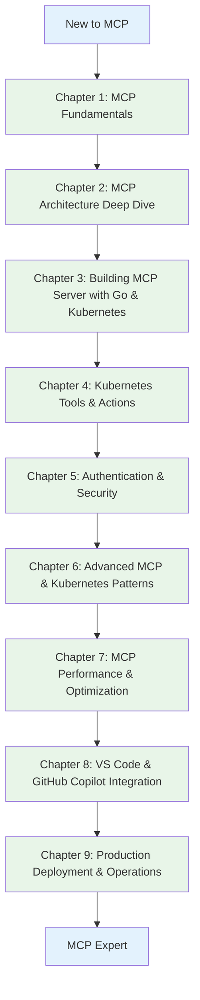

# MCP for DevOps: Building Our MCP Server from Scratch to Interact with Kubernetes

*A comprehensive, hands-on guide to developing your own MCP server from the ground up for Kubernetes cluster management*

## 🎯 Tutorial Overview

This tutorial series transforms theoretical MCP knowledge into practical DevOps skills through building a real-world **Kubernetes MCP Server** using **Golang**. You'll progress from basic concepts to advanced production-ready implementations while integrating with VS Code and GitHub Copilot for modern AI-powered development workflows.

## 🚀 What You'll Build

**Primary Project**: A comprehensive Kubernetes MCP Server in Golang that provides:

- **Resource Discovery**: Pods, Services, Deployments, ConfigMaps, Secrets
- **Cluster Operations**: Scale applications, restart deployments, manage resources
- **Monitoring Integration**: Health checks, logs, metrics collection
- **Security Management**: RBAC, network policies, secret rotation
- **CI/CD Integration**: Deploy applications, manage releases, rollback operations

## �️ Tutorial Overview

### 🚀 Quick Start Options

**🏃‍♂️ Fast Track (Experienced DevOps)**: Skip to Chapter 3 after completing Chapter 1 environment setup

**🎓 Complete Journey (New to DevOps)**: Follow all chapters sequentially for comprehensive learning

**🎯 Focused Learning (Specific Needs)**: Jump to relevant chapters based on your requirements

---

## 📖 Complete Table of Contents

### [Chapter 1: MCP Fundamentals](01-mcp-fundamentals.md)

**🎯 Learning Objectives:**

- Understand what MCP is and why it matters for DevOps teams
- Learn MCP core concepts and terminology
- Compare MCP with traditional automation approaches
- Identify real-world use cases where MCP provides significant value

**📋 Key Topics:**

- What is Model Context Protocol (MCP)?
- MCP vs traditional API integrations and automation tools
- DevOps automation challenges that MCP solves
- MCP ecosystem and community
- Basic protocol concepts: resources, tools, and prompts

**🛠️ Hands-On Lab:**

- Install development environment (Go, Docker, kubectl)
- Set up local Kubernetes cluster (Kind/Minikube)
- Explore existing MCP servers and clients
- Test basic MCP interactions with sample servers

**💡 Real-World Scenario:**
DevOps team struggling with fragmented automation tools and manual processes. Learn how MCP creates unified AI interfaces for infrastructure management.

**📝 Chapter Outcome:**
Complete understanding of MCP fundamentals with working development environment setup.

---

### [Chapter 2: MCP Architecture Deep Dive](02-mcp-architecture-deep-dive.md)

**🎯 Learning Objectives:**

- Master MCP protocol specifications and message flow
- Understand the complete chain: LLM Client → MCP Client → MCP Server → External Resources
- Learn JSON-RPC transport and communication patterns
- Implement proper error handling and protocol compliance

**📋 Key Topics:**

- MCP protocol specification and JSON-RPC foundation
- Message types: initialization, resources, tools, prompts, notifications
- Transport layers: stdio, HTTP, WebSocket
- LLM Client (Claude, GPT) → MCP Client communication
- MCP Client → MCP Server protocol flow
- MCP Server → External Resource integration patterns
- Error handling and protocol compliance

**🛠️ Hands-On Lab:**

- Analyze MCP message flows with protocol debugging tools
- Build a simple MCP client to understand the protocol
- Implement basic MCP server skeleton
- Test protocol compliance and message validation
- Debug communication between all components

**💡 Real-World Scenario:**
Understanding how ChatGPT or Claude uses MCP to interact with your Kubernetes infrastructure through your custom MCP server.

**📝 Chapter Outcome:**
Deep understanding of MCP architecture with hands-on experience of the complete communication chain.

---

### [Chapter 3: Building MCP Server with Go &amp; Kubernetes](03-building-mcp-server-go-kubernetes.md)

**🎯 Learning Objectives:**

- Build a production-ready MCP server using Golang
- Integrate Kubernetes client-go library for cluster interactions
- Implement MCP resource discovery for Kubernetes objects
- Create proper project structure and error handling

**📋 Key Topics:**

- Go project setup and dependency management
- MCP Go SDK integration and server initialization
- Kubernetes client-go library and authentication methods
- Implementing list_resources() for Kubernetes discovery
- Creating read_resource() handlers for detailed object information
- Structured logging and error handling patterns

**🛠️ Hands-On Lab:**

- Create Go project with proper module organization
- Initialize MCP server with Kubernetes client integration
- Implement resource discovery for Pods, Services, Deployments
- Build detailed resource readers with formatted output
- Add comprehensive logging and error handling
- Test MCP server with Kubernetes cluster

**💡 Real-World Scenario:**
DevOps engineer building an MCP server to provide AI assistants with read-only access to Kubernetes cluster information for troubleshooting.

**📝 Chapter Outcome:**
Working MCP server that can discover and provide detailed information about Kubernetes resources to AI clients.

---

### [Chapter 4: Implementing Kubernetes Tools &amp; Actions](04-kubernetes-tools-actions.md)

**🎯 Learning Objectives:**

- Design and implement MCP tools for Kubernetes operations
- Handle complex parameter validation and input schemas
- Implement safe operational commands with proper authorization
- Create comprehensive feedback and status reporting

**📋 Key Topics:**

- MCP tool definition patterns and input schema design
- Kubernetes operational commands: scale, restart, delete, create
- Parameter validation and sanitization for security
- Asynchronous operations and status tracking
- Comprehensive response formatting for AI consumption

**🛠️ Hands-On Lab:**

- Implement scaling tools for Deployments and StatefulSets
- Create restart functionality for Pods and Deployments
- Build ConfigMap and Secret management tools
- Add log retrieval and streaming capabilities
- Implement proper validation and error responses

**💡 Real-World Scenario:**
Operations team wants AI assistants to perform routine maintenance tasks like scaling applications, restarting failed pods, and retrieving logs for debugging.

**📝 Chapter Outcome:**
Feature-complete MCP server capable of performing common Kubernetes operational tasks safely and efficiently.

---

### [Chapter 5: Authentication &amp; Security](05-authentication-security.md)

**🎯 Learning Objectives:**

- Implement robust authentication mechanisms for MCP servers
- Design fine-grained authorization controls for Kubernetes operations
- Apply security best practices for production deployments
- Handle credential management and rotation securely

**📋 Key Topics:**

- Kubernetes RBAC integration with MCP servers
- Service account management and least-privilege principles
- Secure credential storage and rotation patterns
- Audit logging and compliance requirements
- Network security and TLS configuration

**🛠️ Hands-On Lab:**

- Implement RBAC-based authorization checks
- Create service accounts with minimal required permissions
- Add audit logging for all MCP operations
- Configure TLS for secure communications
- Build credential rotation mechanisms

**💡 Real-World Scenario:**
Enterprise environment requiring strict access controls, audit trails, and security compliance for AI-powered infrastructure management.

**📝 Chapter Outcome:**
Security-hardened MCP server with proper authentication, authorization, audit logging, and compliance features ready for enterprise deployment.

---

### [Chapter 6: Advanced MCP &amp; Kubernetes Patterns](06-advanced-mcp-kubernetes-patterns.md)

**🎯 Learning Objectives:**

- Implement advanced MCP patterns for complex Kubernetes operations
- Build event-driven MCP servers with Kubernetes watch APIs
- Create efficient resource caching and streaming mechanisms
- Handle multi-cluster and multi-namespace scenarios

**📋 Key Topics:**

- Advanced MCP server patterns and architectures
- Kubernetes watch APIs and event streaming through MCP
- Resource caching and performance optimization
- Multi-cluster MCP server implementation
- Namespace isolation and multi-tenancy patterns
- Custom Resource Definitions (CRDs) integration
- Helm and Kustomize integration patterns

**🛠️ Hands-On Lab:**

- Implement Kubernetes watch API integration for real-time updates
- Build resource caching layer for performance optimization
- Create multi-cluster MCP server with cluster federation
- Add support for custom resources and CRDs
- Implement Helm chart deployment through MCP tools
- Build namespace-aware resource filtering

**💡 Real-World Scenario:**
Enterprise environment with multiple Kubernetes clusters requiring real-time monitoring, efficient resource management, and multi-tenancy support through AI interfaces.

**📝 Chapter Outcome:**
Advanced MCP server capable of handling enterprise-scale Kubernetes environments with real-time updates and multi-cluster support.

---

### [Chapter 7: MCP Performance &amp; Optimization](07-mcp-performance-optimization.md)

**🎯 Learning Objectives:**

- Optimize MCP server performance for large-scale Kubernetes environments
- Implement efficient resource querying and response strategies
- Build comprehensive testing and debugging workflows for MCP servers
- Monitor and profile MCP server performance

**📋 Key Topics:**

- MCP server performance optimization techniques
- Efficient Kubernetes API querying and pagination
- Resource filtering and selective data retrieval
- Concurrent request handling and rate limiting
- Memory management and garbage collection optimization
- Testing strategies: unit, integration, and load testing
- Debugging MCP protocol communications and bottlenecks
- Performance monitoring and profiling tools

**🛠️ Hands-On Lab:**

- Profile MCP server performance with large Kubernetes clusters
- Implement efficient resource querying with pagination and filtering
- Build concurrent request handling with proper rate limiting
- Create comprehensive test suite with performance benchmarks
- Add performance monitoring with metrics and tracing
- Optimize memory usage and response times
- Debug complex MCP communication issues

**💡 Real-World Scenario:**
Production MCP server handling thousands of Kubernetes resources across multiple clusters, requiring optimized performance and comprehensive monitoring.

**📝 Chapter Outcome:**
High-performance MCP server optimized for enterprise-scale Kubernetes environments with comprehensive testing and monitoring capabilities.

---

### [Chapter 8: VS Code &amp; GitHub Copilot Integration](08-vscode-copilot-integration.md)

**🎯 Learning Objectives:**

- Configure VS Code for seamless MCP server integration
- Optimize GitHub Copilot workflows with custom MCP servers
- Create efficient development workflows combining AI and infrastructure management
- Build custom VS Code extensions for enhanced MCP experience

**📋 Key Topics:**

- VS Code MCP extension configuration and optimization
- GitHub Copilot context enhancement with MCP data
- Custom VS Code commands and keybindings for MCP operations
- Workspace configuration for team collaboration
- Building custom VS Code extensions for MCP integration
- AI-powered Kubernetes troubleshooting workflows

**�️ Hands-On Lab:**

- Configure VS Code with MCP server integration
- Create custom Copilot chat commands for Kubernetes operations
- Build VS Code extension with custom MCP commands
- Set up team workspace configurations
- Create developer productivity shortcuts and automations
- Implement AI-assisted debugging workflows

**💡 Real-World Scenario:**
Development team wants to integrate Kubernetes management directly into their IDE, allowing developers to query cluster status, deploy applications, and troubleshoot issues without leaving VS Code.

**📝 Chapter Outcome:**
Fully integrated development environment where developers can seamlessly interact with Kubernetes clusters through AI-powered VS Code workflows.

- Create Docker containers and Kubernetes deployment manifests
- Implement multi-replica deployments with load balancing
- Build CI/CD pipeline with automated testing and deployment
- Configure monitoring, alerting, and incident response
- Create operational runbooks and documentation

**💡 Real-World Scenario:**
Enterprise deployment requiring 99.9% uptime, automated deployments, comprehensive monitoring, and rapid incident response for business-critical MCP services.

**📝 Chapter Outcome:**
Enterprise-grade production deployment with high availability, automated operations, comprehensive monitoring, and established operational procedures.

---

### [Chapter 9: Production Deployment &amp; Operations](09-production-deployment-operations.md)

**🎯 Learning Objectives:**

- Deploy MCP servers in production Kubernetes environments
- Implement high availability and disaster recovery patterns
- Design CI/CD pipelines for MCP server lifecycle management
- Build scalable multi-service MCP architectures
- Create extensible frameworks for rapid MCP server development

**📋 Key Topics:**

- Container packaging and Kubernetes deployment manifests
- High availability deployment patterns and load balancing
- CI/CD pipeline integration with automated testing and deployment
- Backup and disaster recovery strategies
- Operational monitoring and alerting configuration
- Multi-service MCP architecture patterns
- Service mesh integration (Istio/Linkerd) for advanced networking
- Event-driven architectures with message queues
- Federated MCP servers for multi-cluster environments
- Framework development for rapid MCP server creation

**🛠️ Hands-On Lab:**

- Create Docker containers and Kubernetes deployment manifests
- Implement multi-replica deployments with load balancing
- Build CI/CD pipeline with automated testing and deployment
- Configure monitoring, alerting, and incident response
- Create operational runbooks and documentation
- Implement multi-service MCP architecture with service discovery
- Integrate with service mesh for advanced traffic management
- Build event-driven workflows with message queues
- Create federated MCP server for multi-cluster management
- Develop reusable framework for new MCP server creation

**💡 Real-World Scenario:**
Enterprise deployment requiring 99.9% uptime, automated deployments, comprehensive monitoring, and unified AI-powered management across multiple Kubernetes clusters and complex microservice architectures.

**📝 Chapter Outcome:**
Enterprise-grade production deployment with high availability, automated operations, comprehensive monitoring, and advanced MCP architecture patterns ready for complex multi-cluster environments.
Advanced MCP architecture capable of managing complex, multi-service environments with patterns and frameworks for continued expansion and innovation.

---

## 🎯 Prerequisites & Requirements

### Technical Prerequisites

- **Programming Experience**: Intermediate Golang knowledge (functions, structs, interfaces, goroutines)
- **Kubernetes Basics**: Understanding of Pods, Services, Deployments, and kubectl commands
- **Development Tools**: VS Code, Git, Docker, and command-line proficiency
- **DevOps Concepts**: Basic understanding of CI/CD, monitoring, and infrastructure automation

### Required Software

- **Go 1.21+**: Latest stable version with module support
- **Docker Desktop**: For container building and local Kubernetes
- **Kubernetes Cluster**: Local (Kind/Minikube) or cloud (EKS/GKE/AKS)
- **VS Code**: With Go extension and GitHub Copilot
- **Git**: For version control and collaboration

### Optional but Recommended

- **Prometheus/Grafana**: For monitoring and observability labs
- **Helm**: For advanced Kubernetes package management
- **Terraform**: For infrastructure as code integration

---

## 🚀 Getting Started

Ready to begin your MCP journey? Start with [Chapter 1: MCP Fundamentals &amp; DevOps Context](01-mcp-fundamentals.md) to build your foundation.
