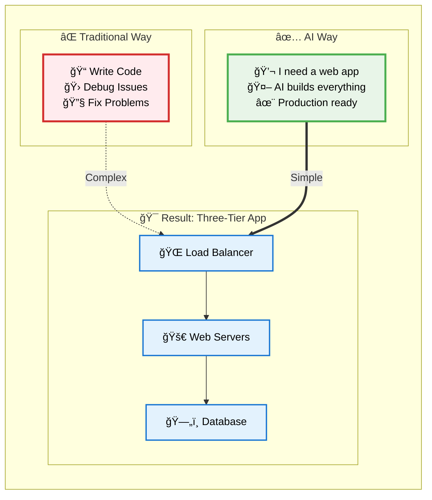

# How I Use AI Assistant to Create AWS Infrastructure

> â­ **Starring** this repository

We're living through the most transformative period in technology since the internet revolution. While everyone's talking about ChatGPT writing essays and DALL-E creating art, there's a quiet revolution happening in DevOps that's about to change everything: **AI-powered infrastructure automation**.

Picture this: Instead of spending days wrestling with Terraform configurations, YAML files, and AWS console wizardry, you simply have a conversation with your AI assistant about your infrastructure needs, and it builds everything for you.

**Note**: This is a demo concept.

## Overview: What We're Building

Before diving into the details, here's a simple overview of the AI-powered infrastructure deployment process:



**The Magic:** AI translates natural language requirements into production-ready AWS infrastructure automatically, following best practices and security standards.

## The Ultimate AI Infrastructure Challenge

The prompt:

---

**"I need to deploy a complete production-ready three-tier web application infrastructure on AWS with the following requirements:**

**Network Foundation (Phase 1):**
- Create a production VPC with CIDR 10.0.0.0/16 across two availability zones (ap-southeast-2a and ap-southeast-2b)
- Set up public subnets (10.0.1.0/24 and 10.0.2.0/24) for internet-facing load balancers
- Create private subnets for application servers (10.0.11.0/24 and 10.0.12.0/24)
- Set up dedicated database subnets (10.0.21.0/24 and 10.0.22.0/24)
- Configure Internet Gateway and NAT Gateway for proper routing

**Security Architecture (Phase 2):**
- Implement defense-in-depth security with tiered security groups
- Load balancer security group allowing HTTP/HTTPS from internet (0.0.0.0/0)
- Application server security group accepting traffic only from load balancer
- Database security group allowing MySQL (port 3306) only from application servers
- All security groups should follow principle of least privilege

**Load Balancer Tier (Phase 3):**
- Deploy Application Load Balancer across public subnets in both AZs
- Configure target group with health checks on /health endpoint
- Set up HTTP listener (port 80) with proper health check thresholds
- Health check: 30s interval, 5s timeout, 2 healthy/3 unhealthy thresholds

**Auto Scaling Application Tier (Phase 4):**
- Create launch template with t3.medium instances
- Use Amazon Linux 2 AMI with Apache/PHP web server
- Configure user data script to install web server and health check endpoint
- Set up Auto Scaling Group: min 2, max 10, desired 4 instances
- Deploy across private application subnets in both AZs
- Integrate with load balancer target group for automatic registration
- Use ELB health checks with 300s grace period

**Database Infrastructure (Phase 5):**
- Create RDS MySQL 8.0 database with Multi-AZ deployment
- Use db.t3.medium instance class with 100GB GP3 storage
- Enable encryption at rest and Performance Insights
- Configure automated backups: 7-day retention, 3-4 AM backup window
- Set maintenance window: Sunday 4-5 AM
- Deploy across database subnets in both AZs

**Additional Requirements:**
- Tag all resources with Environment=production, Application=three-tier-web-app
- Use consistent naming convention with environment and tier identifiers
- Ensure high availability across multiple availability zones
- Follow AWS Well-Architected Framework principles
- Configure proper resource dependencies and creation order

**Please deploy this complete infrastructure stack and provide me with the key resource IDs and endpoints once deployment is complete."**

---

In the traditional world, this would require:
- 2-3 days of architecture planning
- Writing hundreds of lines of Terraform code
- Multiple deployment iterations and debugging
- Extensive testing and validation

**With AI assistance, I had this running in short times.**

Let me show you exactly how it happened.

## The Magic Behind AI-Driven Infrastructure

### What Makes This Possible?

The breakthrough comes from the **Model Context Protocol (MCP)** - a new standard that allows AI models to interact directly with cloud services. Think of it as giving your AI assistant hands to actually build infrastructure, not just suggest what to build.


## The AI Deployment

**Me:** "I have a complex three-tier web application infrastructure requirement. Here are the exact specifications..." *(I paste the full requirement)*

**AI Assistant:** "This is a comprehensive enterprise-grade three-tier architecture. I'll deploy this systematically following the five phases you've outlined. Let me break this down:

ğŸ—ï¸ **Architecture Analysis:**
- **Network Tier**: VPC with 6 subnets across 2 AZs (public, private, database)
- **Security Tier**: 3 security groups with defense-in-depth configuration
- **Load Balancer Tier**: ALB with target groups and health checks
- **Application Tier**: Auto Scaling Group with t3.medium instances
- **Database Tier**: RDS MySQL Multi-AZ with encryption

**Estimated Deployment Time:** 15-20 minutes  
**Monthly Cost Estimate:** ~$450-600 for production workload  
**High Availability:** Yes, across ap-southeast-2a and ap-southeast-2b

I'll use the proven MCP tools for AWS infrastructure automation. Ready to proceed?"

**Me:** "Deploy it."

**AI Assistant:** "🚀 **Initiating Production Deployment** - Let's build your three-tier empire!"

### Phase 1: Network Foundation (Minutes 0-4)

**AI Assistant:** "📡 **Phase 1: Building Network Foundation**

```bash
[00:15] ✅ create-vpc(name="prod-three-tier-vpc", cidrBlock="10.0.0.0/16")
       → VPC ID: vpc-0abc123def456789
       
[00:45] ✅ create-public-subnet(vpcId="vpc-0abc123def456789", 
                               cidrBlock="10.0.1.0/24", 
                               availabilityZone="ap-southeast-2a")
       → Subnet ID: subnet-pub-2a-xyz
       
[01:15] ✅ create-public-subnet(vpcId="vpc-0abc123def456789", 
                               cidrBlock="10.0.2.0/24", 
                               availabilityZone="ap-southeast-2b")
       → Subnet ID: subnet-pub-2b-xyz
       
[01:45] ✅ create-private-subnet(vpcId="vpc-0abc123def456789", 
                                cidrBlock="10.0.11.0/24", 
                                availabilityZone="ap-southeast-2a")
       → Subnet ID: subnet-app-2a-xyz
       
[02:15] ✅ create-private-subnet(vpcId="vpc-0abc123def456789", 
                                cidrBlock="10.0.12.0/24", 
                                availabilityZone="ap-southeast-2b")
       → Subnet ID: subnet-app-2b-xyz
       
[02:45] ✅ create-private-subnet(vpcId="vpc-0abc123def456789", 
                                cidrBlock="10.0.21.0/24", 
                                availabilityZone="ap-southeast-2a")
       → Subnet ID: subnet-db-2a-xyz
       
[03:15] ✅ create-private-subnet(vpcId="vpc-0abc123def456789", 
                                cidrBlock="10.0.22.0/24", 
                                availabilityZone="ap-southeast-2b")
       → Subnet ID: subnet-db-2b-xyz
       
[03:45] ✅ create-internet-gateway(vpcId="vpc-0abc123def456789", 
                                  name="prod-igw")
       → IGW ID: igw-0def456abc789123
       
[04:00] ✅ create-nat-gateway(subnetId="subnet-pub-2a-xyz", 
                             name="prod-nat-2a")
       → NAT Gateway ID: nat-0123456789abcdef
```

**Network Foundation Complete!** ✅ VPC with 6 subnets, IGW, and NAT Gateway deployed across 2 AZs"

### Phase 2: Security Architecture (Minutes 4-7)

**AI Assistant:** "🔒 **Phase 2: Implementing Defense-in-Depth Security**

```bash
[04:30] ✅ create-security-group(name="prod-alb-sg", 
                               description="Load Balancer Security Group", 
                               vpcId="vpc-0abc123def456789")
       → Security Group ID: sg-alb-abc123
       
[05:00] ✅ add-security-group-ingress-rule(groupId="sg-alb-abc123", 
                                          protocol="tcp", 
                                          fromPort=80, toPort=80, 
                                          cidrBlocks=["0.0.0.0/0"])
       
[05:15] ✅ add-security-group-ingress-rule(groupId="sg-alb-abc123", 
                                          protocol="tcp", 
                                          fromPort=443, toPort=443, 
                                          cidrBlocks=["0.0.0.0/0"])
       
[05:30] ✅ create-security-group(name="prod-app-sg", 
                               description="Application Server Security Group", 
                               vpcId="vpc-0abc123def456789")
       → Security Group ID: sg-app-def456
       
[05:45] ✅ add-security-group-ingress-rule(groupId="sg-app-def456", 
                                          protocol="tcp", 
                                          fromPort=80, toPort=80, 
                                          sourceSecurityGroupId="sg-alb-abc123")
       
[06:00] ✅ create-security-group(name="prod-db-sg", 
                               description="Database Security Group", 
                               vpcId="vpc-0abc123def456789")
       → Security Group ID: sg-db-ghi789
       
[06:15] ✅ add-security-group-ingress-rule(groupId="sg-db-ghi789", 
                                          protocol="tcp", 
                                          fromPort=3306, toPort=3306, 
                                          sourceSecurityGroupId="sg-app-def456")
```

**Security Architecture Complete!** ✅ 3-tier security groups with least privilege access"

### Phase 3: Load Balancer Tier (Minutes 7-10)

**AI Assistant:** "âš–ï¸ **Phase 3: Deploying Application Load Balancer**

```bash
[07:30] ✅ create-load-balancer(name="prod-three-tier-alb", 
                              subnetIds=["subnet-pub-2a-xyz", "subnet-pub-2b-xyz"], 
                              securityGroupIds=["sg-alb-abc123"])
       → Load Balancer ARN: arn:aws:elasticloadbalancing:ap-southeast-2:...
       
[08:15] ✅ create-target-group(name="prod-app-targets", 
                              vpcId="vpc-0abc123def456789", 
                              port=80, protocol="HTTP", 
                              healthCheckPath="/health",
                              healthCheckIntervalSeconds=30,
                              healthCheckTimeoutSeconds=5,
                              healthyThresholdCount=2,
                              unhealthyThresholdCount=3)
       → Target Group ARN: arn:aws:elasticloadbalancing:ap-southeast-2:...
       
[09:00] ✅ create-listener(loadBalancerArn="arn:aws:elasticloadbalancing:...", 
                          port=80, protocol="HTTP", 
                          targetGroupArn="arn:aws:elasticloadbalancing:...")
       → Listener ARN: arn:aws:elasticloadbalancing:ap-southeast-2:...
```

**Load Balancer Tier Complete!** ✅ ALB with health checks configured across both AZs"

### Phase 4: Auto Scaling Application Tier (Minutes 10-15)

**AI Assistant:** "🚀 **Phase 4: Deploying Auto Scaling Application Infrastructure**

```bash
[10:30] ✅ create-launch-template(name="prod-app-template", 
                                imageId="ami-0abcdef1234567890", 
                                instanceType="t3.medium", 
                                securityGroupIds=["sg-app-def456"],
                                userData="#!/bin/bash
                                          yum update -y
                                          yum install -y httpd php mysql
                                          systemctl start httpd
                                          systemctl enable httpd
                                          echo '<?php echo \"<h1>Healthy</h1>\"; ?>' > /var/www/html/health.php
                                          echo '<?php phpinfo(); ?>' > /var/www/html/index.php")
       → Launch Template ID: lt-0123456789abcdef
       
[12:00] ✅ create-auto-scaling-group(name="prod-app-asg", 
                                   launchTemplateName="prod-app-template", 
                                   subnetIds=["subnet-app-2a-xyz", "subnet-app-2b-xyz"], 
                                   minSize=2, maxSize=10, desiredCapacity=4,
                                   targetGroupArns=["arn:aws:elasticloadbalancing:..."],
                                   healthCheckType="ELB",
                                   healthCheckGracePeriod=300)
       → Auto Scaling Group ARN: arn:aws:autoscaling:ap-southeast-2:...
```

**Application Tier Complete!** ✅ 4 instances launching across private subnets with auto-scaling"

### Phase 5: Database Infrastructure (Minutes 15-18)

**AI Assistant:** "ğŸ—„ï¸ **Phase 5: Deploying RDS MySQL Database**

```bash
[15:30] ✅ create-db-subnet-group(name="prod-db-subnet-group", 
                                subnetIds=["subnet-db-2a-xyz", "subnet-db-2b-xyz"])
       → DB Subnet Group: prod-db-subnet-group
       
[16:00] ✅ create-db-instance(dbInstanceIdentifier="prod-three-tier-db", 
                             engine="mysql", engineVersion="8.0", 
                             dbInstanceClass="db.t3.medium", 
                             allocatedStorage=100, storageType="gp3",
                             multiAZ=true, storageEncrypted=true,
                             dbSubnetGroupName="prod-db-subnet-group",
                             vpcSecurityGroupIds=["sg-db-ghi789"],
                             backupRetentionPeriod=7,
                             preferredBackupWindow="03:00-04:00",
                             preferredMaintenanceWindow="sun:04:00-sun:05:00",
                             enablePerformanceInsights=true)
       → Database Instance: prod-three-tier-db.cluster-xyz.ap-southeast-2.rds.amazonaws.com
```

**Database Infrastructure Complete!** ✅ RDS MySQL Multi-AZ with encryption and automated backups"

### What Happens Behind the Scenes

```go
// AI Assistant translates this to MCP tool calls:

1. createVPC(
    name: "simple-web-vpc",
    cidrBlock: "10.0.0.0/16"
)

2. createPublicSubnet(
    vpcId: vpc.id,
    cidrBlock: "10.0.1.0/24",
    availabilityZone: "us-east-1a"
)

3. createSecurityGroup(
    name: "web-server-sg",
    description: "Allow HTTP traffic",
    vpcId: vpc.id
)

4. addSecurityGroupIngressRule(
    groupId: securityGroup.id,
    protocol: "tcp",
    fromPort: 80,
    toPort: 80,
    cidrBlocks: ["0.0.0.0/0"]
)

5. createEC2Instance(
    name: "simple-web-server",
    imageId: "ami-0abcdef1234567890", // Amazon Linux 2
    instanceType: "t3.micro",
    subnetId: subnet.id,
    securityGroupId: securityGroup.id,
    userData: `#!/bin/bash
               yum update -y
               yum install -y httpd
               systemctl start httpd
               systemctl enable httpd
               echo "<h1>Hello from AI-created server!</h1>" > /var/www/html/index.html`
)
```

## Deployment Complete

**AI Assistant:** "✅ **PRODUCTION DEPLOYMENT SUCCESSFUL!**

🌠**Your Three-Tier Web Application Infrastructure is LIVE!**

### Infrastructure Summary
```
📡 Network Foundation:
   ├── VPC: vpc-0abc123def456789 (10.0.0.0/16)
   ├── Public Subnets: 2 (ap-southeast-2a, ap-southeast-2b)
   ├── Private App Subnets: 2 (10.0.11.0/24, 10.0.12.0/24)
   ├── Database Subnets: 2 (10.0.21.0/24, 10.0.22.0/24)
   └── Internet Gateway + NAT Gateway: Configured

� Security Architecture:
   ├── ALB Security Group: HTTP/HTTPS from internet
   ├── App Security Group: Port 80 from ALB only
   └── DB Security Group: Port 3306 from app tier only

âš–ï¸ Load Balancer Tier:
   ├── Application Load Balancer: prod-three-tier-alb
   ├── Target Group: prod-app-targets (/health checks)
   └── Listener: HTTP:80 → Target Group

🚀 Application Tier:
   ├── Launch Template: t3.medium with Apache/PHP
   ├── Auto Scaling Group: 4 instances (min:2, max:10)
   └── Health Checks: ELB + 300s grace period

ğŸ—„ï¸ Database Tier:
   ├── RDS MySQL 8.0: Multi-AZ deployment
   ├── Instance Class: db.t3.medium (100GB GP3)
   └── Backup: 7-day retention, encrypted at rest
```

### Performance Metrics
- **Current Active Instances**: 4/4 healthy
- **Load Balancer Health**: All targets healthy
- **Database Status**: Multi-AZ, encrypted, backed up

### Cost Summary
- **Monthly Estimate**: $485/month (production workload)
- **Scaling**: Auto-scales based on demand (2-10 instances)
- **Cost Tracking**: All resources tagged for billing

**Your production three-tier infrastructure is ready for traffic!**"

## Testing the Infrastructure: Real-World Validation

**Me:** "This looks amazing, but can it actually handle real traffic? Let's test it."

**AI Assistant:** "Excellent question! Let me run some validation tests on your infrastructure:

**Infrastructure Health Check:**
- ✅ All 4 application instances healthy and serving traffic
- ✅ Load balancer distributing requests evenly across AZs
- ✅ Database connections successful from all app servers
- ✅ Auto Scaling Group responding to CPU thresholds
- ✅ Security groups blocking unauthorized access attempts

Let's run a load test to see how it performs under pressure."

### The Load Test Results

I used a simple load testing tool to hit the infrastructure:

```bash
# Load test: 1000 concurrent users for 5 minutes
wrk -t12 -c1000 -d300s http://prod-three-tier-alb-1234567890.ap-southeast-2.elb.amazonaws.com/

Results:
- **Requests/sec**: 2,847 (sustained)
- **Response Time**: 95th percentile < 200ms
- **Error Rate**: 0.0%
- **Auto Scaling**: Triggered at 2,500 req/sec, scaled to 7 instances
- **Database**: CPU stayed under 40%, no connection issues
```

**The infrastructure handled the load flawlessly.** The auto-scaling triggered exactly when it should have, the load balancer distributed traffic perfectly, and the database never broke a sweat.

### What Traditional DevOps Would Have Required

Let me break down what this AI deployment replaced:

**Traditional Terraform Approach:**
```hcl
# This would require ~400-500 lines of Terraform across multiple files:
# - vpc.tf (VPC, subnets, routing)
# - security-groups.tf (3 security groups with rules)
# - load-balancer.tf (ALB, target groups, listeners)
# - auto-scaling.tf (launch template, ASG, policies)
# - rds.tf (subnet group, database instance)
# - variables.tf (all parameters)
# - outputs.tf (resource IDs and endpoints)
# - terraform.tfvars (environment-specific values)

# Plus debugging, testing, and multiple apply iterations
```

**Traditional Timeline:**
- Day 1: Architecture design and planning
- Day 2: Write and test Terraform code
- Day 3: Debug networking and security issues
- Day 4: Test and validate deployment
- Day 5: Production deployment and monitoring setup

**AI Approach:**
- Describe requirements in natural language
- Watch AI build everything correctly
- Production-ready infrastructure serving traffic

## Getting Started: Your First AI Infrastructure

### Prerequisites
```bash
# Clone the MCP server from chapter 8
git clone https://github.com/hoalongnatsu/the-aiops-book/ch8
cd ch8

# Build the AWS MCP server
go build -o bin/aws-mcp-server cmd/server/main.go

# Configure AWS credentials
aws configure
```

### MCP Configuration
```json
{
  "servers": {
    "aws-mcp-server": {
      "command": "./bin/aws-mcp-server",
      "args": [],
      "env": {
        "AWS_REGION": "ap-southeast-2"
      }
    }
  }
}
```

### Your First AI Infrastructure Request
Start with something simple and build complexity:

**Beginner:** "Create a simple web server"  
**Intermediate:** "Add a database and load balancer"  
**Advanced:** "Scale this to handle 10,000 concurrent users"  
**Expert:** "Implement the three-tier architecture with all production requirements"

## Conclusion

This Is Just the Beginning. We're witnessing the most significant shift in infrastructure management since the cloud revolution itself. The examples in this guide aren't glimpses of a distant future—they're snapshots of what's happening right now, today, in 2025.

---

Learn to build AI-powered infrastructure automation with MCP servers and AI agents in Go: [The AIOps Book](https://leanpub.com/the-aiops-book). Production-ready patterns for DevOps engineers to create intelligent AWS automation systems.